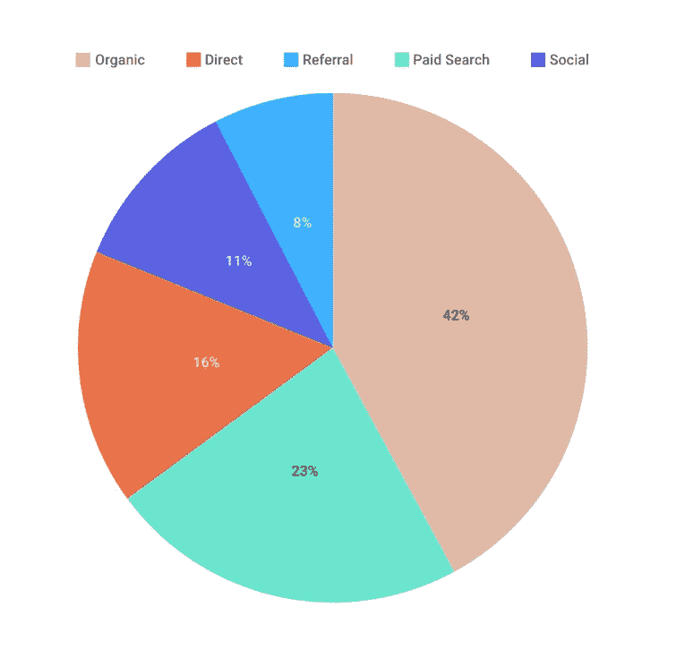
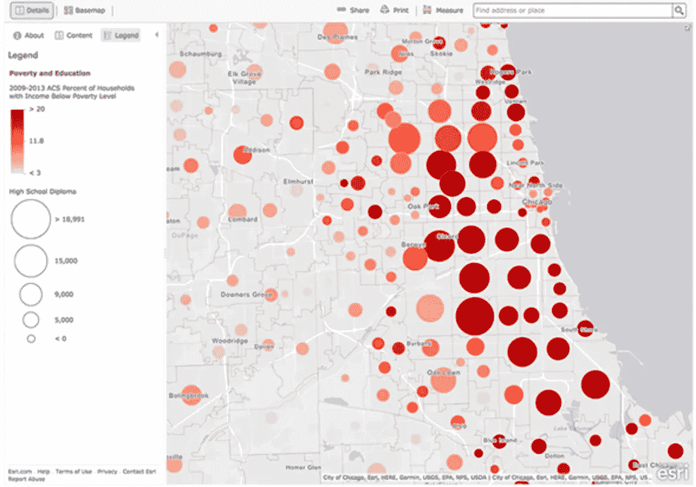
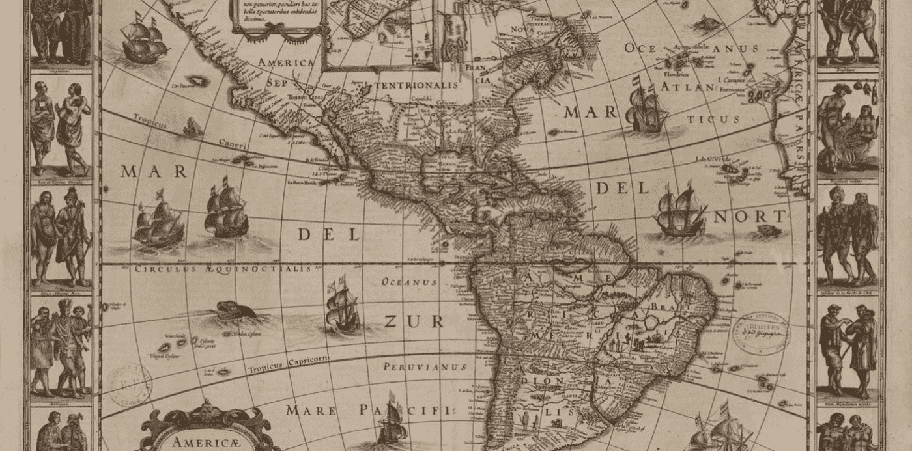

# 数据可视化|数据可视化的挑战

> 原文：<https://medium.com/analytics-vidhya/challenges-in-data-visualization-ed3c2c0eb6c9?source=collection_archive---------4----------------------->

让信息**有趣** …但**准确**？这就是数据可视化的挑战。

[阿德奥卢·埃莱图](https://unsplash.com/@adeolueletu?utm_source=medium&utm_medium=referral)在 [Unsplash](https://unsplash.com?utm_source=medium&utm_medium=referral) 拍摄的照片

## 在设计中应用数据可视化时的挑战和考虑事项:

首先要记住的是，您将处理大量的信息和数据集，而不仅仅是 4 或 5 条信息。

**1️⃣选择恰当的视觉隐喻**

*   当你开始设计时，图表、颜色甚至图表垃圾的选择是你应该考虑的因素。
*   然而，在你考虑这些事情之前，数据中的**精度是首先要考虑的事情。一旦你和数字打交道，你就必须小心。如果你真正理解统计的准确性，你将能够以一种能够传递特定含义或洞察力的方式来呈现它。**

**2️⃣易读性无需过多依赖图例和标签**

*   有一点需要注意，当涉及到优化你的可视化时，不要让你的用户不断地参考图例。当眼睛不得不四处移动以检查所呈现的信息时，它会破裂。最佳做法是只看图形就能理解信息。

尽量保持设计的干净和简约，避免眼睛来回移动到图例上。[来源](https://moqups.com/templates/charts-graphs/pie-donut-chart/pie-chart-web-traffic/)

# 小贴士:

符号是一个有趣的因素，可以帮助你处理可视化的信息集群。

[如何进行空间分析](https://www.esri.com/arcgis-blog/products/product/analytics/how-to-perform-spatial-analysis/)

*   这张地图使用了受控的**调色板**、**色调值**和**大小**的不同变化。
*   这种设计方法很好地传达了比较关系和密度。当我们看到这一点时，我们知道哪些地区提供高等教育，哪些地区没有。此外，这张地图还告诉我们，贫困和教育之间存在联系。

**3️⃣数据的密度和可信度**

制图员经常需要创建高密度的可视化效果。来源:[https://pro . europeana . eu/post/maps-for-makers-named-cartographers](https://pro.europeana.eu/post/maps-for-makers-famous-cartographers)

*   **什么是数据密度？**
    数据密度是指一个统计图形内的大样本数据集。
    我们的眼睛可以在很小的空间内发现色调、线宽和形状的细微差别，因此人们可以在单个图形中看到大量信息。

最后，感谢我的老师，他启发了我数据可视化，并帮助我克服了挑战。