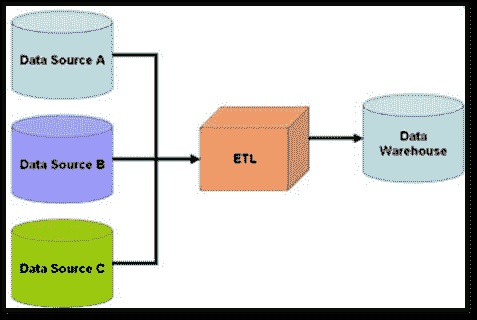

# 机器学习项目中的挑战

> 原文：<https://medium.com/analytics-vidhya/challenges-in-machine-learning-projects-431adf56ed84?source=collection_archive---------26----------------------->

在这篇博客中，我提出了一些当你从事机器学习项目时应该遵循的标准。这个标准是由我教员提出的，他的名字是 srikanth varma，(在机器学习领域有 10 年的工业经验)。

我只是分享这些标准，希望你能够在努力获得更好的机器学习项目设计的同时，在头脑中考虑这些事情。

让我们开始，首先我们可以看到标准的标题，然后我们可以看到每个标准的详细描述…..

# 需要应对的挑战:

1.  理解业务问题和需求，问题的定义
2.  数据采集
3.  数据准备:清理、预处理
4.  探索性数据分析
5.  建模、评估、解释
6.  结果交流
7.  模型部署
8.  模型的操作
9.  模型的优化

# 每个标准的详细描述:

1.  **了解业务问题和需求，问题的定义:**

这是非常重要的方面，伙计们，在进行项目之前，你必须了解业务问题和需求端到端。你的项目必须有一个好的提案。一旦你明白了清晰的方法，你就可以开始机器学习的正确过程。

2.**数据采集:**

获取数据是非常重要的一步，在数据获取中起重要作用的概念是提取、转换和加载，简称 ETL。这是将数据从一个或多个源复制到目标系统的一般过程

摘录:

数据提取，包括从同类或异类源中提取数据。

转换:

数据转换通过数据清理和将数据转换成适当的存储格式/结构来处理数据，以便进行查询和分析。

负载:

数据加载描述了将数据插入到最终的目标数据库中，例如操作数据存储、数据集市、数据湖或数据仓库。

用于该概念的工具之一是 SQL，它试图处理数据库、数据仓库、大数据(spark、hadoop)中的数据。

> ETL 在数据采集中起着重要的作用

3.**数据准备:**

伙计们，数据准备非常重要，因为在现实世界的业务问题中，数据不会是像 Kaggle(数据科学的数据中心)中可用的数据集那样的结构化数据形式。你必须做一些像特征工程、数据预处理、数据清理这样的工作。

特征工程:

特征工程是在现有特征的基础上转换或引入新特征，以充分利用机器学习模型。

数据预处理:

数据预处理是一种用于将原始数据转换成干净数据集的技术。换句话说，无论何时从不同来源收集数据，都是以原始格式收集的，这对于分析是不可行的。

数据清理:

数据清理是从记录集、表或数据库中检测和纠正(或删除)损坏或不准确记录的过程，指的是识别数据中不完整、不正确、不准确或不相关的部分，然后替换、修改或删除脏数据或粗糙数据。(根据维基百科)

> 注意:现实世界的问题不是结构化数据类型的，而是非结构化数据类型的

4 **。探索性数据分析:**

分析数据很重要，70%的时间花在分析数据上。数据分析是对数据提出质疑并试图解决问题。python pandas 是一个用于分析数据和可视化数据的工具。数据可视化是以图形方式查看数据的重要概念，它提供了数据如何分布的想法。seaborn，matplotlib 是一些用于数据可视化的 python 库。

> 数据分析和数据可视化在探索性数据分析中发挥着重要作用。

5.**建模、评估、解释。**

建模:

根据需要的问题来决定机器学习模型，而不是按照你喜欢的模型来应用。

> 模型是由问题决定的，而不是由你决定的！！

评估:

评估技术有助于检查您的模型是否具有更好的准确性。尝试对业务问题应用更多的评估技术，如准确性得分、F1 得分、ROC 曲线、混淆矩阵。

解释:

解释是给出特定输出被预测的原因的过程。通过提供这样的理由，相关的商业人员或客户可以容易地理解为什么预测这样的输出。

> 推理是理解为什么这样的输出被预测的好方法！！

6.**结果沟通:**

结果交流是机器学习工程师与普通人交流的最佳标准。该过程应该能够理解，即使是一般人谁不是在这个领域的工作。在每一个过程中，你需要进行一般性的观察，让一般人能够以清晰的方式理解。

> 即使对于人来说，过程也需要理解，属于非机器学习领域

7.**模型部署:**

一旦您执行您的模型，所有的过程都成功完成，您必须将您的模型部署到网上(万维网)。python flask 和 Django 是用本地主机部署你的模型的工具之一。Heroku(平台即服务)用于在线部署您的模型。

查看 Heroku 平台的链接:[https://www.heroku.com](https://www.heroku.com)

> 模型应在线部署

8.**模型运行:**

在每一个过程完成后，你需要重新训练你的模型，需要检查模型管道是否工作正常，需要在这个标准下处理管道故障。

> 在你的操作中每次都需要检查模型管道

9.**模型优化:**

优化是一项重要的任务，一旦你完成了整个过程，你需要改进或更新模型，包括更多的数据和功能，还需要优化代码。

> 优化技术显示了模型是如何有效地执行的！！

由此我得出结论，当你在机器学习项目中工作时，你必须在头脑中考虑上述标准..

— — Dhilip vasanth(机器学习的年轻学习者)