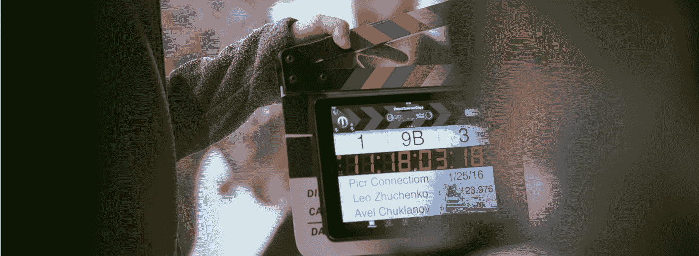

# 从数字看电影制作部门的变化

> 原文：<https://medium.com/analytics-vidhya/changes-in-film-production-departments-by-the-numbers-8149fda272cd?source=collection_archive---------25----------------------->

在过去的一个世纪里，电影制作行业经历了许多变化，包括美国工作室系统的兴起，同步声音的引入，以及电视等竞争对手视觉媒体的出现。利用大量的电影演职员表，我试图衡量自 20 世纪 20 年代以来不同角色在电影制作中的变化。