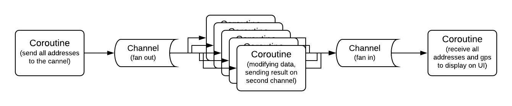

# 科特林的渠道——第二部分

> 原文：<https://medium.com/analytics-vidhya/channels-in-kotlin-part-two-7d52abbc5b6e?source=collection_archive---------5----------------------->

## 协程程序的通信要点


泰勒·维克在 [Unsplash](https://unsplash.com/s/photos/cord-organized?utm_source=unsplash&utm_medium=referral&utm_content=creditCopyText) 上的照片

在[的上一篇文章](/@dahlberg.bob/channels-in-kotlin-part-one-594ba12dcb5a)中，我们讲述了什么是渠道以及渠道的四种类型。让我们更实际一点，看看什么时候，如何，以及使用渠道的不同方式。

## 不是 Rx

首先，我们需要确定与 Rx 的区别，这样我们就可以专注于渠道，而不是 Rx 的替代品。要记住的最重要的事情是，一个频道本质上不是在传播它的价值观。一旦接收器从信道获得了某个值，它就被从信道中移除。看一下扇入和扇出的例子，这样会更清楚。

## 扇出

先说一个场景。您有一个地址列表，需要对每个地址进行查找，以便从某个网络服务中获得相应的 GPS 坐标。在这种情况下，按顺序执行并不是最佳选择。所以我们希望*将列表扇出*到多个协程，以便能够同时处理几个地址。如果我们从生产端开始，我们需要一个列表并将所有值发送到一个通道。

```
**val** channel = *Channel*<String>()
**val** addresses = *listOf*(
    "Fasanv 34, 11111",
    "Publikv 10, 22222",
    ...
)*launch*(Dispatchers.Default) **{** addresses.*forEach* **{** channel.send(**it**)
    **}** channel.close() **}**
```

现在我们有了一个通道，可以一个接一个地获取所有的地址。正如我们现在所知，它的类型是 rendevous，这意味着它将暂停，直到有人收到每个值。接下来，我们使用通道中的地址。

```
*launch*(Dispatchers.Default) **{
    for** (address **in** channel) {
        **val** gps = *fetchCoordinates*(address)
        *saveCoordinates*(address, gps)
    }
**}**
```

现在，我们有了完整的流程。我还使用了一个 for 循环来迭代通道。它为我们处理所有的暂停，当通道关闭时，for 循环退出。这是我喜欢 Kotlin 的微妙之处之一，抽象中的每个构造都是可迭代的，也遵循约定，可以用作语言中的任何其他可迭代的构造。

另一个旁注是，这是我开始真正理解挂起函数和协程的顺序性的地方。在经历了至少 15 年的不同步回调后，这是一项艰巨的任务。

我跑题了，回到场景，以及如何让它并发。嗯，这就像创建几个协程来做同样的事情一样简单，就像这样。

```
*repeat*(5) **{** *// iterates 5 times -> creating 5 coroutines**launch*(Dispatchers.Default) **{
        for** (address **in** channel) {
            **val** gps = *fetchCoordinates*(address)
            *saveCoordinates*(address, gps)
        }
    **}
}**
```

当我知道我想要的迭代次数时，我喜欢使用 repeat 函数而不是 for 循环，这里我们迭代了五次，从而创建了五个协程。现在，五个不同的协程在同一个通道上迭代，每个都暂停，直到轮到它们接收值。这也是渠道的优势之一。您不必关心同步、线程或永久挂起。即使您只是通过通道发送一个项目，当您关闭通道时，所有五个协程及其对应的五个 for 循环都将退出。

我们还可以使用 *produce-* 和*consume each*-函数来更新代码，使其更加符合通道习惯。这是更新的版本。

```
**val** addresses = *listOf*(
    "Fasanv 34, 11111",
    "Publikv 10, 22222",
    ...
)**val** channel = *produce* **{** addresses.*forEach***{** send(it) **}
}***repeat*(5) **{** *// iterates 5 times -> creating 5 coroutines**launch*(Dispatchers.Default) **{** channel.*consumeEach* **{** address **->
            val** gps = *fetchCoordinates*(address)
            *saveCoordinates*(address, gps)
        **}
    }
}**
```

consumeEach 扩展函数几乎与 for 循环相同，看起来没什么意思。它可能会在未来出现，因为它仍然是一个实验性的 API。

但是产生的延伸功能是一种美。它所做的是，为我们创建一个新的通道，并将其作为 ReceiverChannel 返回，它将发送功能封装在 produce-function 中。在封闭之外，我们只能从通道接收。关闭完成后，生产功能会自动关闭通道。因此，您不会意外地得到一个永不终止的协程和通道。

## 扇入

毫不奇怪，在通道的帮助下，我们还可以将来自许多不同协程的数据扇入到一个协程中，这就是所谓的扇入。让我们坚持前面的例子，并在此基础上进行构建。我们不想保存坐标，而是希望能够在完成后显示它们。

在大多数图形渲染环境中，您需要从一个特定的线程中呈现数据，这个线程通常被称为 UI 线程或主线程。因此，要从运行在我们无法控制的任意数量线程上的所有协程中收集所有数据，至少在本例中不是这样，我们需要再次将它们分散到一个线程中。为此，我们需要一个新的渠道。

```
**val** receiveChannel = *Channel*<Pair<String, GPS>>()
```

现在我们有了一种从多个协程(可能还有线程)发送并在一个协程中使用它们的方法。我们正在迭代之前保存坐标的函数，以通过新的通道发送坐标。

```
...
channel.*consumeEach* **{** address **->
    val** gps = *fetchCoordinates*(address)
    receiveChannel.send(address *to* gps)
**}**
receiveChannel.close() *// don't forget to close*...
```

所有的地址，伴随着它们相应的 GPS 坐标，现在从多个协同程序发送到*接收通道*。所以基本上，所有的繁重工作都完成了，对吧？现在，我们需要从一个将向用户显示该通道的协程中使用该通道，到目前为止，您应该已经熟悉了如何使用该通道。

```
*// this runs on the main thread - inherited from runBlocking
launch* **{** receiveChannel.*consumeEach* **{** (address, gps) **->** *println*("**$**address -> **$**gps")
    **}
}**
```

现在我们也完成了风扇的工作。现在我们有了一个完整的工作应用程序，它使用了一个典型的并发模式。它也可以用于并行，但这需要更具体的实现，与硬件更紧密地耦合，我现在不会深入讨论这个问题。

这是一个很小的例子，但它显示了 Kotlin 中渠道的优势。我们已经分割了一系列的值来同时处理，并且我们已经将它们收集到一个协程中，没有任何线程或者同步的想法。在我看来，这就是渠道的真正力量。它们使得将协程同步到系统中变得简单。这是我们代码的一个小图和完整的例子。



上面的全功能示例

## 当心变化

显示的一些功能是实验性的，将来可能会有变化。如果您更深入地研究 Channel API，您会发现许多不推荐使用和过时的函数，例如 filter 和 take 等等。它们已经被弃用，而支持流，以保持信道的简洁和直接，并将与 Rx 的斗争留给流。

API 也在发展，另一个过时的功能是 actor-builder，它的工作方式类似于 product-builder，但它是用来表示一个 actor 的，其中通道变成了 actor 的邮箱。这是一个很好的渠道使用，它只是过时了，因为他们正在建立一个更好的，更复杂的演员建设者。而只有未来会告诉我们，它会成为一个新的构建者(类似于现在)还是一个自己的实现，比如 Flow。

## 最后的想法

我希望这两篇文章能帮助您理解通道，并帮助您掌握协程和挂起函数。它确实帮助我以顺序的方式思考异步性。

文章第一部分:[https://medium . com/@ Dahl Berg . bob/channels-in-kotlin-part-one-594 ba 12 dcb 5a](/@dahlberg.bob/channels-in-kotlin-part-one-594ba12dcb5a)