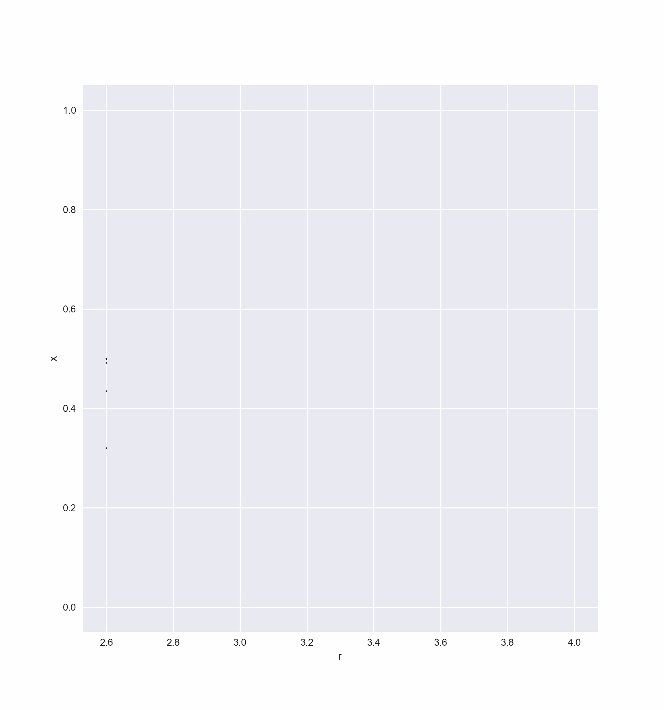
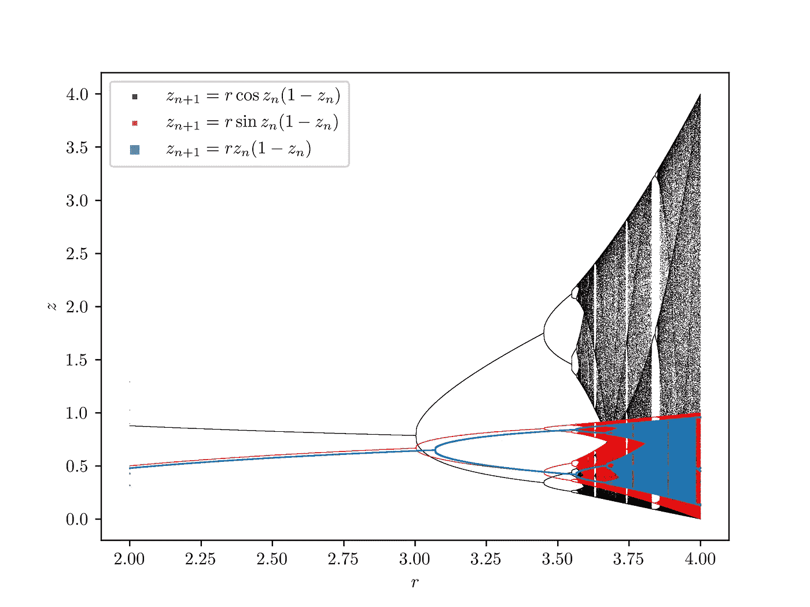
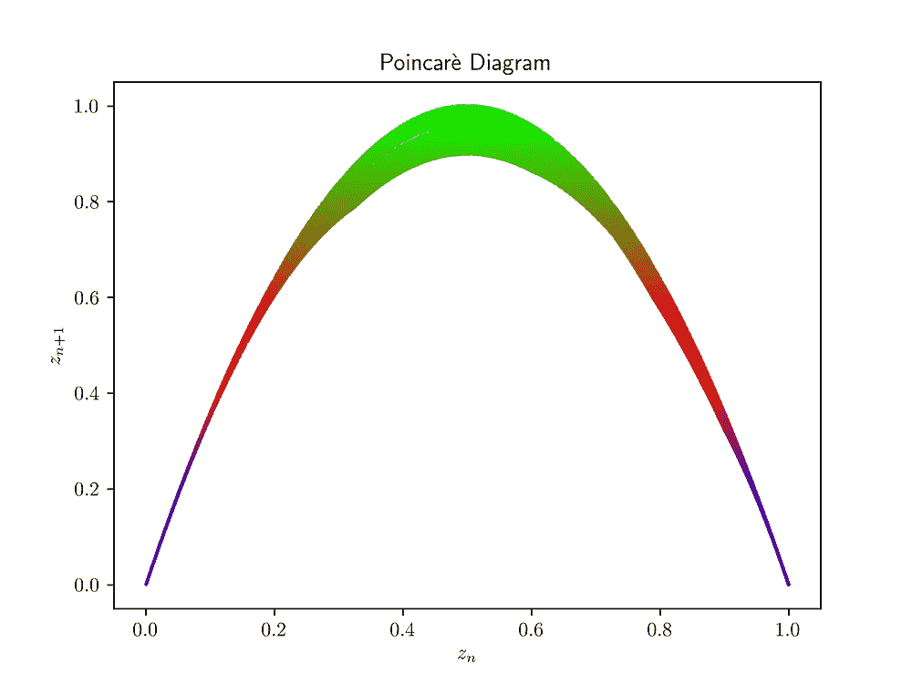
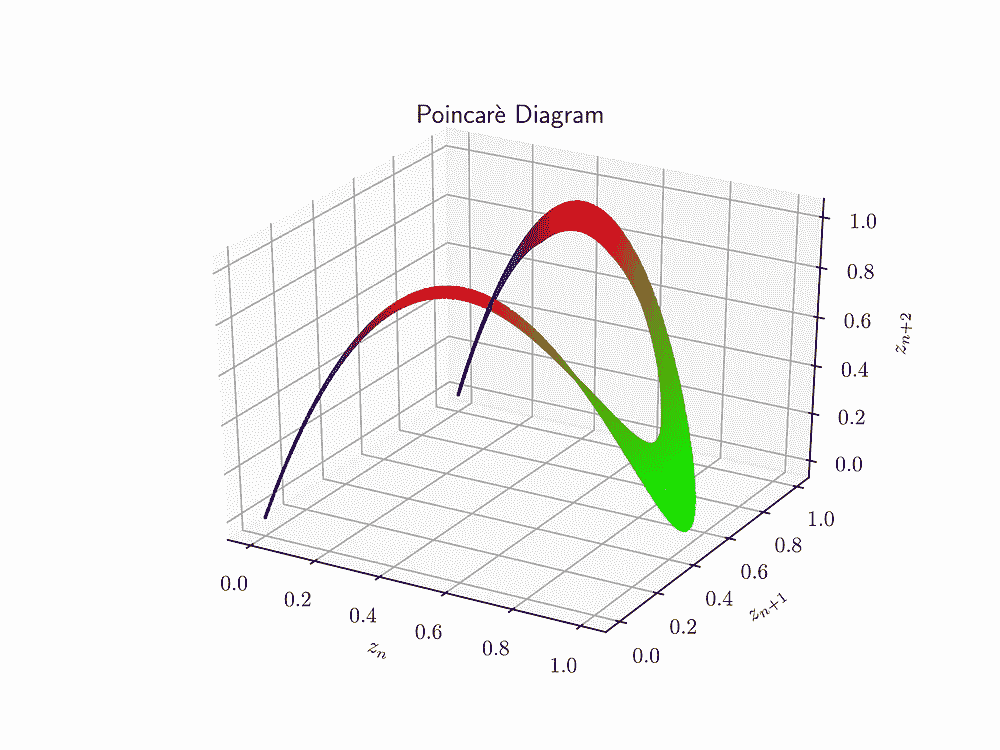

# 混沌与逻辑图

> 原文：<https://medium.com/analytics-vidhya/chaos-logistic-map-bd9a7f2f9d0e?source=collection_archive---------15----------------------->

逻辑映射是具有混沌行为的最简单的非线性递归方程之一。这个动力学方程是 2 次多项式，最早由[罗伯特·梅](https://en.wikipedia.org/wiki/Robert_May,_Baron_May_of_Oxford)推广。逻辑图可以写成:

其中 ***x_n*** 为范围[0–1]内的归一化值，通常表示现有人口与最大可能人口的比值。参数 ***0 ≤ r ≤ 4，*** 代表内在增长率或生育率**。**

逻辑图存在病理问题，因为 r > 4 的值会导致一些负面结果。

# 内在增长率参数:

对于不同的 ***r*** 值，该等式具有不同的行为:

当 ***0 ≤ r < 1，*** 种群将在初始条件不变的情况下灭绝。

当 ***1 ≤ r < 2，*** 时，尽管存在初始条件，但种群会迅速逼近 ***(r-1)/r*** 。

当 ***2 ≤ r < 3，*** 最终会达到 ***(1-r)/r*** 并围绕该值波动。

当 ***3 ≤ r < 3.5699，*** 事情开始变得诡异，***3≤r<3.44949***对于几乎所有的初始条件，种群都会达到两个值之间的永久振荡。当***3.44949≤r<3.54409***时，粒子数将出现所谓的倍周期现象，并达到永久振荡量的四个值。而同样当 ***3.54409 ≤ r*** 时，种群会分叉到 ***8，16，32，…*** 值。两个连续分叉间隔之间的长度接近被称为费根鲍姆常数的 ***4.669*** 。

当 ***r ≤3.5699*** 时，那么种群将表现出混沌行为，分岔将不再可见，但*r 中仍有一些区域再次显示出分岔。*

*而当 ***r ≤ 4*** 时，几乎所有的初始值都会给区间[0，1]留下一些负值。*

**

*显示任意 r 值的吸引子的分叉图。*

*事实上，这种行为不仅仅存在于这个方程中，每一个单峰地图都是如此，例如:*

****

*上述所有方程在不同的尺度下表现出相似的行为。*

******

*不同 r 值的庞加莱图*