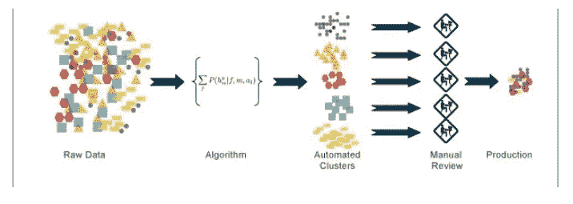

# 第 00 章:初学者机器学习入门

> 原文：<https://medium.com/analytics-vidhya/chapter-00-introduction-to-machine-learning-for-beginners-138298507094?source=collection_archive---------22----------------------->

假设有人给了一张图片，并让你写一个程序告诉他们图片里有一只香蕉。传统的编程需要一组指令来识别这张图片，这将需要大量的代码，并留下大量的错误空间。有了机器学习，我们只需要数据来精确。多亏了互联网和智能手机，我们有了大量的数据。机器学习程序可以从数据中学习行为。

> “如果计算机算法/程序在 T 中的任务上的性能(由 P 测量)随着经验 E 而提高，则称该计算机算法/程序从性能测量 P 和某类任务 T 的经验 E 中学习。”

# 机器学习的应用

机器学习在各个领域有许多用途，一些应用如下

*   推荐系统
*   天气预报
*   疾病诊断
*   机器人学
*   自动驾驶汽车

# 机器学习的类型:

机器学习主要分为以下四类

## 1.监督学习

监督学习是第一种机器学习。在实际的机器学习中，大多数应用使用监督学习。

在监督学习中，我们知道输入和输出。为简单起见，假设一组输入数据为 X，称为特征。将数据输出为 Y，称为目标。

让我们以泰坦尼克号的数据集为例来看看。如果一个人在灾难中幸存与否是目标值，所有其他列都是特征。

## 监督学习的类型:-

监督学习主要分为以下两个部分

## 1.1.分类

在分类中，使用标记数据，并且该数据用于以非连续形式进行预测。信息的输出并不总是连续的，图形也是非线性的。在分类技术中，算法从提供给它的数据输入中学习，然后使用这种学习对新的观察结果进行分类。

有许多分类模型。分类模型包括逻辑回归、支持向量机(SVM)、K 近邻、朴素贝叶斯分类、决策树分类和随机森林分类。

## 1.2 回归

在回归中，使用标记数据，并且该数据用于以连续的形式进行预测。输入的输出总是持续的，图形是线性的。回归是预测建模技术的一种形式，它调查因变量[输出]和自变量[输入]之间的关系。

回归的一个应用实例。如果一家公司的销售额在过去的几年中每个月都在稳步增长，通过对销售数据和月销售额进行线性分析。该公司可以预测未来几个月的销售额。简单地说，我们可以把它写在等式里。

有许多回归模型。回归模型包括线性回归、多元回归算法、逻辑回归和支持向量回归。

## 分类 v/s 回归

让我们在这里注意一下回归算法和分类算法之间的差异有时会让大多数数据科学家感到困惑，这使得他们在解决预测问题时采用了错误的方法。

## 2.无监督学习

无监督学习是第二种类型的机器学习，其中未标记的数据用于训练算法，这意味着它用于没有历史标签的数据。显示的内容必须由算法计算出来。目的是探索数据并找到其中的一些结构。

该算法计算出数据，并根据数据段，用新的标签对数据进行聚类。

## 无监督学习的类型:-

无监督学习主要分为以下两个部分

## 2.1 集群

在聚类中使用未标记的数据，它是将相似的实体分组在一起，然后使用分组的数据来构成聚类的过程。

找出数据点中的相似之处，并将相似的数据点分组在一起，并确定新数据应该属于哪个聚类。

有许多聚类模型。聚类模型包括 K-Means 和层次聚类。

## 2.2 降维

在降维中，数据的维度被降低以从输入中去除不需要的数据。

该技术涉及将具有大尺寸的一组数据转换成携带相同数据和小尺寸的数据的过程。

降维模型包括主成分分析和线性判别分析。

## 3.半监督学习

很多时候，我们需要有标签的数据来做监督机器学习。另一类算法称为无监督算法，不需要标签，但可以从未标签数据中学习。

现在，假设您想要训练一个模型来对文本文档进行分类，但是您想要给算法一个关于如何构建类别的提示。您希望只使用一小部分已标记的文本文档，因为并非每个文档都已标记，同时您希望模型根据已标记的文档尽可能准确地对未标记的文档进行分类。

令人欣慰的是，有一类算法称为半监督算法，能够从部分标记的数据集进行学习。

 [## 半监督学习和对抗训练简介

medium.com](/inside-machine-learning/placeholder-3557ebb3d470) 

# 4.强化学习

强化学习就像教你的狗一项新技术。在强化学习中，我们将以奖励和惩罚的形式提供程序反馈，基于此狗将识别理想的行为。

# 结论

本文回顾了机器学习算法的一些用例，该领域中使用的常见方法和流行方法。重要的是要记住，算法、方法和方法将继续变化。

感谢阅读。快乐学习。