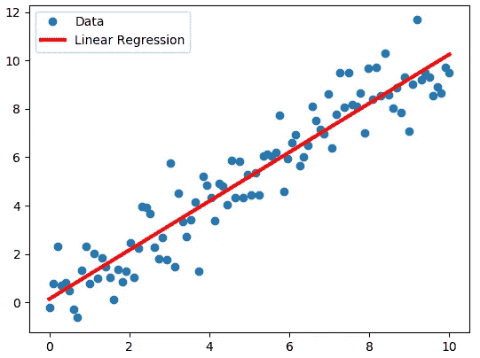
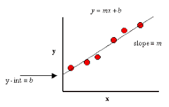
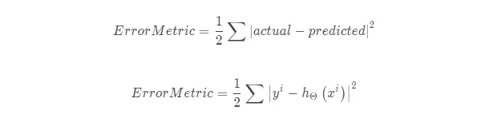
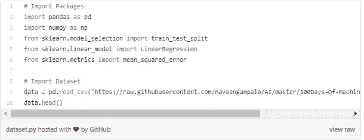
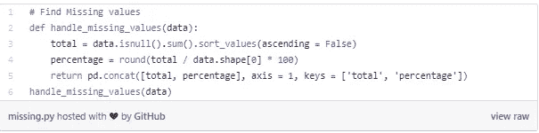
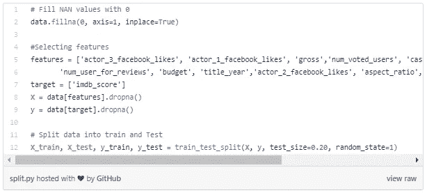
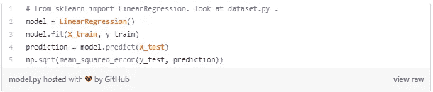

# 第一章:线性回归简介

> 原文：<https://medium.com/analytics-vidhya/chapter-01-introduction-to-linear-regression-6285b23c3e66?source=collection_archive---------29----------------------->

如果你是一个熟悉数据科学的人，你一定已经意识到，在简单的线性回归和深度神经网络之间，我们长大后会成为一名数据科学家。

线性回归是一种非常强大的机器学习算法，用于计算预测未来结果的基线结果。

在本文中，我们将了解以下主题:

*   线性回归简介
*   价值函数
*   线性回归的应用
*   用 Scikit-Learn 实现线性回归
*   利弊
*   摘要

## **线性回归简介**

线性回归属于监督学习算法的子领域。让我们从理解回归开始。这是一种预测性建模技术，它调查因变量和自变量之间的关系。线性回归属于监督学习算法的子领域。让我们从理解回归开始。这是一种预测性建模技术，它调查因变量和自变量之间的关系。

线性回归的基本思想是检查两件事:

*   **自变量**在预测**结果**(因变量)方面做得好吗？
*   哪些变量是**结果(因变量)**变量的**显著预测因子**？

具有一个因变量和一个自变量的回归方程的最简单形式由以下公式定义

## **成本函数**

成本函数的基本目标是找到最小化误差平方和的线。让我们来看看上式中与使误差最小的线相关的系数( *m，b* )。我们可以看到计算的图形描述。

我们可以使用均方误差(MSE)成本函数来衡量线性回归算法的准确性。MSE 测量预测输出和实际输出(标签)之间的平均平方距离。

## **应用**

下面是一些利用线性回归的用例

*   **价格预测:**预测未来的机会和风险是回归分析在商业上最突出的应用。
*   金融服务或保险:根据体重预测血糖水平。在金融服务领域，洞察消费者行为，了解业务和影响盈利能力的因素。

## **实施**

我们将使用 Scikit-Learn，它是 Python 最流行的机器学习库之一。

**步骤 1:** 我们将导入包和数据集。我将使用电影数据集。

[https://github . com/naveengampala/AI/tree/master/100 days-Of-machine learning/data](https://github.com/naveengampala/AI/tree/master/100Days-Of-MachineLearning/data)

**第二步:**找到缺失的值，将数据集分成训练和测试。

**步骤 3:** 从数据集中删除缺失值，然后将数据集拆分为训练值和测试值。

**第 4 步:**让我们使用以下步骤建立线性回归模型。

*   加载算法
*   实例化模型并使其适合训练数据集
*   对测试集的预测
*   计算均方根误差

## **优点**

*   线性回归模型的最大优点是线性:它使估计过程简单，最重要的是，这些线性方程对权重的解释容易理解
*   从数学上来说，它很容易实现，训练起来也非常高效。
*   有这么多的集体经验和专业知识，包括线性回归模型和软件实现的教学材料

## **缺点**

*   线性回归模型的主要局限是只能表示线性关系。每个非线性或相互作用都必须手工制作。
*   线性回归对异常值(异常)非常敏感。因此，在对数据集应用线性回归之前，应该分析并移除异常值。

## **总结**

总之，线性回归是分析变量之间关系的很好的工具，但是在实际应用中不推荐使用，而且现实世界中的大多数问题都不是线性的