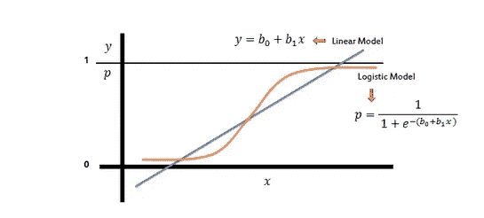

# 第二章:逻辑回归介绍

> 原文：<https://medium.com/analytics-vidhya/chapter-02-introduction-to-logistic-regression-f4750d55ac4a?source=collection_archive---------23----------------------->

## 这个全面的教程旨在介绍机器学习中的逻辑回归的基础。

在本文中，我们将了解以下主题:

*   逻辑回归介绍
*   逻辑回归背后的数学
*   逻辑回归的应用
*   用 Scikit-Learn 实现逻辑回归
*   利弊
*   摘要

## **逻辑回归简介**

逻辑回归属于监督学习算法的研究范围。这是一种用于解决分类问题的技术。这是一个这样的例子

*   电子邮件是否是垃圾邮件
*   肿瘤是否是恶性的。

逻辑回归和线性回归都是监督学习技术。如果你想了解线性回归[，点击这里](/analytics-vidhya/chapter-01-introduction-to-linear-regression-6285b23c3e66) **。**在上一章中，我们看到回归问题的输出是连续的，而分类问题的输出是离散的。

## **简单逻辑回归背后的数学原理**

在我们进一步讨论之前，让我们从一个我们在学校都学过的简单例子开始。如果我们抛硬币两次。它至少有一次正面着地的几率有多大？

简单地说，我们可以通过计算

*   有利结果:HH，HT，TH
*   不利结果:TT

因此，它至少有一次正面着地的几率是 3:1

分类反应为“真”(1)的对数概率被建模为特征的线性组合。如果我们简单地用数学形式来表达

上述线性方程的范围是 **(-∞，∞)** ，上述函数称为 logit 函数或 Sigmoid 函数。通过求解概率我们会得到

上式的范围为 **( 0，∞)**

上述等式的范围是(0，1)。下图显示了线性模型和逻辑模型。

## **逻辑回归的应用**

逻辑回归有一些很酷的应用，让我们看看其中的一些:

*   图像分类和分割
*   手写识别
*   根据语料库中的一袋单词预测一个人是否抑郁

## **使用 Scikit-Learn 实现逻辑回归**

如果你有兴趣，你可以在 [Kaggle](https://www.kaggle.com/ngmpala/eda-titanic-dataset) 上查看我的笔记本

*   **步骤 1:** 我们将使用 Titanic 数据集来学习更多关于逻辑回归的知识。这是机器学习世界中数据集的“Hello World”。让我们导入包和数据集。

第二步:使用下面的函数找出数据集中缺失的值。

**第三步:**从数据集中删除缺失值。让我们讨论一下哪些值应该被丢弃。

**讨论:**

*   一般来说，保留数据总是比丢弃数据好。有时，如果超过 60%的观测数据缺失，您可以删除变量，但前提是该变量不重要。
*   如果任何缺失值小于 2%,最好删除行值。该百分比可能会随着相应的数据集而变化。
*   计算某一列中非缺失值的平均值/中值，然后独立于其他列单独替换每一列中的缺失值，这种方法既简单又快速，适用于小型数值数据集，但对于编码的分类特征结果较差(不要对分类特征使用这种方法)。

**第四步:**让我们按照以下步骤建立逻辑回归模型。

*   加载算法
*   实例化模型并使其适合训练数据集
*   数据集预测

## **优点**

*   从数学上来说，它很容易实现，训练起来也非常高效。
*   如果数据集是线性可分的，逻辑回归表现良好。

## **缺点**

*   逻辑回归的主要限制是因变量和自变量之间的线性假设。

## 摘要

尽管深度神经网络的技术水平很高，但逻辑回归仍被广泛使用的原因是逻辑回归非常**有效**并且**不**需要太多**计算资源**，这使得**在生产中运行**是可负担得起的。

感谢阅读。快乐学习。如果你在 linkedin 上，让我们联系起来[***这里***](https://www.linkedin.com/in/naveen-gampala-0105b279/)