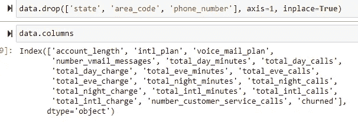

# 机器学习 101:分类

> 原文：<https://medium.com/analytics-vidhya/chapter-1-machine-learning-101-d7e0f470e7ca?source=collection_archive---------25----------------------->

你可以在网上找到很多关于机器学习的定义，太棒了。但是要从根本上理解它，你需要有一个概念:

*   ML 可以解决的问题类型
*   机器学习中构建模型的砖块
*   探索一些关键算法和概念，如欠拟合和过拟合、正则化和交叉验证(我们将在下面看到)
*   如何选择正确的算法、调整参数和验证模型

安妮·斯普拉特在 [Unsplash](https://unsplash.com?utm_source=medium&utm_medium=referral) 上的照片

对于这一章，让我们使用电信行业的客户流失数据。这个数据文件叫做“Orange_Telecom_Churn_Data.csv ”,在谷歌上很容易找到。数据帧如下所示:

对于初学者，我想使用一个非常基本和简单的技术，因为这个例子比 iris dataframe 有更多的行(5000 对 150)，结果会更准确。

机器学习有两大类:

*   **监督**:数据点有一个已知的结果
*   无监督的:数据指向未知的结果

由于我们所有的专栏都有很好的标签，我们现在将坚持监督学习，它也可以分为两类:

*   **分类**:其中结果是一个类别
*   **回归**:其中结果是连续的(每说的数值)

下面是我们在本例中想要做的事情的简要概述:

我们将从制作一个模型开始，向它提供一些数据，并预测一个目标值。

然后给我们的模型一些数据来预测适当的结果。

**—预处理—**

这实际上是大部分奇迹发生的部分，对于我们的例子，让**预测**流失率(如果一个客户停止订购某个电信业务)。

州、区号和电话号码是任意的，只会混淆我们的模型，所以我们使用。下降法，这是非常重要的**在开始训练前发现这种列，以获得最佳效果。**

****

**如您所见，使用[**label binarizer**](https://scikit-learn.org/stable/modules/generated/sklearn.preprocessing.LabelBinarizer.html)**库，我们将**真**和**假**数据转换为浮点数(0 代表假，1 代表真)
[filterwarnings](https://stackoverflow.com/questions/29086398/sklearn-turning-off-warnings/32389270) 只是一个小细节，以忽略该操作可能引发的警告，从而获得干净的输出。****

****[**最小最大缩放器**](https://scikit-learn.org/stable/modules/generated/sklearn.preprocessing.MinMaxScaler.html) ，将所有数据点缩放至 0 到 1 之间的值。(更具体地说，它**将数据**标准化。标准化对于具有负值的数据很有用。它把数据排列成一个****的标准正态分布。**分类比回归**更有用。)********

****我们希望我们的学习尽可能的快速和精确，而不需要花费太多的时间和内存，我将使用[这个函数](https://www.kaggle.com/arjanso/reducing-dataframe-memory-size-by-65?fbclid=IwAR1joj1puRpqAcPHCWfoieBitZRR7Oe6C5Hyr0dx6eKgvRyFC9R1QShrkVU)，它将内存使用大幅减少了 43%。它的简单功能是:****

1.  ****确定该列是否为数字****
2.  ****确定该列是否可以用整数表示****
3.  ****找出最小值和最大值****
4.  ****确定并应用能够适应值范围的最小数据类型****

********

****在预处理部分，我们要做的最后一件事是分离我们想要训练模型的列(我们称之为 *X_data* )和我们想要预测的列( *Y_data* )****

********

******—培训—******

****对于这个例子，我们需要将最后一列分为*真*或*假*类别(**搅动**或**未搅动)。**允许我们这样做的一个好算法将是[K-最近邻](https://www.saedsayad.com/k_nearest_neighbors.htm)，听起来很复杂，但相信我它并不复杂，让我用一个简单的图表向你展示它是如何使用二维工作的，因为这对我们凡人的大脑来说更容易可视化:****

****假设我们有一个医疗中心的数据，让我们画出年龄(Y 轴)和一生中手术次数(X 轴)的关系图。****

********

****蓝点在手术中存活了下来，而橙色的则没有。假设我们有一个钻石，我们想预测它的结果。****

********

****𝑑 = sqrt(|∆𝑠urgeries| + |∆𝐴𝑔e|)****

****我们将选取任意数量的邻居，例如 3 个，并测量钻石与其 3 个最近邻居之间的欧几里德距离。该算法将执行简单的求和以及重心运算来确定方块的结果****

****理论到此为止，让我们开始训练吧:****

********

****这是如何做到的，很好很容易，我们刚刚创建的 **knn 模型**可以从给定的 *X_data* 或我们想要创建的任何相同长度和参数的数组中预测 *y_data* ， *y_pred* 就是预测结果。但是我们怎么知道我们的模型是否准确呢？让我们定义一个函数来衡量它的精度:****

********

****real_data.shape[0]只返回行数****

****我们通过将数据框中的实际数据与我们刚刚使用 knn 算法预测的数据进行比较来衡量准确性。我们得到了 94.22%的准确率，这是很好的，但离完美还差得很远。也许增加邻居的数量(上面的 n_neighbors 参数)会有帮助？让我们来看看:****

********

****在这个例子中，3 是最准确的，但是为什么 1 会给出 100%匹配的结果呢？这就是所谓的**过拟合，**这意味着**我们的模型只有在给定的数据与他训练的数据非常相似时才会准确。这是我们想要避免的，因为机器学习的目的是泛化。******

******—奖金—******

****让我们追求完美，努力提高我们目前的成绩。我们将使用统一权重训练另一个模型，这是通过将分类器方法中的 **p** 参数(Minkowski 距离的幂参数)更改为 1 来完成的(当 p = 1 时，这相当于使用 manhattan_distance (l1)，欧几里得 _distance (l2)为 p = 2，这是**默认的**选项)
，即 [Manhattan Distance](https://towardsdatascience.com/k-nearest-neighbors-knn-algorithm-bd375d14eec7)****

********

****没有太大的改进(+0.34%)，因为这个例子的目的是为了知道存在哪些参数可以用来改进结果****

******—结局—******

****不要压倒这一章，我今天就到此为止，希望它能帮助你学会一两个技巧，你可以发电子邮件给我在 cellardoorweb@gmail.com 的任何要求或问题。敬请期待更多人工智能的精彩****