# 第 3 章—从头开始线性回归

> 原文：<https://medium.com/analytics-vidhya/chapter-3-linear-regression-from-scratch-474a795ea70f?source=collection_archive---------29----------------------->

在[第 1 章](/swlh/introduction-to-pytorch-fcb8a8e452ec)和[第 2 章](/analytics-vidhya/chapter-2-introduction-to-linear-regression-d6f95409e657)中，我们得到了 PyTorch 的介绍，PyTorch 中使用的一些有趣的函数，机器学习中使用的不同算法，以及线性回归的简要但扎实的介绍。在本章中，我们将从头开始构建一个线性回归模型，也就是说，不使用任何 PyTorch 内置函数。事不宜迟，我们开始吧。

[来源](https://wallpaperaccess.com/full/510424.jpg)

## **问题陈述**

通过观察一个地区的平均温度、降雨量和湿度(独立变量或预测变量)来预测苹果和橙子的产量(因变量或目标变量)。

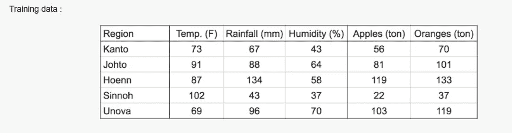

[来源](https://i.imgur.com/6Ujttb4.png)

我们知道，在线性回归中，目标变量被认为是独立变量的加权和，被称为偏差的某个常数抵消(我们添加此抵消，以便当所有独立变量变为零时，输出不应变为零)。

这个陈述可以用数学方法表示为:-

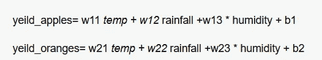

这些方程表明，因变量与因变量共享一个线性关系。

## **线性回归的学习部分**

我们应该通过分析训练数据来找到一组权重和偏差，即 w11、w12、…w23 以及 b1 和 b2，以基于 avg 来预测新区域的苹果和橙子的产量。在…之时、降雨量和湿度。这是通过稍微调整权重和偏差来实现的。

训练数据可以被认为是两个 numpy 阵列(矩阵),每个观察值输入和目标一行。

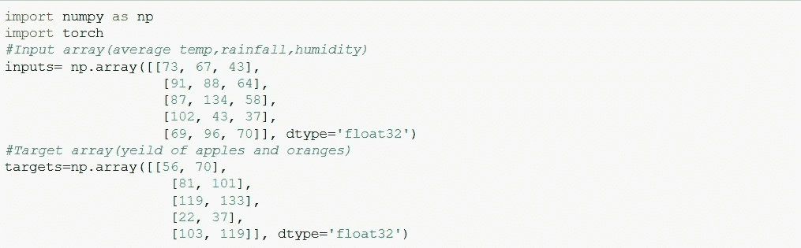

由作者生成

我们现在将 numpy 数组转换为张量，为此我们使用 torch.from_numpy()，该方法将 numpy 数组作为输入和输出张量。

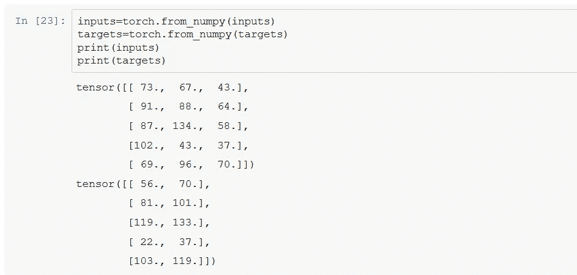

由作者生成

权重(w11，w12，…w23)和偏差(b1，b2)可以表示为矩阵，第一行和第一个偏差元素用于预测苹果的产量，第二行和元素用于预测橙子的产量。

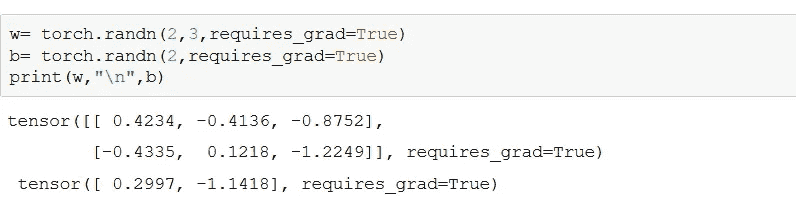

由作者生成

在这段代码中，我们使用 torch.randn()创建了两个张量 w 和 b，它们将作为我们的权重和偏差矩阵。torch.randn()函数创建两个矩阵，其中元素是从均值=0、标准差=1 的正态分布中随机选取的。

## **模型创建**

我们的模型只是一个执行输入和权重(转置)的矩阵乘法并添加偏差的函数。

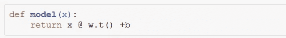

由作者生成

我们定义 model()，它将输入矩阵作为参数并返回预测。

我们将输入矩阵与随机生成的权重矩阵的转置相乘(以避免大小不匹配)，并将结果与偏差矩阵相加。

*   @符号代表 PyTorch 中矩阵乘法
*   。方法返回矩阵的转置

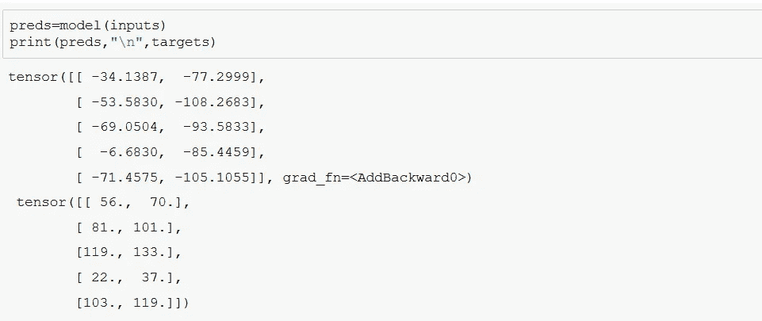

由作者生成

我们将输入作为参数传递给 model()。比较目标矩阵和预测矩阵，我们看到预测值和目标值之间的巨大差异。这是因为我们选择了完全随机的权重和偏差矩阵。

## **损失函数**

在我们改进我们的模型之前，我们需要评估我们的模型表现如何。为了确定性能，我们计算均方误差(MSE)。

1.  找出预测值和目标值之间的差异，即误差
2.  由于误差可能有负值，为了消除这一点，我们平方这些值。
3.  求平均值。

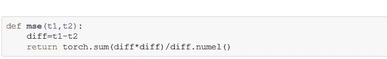

上述函数计算均方误差。

*   torch.sum 返回张量中所有元素的总和
*   numel 方法返回张量中元素的数量。

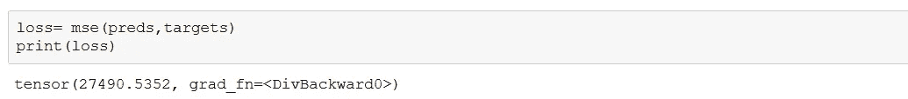

由作者生成

模型的损耗非常高。平均而言，预测值与目标值相差约 165.803 (sqrt(27490.5352))。考虑到我们的目标值本身在 50–150 的范围内。损失越低，模型越好。

## **梯度计算**

我们可以根据权重和偏差矩阵自动找到损失的梯度或导数，因为它们的*。requires_grad* 被设置*为真*，grad 返回一个相同维数的矩阵。梯度存储在*中。各自张量的 grad* 属性。在调用。grad 属性我们必须调用 backward()函数。

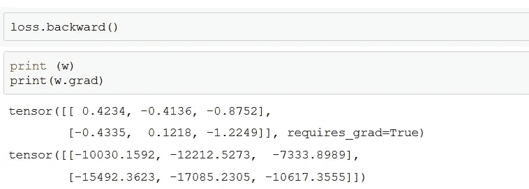

由作者生成

损失是我们的权重和偏差的二次函数，我们的目标是找到给出最低损失的权重和偏差的集合。微积分的一个关键观点是，梯度表示损失的变化率，或损失函数相对于权重和偏差的斜率。

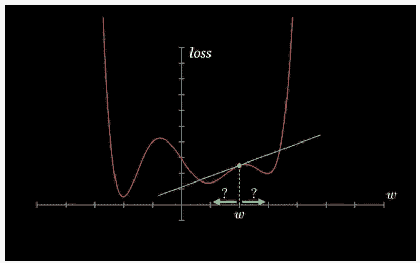

[**来源**](https://i.imgur.com/hFYoVgU.png) **:图表 1**

在图 1 中，梯度元素为正，因此:

*   稍微增加元素的值会增加损耗。
*   稍微降低元素的值，可以减少损耗。

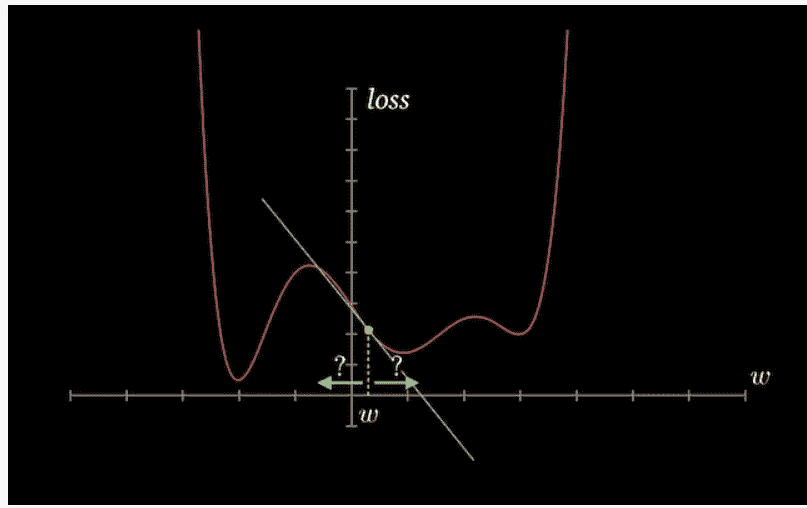

[来源](https://i.imgur.com/w3Wii7C.png):图 2

在图 2 中，梯度元素是负的，因此:

*   稍微增加元素的值，可以减少损耗。
*   稍微降低元素的值会增加损耗。

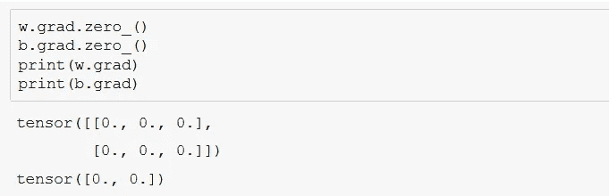

由作者生成

在上面的代码片段中，我们通过调用。zero_()方法。我们需要这样做，因为 PyTorch 会累积梯度，也就是说，下次我们对 loss 调用 backward()时，新的梯度值会添加到现有的梯度值中，这可能会导致意外的结果。

## **使用梯度下降调整权重和偏差**

我们将使用梯度下降优化算法来减少损失并改进我们的模型，该算法具有以下步骤:

*   生成预测
*   计算损失
*   根据权重和偏差计算梯度
*   通过减去与梯度成比例的少量来调整权重
*   将梯度重置为零

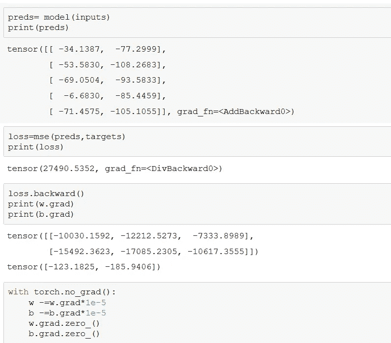

由作者生成

我们可以通过用临时设置所有*的 *torch.no_grad():* 包装代码块来阻止 autograd()在 requires_grad 设置为 True 的张量上跟踪历史。requires_grad=False* 。

我们将梯度乘以一个很小的数(在这种情况下是 10^-5)，以确保我们不会对权重进行很大的修改，因为我们只想在梯度的下坡方向上迈出一小步。这个数叫做算法的学习率。在我们更新了权重之后，我们将梯度重置回零，以避免影响任何未来的计算。

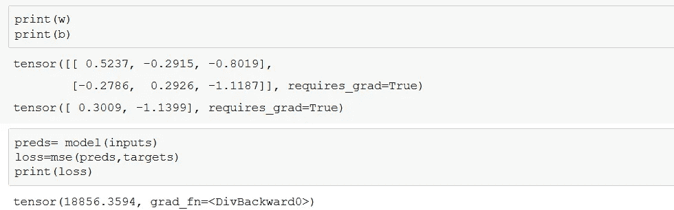

由作者生成

我们已经实现了损失的显著减少，简单地通过使用梯度下降稍微调整权重和偏差。

## **多纪元训练**

为了进一步减少损失，我们可以使用梯度下降多次重复调整权重和偏差的过程。每次迭代称为一个时期。让我们训练模型 200 个纪元。

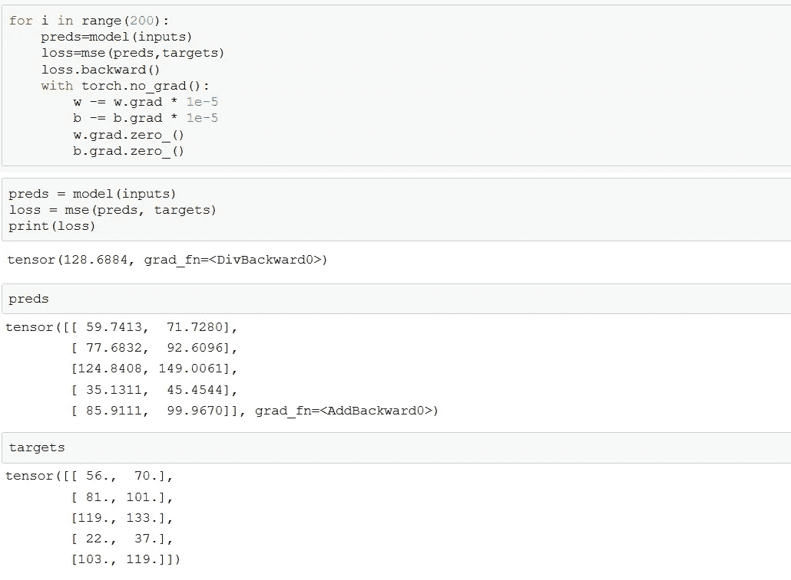

由作者生成

我们可以看到，损失已经大大减少，经过 200 个时代后，损失的最终值是 128.6884，这是相当不错的。预测值现在更接近目标值。

总结一下这篇博客，我们了解了如何在不使用任何 PyTorch 内置工具的情况下从头构建一个模型，并且仍然能够获得一个好的预测模型。

我使用了一个 Jupyter 笔记本来创建模型，这是一个开源的 web 应用程序，允许您创建和共享包含实时代码、方程、可视化和叙事文本的文档，任何人都可以使用这个平台来实践本教程。

在下一篇博客中，我们将学习使用 PyTorch 内置函数为更大的数据构建一个线性回归模型。

*感谢阅读，下期再见！*

> 如果你需要这个博客的链接，请留下你的评论。