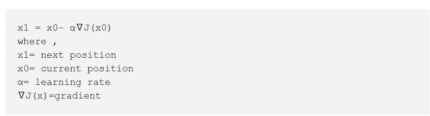
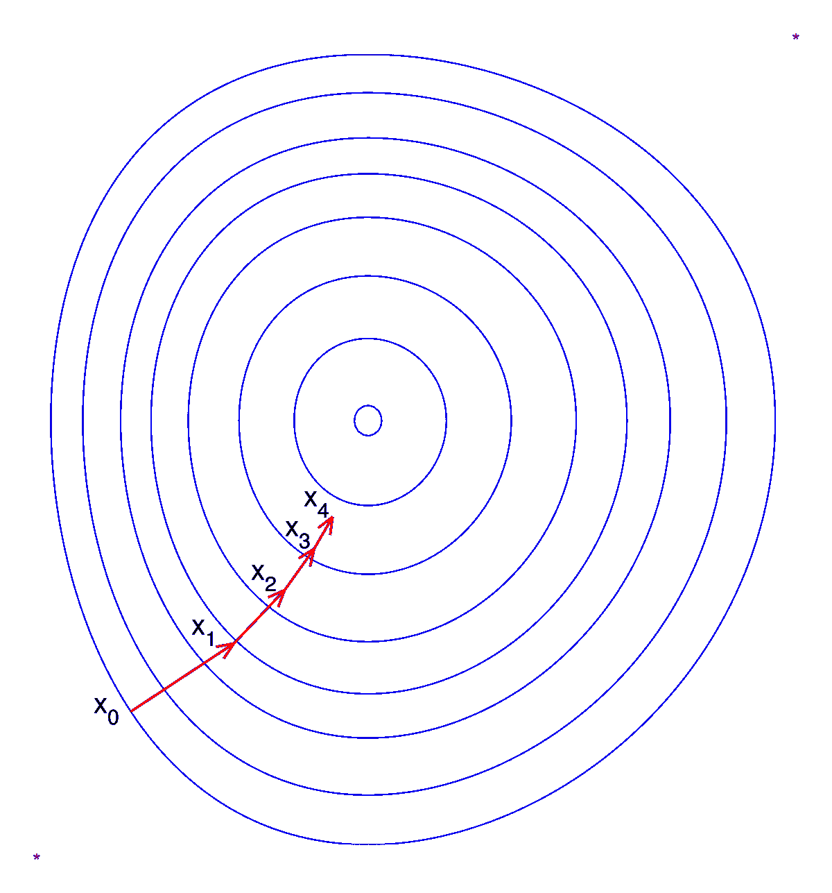

# 第 4.1 章—使用 PyTorch 内置的线性回归模型

> 原文：<https://medium.com/analytics-vidhya/chapter-4-1-linear-regression-model-using-pytorch-built-ins-53e8be20fb96?source=collection_archive---------28----------------------->

## PyTorch 内置介绍。

在之前的博客中，我们从头开始构建了一个线性回归模型，没有使用任何 PyTorch 内置函数。在使用 PyTorch 内置之前，我们应该了解一些关键概念，并熟悉常用的包和模块。让我们开始吧。

[来源](https://ak.picdn.net/shutterstock/videos/3921440/thumb/1.jpg)

1.  **torch.nn 包**

这个 torch 包提供了一组标准的神经网络模块和一组容器模块，可以用来定义任意方向(循环或非循环)的图形。实际上，大多数网络要么是顺序的，要么具有简单的分支模式或递归。

**2。torch . utils . data . tensordataset**

这个类帮助我们使用数组索引来访问一小部分训练数据。它返回一个元组(或元组对)，其中第一个元素包含所选行的输入变量，第二个元素包含目标。

**3。torch . utils . data . random _ split**

我们使用这个函数将我们手头的数据集分成训练、验证和测试数据集(我们将很快讨论这些)。

它需要两个参数:—

*   数据集:-要拆分的数据集。
*   长度:-每个子集不同长度的列表。

**4。torch.utils.data.DataLoader**

这个类用于将我们的数据分成预定义大小的批。它还提供了数据的随机混洗。它使计算更快更有效。因为我们在列表中有两个值，所以在调用这个函数时，我们有两个分配给它的对象。

**5。torch.nn.Linear**

这个类对输入的数据进行线性变换。我们使用神经网络定义模型，而不是像在第 3 章中那样手动初始化权重和偏差。线性类自动。

这个类有以下参数:—

*   in_features :-每个输入样本的大小。
*   out_features :-每个输出样本的大小。
*   偏差:-如果设置为 false，该层将不会学习附加偏差。默认情况下，它被设置为 true。

权重的形状为(输入要素，输出要素)，偏差的形状为(输出要素)。它们是随机初始化的，可以更改。它有一个参数方法，将返回模型中所有权重和偏差矩阵的列表。对于线性回归模型，我们只有一个权重矩阵和一个偏差矩阵。

**6。torch.nn.Functional**

这个火炬包包括许多损失函数和其他几个实用程序。

**7。torch.optim**

我们可以使用优化器，而不是使用梯度手动操作模型的权重和偏差。这个 torch 包实现了各种优化技术。要使用 torch.optim，我们必须构建一个优化器对象，它将保存当前状态，并根据计算出的梯度更新参数。所有的优化技术都实现了一个 step()方法来更新参数。

这些是我们将在下一篇博客中用来构建线性回归模型的一些包。接下来，让我们来看看我们将用于实现该模型的一些术语和概念。

在构建真实世界的机器学习模型时，我们将把可用的数据集分成三部分:—

*   训练集:这是一组用于训练模型的数据，即计算损失，使用优化技术调整模型的权重。
*   验证集:-该集用于在训练时评估模型，调整超参数(学习率、批量大小等。)并挑选模型的最佳版本。
*   测试集:这是用来比较不同的模型，或不同类型的建模方法，并报告模型的最终准确性。

**梯度下降算法**

这个术语在[第 3 章](/analytics-vidhya/chapter-3-linear-regression-from-scratch-474a795ea70f)的最后部分使用，当时我们正在训练模型以减少损失函数。让我们详细讨论一下这个概念。

定义导数有很多种方法。两个常见的定义是:-

*   函数图形切线的斜率。
*   函数变化率。

梯度是几个变量的导数的概括。让我们用 x 作为函数 J(x1，x2，x3)中的变量

由作者生成

这里∇是符号表示，表示我们在取函数的梯度，而< and >内的梯度用来表示梯度是一个向量。

对于标量(一个变量)，梯度给出切线的斜率。在矢量的情况下，梯度指向函数增长最快的方向。

现在，让我们建立在上面的梯度定义，让我们尝试和理解梯度下降算法。这是一个迭代过程，用于寻找误差或成本函数的最小值。

如果我们想减少一个函数，我们要朝着与最快增加相反的方向移动。也就是说，如果我们在点 x0，并想移动到附近最低的点(局部最小值)，我们的下一步应该是:—

由作者生成

[来源](https://upload.wikimedia.org/wikipedia/commons/thumb/f/ff/Gradient_descent.svg/1200px-Gradient_descent.svg.png) -梯度下降算法

学习率是一个非常小的值，乘以梯度，然后从当前位置减去。学习速度的选择是至关重要的，尤其是当我们接近最小值的时候。如果学习率很低，达到最低点所用的时间将会很长。另一方面，如果选择的值太高，则会导致过冲，并可能错过局部最小值。

等式中的负号表示我们正朝着与梯度相反的方向运动。

**随机梯度下降**

我们将在我们的模型中使用随机梯度下降作为优化器。之所以称之为随机，是因为样本是成批选择的(通常是随机洗牌)，而不是作为一个单一的群体。它也被称为增量梯度下降。在该算法中，我们重复运行训练集，并且每当我们遇到数据点时，我们仅根据该单个数据点集(输入，目标)的误差梯度来更新参数。而批量梯度下降必须在采取单个步骤之前扫描整个训练集，如果数据点的数量非常大，这可能证明是昂贵的。

作为博客的总结，我们现在可以简单解释一下我们将使用 PyTorch 内置的不同 torch 包来构建线性回归模型。我们对梯度下降算法和随机梯度下降算法有很好的理解。

在下一篇博客中，我们将以此为基础，使用 PyTorch 内置函数构建一个线性回归模型。

*感谢阅读，下期再见！*

> 对于博客的进一步阅读，

[https://github . com/cleor 41/cs 229 _ Notes/blob/master/lections/cs 229-Notes 1 . pdf](https://github.com/cleor41/CS229_Notes/blob/master/lectures/cs229-notes1.pdf)

请看[这些来自 Udacity 课程](https://jovian.ml/outlink?url=https%3A%2F%2Fstorage.googleapis.com%2Fsupplemental_media%2Fudacityu%2F315142919%2FGradient%2520Descent.pdf)的笔记。