# 第 4.2 章—线性回归模型

> 原文：<https://medium.com/analytics-vidhya/chapter-4-2-linear-regression-using-pytorch-built-ins-6cba7900e779?source=collection_archive---------26----------------------->

## 使用 PyTorch 内置

在上一篇博客[第 4.1 章](/analytics-vidhya/chapter-4-1-linear-regression-model-using-pytorch-built-ins-53e8be20fb96)中，我们详细讨论了一些常用的内置 PyTorch 包，以及我们将用来构建线性回归模型的一些基本概念。在这篇博客中，我们将使用 PyTorch 内置工具来构建我们的模型。

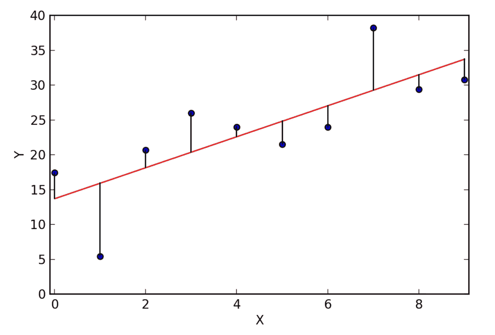

[来源](https://www.google.com/url?sa=i&url=https%3A%2F%2Fquantumcomputingtech.blogspot.com%2F2019%2F04%2Flinear-regression-machine-learning.html&psig=AOvVaw2WW3z45m4vGVKnnjoCtYWh&ust=1592674209224000&source=images&cd=vfe&ved=0CAMQjB1qFwoTCNio1pm1juoCFQAAAAAdAAAAABAD)

在这篇博客中，我们将使用个人年龄、性别、身体质量指数、孩子数量和吸烟习惯等信息来准确预测保险费用。这种模型有助于保险公司确定一个人的年度保险费。这个问题的数据集取自:【https://www.kaggle.com/mirichoi0218/insurance[。](https://jovian.ml/outlink?url=https%3A%2F%2Fwww.kaggle.com%2Fmirichoi0218%2Finsurance)

我们将通过以下步骤创建一个模型:

1.  下载并探索数据集，
2.  准备用于训练的数据集，
3.  创建线性回归模型，
4.  训练模型以适应数据，
5.  使用训练好的模型进行预测。

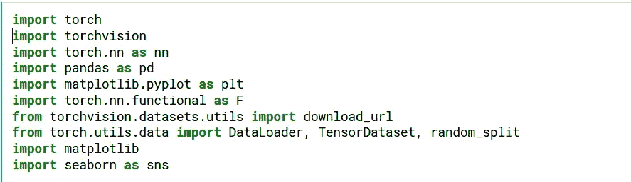

由作者生成

我们从导入所需的包开始。我们已经讨论了前一篇博客中使用的大多数包。

## **步骤 1 :-下载并浏览数据**

对于这个博客，我们将使用 Kaggle 平台来构建我们的模型。我们可以直接从 Kaggle 加载数据集。

为了将数据集加载到内存中，我们将使用 pandas 库中的 read_csv 函数。这些数据将作为熊猫数据框架加载。

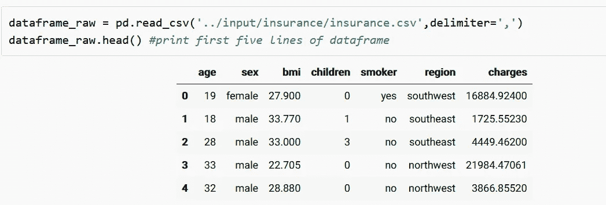

由作者生成

我们可以使用 Pandas 中的 head 函数打印数据集的前五行。

我们将对数据集做一个小的定制，这样每个读者都能得到一个稍微不同的数据集。这一步不是强制性的。

由作者生成

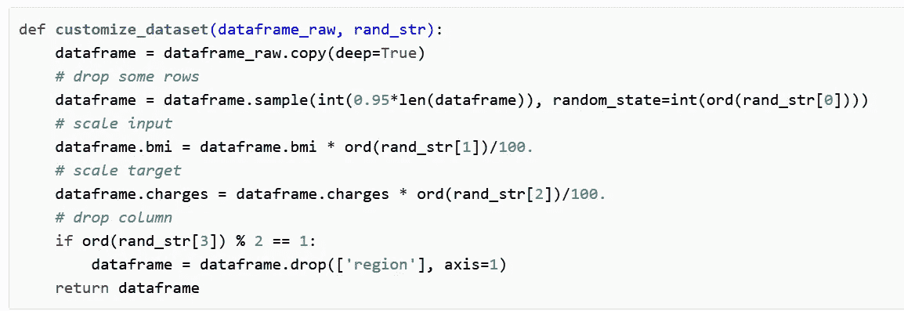

由作者生成

customize_dataset 函数将使用您的姓名作为随机数的来源来稍微定制数据集。

现在让我们调用 customize 函数，将 dataset 和 your_name 作为参数传递，并使用 head 函数检查数据集的前几行。

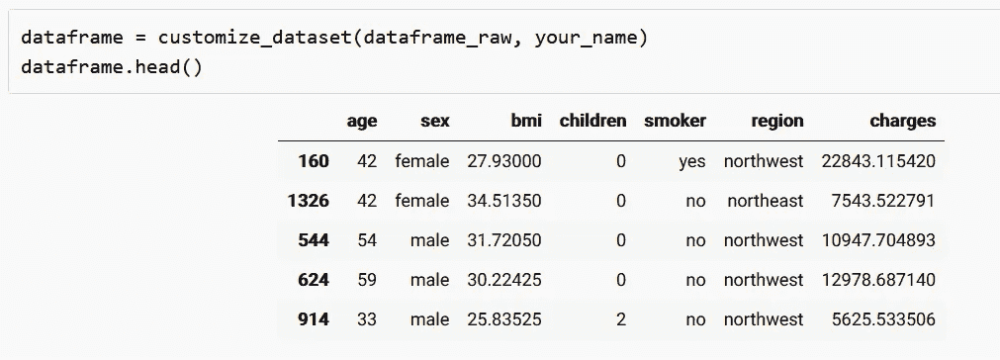

由作者生成

现在让我们找出数据集中的行数和列数。

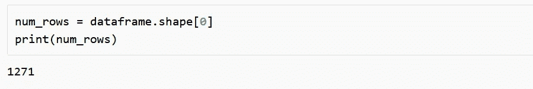

由作者生成

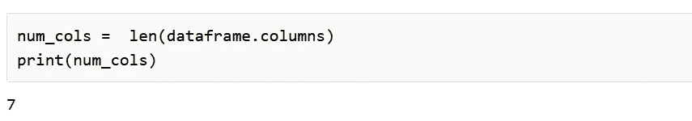

由作者生成

现在我们应该分配输入、输出和分类列(非数字的输入列)。

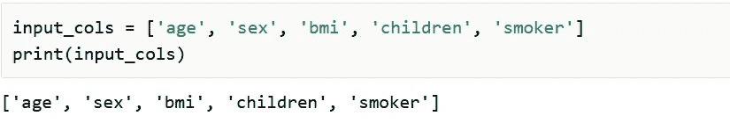

由作者生成

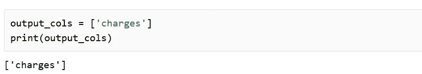

由作者生成

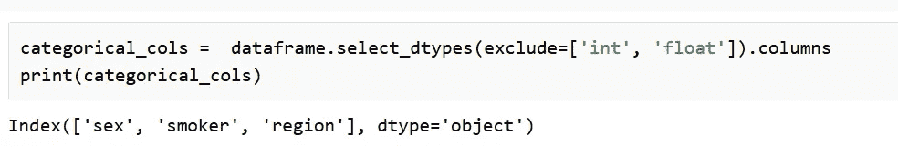

由作者生成

我们可以找到输出列“电荷”的最小值、最大值和平均值。我们也可以在图表中画出电荷的分布。作为参考，请看看 https://jovian.ml/aakashns/dataviz-cheatsheet。

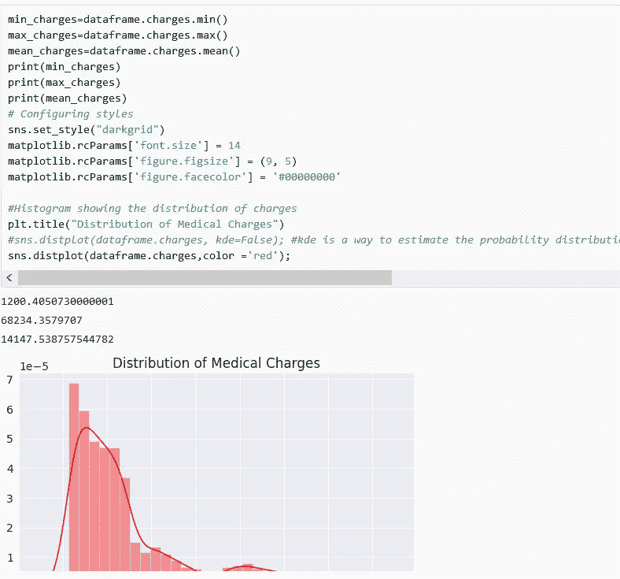

由作者生成

## **步骤 2 :-准备用于训练的数据集**

我们需要将熊猫数据框架中的数据转换成 PyTorch 张量用于训练。为此，第一步是将其转换为 numpy 数组，第二步是将分类列转换为数字。

通读[熊猫文档](https://pandas.pydata.org/pandas-docs/stable/user_guide/categorical.html)，了解我们如何将分类变量转换成数字。

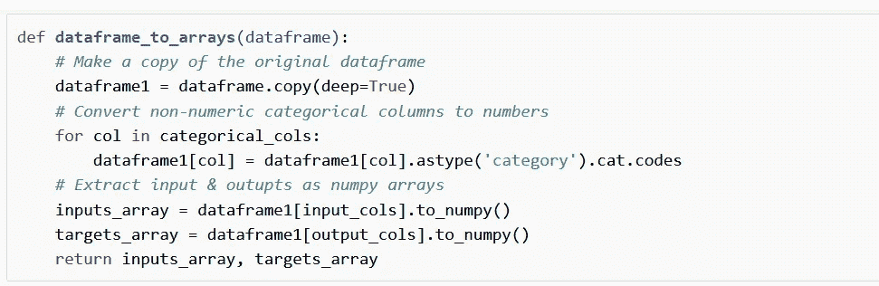

由作者生成

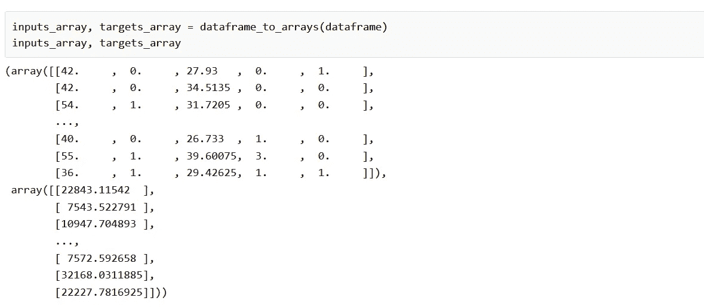

由作者生成

下一步是将这些 numpy 数组转换成 PyTorch 张量。

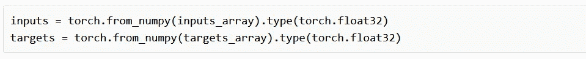

由作者生成

我们使用输入和目标张量来创建 PyTorch 数据集和数据加载器，用于训练和验证。我们将首先创建一个 TensorDataset，然后创建训练和验证数据集。我们将使用 random_split 函数来分割数据集，以获得训练和验证数据集。最后，选择一个批量大小来创建用于训练和验证的数据加载器。

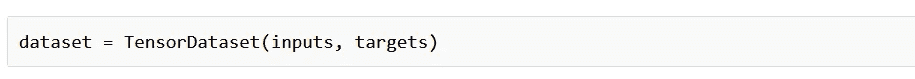

由作者生成

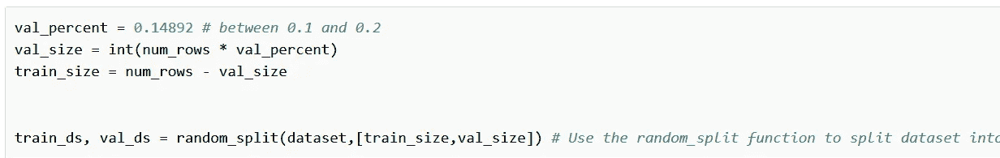

由作者生成

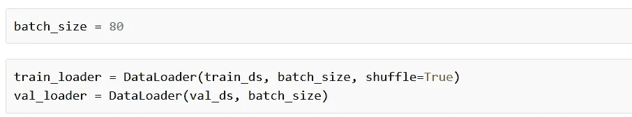

由作者生成

在我们进入下一步之前，让我们来看一组数据。

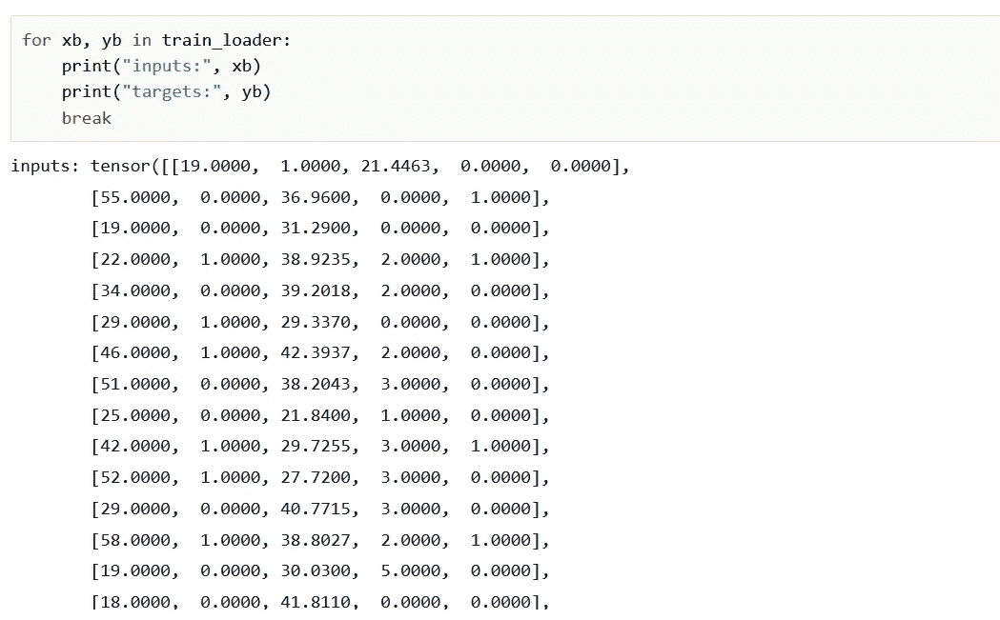

由作者生成

## **步骤 3 :-创建一个线性回归模型**

让我们创建保险模型的类定义。在创建类之前，我们必须找到输入和输出列的大小。

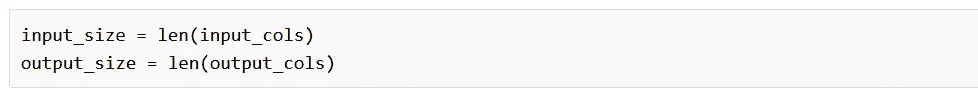

由作者生成

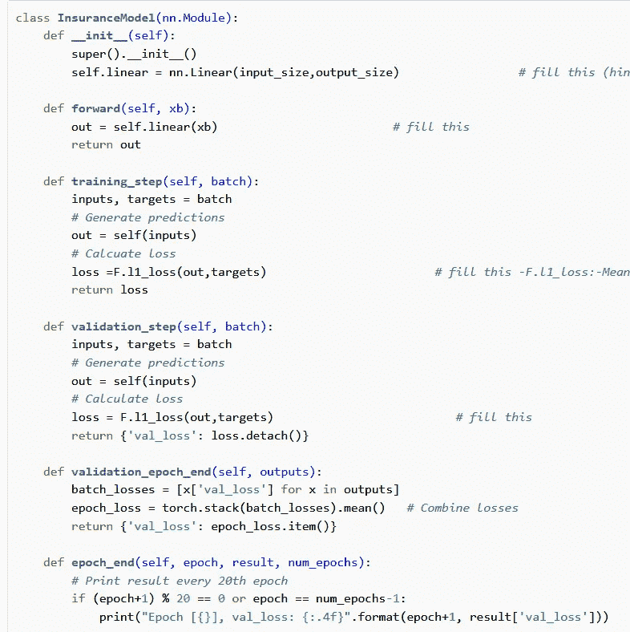

由作者生成

让我们讨论一下每个函数的作用。training_step 函数获取一批数据。从 batch 中我们得到输入，self(输入)，self 表示模型本身，它调用 forward 函数并将输入作为参数传递。在 nn.module 中，实现了一个可调用的方法，该方法只接受输入并传递给 forward 函数。

validation_step 函数也遵循与 training_step 函数相同的方法。此外，我们还计算并返回验证损失。

在我们运行完所有的批处理之后，我们得到了输出列表。我们提取出每一批的损失，并求出该批损失值的平均值，从而得到每个时期的验证损失。这是由 validation_epoch_end 函数完成的。

在每个时期之后，我们记录该时期的时期号和验证损失。我们显示每个第 20 个时期和最后一个时期的时期编号和验证损失。这是由 epoch_end 函数完成的。

让我们使用 InsuranceModel()类创建一个模型，并使用 model.parameters 检查模型的权重和偏差。

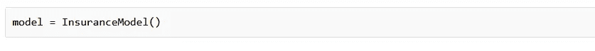

由作者生成

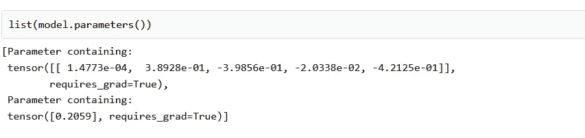

由作者生成

## **步骤 4 :-训练模型**

为了训练我们的模型，我们将使用拟合方法。

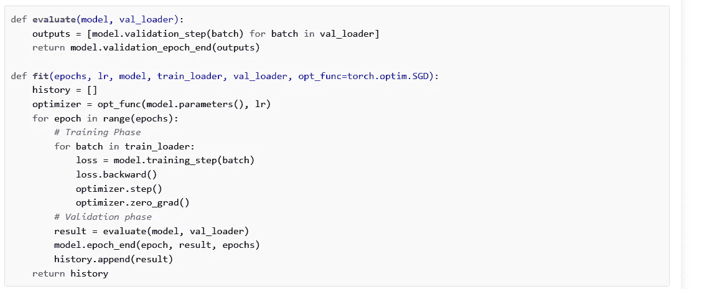

由作者生成

evaluate 函数接受两个参数模型和 val_loader。它迭代验证数据集中的批次，并为每个批次调用 validation_step 函数。对于每一批，它都将验证损失作为一个对象取回。所有这些被组合成列表，我们得到返回的对象列表作为输出。

在这之后，我们称之为 validation_epoch_end(输出)。这将返回包含验证数据集平均损失的对象。

拟合函数创建一个优化器，默认情况下使用 torch.optim.SGD 对模型参数(权重和偏差)执行梯度下降。它还将历元数、学习率、模型、train_loader 和 val_loader 作为输入。我们声明 history[]来存储每个时期的验证损失。

在训练之前，调用 evaluate 函数来计算验证集的损失。

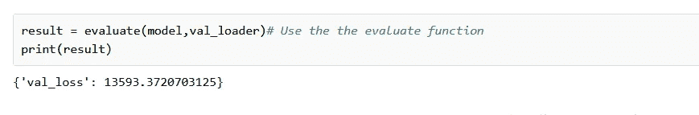

我们现在准备训练模型。您可能需要多次运行训练循环，针对不同的时期数和不同的学习率，以获得良好的结果。此外，如果您的损失变得太大(或 nan)，您可能需要通过运行 model = InsuranceModel()来重新初始化模型。尝试一段时间，尽量降低损失。

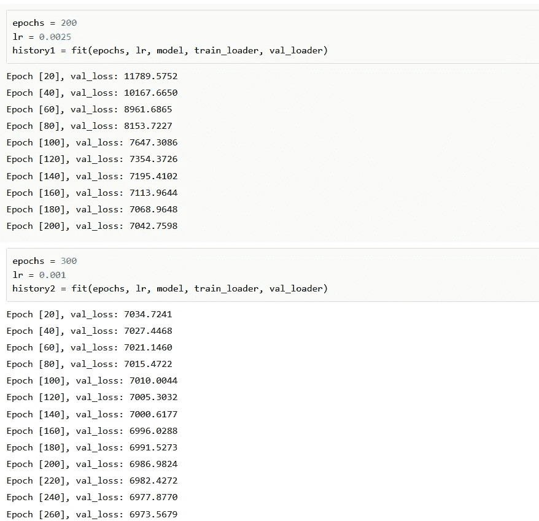

由作者生成

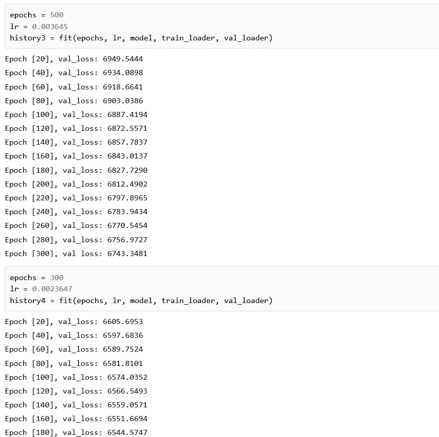

由作者生成

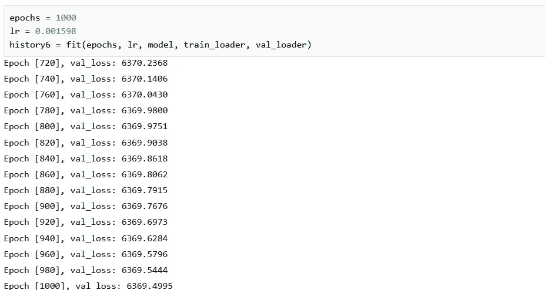

由作者生成

我们得到了 6369.4995 的最终确认损失。重新初始化模型，并尝试不同的批量大小、时期数、学习率等，以获得更低的验证损失。

## **步骤 5 :-使用训练好的模型进行预测**

让我们写一个函数来做一些预测。

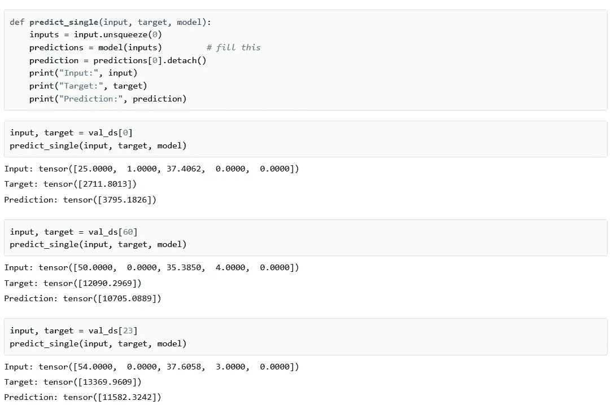

由作者生成

我们使用 unsqueeze(0)方法来给出一个额外的维度，以便它表示一批图像。正如我们所看到的，预测值非常接近目标值。

*感谢阅读，下期再见！*

> 如果你需要这个博客的链接，请留下你的评论。

> 对于博客的进一步阅读，

 [## 熊猫教程 1:熊猫基础(read_csv，DataFrame，数据选择等。)

### Pandas 是最受欢迎的用于数据科学和分析的 Python 库之一。我喜欢说它是“SQL of…

data36.com](https://data36.com/pandas-tutorial-1-basics-reading-data-files-dataframes-data-selection/)  [## torch.nn.functional - PyTorch 主文档

### 在某些情况下，将 CUDA 后端与 CuDNN 一起使用时，该操作员可能会选择一个不确定的算法来…

pytorch.org](https://pytorch.org/docs/stable/nn.functional.html#loss-functions)