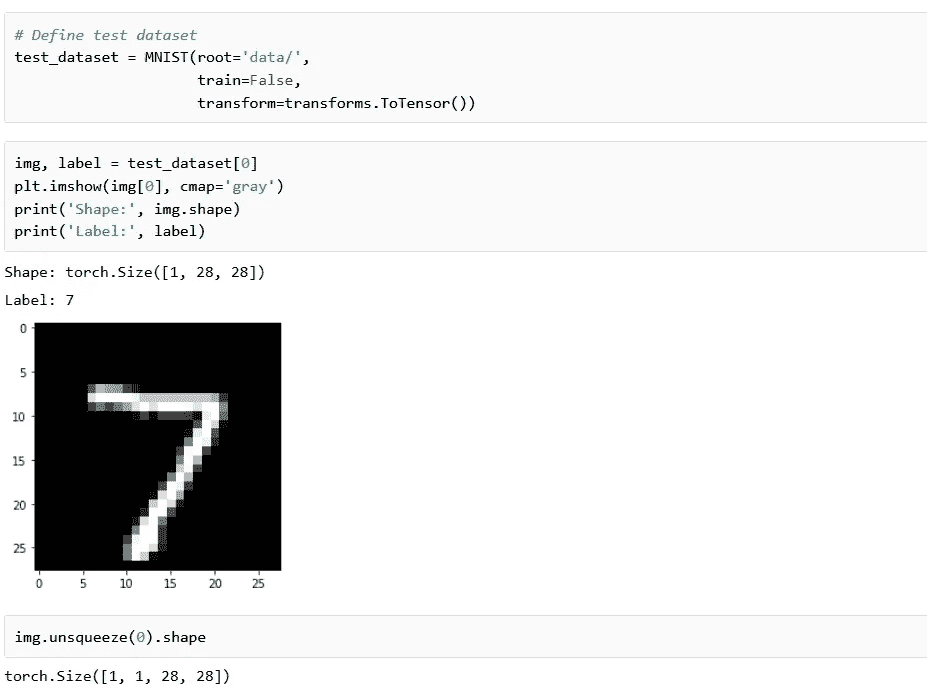

# 第 5 章—逻辑回归

> 原文：<https://medium.com/analytics-vidhya/chapter-5-logistic-regression-4a1a90c9d205?source=collection_archive---------27----------------------->

## 在 PyTorch 中建立逻辑回归模型

在以前的博客中，我们使用线性回归技术来创建模型。但是线性回归技术是无限的，它有无限的可能性，只有当响应变量是连续的时候才能使用，这就把逻辑回归引入了框架。

[来源](https://searchengineland.com/figz/wp-content/seloads/2018/03/machine-learning-AI-dark-blue-ss-1920.jpg)

逻辑回归用于描述数据和解释因变量与一个或多个标称、序数、区间或比率自变量之间的关系。

分类变量代表可以分成组或级别的数据类型。婚姻状况、性别这些问题的答案可能是“是/否”或“男/女”。

## 逻辑回归的类型:-

1.  二元逻辑回归——它处理有两种可能结果的分类变量。
2.  多标称逻辑回归——它处理具有三个或更多标称类别的分类变量。
3.  有序逻辑回归——它处理具有三个或更多有序类别的分类变量。序数意味着类别将按顺序排列。示例:-评级(1-5)。

逻辑回归模型类似于线性回归模型，也就是说，存在权重和偏差，并且使用简单的矩阵运算获得输出。

对于这个笔记本，我们将考虑 MNIST 数据集，它由手写数字(0 到 9)的 28px 乘 28px 灰度图像以及每个图像的标签组成，这些标签指示它代表哪个数字。它包含 60000 张用于训练模型的图像。

由作者生成

在上面的代码块中，我们导入了 torchvision，它由流行的数据集、模型架构和计算机视觉的常见图像转换组成。它包含下载和导入流行数据集的实用程序。

我们可以看到，当第一次执行该语句时，它将数据下载到笔记本旁边的 data/目录中，并创建一个 PyTorch 数据集。在随后的执行中，由于数据已经下载，下载被跳过。

由作者生成

从上面的代码中，我们可以看到数据集的大小，它有 60，000 张图像，可用于训练模型。还有一个额外的 10，000 幅图像的测试集，可以通过将 train=False 传递给 MNIST 类来创建。

由作者生成

我们可以看到它是由 28px 乘 28px 和一个标签组成的一对。图像是 PIL 类的对象。Image，它是 Python 图像库的一部分。这是一个免费的开源库，为 Python 解释器增加了处理能力。这个库支持许多文件格式，并提供强大的图像处理和图形功能。

由作者生成

Matplotlib 是用于在 Python 中绘制图形的库。我们可以使用 matplotlib 在 Jupyter 中查看图像。此外，我们添加%matplotlib inline，这一行告诉 Jupyter notebook 我们要在笔记本中绘制图形，如果没有这一行，绘图将显示为弹出窗口。以%开头的语句称为神奇命令，用于配置 Jupyter 的行为。

借助 Matplotlib，我们可以通过绘制来分析一些图像。cmap 是一个将数字映射到颜色的字典。Matplotlib 提供了许多内置的彩色地图。在这种情况下，我们将 cmap 设置为“gray ”,以便它映射 0 和 1 之间的值。

由作者生成

注意:-我们应该理解 PyTorch 不能处理图像的事实。我们需要将图像转换成张量。我们可以通过使用 torchvision.tranforms 包来做到这一点，该包包含用于此目的的预定义函数。我们使用 ToTensor 变换将图像转换为 PyTorch 张量。

由作者生成

在上面的代码块中，我们将图像转换为张量。从最大值和最小值可以清楚地看出，值被限制在 0 和 1 之间，其中 0 是黑色，0 是白色，值之间是不同的灰度。

## 训练和验证数据集

没有单独的验证集，我们手动将 60000 幅图像分成训练和验证数据集。我们通过使用 PyTorch 中的随机分割方法来实现这一点。

由作者生成

选择随机样本来创建验证集是很重要的，因为训练数据通常是按照目标标签排序的，即 0 的图像、1 的图像、2 的图像等等。如果我们简单地通过选择最后 20%的图像来挑选 20%的验证集，则验证集将只包含 8 和 9 的图像，而训练集将不包含 8 和 9 的图像。这将使得不可能使用训练集来训练好的模型，训练集在验证集(和真实世界的数据)上也表现良好。

我们现在可以创建数据加载器来帮助我们批量加载数据。我们将使用 128 的批量。

由作者生成

我们为训练数据加载器设置 shuffle=True，以便在每个时期生成的批次是不同的，这种随机化有助于概括和加速训练过程。另一方面，由于验证数据加载器仅用于评估模型，因此不需要打乱图像。

# 评估度量和损失函数

我们需要一种方法来评估我们的模型表现如何。一种自然的方法是找到被正确预测的标签的百分比，即预测的准确性。

由作者生成

==对两个具有相同形状的张量执行逐元素比较，并返回相同形状的张量，其中 0 表示不相等的元素，1 表示相等的元素。将结果传递给 torch.sum 将返回预测正确的标签数。最后，我们除以图像的总数来得到精确度。

## 模型

现在我们已经准备好了数据加载器，我们可以定义我们的模型了。

1.  逻辑回归模型与线性回归模型几乎相同，即有权重和偏差矩阵，并且使用简单的矩阵运算获得输出(pred = x @ w.t() + b)。
2.  我们可以用 nn。线性来创建模型，而不是手动定义和初始化矩阵。
3.  从 nn 开始。Linear 希望每个训练示例都是一个向量，每个 1x28x28 图像张量在传递到模型中之前都需要展平为大小为 784 (28 * 28)的向量。
4.  每个图像的输出是大小为 10 的向量，向量的每个元素表示特定目标标签的概率(即 0 到 9)。图像的预测标签仅仅是具有最高概率的标签。

# 训练模型

由作者生成

由作者生成

Evaluate 函数将执行验证阶段，而 fit 函数将执行整个训练过程。

fit 函数记录每个时期的验证损失和度量，并返回训练过程的历史。这对于调试和可视化训练过程非常有用。在我们训练该模型之前，让我们看看该模型在具有初始随机初始化权重和偏差集的验证集上的表现。

批量大小、学习率等配置。需要在训练机器学习模型时预先挑选，称为超参数。选择正确的超参数对于在合理的时间内训练准确的模型至关重要，并且是研究和实验的活跃领域。

由作者生成

初始精度约为 10%，这是人们对随机初始化模型的预期(因为它有十分之一的概率通过随机猜测得到正确的标签)。还要注意，我们使用的是。格式方法，以便只打印小数点后的前四位数字。

现在我们来训练模型。我们应该通过时代的数量。

由作者生成

在前 5 个时期，我们的模型在验证集上达到了 82%的准确度。让我们继续这个过程，看看我们是否能提高它的准确性。

由作者生成

由作者生成

# 使用单个图像进行测试

让我们用 10000 张图像的预定义测试数据集中的一些图像来测试我们的模型。我们首先用 ToTensor 变换重新创建测试数据集。

由作者生成

img.unsqueeze 只是在 1x28x28 张量的开头添加了另一个维度，使其成为 1x28x28 张量，模型将其视为包含单个图像的批处理。

定义一个辅助函数 predict_image，它返回单个图像张量的预测标签。

由作者生成

由作者生成

由作者生成

让我们看看测试集上模型的总体损失和准确性。

由作者生成

总之，我们可以看到，即使经过非常长时间的训练，该模型也很可能不会越过 86%的准确度阈值。一个可能的原因是学习率可能太高。有可能模型的参数在具有最低损失的最佳参数集附近“跳动”。你可以试着降低学习率，多训练几个纪元，看看有没有帮助。

感谢阅读，下期再见！

*如果你需要本博客笔记本的链接，请留言。*