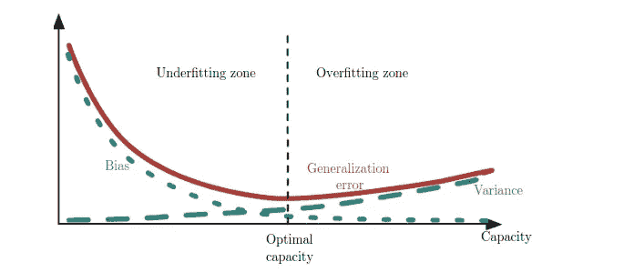

# 第 5 章:机器学习基础(第 1 部分)

> 原文：<https://medium.com/analytics-vidhya/chapter-5-machine-learning-basics-26c64412b42e?source=collection_archive---------18----------------------->

这个故事是我从伊恩·古德菲勒、约舒阿·本吉奥和亚伦·库维尔的《深度学习》一书中总结出来的直觉

如果你没有读过我之前的故事，请去查看一下[https://medium . com/analytics-vid hya/deep-learning-book-in-plain-English-ch1-2 f 73 e 9 b 71 ACB](/analytics-vidhya/deep-learning-book-in-plain-english-ch1-2f73e9b71acb)

本章从解释线性回归开始，简单哈？我知道，但这本书确实超出了我们在许多教程中看到的简单线性方程，所以让我们从线性回归方程开始:

其中，y-hat 是我们需要预测的目标值，beta-one 是斜率，也就是权重，X 是我们从数据集获得的特征。权重得到调整，直到它给我们一个好的结果。那么我们如何衡量这个简单模型的好呢？你听说过交叉熵吗？震惊？是的，我也是。**交叉熵**就是模型和实际数据集之间的数据分布差异。默认情况下，模型的分布是高斯分布，所以想象一下，如果您有一个高斯分布，如下所示:

像这样的散点图，

该模型在训练期间所做的是，它试图尽可能地匹配这两张照片，而不模仿数据的确切分布，因此我们不会面临过度拟合。因此，这里的度量或交叉熵只是预测点和实际点之间的 L2 距离的均方根误差。

顺便说一下，我们可以通过控制模型**的容量来确定模型是否会过拟合或欠拟合。**

事实上，模型的能力就是模型拟合一个函数的能力。例如，我们可以增加这个线性回归模型的容量，以包括多项式，这增加了它的假设空间，从而增加了它的复杂性，如果给定的数据集很小，它可能会过度拟合

下图显示了给定数据集的最佳模型容量。

那么，实际上什么度量模型度量模型容量呢？这里 Vapnik-Chervonenkis 维度或 VC 维度登场。分类器的 VC 维由 Vapnik 和 Chervonenkis 定义为分类算法可以粉碎的最大点集的基数(大小)。如果你感兴趣，这里有一篇更深入的文章

 [## 用 VC 维度量分类器的能力

### 用 VC 维度量算法的表达能力

towardsdatascience.com](https://towardsdatascience.com/measuring-the-power-of-a-classifier-c765a7446c1c) 

参数与非参数模型？

线性回归、逻辑回归和支持向量机，其中模型的形式是预定义的— **非参数学习器**不具有先验指定的*模型结构。*在训练模型之前，我们不会推测我们试图学习的函数 *f* 的形式，就像我们之前对线性回归所做的那样。相反，模型结构*完全由数据*决定。

换句话说，线性回归中的参数即权重(β-one)被设置并独立于输入数据集，而例如在 kNN 中，它的机制是预测 X-test 的 y，使得 y 等于与训练数据集中最近的 Xtrain 到 Xtest 相关联的 y。这是数学公式，

Y =Yi 使得 i = min(Xtrain，Xtest)所以这里它依赖于数据集，没有设置参数。

# **偏置**

偏差是我们估计出来的权重，偏差方程是

偏差(θ)= E(θ)-θ。

所以某个参数θ的偏差是**θ的**估计减去实际θ****

所以如果偏差为零，我们说这个参数是无偏的。我举个例子，把书上的事情说清楚。

考虑一组样本

{x(1)，。。。，x(m ),它们根据具有平均值θ的伯努利分布独立且相同地分布。

# **差异**

简单地说，就是数据集中的变化改变了我们的估计量(权重)多少，从而影响了我们的模型性能。当然，我们需要一个低偏差和低方差的估计量。

最后，模型的均方差是给定估计量(权重)的偏差和方差之和，MSE =(E(θ)-θ)=偏差(θ)+var(θ)

在这里，偏差伴随着欠拟合，因为我们的参数是错误的，所以我们错过了数据中的重要信息，而方差伴随着过拟合，如果它增加，这意味着估计器捕捉到了数据中的每个信息，并且在泛化方面相对失败。

这一章将在另一个故事中完成，在那里我将谈论频率主义者和贝叶斯理论之间的差异，从内部监督和非监督算法！

谢谢