# covid19 期间根据财务指标描述公司特征

> 原文：<https://medium.com/analytics-vidhya/characterising-companies-based-on-financial-metrics-during-covid19-1a6ce9cc4ada?source=collection_archive---------14----------------------->

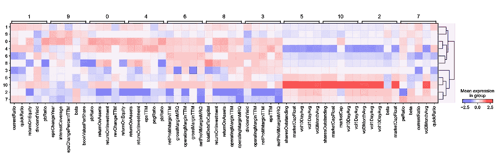

> 注:所有代码均可在回购中获得:[https://quanp.readthedocs.io/en/latest/tutorials.html](https://quanp.readthedocs.io/en/latest/tutorials.html)

2020 年 8 月，作者开始演示在商业和金融界采用单细胞基因组分析(SCGA)。SCGA 具有大量的特征(高达 56k 基因/特征),并且通常已知在高背景中具有低信号。在这里，作者试图根据基本财务指标描述 covid19 期间标准普尔 500 公司的特征。

我们知道**标准&普尔 500** ，或者简称为**S&p500**，是一个 ***股市指数*** ，衡量在美国**证券交易所**上市的*500 家大公司**的股票表现。它是最受关注的股票指数之一，许多人认为它是美国股票市场的最佳代表之一。这也使得一个合理的好的和充分的股票宇宙挑选一些好的公司来形成一个基于我们定义的 [Alpha](https://www.investopedia.com/articles/investing/092115/alpha-and-beta-beginners.asp#:~:text=Alpha%2C%20one%20of%20the%20most,%25%2C%20the%20alpha%20is%2015.) 的投资组合。***

> ***在新冠肺炎封锁期**，我们了解到**拥有强大自由现金流和低短期债务(即< 1 年期债务)的公司将有可能在**度过疫情封锁期。****【FCF】**自由现金流量通常被定义为净经营现金流量减去资本支出。另一方面，流动比率和/或速动比率是评估公司短期债务的良好指标。***

# ***1.下载数据***

***在这里，我们获得了维基百科上列出的 505 家 S&P500 成员公司&从 TD Ameritrade API 获得了每家公司的基本指标列表(所有函数都可以从 [quanp](https://github.com/hkailee/quanp) 工具中获得)。***

***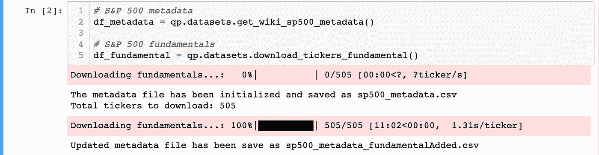***

***潜在有用的基础/特性列表如下:-***

***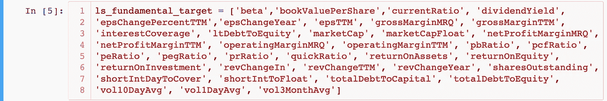***

# ***2.简单特征预处理***

***因子分析/主成分分析的变量分布无效。然而，如果变量呈正态分布，分析结果通常会得到增强(Tabachnick & Fidell，2013)。这里，我们只做 2 个简单和标准的预处理，log(x+1)变换，然后是[标准化](https://www.analyticsvidhya.com/blog/2020/04/feature-scaling-machine-learning-normalization-standardization/)缩放。***

******

# ***3.使用主成分分析进行降维***

***我们通过运行主成分分析来降低数据的维度，它揭示了变化的主轴并对数据进行降噪。在这里，我们使用前两个主成分(PCs)坐标绘制散点图，并尝试查看这两个主成分是否可以很好地区分公司的 GICS 部门。***

***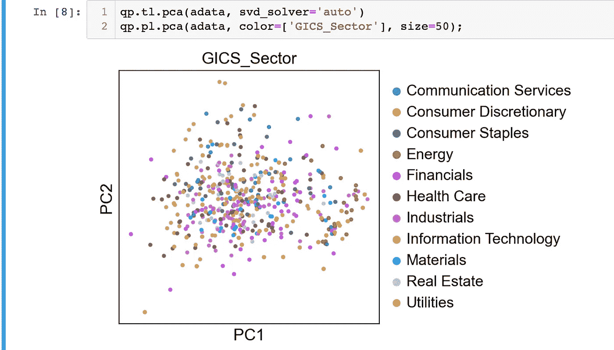***

***例如，信息技术、金融和能源部门的公司似乎可以从低到高的 PC1 中分离出来。***

***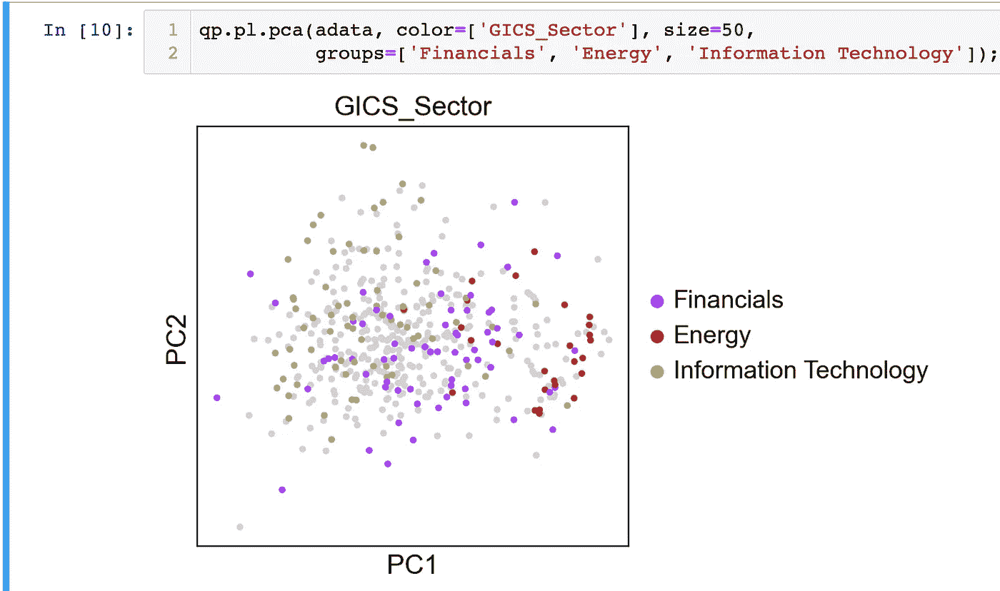***

***现在，让我们检查单台电脑对数据总方差的贡献。这为我们提供了关于我们应该考虑多少个 PC 以计算单元的邻域关系的信息，例如在聚类函数`qp.tl.leiden()`、`qp.tl.louvain()`或`tSNE qp.tl.tsne()`中使用的信息。根据我们的经验，通常粗略估计一下电脑的数量就可以了。“肘”点似乎表明，至少高达 PC5 将是有用的公司特征。我们将在后面的前 8 个的基础上做进一步的降维。稍后，我们将在单独的教程笔记本[中进行因素分析，以检查构成这些电脑的潜在特性。](https://link.medium.com/aV5mepSA09)***

***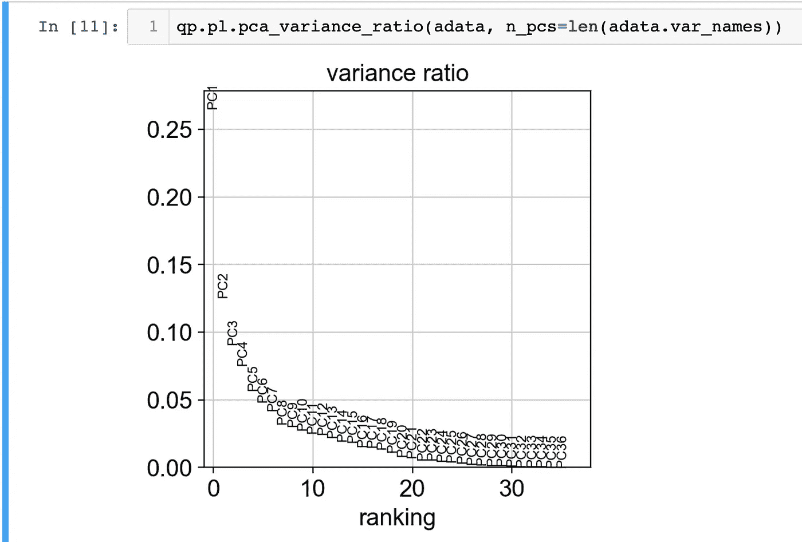***

***肘点出现在前 5 根之间。***

# ***4.计算邻域图***

***在我们查看带有部门注释的 tSNE 图之前，让我们使用数据矩阵的 PCA 表示来计算公司的邻域图。这将增加每个公司之间的距离和联系。这里，我们考虑 10 个最近的邻居，其中 8 个来自 PCA。***

******

# ***5.聚类邻域图***

***这里，我们使用 Traag *等人* (2018)的莱顿图聚类方法(基于优化模块性的社区检测)对公司的邻域图进行聚类，我们已经在上一节中计算过了。***

******

# ***6.基于 T 分布随机近邻嵌入的进一步降维***

***让我们使用实施为`qp.tl.tsne(adata, n_pcs=8)`的 tSNE 工具，进一步将以上确定的 8 个可能重要的 PC 的维度降低到 2 维。我们现在可以在 tsne 图上绘制和查看莱顿聚类、GICS 部门或任何财务指标/特征的注释。我们看到莱顿集团 3 似乎很好地符合金融部门，它的特点是低电流。***

***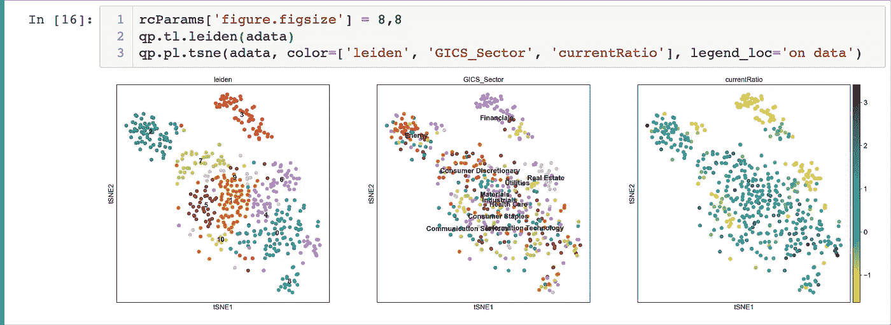***

# ***7.使用均匀流形近似和投影(UMAP)的进一步备选降维***

***我们还可以使用 UMAP(麦金尼斯等人，2018 年)将邻域图嵌入到二维中，见下文。它可能比 tSNE 更忠实于流形的全局连通性。在运行 UMAP 之前，我们计算集群之间的相关性作为 UMAP 的初始位置。***

***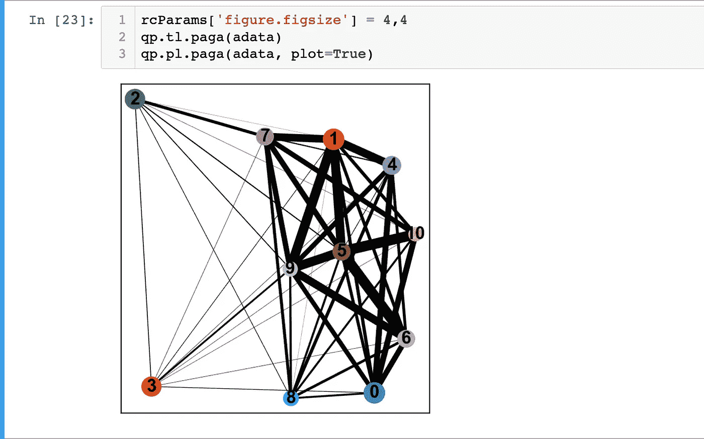***

***我们现在可以在 UMAP 图上绘制和查看莱顿聚类、GICS 部门或任何财务指标/特征的注释。我们看到，莱顿集团 3 似乎对应良好的金融部门，主要特点是高周转率和速动比率。***

***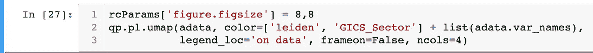******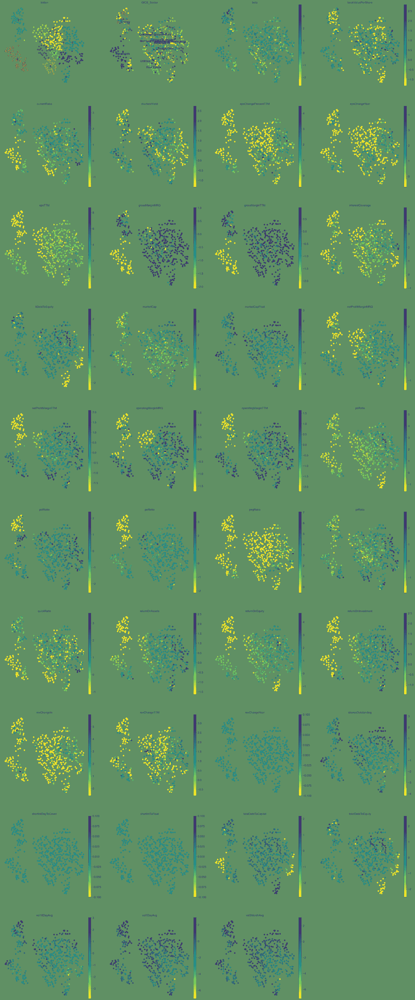***

# ***8.分层聚类***

***我们可以运行`qp.tl.dendrogram`来计算所有识别出的集群的层次聚类。这里使用了默认的距离方法—欧几里德距离。多个可视化，然后可以包括一个树状图:`qp.pl.matrixplot`、`qp.pl.heatmap`、`qp.pl.dotplot`和`qp.pl.stacked_violin`。这里显示了热图和矩阵图的示例。***

***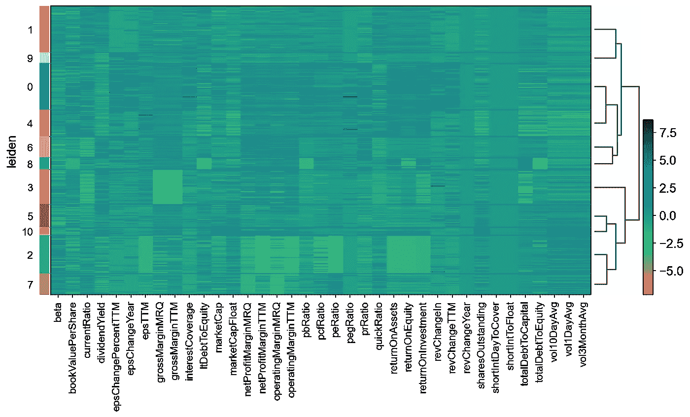***

***热图图***

***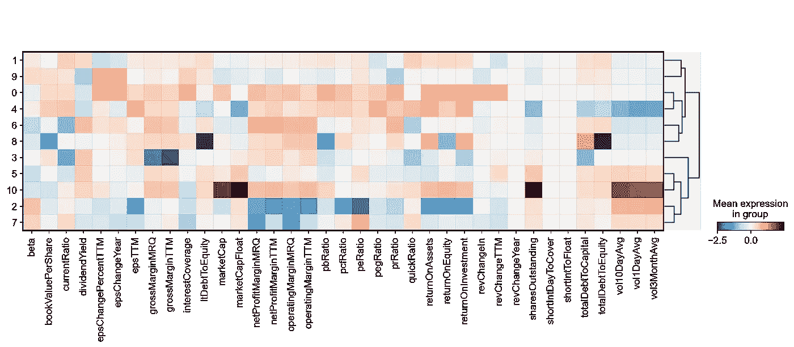***

***矩阵图***

# ***9.对定义每个集群的重要特征进行排序和可视化***

***我们可以识别不同地表征每个聚类的特征/度量，而不是像以前那样查看聚类的所有特征。例如，我们可以看到聚类 3(主要由金融公司组成，如下所示)与较高的股息收益率、operatingMarginTTM、netProfitMarginTTM、epsTTM 和 netProfitMarginMRQ 显著相关。但较低的 grossMarginTTM、grossMarginMRQ、currentRatio、quickRatio、totalCapitalToDebt 等。***

***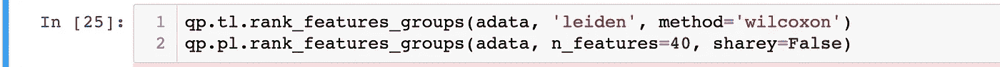******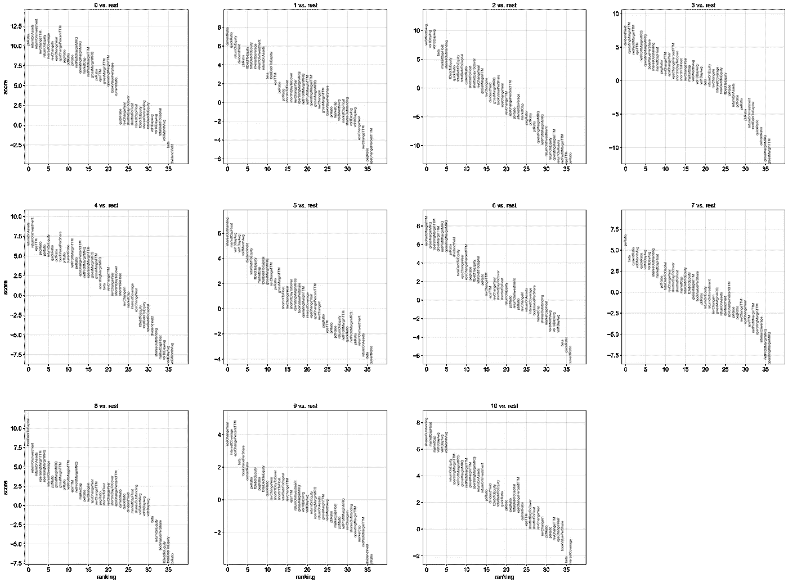***

# ***10.使用 matrixplot 可视化 5 大积极特征***

***结合上面的特征排名图，我们发现与集群 1 公司相关的前 5 个积极特征是 currentRatio、quickRatio、returnOnEquity、dividendYield 和 pbRatio。***

************

***最后，我们可以交叉列表的莱顿和 GICS _ 部门，以检查部门和莱顿定义之间的相关性。在这里，我们发现集群 3 的公司与金融行业的公司高度相关，集群 6 主要是房地产行业的公司。***

***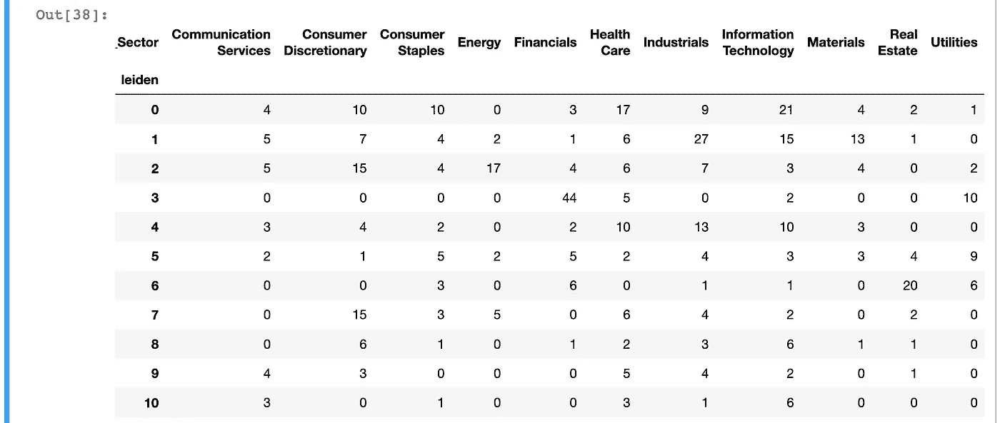***

# ***结论:-***

***在本教程中，我们发现聚类 3(主要由金融行业公司组成)与较高的股息收益率、operatingMarginTTM、netProfitMarginTTM、epsTTM 和 netProfitMarginMRQ 显著相关。但较低的 grossMarginTTM、grossMarginMRQ、currentRatio、quickRatio、totalCapitalToDebt 等。另一方面，第 1 类公司与高流动比率、速动比率、回报率、股息收益率和 pbRatio 相关。***

***但是，应该注意的是，在此 COVID19 期间，当金融公司等公司的流动/速动比率较低时，它们可能不会像材料/工业公司那样脆弱。当比较行业内的公司时，具有高流动/速动比率的公司——尤其是那些列在第 1 类的公司——可能具有更高的生存优势。***

# ***参考资料:***

> ***[https://quanp.readthedocs.io/en/latest/tutorials.html](https://quanp.readthedocs.io/en/latest/tutorials.html)***