# 描述 COVID19 疫苗成功后 1 个月表现优于公司的特征

> 原文：<https://medium.com/analytics-vidhya/characterizing-outperformed-companies-1-month-post-covid19-vaccine-success-d03185e167a9?source=collection_archive---------21----------------------->

## 解释性能最佳和最差的集群

*注:回购中所有代码均可用:*[](https://quanp.readthedocs.io/en/latest/tutorials.html)

*2020 年8 月，笔者在 covid19 期间尝试了基于基本面指标的标准普尔 500 指数公司的[表征。在这里，作者试图从辉瑞](/analytics-vidhya/characterising-companies-based-on-financial-metrics-during-covid19-1a6ce9cc4ada) **于 2020 年 11 月 18 日**宣布第一个 covid19 疫苗成功后的 [**一个月来描述 S & P500 公司的表现。简而言之，股票回报率是根据 2020 年 11 月 17 日和 12 月 18 日收盘(eod)股价之间的差异计算的。检索公司的当代基本指标，以调查它们与当月表现最佳和最差的公司的相关性。**](https://www.pfizer.com/news/press-release/press-release-detail/pfizer-and-biontech-conclude-phase-3-study-covid-19-vaccine)*

> *虽然集群 8 是表现最好的，但它与高贝塔公司相关，而高贝塔公司通常与更高的市场风险相关。他们的业绩与统计上较低的营业利润因素不相称。相比之下，集群 9 公司的贝塔系数更低，风险更小；其表现是合理的有利较高的营业利润因素和较低的财务风险因素。*

# *1.下载数据*

*在这里，我们从 TD Ameritrade API 获得了列在维基百科上的 **505 S & P500 成员公司**。从 TD Ameritrade API 获得了每个公司的基本指标列表(所有函数都可以从[***quanp***](https://quanp.readthedocs.io/en/latest/)工具中获得)。*

*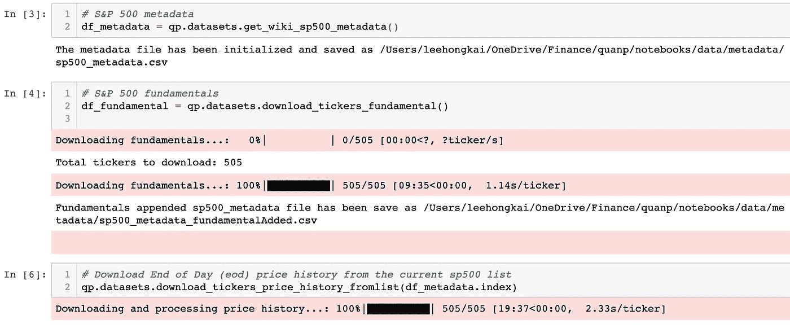*

# *2.加载和准备数据*

*可选:上面单元格中重试的数据保存为 csv 文件。您可以执行此单元格以避免重新运行上面耗时的下载步骤。这里，我们检查基础数据框架中所有可用的列/特性。*

*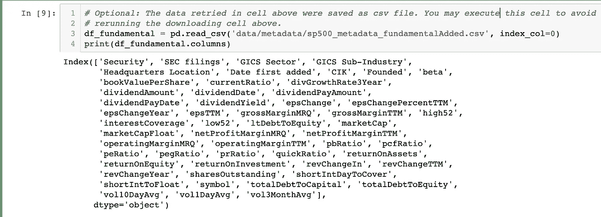*

*接下来，我们为每个公司准备一天结束(eod ),并打印出数据帧的前 2 天和后 2 天。*

*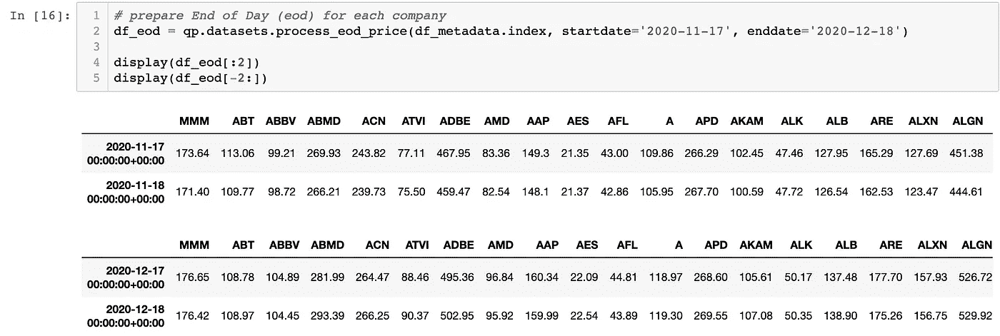*

*接下来，我们计算每家公司股价的 **1 个月日志回报**，即 2020 年 11 月 17 日和 12 月 18 日之间的价格差异，并合并基本面和日志回报数据框架。我们可以看到，所有公司的 1 个月对数收益率的中位数为 0.021695。*

*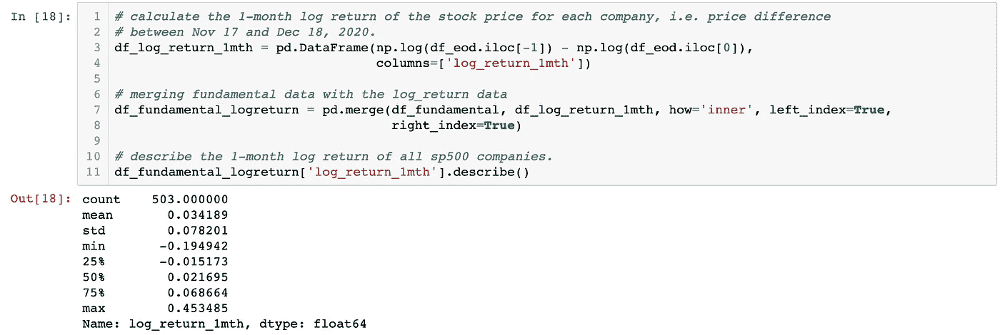*

*接下来，我们用(0，1)定义潜在有用的特征和最小-最大缩放。*

*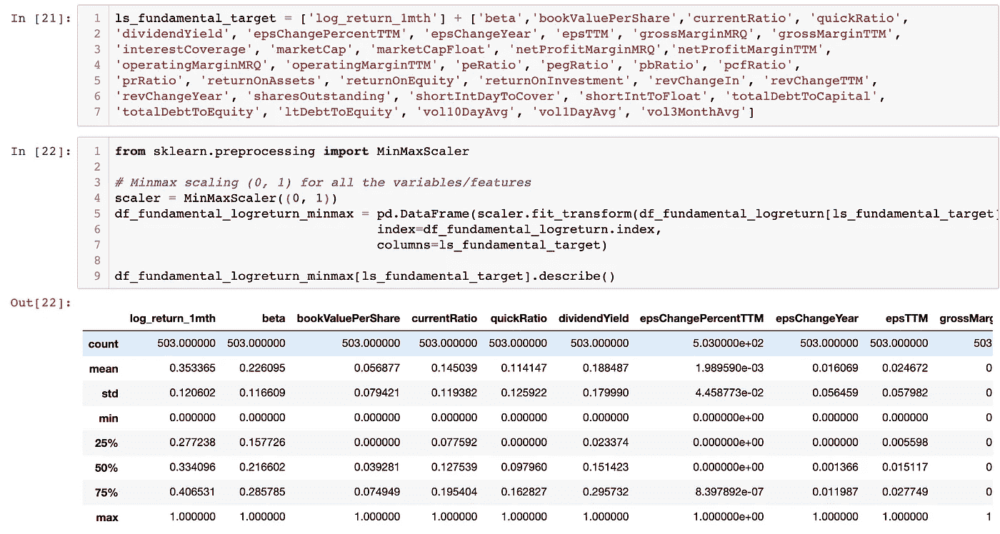*

*为了使用方便的 [***quanp***](https://quanp.readthedocs.io/en/latest/) 工具，我们将数据帧加载为 anndata。这里，下面的主成分分析的变量分布是无效的。然而，如果变量呈正态分布，分析结果通常会得到增强(Tabachnick & Fidell，2013)。这里，我们只做 log(x+1)变换，然后进行[标准化](https://www.analyticsvidhya.com/blog/2020/04/feature-scaling-machine-learning-normalization-standardization/)缩放。我们还增加了 GICS 扇区作为观测特征。*

# *3.首次使用主成分分析(PCA)进行经验降维*

*我们通过运行主成分分析来降低数据的维度，它揭示了变化的主轴并对数据进行降噪。这里，我们检查单个电脑对数据总方差的贡献。这为我们提供了关于我们应该考虑多少个 PC 来计算单元的邻域关系的信息——这对聚类函数`*qp.tl.leiden()*`、`*qp.tl.louvain()*`或`*tSNE qp.tl.tsne()*`很有用。根据我们的经验，通常粗略估计一下电脑的数量就可以了。“肘”点似乎表明，至少高达 PC5 将是有用的公司特征。我们将在前 5 个的基础上进一步降维。*

*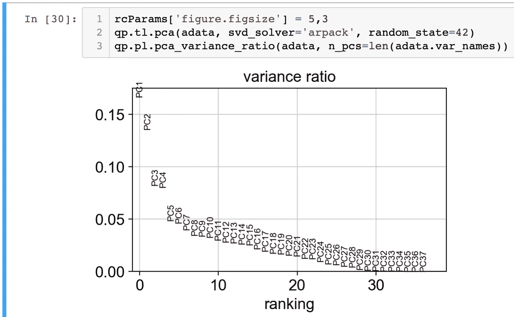*

# *4.计算邻域图*

*在我们执行**莱顿** **基于图的聚类**和**降维**之前，我们需要使用数据矩阵的 PCA 表示来计算公司的邻域图。这将增加每个公司之间的距离和联系。这里，我们考虑 10 个最近的邻居，其中 5 个来自 PCA。*

```
*qp.pp.neighbors(adata, n_neighbors=10, n_pcs=5, random_state=42);*
```

# *5.聚类邻域图*

*这里，我们使用 Traag *等人* (2018)的莱顿图聚类方法(基于优化模块性的社区检测)对公司的邻域图进行聚类，我们已经在上一节中计算过了。*

```
*qp.tl.leiden(adata);*
```

# *6 使用统一流形近似和投影(UMAP)进一步降维*

*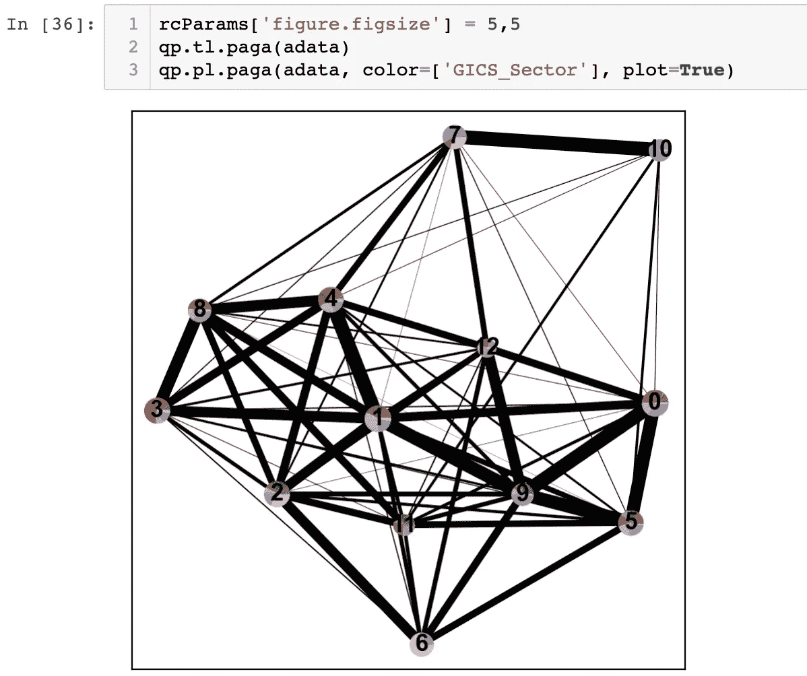*

*这里，我们使用 UMAP(麦金尼斯等人，2018)将邻域图嵌入到二维中，见下文。在运行 UMAP 之前，我们计算集群之间的相关性作为 UMAP 的初始位置。*

*我们现在可以在 UMAP 图上绘制和查看莱顿聚类的注释或任何财务指标/特征。同样，我们可以看到，莱顿集群 8 和 3 的公司似乎在疫苗成功后 1 个月表现最好，而表现最差的似乎是集群 6 和 7 的公司。*

*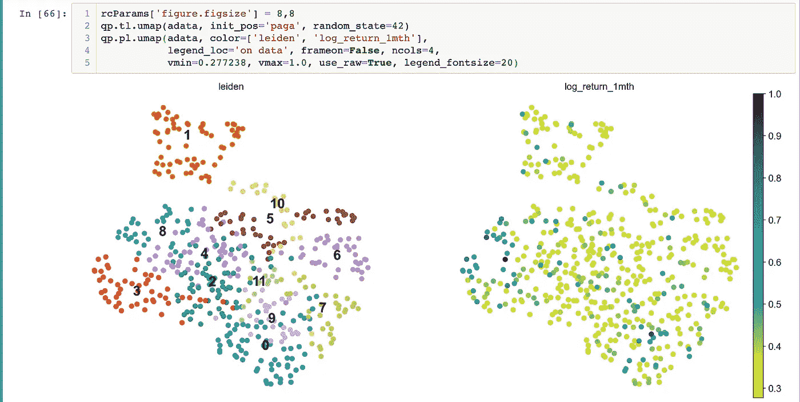*

# *7.层次聚类和矩阵图*

*我们可以运行`*qp.tl.dendrogram*`来计算所有识别出的集群的层次聚类。这里使用了默认的距离方法—欧几里德距离。多个可视化，然后可以包括一个树状图:`*qp.pl.matrixplot*`、`*qp.pl.heatmap*`、`*qp.pl.dotplot*`和`*qp.pl.stacked_violin*`。这里显示了热图和矩阵图的示例。*

*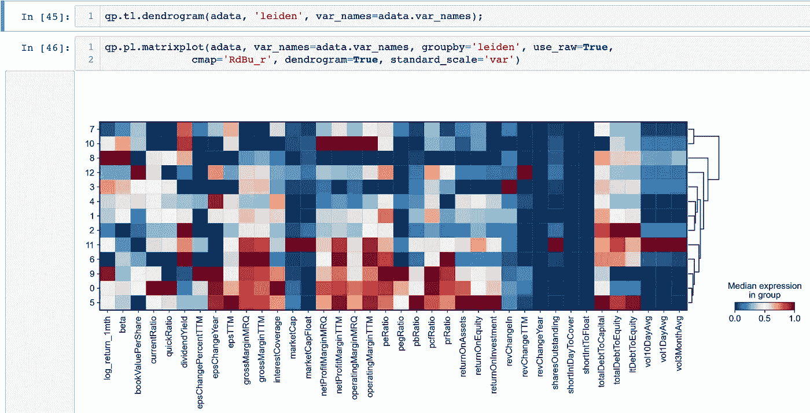*

*矩阵图显示了每个公司群/组的中间值。同样，我们看到群集 8 在“log _ return _ 月”中表现最佳，其次是群集 9 和 3。此外，我们还可以看到，两个集群 8 中的“β”都很高。为了确认结果，我们在下面的数据框中打印出每个集群/组的准确中值。*

*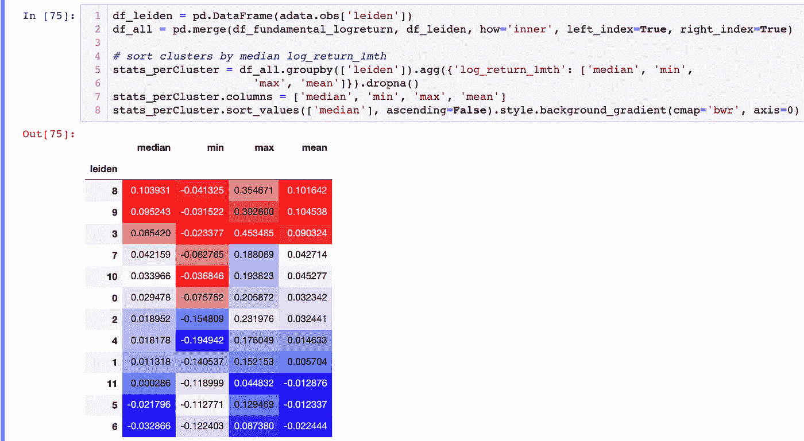*

*上面的数据帧显示，莱顿第 8 类的“log_return_1mth”的中值最高，而第 6 类的中值最低。为了确认“beta ”,我们在下面的单元格中进行了类似的操作。我们通常不喜欢[高贝塔，因为它通常与风险更高的公司相关](https://www.investopedia.com/investing/beta-know-risk/)。*

*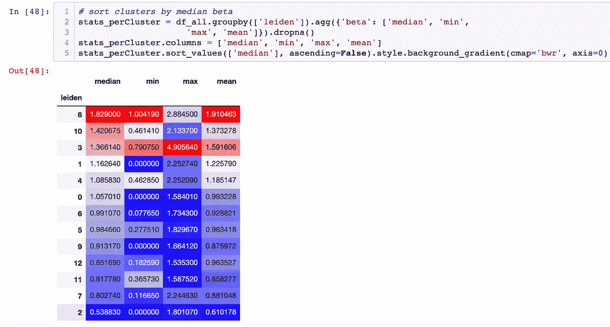*

# *8.可视化定义每个集群的基本特征*

```
*qp.tl.rank_features_groups(adata, 'leiden', groups=['8', '9', '7',                
                             '6'], method='wilcoxon')qp.pl.rank_features_groups(adata, n_features=38, sharey=False,  
                             fontsize=10, ncols=2)*
```

*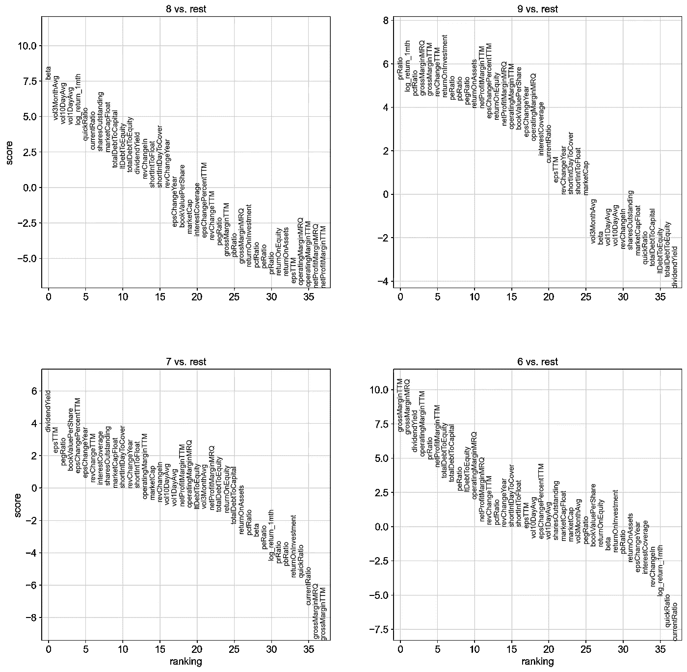*

*我们可以识别不同地表征每个聚类的特征/度量，而不是像以前那样查看聚类的所有特征。在这里，我们可以看到，集群 8 与较高的 beta、波动性 3 个月平均值(vol3MonthAvg)、波动性 10 天平均值(vol10DayAvg)、vol1DayAvg 显著正相关，但与较低的过去 12 个月每股收益(epsTTM)、每股收益比率(peRatio)、operatingMarginTTM、netProfitMarginTTM、returnOnAssets 等负相关。*

*表现最差的类别 6 与较高的股息收益率、grossMarginMRQ、grossMarginTTM、TotalDebtToEquity 等以及较低的流动资产、速动资产比率和资产回报率等相关。*

*在这里，作者特别感兴趣的是来自集群 9 的公司，这与较低的贝塔系数相关，这通常意味着该集群中的股票被认为风险较低。此外，聚类 9 与有利的较高运营盈利能力因素(“netProfitMarginTTM”、“netProfitMarginMRQ”、“grossMarginTTM”、“grossMarginMRQ”、“returnOnInvestment”、“returnOnAssets”、“operatingMarginTTM”、“operatingMarginMRQ”)和较低的财务风险因素(“ITDebtToEquity”和“TotalDebtToEquity”)相关联*

*我们可以根据下面 umap 图上的财务指标/特征来绘制和查看莱顿聚类的注释。在这里，我们看到莱顿集群 8 确实主要以高 beta 和不利的较低运营利润率因素为特征；集群 9 的特点是贝塔系数较低，许多有利的运营盈利因素较高；第 6 类和第 7 类的特点是不利的低偿付能力因素(流动、速动比率)。*

*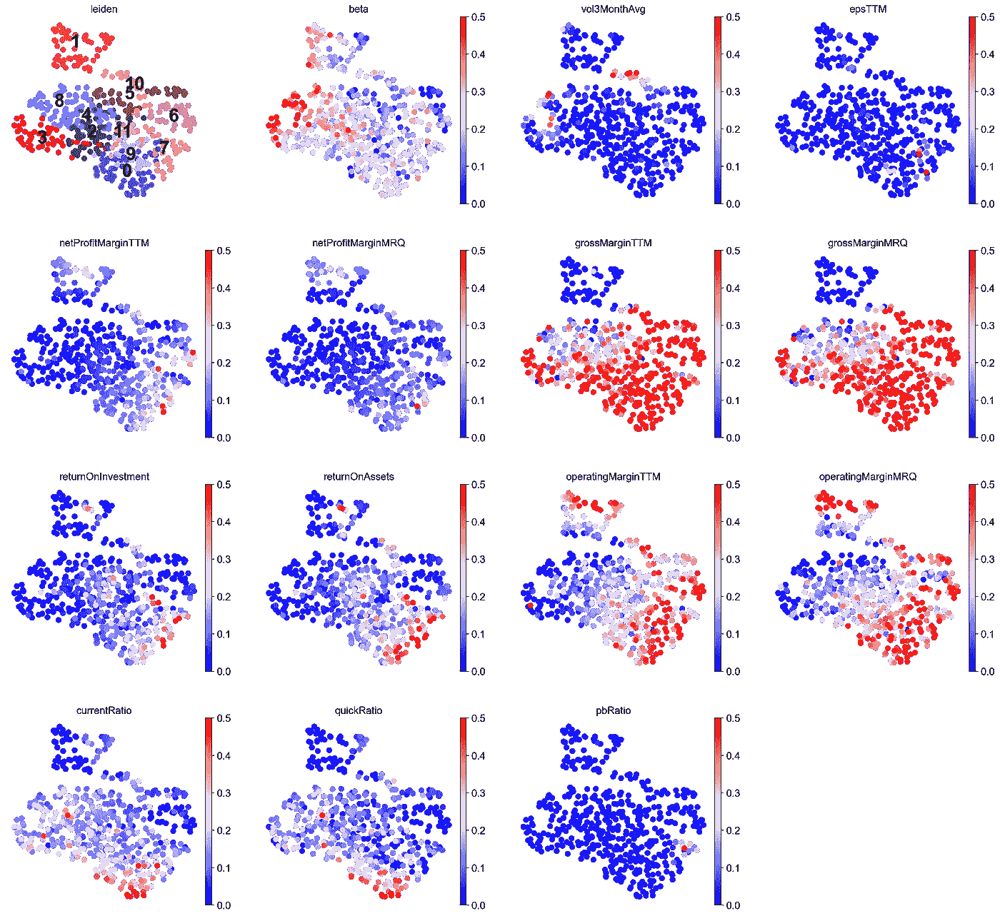*

# *9.理想的集群 9 公司中基于部门的绩效(基于 1 个月的日志回报)*

*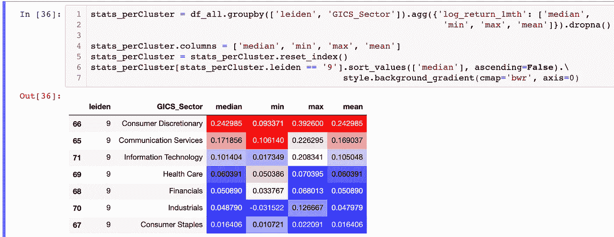*

*集群 9 公司及其相关行业信息列表:-*

*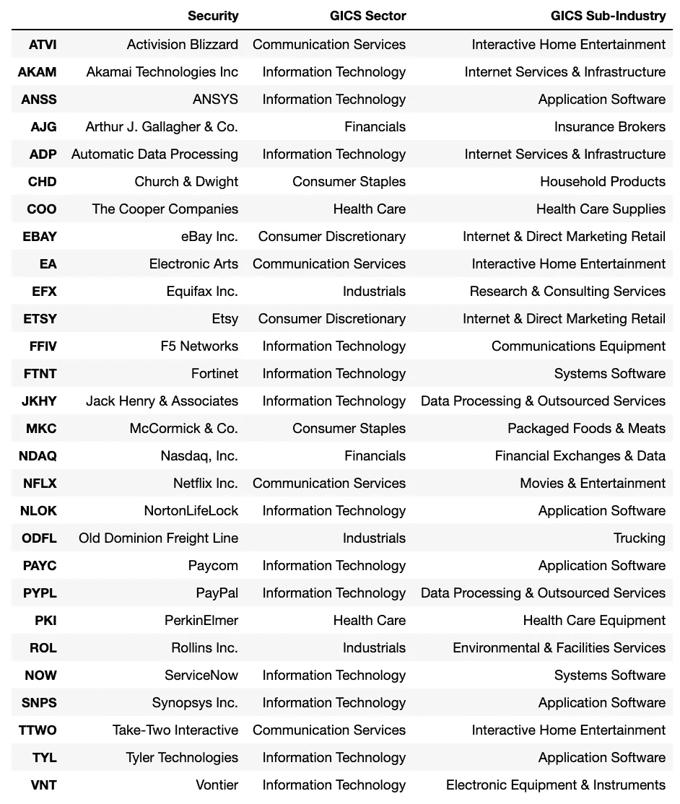*

***理想的顶级企业集群 9 家公司***

# *10.表现最差的集群 6 公司中基于部门的表现(基于 1 个月的日志回报)*

*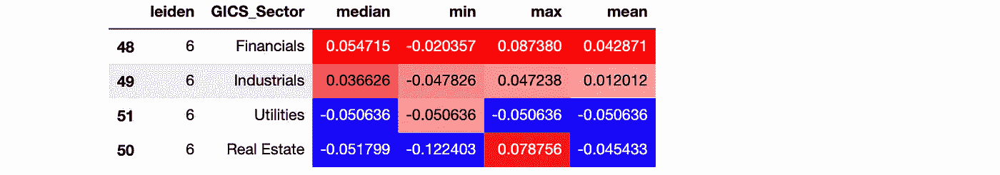*

*集群 6 公司及其相关行业信息列表:-*

*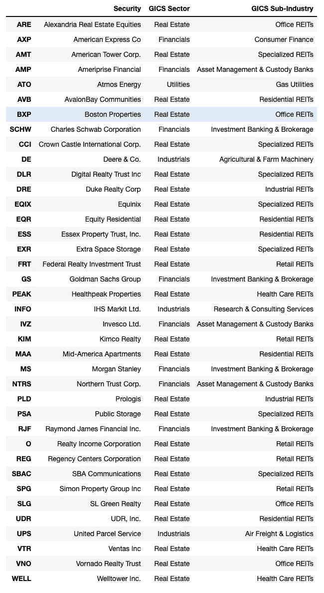*

*表现最差的第 6 类公司*

# ***11。旭日为所有 SP500 公司建立在集群和部门的基础上。***

*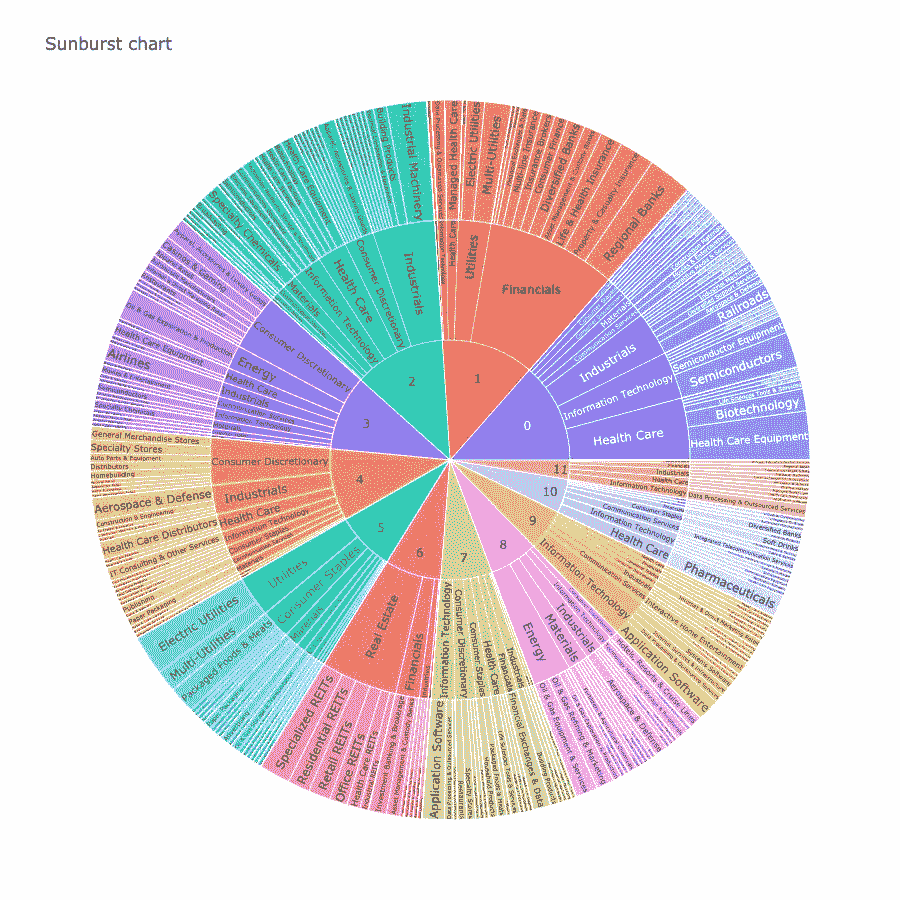*

*下面的旭日图显示，第 9 类主要由信息技术部门组成，第 8 类主要由能源部门组成，第 6 类主要由房地产部门组成。*

*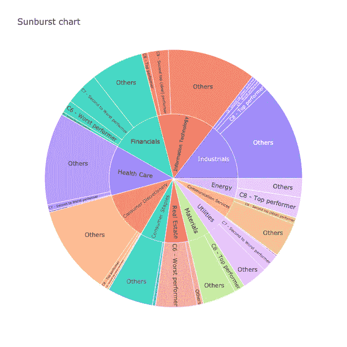*

*下面的旭日图显示，大多数房地产公司在疫苗成功后 1 个月表现最差，集群 6。*

# ***结论***

*在本教程中，我们发现虽然集群 8 表现最佳，但它与高贝塔公司相关，即股票市场风险较高。他们的业绩与统计上较低的营业利润因素不相称。相比之下，第 9 类公司的贝塔系数较低，风险较低，其业绩因有利的较高运营利润因素和较低的财务风险因素而得到证明。*

*另一方面，表现最差的是集群 6，其次是集群 7。两个集群都有明显较低的偿付能力(流动和速动比率)。群组 6 还与较高的金融风险相关，即较高的债务资本比/股本。值得注意的是，群组 6 主要由房地产公司组成。最糟糕的表现可能是当前冬季期间正在进行的第二波，在那里城市封锁被广泛采用。*

*接下来，我们将在以后的文章中进一步剖析集群 6 和集群 9；)*

***备注:**作者喜欢反馈。请在下面留下你的评论，如果有的话。*

> ****喜欢以上作品请鼓掌分享；)****
> 
> *参考资料:*
> 
> **1。*[*https://quanp.readthedocs.io/en/latest/tutorials.html*](https://quanp.readthedocs.io/en/latest/tutorials.html)*
> 
> **2。Tabachnick & Fidell。*使用多元统计，第六版。培生 2013；ISBN-13:9780205956227。***
> 
> **3。* Traag *等*(2018)*从卢万到莱顿:保证良好连接的社区* [arXiv](https://arxiv.org/abs/1810.08473) 。*
> 
> **4。钦卡里尼&金。量化股票投资组合管理——一种积极的投资组合构建和管理方法。麦格劳-希尔公司 2006 年；ISBN:0071459405。**