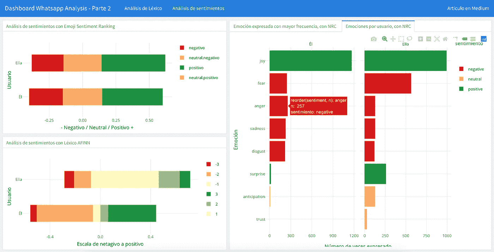

# WhatsApp 上的聊天分析:第 2 部分——用 R

> 原文：<https://medium.com/analytics-vidhya/chat-analysis-on-whatsapp-part-2-sentiment-analysis-and-data-visualization-with-r-f148592fa1b0?source=collection_archive---------9----------------------->

仪表板可视化 WhatsApp 聊天数据，链接在文章末尾

如果你已经直接阅读了这篇文章，也许我会建议你先看看第 1 部分，在那里我首先向你介绍了 **rwhatsapp** ，这是一个很小但非常有用的包，从中我们对有趣的数据进行了第一次分析和可视化，这些数据是从 2018 年到今天两个人在 whatsapp 上的对话中提取的…