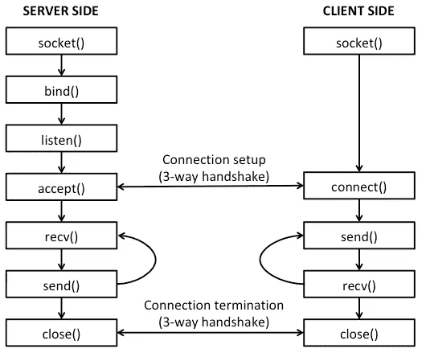

# 使用 python3 的聊天应用程序

> 原文：<https://medium.com/analytics-vidhya/chat-application-using-python3-9d1980387503?source=collection_archive---------3----------------------->

现在聊天应用程序非常普遍，有时我们希望我们有自己的聊天应用程序，有自己的定制功能和外观。所以我尝试用套接字编程的概念在 Python3 中制作一个基于 CLI 的聊天程序。

# 什么是套接字编程？？

初学者首先想到的问题是什么是套接字，什么是套接字编程？？？

> **网络套接字**是在[计算机网络](https://en.wikipedia.org/wiki/Computer_network)上的[节点](https://en.wikipedia.org/wiki/Node_(networking))内发送或接收数据的内部端点。

所以现在我们可以得出结论，制作这样的控制网络套接字的程序被称为套接字编程。通过套接字编程，我们可以控制网络套接字，并向网络上的其他系统发送数据以传输数据。最常见的套接字应用程序类型是客户端-服务器应用程序，其中一方充当服务器并等待来自客户端的连接。

# 弄脏手

现在我们知道了什么是套接字编程以及为什么使用它。Python 提供了一个 [socket 模块](https://docs.python.org/3/library/socket.html)来制作这样的程序。这是我们将用来制作一个客户端服务器聊天应用程序的模块。

该模块中的主要套接字 API 函数和方法是:

*   socket():用于创建套接字的实例
*   bind():将 ip 和端口号与套接字对象绑定
*   listen():侦听来自客户端的传入请求
*   accept():接受来自客户端的传入请求
*   connect():将客户机连接到服务器的套接字
*   recv():从另一端接收数据
*   send():将数据发送到另一端
*   close():关闭客户机和服务器之间的会话



TCP 的套接字 API 调用序列和数据流

在这种客户机-服务器体系结构中，

1.  服务器创建一个套接字，并将其与 IP 和端口号绑定。
2.  它侦听绑定端口上的传入请求。
3.  客户端制作一个套接字，并将其连接到服务器的 IP 和端口。(三次握手)
4.  服务器接受客户端请求，然后开始服务器和客户端之间的数据传输。
5.  当数据传输完成时，客户端和服务器之间的连接关闭。(连接终止)

# 服务器端[代码]

```
import socket         # import socket module
ip="192.168.43.92"    # server's IP address
port=4545             # server's port dedicated for the program s = socket.socket()   # create socket
s.bind((ip, port))    # bind the IP and port with the socket
s.listen()            # listen for incoming requests on port 4545c, addr = s.accept()     # accepts the incoming request 
                         # + make client objectwhile True:
        c_data = c.recv(1024).decode()      # receive client data
        print("[msg]> "+c_data)             # print client data
        if c_data == 'exit':
                break
        c.send(input("[you]> ").encode())   # sends the server datac.close()        # close client session
s.close()        # close socket 
```

# 客户端[代码]

```
import socket                 # import socket modules=socket.socket()             # create socket instances_ip = "192.168.43.92"        # server's ip address
s_ port = 4545                # server's port number
s.connect((s_ip, s_port))     # connecting to server's socketwhile True:
        s.send(input("[you]> ").encode())    # send data to server
        s_data = s.recv(1024).decode()       # recv data from server
        if s_data == 'exit':
                break
        print("[msg]> "+s_data)              # print server datas.close()                     # close socket
```

这些代码提供了聊天应用程序的基本功能。此代码可以修改，以提供更多的功能，用例，用户界面等，根据个人的要求。

**注**:以上代码中使用的 IP 地址和端口号是我机器的事实，你必须用你机器的事实来替换它们。

*   要获得 IP，您可以使用 windows 的“ipconfig”命令和 linux 的“ifconfig”命令。
*   对于端口号，您可以使用系统的任何空闲端口。要检查繁忙的端口，您可以使用带有合适选项/标志的“netstat”命令。
*   两个设备(客户端和服务器)应该相互连接(即在同一个网络上或可 ping 通)。
*   两个代码共享同一个属于服务器的 IP。所以你必须使用服务器的 IP 地址。

暂时就这样了。如果你为一些其他用例修改这个，那么我很想知道它。