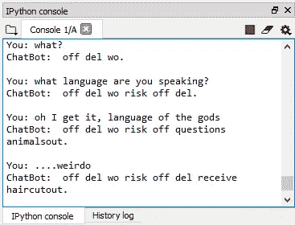

# 使用深度学习和 NLP 实现 Seq2Seq 模型的聊天机器人开发

> 原文：<https://medium.com/analytics-vidhya/chatbot-development-using-deep-learning-nlp-implementing-seq2seq-model-eb1114903523?source=collection_archive---------5----------------------->


全矢量创建的横幅矢量—[www.freepik.com](http://www.freepik.com)

> 注意:在这篇文章中，我将只总结构建聊天机器人的步骤。与这个项目相关的所有文件和完整的代码已经上传到我的 github 个人资料中，下面给出了链接，要查看完整的代码，你可以克隆或下载这个库。 **chatbot.py** 文件包含大量解释代码内容和原因的注释。因此，你不会真的有任何困难理解它。任何其他疑问都将得到解答。
> 
> 【https://github.com/adi2381/ai-chatbot 

在我们开始这篇文章之前，我们需要用简单的语言了解一些事情，比如:

*   什么是聊天机器人？

聊天机器人可以被定义为一种人工智能的应用，它通过听觉或文本或手段与人类进行对话。听觉聊天机器人的例子可以是三星 Bixby 或苹果的 Siri，文本聊天机器人可以是 telegram 或 messenger 聊天机器人。

*   为什么要使用聊天机器人？

我们举个例子来解释一下。

假设您在一家电子商务公司的客户支持部门工作，您与一位客户聊天，他问了一个简单的问题，比如“我的订单在哪里？”，现在您可以在系统上手动检查，然后回复给用户。这只是一个例子。然而，客户支持主管不得不在一天中面对同样的问题一百万次，一遍又一遍地回答同样的事情似乎是多余的，就像得到一个查询、在数据库中查找并回复用户一样。如果你想一想，聊天机器人也可以很容易地做到这一点，它可以接收查询，查看数据库并回复，因此人力资源可以被分配到其他更有用的地方。因此，在这种情况下通过聊天机器人实现自动化是有益的。

*   **它们用在哪里？**

它们主要用于各种目的的对话系统中，例如提供客户服务或获取信息。聊天机器人可以为任何特定领域开发和实现，例如在电子商务中，你会看到它主要提供订单、支付等方面的支持。

*   **聊天机器人的问题空间是什么？**

聊天机器人的主要任务是为它从用户那里收到的任何查询或消息确定最佳响应。最佳对策应该如下:

1.  直接准确地回答用户的问题

2.提供与查询相关的相关信息

3.如果问题不明确，询问后续问题，以便更深入地了解问题，从而得出最佳答案

*   **我们的方法是什么？**

我们使用了深度学习，除此之外，还使用了 NLP(自然语言处理)、RNN(递归神经网络)和 LSTM(长短期记忆)的概念，并最终利用 seq2seq 模型架构来实现聊天机器人。

# 入门:Anaconda

1.  安装 Anaconda

[](https://www.anaconda.com/distribution/) [## Anaconda Python/R 发行版—免费下载

### 开源的 Anaconda 发行版是在…上执行 Python/R 数据科学和机器学习的最简单的方法

www.anaconda.com](https://www.anaconda.com/distribution/) 

2.使用 Anaconda Shell 安装虚拟环境

*   转到开始> Anaconda3 > Anaconda 提示符
*   运行以下代码行创建一个虚拟环境。-n 用于定义虚拟 env 的名称，并且安装了 python 3.5，所以确保安装相同的版本以避免任何问题。

```
conda create -n chatbot python=3.5 anaconda
```

3.激活虚拟环境并安装 Tensorflow

*   在 Anaconda Navigator 中，转到您可以在左侧栏中找到的环境
*   您将在那里找到您的虚拟环境以及属于 Anaconda 的根虚拟环境，单击您的环境>右键单击>用 python 终端打开并执行以下代码

```
Activate nameofyourvirtualenvironment
```

*   一旦激活了虚拟 env，请严格安装 tensor flow 1 . 0 . 0 版，因为 tf.reset_default_graph 等特定函数在以后的版本中已被弃用。

```
pip install tensorflow==1.0.0
```

4.下载康奈尔电影对话语料库数据集

 [## 康奈尔电影对话语料库

### 这个语料库包含了从原始电影剧本中提取的大量元数据丰富的虚构对话:…

www.cs.cornell.edu](http://www.cs.cornell.edu/~cristian/Cornell_Movie-Dialogs_Corpus.html) 

# 入门:Spyder

1.  通过 Anaconda 导航器启动 Spyder IDE
2.  无论你在哪里下载了数据集，我假设你在桌面上创建了一个名为 chatbot 的文件夹，所以将数据集文件夹复制到 chatbot，然后从数据集文件夹中取出**Movie _ lines**&**Movie _ conversations**文本文件，并将其粘贴到 chatbot 文件夹中。
3.  通过，spyder IDE 通过右上角的资源管理器窗口导航到您的目录，您会发现其他选项，如变量资源管理器等。另外，将 python 文件保存到这个 chatbot 目录中。

# 构建聊天机器人

**第一阶段**包括导入必要的库、导入数据集以及为模型的训练阶段预处理数据集。以下是进行数据预处理的步骤:

```
### Phase 1: Data Preprocessing ### # Importing Dataset
  # Creating a dictionary that maps each line with its id
  # Creating a list of all of the conversations
  # Getting questions and answers seperately
  # Simplifying and cleaning the text using Regular Expressions
  # Cleaning questions
  # Cleaning answers
  # Filtering out the questions and answers that are too short or too long
  # Creating a dictionary that maps each word to its number of occurrences
  # Creating two dictionaries that map the words in the questions and the answers to a unique integer
  # Adding the last tokens to above two dictionaries
  # Creating the inverse dictionary of the answers_words_to_int dictionary
  # Adding the <EOS> token to the end of every answer
  # Translating all the questions and the answers into int &    replacing all the words that were filtered out by <OUT> token
  # Sorting questions and answers by the length of questions
```

第二阶段包括构建 seq2seq 模型来实现我们的聊天机器人。此阶段使用了以下概念:

*   递归神经网络
*   LSTM(长短期记忆)
*   Seq2Seq 模型
*   优化技术——波束搜索解码器和注意机制

```
### Phase 2: Building SEQ2SEQ Model ### # Creating placeholders for the inputs and the targets
  # Preprocessing the targets
  # Creating the Encoder RNN
  # Decoding the training set
  # Decoding the test/validation set
  # Creating the Decoder RNN
  # Building the seq2seq model
```

**第三阶段**包括训练我们在前一阶段构建的 seq2seq 模型。此阶段使用了以下概念:

*   超参数
*   优化技术— ADAM 优化器

```
### Phase 3: Training the SEQ2SEQ Model ### # Setting the Hyperparameters
  # Defining a session
  # Loading the model inputs
  # Setting the sequence length
  # Getting the shape of the inputs tensor
  # Getting the training and test predictions
  # Setting up the Loss Error, the Optimizer and Gradient Clipping
  # Padding the sequences with the <PAD> token
  # Splitting the data into batches of questions and answers
  # Splitting the questions and answers into training and validation sets
  # Training
```

**第四阶段**包括建立聊天机器人，然后是培训阶段。

```
### Phase 4: Testing The Seq2Seq Model ###

  # Loading the weights and Running the session
  # Converting the questions from strings to lists of encoding integers
  # Setting up the chat
```

# 结果



我和聊天机器人的第一次对话

如你所见，回复是不恰当的。原因是缺乏训练。我们将 4200 个示例的数据集分成 100 个一批，因此，完成一个时期需要 42 次迭代。所以，我训练了 15 个时期的模型，结果就在你面前，这还不够。也许，训练阶段可以通过进一步微调超参数或简单地为更多的时期进行训练来改进。

为了训练模型，我使用了谷歌 Colab，因为它为你提供了一个 Nvidia Tesla K80 以及 12GB 的 RAM，在虚拟环境中最多可以免费使用 12 个小时。关于如何在 google colab 中训练你的模型，我已经在我的 GitHub repo 中提供了步骤。

 [## ADI 2381/ai-聊天机器人

### 这是一个使用 Seq2Seq 模型构建聊天机器人的尝试。该模型基于两个 LSTM 层。Seq2Seq 主要是…

github.com](https://github.com/adi2381/ai-chatbot) 

# 结论

聊天机器人是人工智能的一个重要应用，聊天机器人行业目前正在蓬勃发展，顶级公司在其最新设备中使用聊天机器人，如亚马逊的 Alexa 或三星的 Bixby。聊天机器人领域仍然具有挑战性，例如如何改进答案，以及选择最佳模型，根据查询生成最合适的答案等等。在这篇文章中，我们只尝试了 seq2seq 架构的一种变体，并结合特定的优化技术来构建我们的聊天机器人。我希望你喜欢这篇文章，它激起了你对聊天机器人的兴趣。

# 大声喊出来

这一部分致力于互联网上关于聊天机器人开发的令人惊叹的教程和文章，它们对我构建聊天机器人帮助很大。我特别遵循了这些:

***** 为你的聊天机器人利用 NLP &机器学习的终极指南—斯特凡·科茹哈罗夫
([https://chatbotslife . com/Ultimate-Guide-to-leveling-NLP-Machine-Learning-for-you-Chatbot-531 ff 2 DD 870 c](https://chatbotslife.com/ultimate-guide-to-leveraging-nlp-machine-learning-for-you-chatbot-531ff2dd870c))
*****seq 2 seq 机器学习模型—马尼·瓦德瓦(GeeksforGeeks)
([https://1](https://www.geeksforgeeks.org/seq2seq-model-in-machine-learning/)