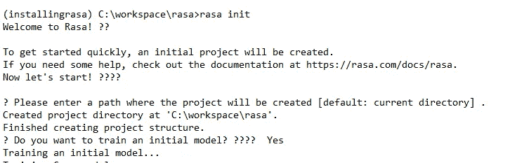

# 聊天机器人在印度的 Covid19 案件，并在网站上托管它，并获得实时信息

> 原文：<https://medium.com/analytics-vidhya/chatbot-for-covid19-cases-in-india-and-hosting-it-in-the-website-angetting-real-time-information-1513a951e357?source=collection_archive---------18----------------------->

这个聊天机器人将有助于获得印度各邦的 covid19 病例信息。

Rasa 框架用于开发聊天机器人，该机器人将提供有关印度各邦 covid 19 病例的信息。Rasa 是一个开源的机器学习框架，帮助我们开发人工智能特色的聊天机器人。

Rasa 的架构:它是如何处理消息和回复的。

Rasa 消息处理框架

1.  用户通过消息与聊天机器人交流，消息被接收并传递给解释器，解释器将其转换为字典并包括原始消息和意图。这是由 NLU 处理的。该文件位于 chatbot 项目文件夹中的 NLU.md。

示例:显示卡纳塔克邦的 covid19 病例

在此消息中，意图是显示，实体是 covid19 和卡纳塔克邦。这将被 NLU 翻译成词典。

2.跟踪器是跟踪来自用户的消息的对象。

3.策略接收跟踪器的当前状态，并决定下一步采取什么行动。

4.现在采取什么行动取决于用户的问题

5.跟踪器跟踪所采取的行动。

6.将响应发送给用户。

启动项目的步骤:

先决条件:Rasa 应该安装在系统中。

初始化项目文件夹中的 Rasa，命令是<rasa init="">，它将初始化项目文件夹中的初始聊天机器人。项目文件夹将包含所有必需的文件。</rasa>

项目目录结构将需要开发聊天机器人的文件。

开发环境的设置已经完成。现在将开始编写获取 COVID19 statewise 信息的意图和实体。Data foldet 包含 nlu.md 文件，将打开该文件并开始编写与 covid19 搜索相关的意图。训练模型需要这些数据。

nlu.md 文件快照:

下一步是在 stories.md 文件中为 covid_state 意图创建故事。故事不过是它将如何跟随对话路径的路径。covid_sate 意图必须存在于 stories.md 文件中，因为这是定义对话路径所必需的。它应该与 nlu.md 文件中定义的名称相同。

故事路径:

stories.md 文件中存在相同的意图“covid_state”。bot 一旦发现意图会如何响应，路径是通过定义“atction _ state”来定义的。这个“action_state”必须存在于 domain.yml 文件和 action.py 文件中。

现在，将打开 domain.yml 文件，在实体块中定义实体，在动作块中定义 action_state。

下一步将是决定用户的动作或响应或消息。响应写在 action.py 文件中。

action.py 文件可以调用数据库或文件，从中获取印度州的 covid 相关数据。

这个问题的答案在 action.py 文件下。

用户向聊天机器人提出的问题:

卡纳塔克邦的 covid 病例？

聊天机器人应该能够实时给出这个查询的响应。但是问题是聊天机器人如何获得这些数据来回复用户。有提供实时数据的开放 api。将使用该 api 为机器人获取数据。

json 数据 api 托管在下面的链接中，我们的聊天机器人模型将使用这个链接。

[https://api.covid19india.org/data.json](https://api.covid19india.org/data.json)

action.py 文件将对用户查询的响应进行组织。在 action.py 中将导入 requests 包，该包将用于从上述 api 获取 json 数据请求。该方法向 json api 请求 covid 数据，并将其过滤出来以获得适当的查询响应。该方法的代码快照如下:

聊天机器人差不多准备好了，将修改 enpoints.yml 文件并训练模型。

编码部分完成后，就该训练模型了。

训练模型的命令是<rasa train="">，这将在模型文件夹下创建新的训练模型。</rasa>

训练模型需要几分钟，同时运行动作<rasa run="" action=""></rasa>

一旦模型被训练，将开始与聊天机器人相关的 covid19 案件明智的在印度。

开始与聊天机器人交谈:

这些是定期更新的实时数据。

将此聊天机器人与网站集成:

为了在网站中托管聊天机器人，credentials.yml 将被修改以添加 socketio，打开 credentials.yml 文件并添加以下行:

socket io:
user _ message _ evt:user _ outleted
bot _ message _ evt:bot _ outleted
session _ persistence:true

下一步是创建一个运行这个机器人的 html 页面，并将这些脚本添加到 html 文件的 body 标签中。

<脚本 src = "[https://storage.googleapis.com/mrbot-cdn/webchat-latest.js](https://storage.googleapis.com/mrbot-cdn/webchat-latest.js)"></脚本>
//或者你可以用特定版本替换最新
<脚本>
webchat . default . init({
选择器:" #webchat "，
initPayload: "/get_started "，
custom data:{ " language ":" en " }，//任意自定义数据。保持最小化，因为这将被添加到 socket
socket URL:"[http://localhost:5](http://localhost:5005)000 "，
socketPath: "/socket.io/"，
title: "Rasa bot demo "，
subtitle: "Subtitle "，
})
< /script >

接下来是运行模型并在 html 页面的脚本中修改端口号。

rasa run -m 型号—启用-api — cors "*" —调试

根据上面的输出修改 html 文件的端口号。

一切就绪，请确认以下事项:

1.  验证操作正在运行，如果没有运行<rasa run="" action=""></rasa>
2.  验证命令正在运行，并将端口与此命令输出和 html 文件匹配，如果不匹配，请修改 html 文件端口。

rasa run -m 型号—启用-api — cors "*" —调试

是时候和机器人聊天，获取印度各邦 covid 19 的信息了。

转到项目文件夹，在 chrome 浏览器中打开 index.html 文件，开始与 bot 对话。

请点击 github 链接获取完整源代码:

[https://github.com/rikesh-DS/indiacovid19bot.git](https://github.com/rikesh-DS/indiacovid19bot.git)