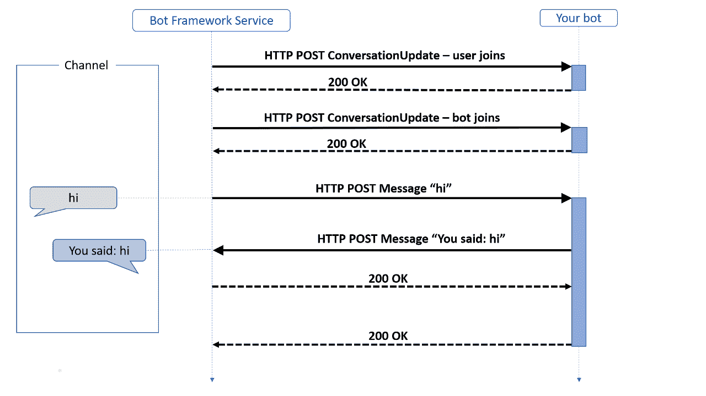

# Python 中的聊天机器人——第 1 部分

> 原文：<https://medium.com/analytics-vidhya/chatbot-in-python-part-1-919d94dbb3fa?source=collection_archive---------15----------------------->

> 据 Gartner 称，“到 2022 年，70%的白领将每天与对话平台互动”

据估计，在过去的一年中，全球超过 67%的消费者使用聊天机器人进行客户支持，到 2020 年，大约 85%的客户互动将在没有人工代理的情况下进行。


这些不仅仅是估计，而是事实。在当今世界，我们大多数人在工作或日常活动中都依赖于**虚拟助手。**考虑这样一个场景，客户希望解决他们的一些问题，然后登陆聊天机器人，只需描述他们的问题，他们就可以找到合适的解决方案，如果不可能找到合适的解决方案，他们可以为此创建一个票证，并可以检查他们的票证进度。ITOA 任务变得无缝和无障碍。

聊天机器人不仅使之成为可能，而且为轻松处理一些耗时的任务和客户满意度打开了一个新的大门。

所以在这篇文章(第一部分)中，我们将看到如何开发聊天机器人。许多框架可以用于聊天机器人的开发，在这篇文章中，我们将讨论如何使用[微软聊天机器人框架](https://docs.microsoft.com/en-us/azure/bot-service/bot-service-overview-introduction?view=azure-bot-service-4.0)用 python 开发聊天机器人。

在直接进入开发之前，让我们首先设置使用 bot SDK 开发聊天机器人所需的所有要求。

1.  Python [3.6](https://www.python.org/downloads/release/python-369/) 或 [3.7](https://www.python.org/downloads/release/python-370/)
2.  [Bot 框架模拟器](https://github.com/microsoft/BotFramework-Emulator/blob/master/README.md)
3.  g[it](https://git-scm.com/downloads)-用于版本控制

**建立开发环境**

1.  让我们从在 python 中设置一个虚拟 env 开始。为此，我们需要使用 pip 命令安装 virtualenv


安装虚拟

2.成功安装 virtualenv 后，使用以下命令创建一个虚拟环境

```
###In Windows 
py -m venv env_chatbot### In Linux and macOS
python3 -m venv env_chatbot 
```

3.激活虚拟环境

```
## In Linux and macOS
source env_chatbot/bin/activate
```

对于 windows


在 windows 中激活虚拟环境

**安装所需的依赖关系**

1.  要在 python 中本地开发 bot，需要安装一些包 botbuilder-core、asyncio 和 cookiecutter


安装所需的软件包

2.微软 Bot 框架提供了一些预定义的模板，可以快速入门。在这一步中，我们使用 cookie cutter 来安装一个 echo bot 模板，它是基本的 [*bot 服务模板*](https://github.com/microsoft/BotBuilder-Samples/tree/master/generators/python/app/templates) 之一。


下载预定义的 bot 服务模板

3.现在，我们导航到微信文件夹，在那里保存我们的 bot 并安装 requirement.txt 中提到的运行 bot 所需的所有依赖项。

```
pip install -r requirement.txt
```

4.现在，在我们安装了所有的依赖项之后，我们将通过运行微信文件夹中的 app.py 文件来运行我们预定义的 bot 模板。


运行 echo bot 模板

5.我们打开 bot 模拟器，在 3978 端口号上连接到本地主机


机器人回显用户给出的响应

这就完成了安装和运行 bot 模板的步骤。

但是，当一个新的对话开始或一个用户加入到对话中时，机器人应该自己发送一条消息，让用户更多地了解它的特性或功能，这不是很好吗，因为机器人的主要目标是让用户参与到有意义的对话中。因此，从这里开始，我们开始向现有的 bot 模板添加欢迎消息。

在创建机器人之前，了解机器人如何使用活动对象与其用户通信是很重要的。让我们首先来看看在运行一个简单的 echo bot 时交换的活动。



Bot 工作流程

一旦用户加入机器人并向其发送输入，就会发生两种类型的活动(参见上图)

1.  当新用户或机器人加入对话时，机器人发送更新消息
2.  消息——消息活动携带最终用户和机器人之间的对话信息。在我们的 Echo bot 的例子中，它是一个由通道渲染的简单文本。或者，消息活动可以是要说的文本、建议的动作或卡片。

> 从上图中我们注意到，在对话中，人们可能一次说一个人，进行*“话轮”。* **那么我们如何实现这个案例中的一个 bot 呢？**在机器人框架的情况下，一个 ***回合*** 由用户对机器人的输入活动和机器人作为即时响应发送回用户的活动组成。但这里的问题是，机器人如何处理用户传入的活动，并决定发送哪个响应。这是我们在机器人活动堆栈中关注的内容，我们可以看到机器人如何处理传入消息活动的到达。

当机器人接收到一个活动时，它将它传递给它的活动处理程序，活动处理程序下面有一个基础处理程序，叫做 *turn handler。*所有的活动都通过到达*。*turn 处理程序看到一个传入的活动，并将其发送给***OnMessageActivityAsync***活动处理程序。

当我们创建 bot 时，用于处理和响应消息的逻辑将进入 OnMessageActivityAsync 处理程序，用于处理添加到会话中的成员的逻辑将进入***onmembersaddasync***处理程序，每当有成员添加到处理程序时都会调用该处理程序。我已经讨论了这两个处理程序，简单来说，要了解它们更多请点击这个 [**链接**](https://docs.microsoft.com/en-us/azure/bot-service/bot-builder-basics?view=azure-bot-service-4.0&tabs=python#the-activity-processing-stack) ***。***

因此，为了向添加到对话中的每个新用户发送欢迎消息，我们需要在 OnMembersAddedAsync 上应用逻辑，我们创建了一个属性***welcome _ user _ state . did _ welcome _ user***来检查用户是否收到了欢迎消息。因此，每当接收到新的用户输入时，我们检查该属性以查看它是否被设置为 *true* ，如果该属性没有被设置为 true，我们向用户发送初始欢迎消息。如果设置为*真*，基于用户输入的内容，该机器人将执行以下操作之一:

*   回显从用户处收到的问候。
*   显示一张英雄卡，提供更多关于机器人的信息。

ut，我们将向用户发送一个 [**适配卡**](https://adaptivecards.io/) 作为欢迎消息，而不是向用户发送普通的文本消息。

在本文中，我不会过多讨论适配卡，因为这超出了本文的范围。我建议阅读此[文章](https://docs.microsoft.com/en-us/adaptive-cards/getting-started/bots)以获得更多关于适配卡的信息。

因此，现在，我们需要创建一个自适应卡，并将其作为一个活动发送给用户，以便在频道上看到。一旦欢迎了一个新用户，就会为每个消息回合评估用户输入信息，并且机器人会根据该用户输入的上下文提供响应。

向新用户发送欢迎消息的代码片段

现在，我们运行上面的代码，看看当一个新用户被添加到对话中时，用户是否会收到欢迎消息。


Bot 模拟器片段

# **结论:**

在本文中，我们看到了如何使用 python 和 Microsoft Bot Framework 创建高效的聊天机器人，以及如何向新用户发送欢迎消息。在接下来的文章中，我们将看到如何使用 LUIS 和微软认知服务来实现对话、意图和实体的概念。

要查看上述代码，请点击我的 Github repo 的链接。