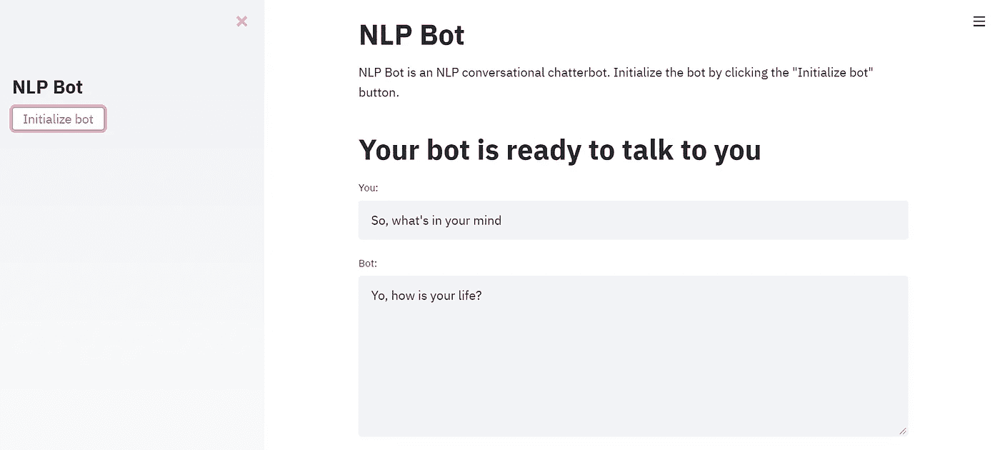

# 使用 Streamlit 的聊天机器人教程

> 原文：<https://medium.com/analytics-vidhya/chatbot-tutorial-using-streamlit-d8af6a21d80d?source=collection_archive---------4----------------------->

今天，我将告诉你如何创建一个智能对话聊天机器人，并轻松地主持它。所以，系好安全带，享受旅程吧:)

最后的**结果**应该是这样的:



安装 streamlit 很简单:
从安装和导入 Streamlit 开始。
pip 安装细流
导入细流为 st

我们还将使用一个名为 chatter bot:[https://github.com/gunthercox/ChatterBot](https://github.com/gunthercox/ChatterBot)的库

遵循以下简单步骤:

1.  确保安装了 Python、Spacy、Streamlit 和 ChatterBot。
2.  要安装 chatterbot，激活虚拟环境，请遵循以下步骤:
3.  conda create-name chatter bot _ example python = 3.7
4.  conda 激活聊天机器人 _ 示例
5.  pip 安装聊天机器人
6.  pip 安装聊天机器人 _ 语料库
7.  pip 安装流程
8.  用`streamlit run cbv2.py`运行 *cbv2.py* 。
9.  演示将在 [http://localhost:8501/](http://localhost:8501/) 进行

以管理员身份打开命令提示符，并执行以下步骤:

1.  要安装 chatterbot，激活虚拟环境，请遵循以下步骤:
2.  conda create-name chatter bot _ example python = 3.7
3.  conda 激活聊天机器人 _ 示例
4.  pip 安装聊天机器人
5.  pip 安装聊天机器人 _ 语料库

现在，你应该已经安装了聊天机器人。

您可以从[http://convai.io/data/](http://convai.io/data/)下载训练所需的数据集

另外，你可以查看我的 github 库:[https://github.com/jojo96/Chatterbot-Streamlit](https://github.com/jojo96/Chatterbot-Streamlit)

_ _ _ _ _ _ _ _ _ _ _ _ _ _ _ _ _ _ _ _ _ _ _ _ _ _ _ _ _ _ _ _ _ _ _ _ _ _ _ _ _ _ _ _ _ _ _ _ _ _ _ 现在编程部分:

```
#importing libraries
import streamlit as st
from chatterbot import ChatBot
from chatterbot.trainers import ListTrainer
from chatterbot.trainers import ChatterBotCorpusTrainer 
import json#get_text is a simple function to get user input from text_input
def get_text():
    input_text = st.text_input("You: ","So, what's in your mind")
    return input_text#data input
data = json.loads(open(r'C:\Users\Jojo\Desktop\projects\chatbot\chatbot\chatbot\data_tolokers.json','r').read())#change path accordingly
data2 = json.loads(open(r'C:\Users\Jojo\Desktop\projects\chatbot\chatbot\chatbot\sw.json','r').read())#change path accordinglytra = []
for k, row in enumerate(data):
    #print(k)
    tra.append(row['dialog'][0]['text'])
for k, row in enumerate(data2):
    #print(k)
    tra.append(row['dialog'][0]['text'])st.sidebar.title("NLP Bot")
st.title("""
NLP Bot  
NLP Bot is an NLP conversational chatterbot. Initialize the bot by clicking the "Initialize bot" button. 
""")bot = ChatBot(name = 'PyBot', read_only = False,preprocessors=['chatterbot.preprocessors.clean_whitespace','chatterbot.preprocessors.convert_to_ascii','chatterbot.preprocessors.unescape_html'], logic_adapters = ['chatterbot.logic.MathematicalEvaluation','chatterbot.logic.BestMatch'])ind = 1
if st.sidebar.button('Initialize bot'):
    trainer2 = ListTrainer(bot) 
    trainer2.train(tra)
    st.title("Your bot is ready to talk to you")
    ind = ind +1

user_input = get_text()if True:
    st.text_area("Bot:", value=bot.get_response(user_input), height=200, max_chars=None, key=None)
else:
    st.text_area("Bot:", value="Please start the bot by clicking sidebar button", height=200, max_chars=None, key=None)
```