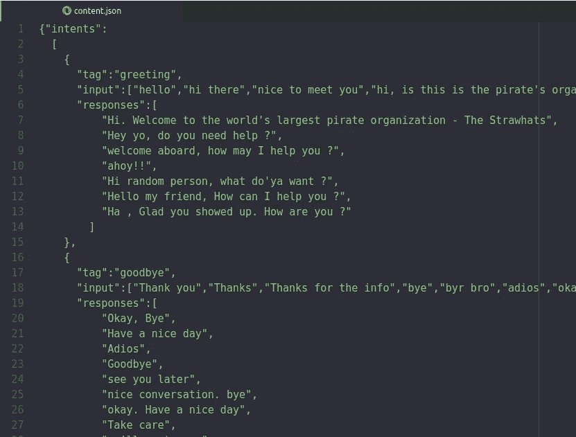
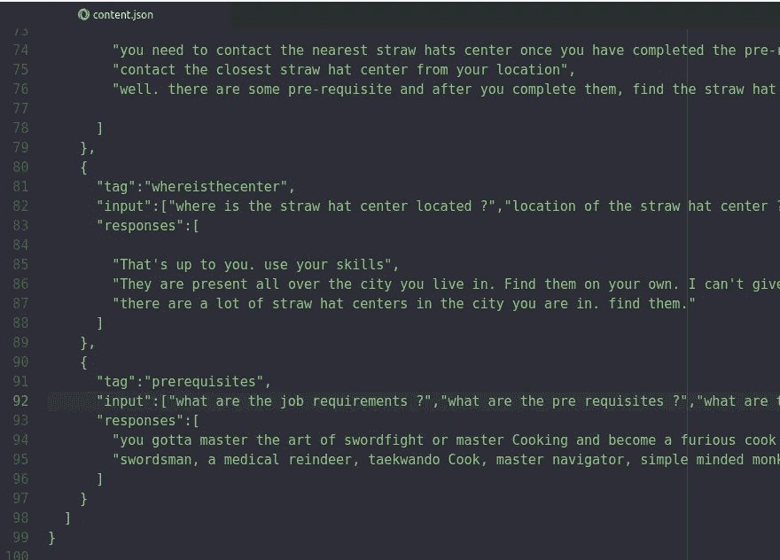
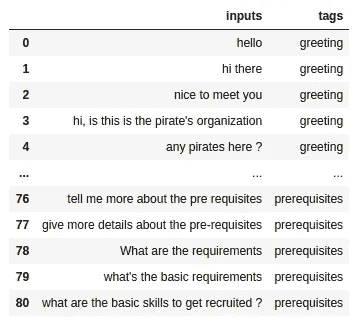
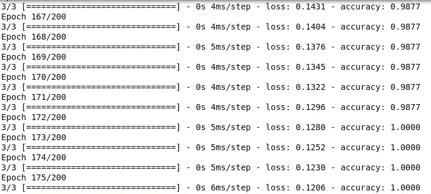

# 使用 TensorFlow 2.0 的聊天机器人—尽情欢乐

> 原文：<https://medium.com/analytics-vidhya/chatbot-with-tensorflow-2-0-going-merry-2f79284a6104?source=collection_archive---------1----------------------->


注意:所有的代码文件都可以在:[https://github.com/ashwinhprasad/Chatbot-GoingMerry](https://github.com/ashwinhprasad/Chatbot-GoingMerry)获得

**Going Merry** 是我为**海盗招募过程**创造的聊天机器人。它有助于招募世界各地的海盗。这回答了用户关于招聘流程、先决条件等的简单问题。同样的模型也可以用于为任何组织创建聊天机器人

# 介绍

聊天机器人是一种用于通过文本进行在线聊天的软件应用程序。在这篇博文中，我将展示如何使用 tensorflow 2 为您的组织创建一个简单的聊天机器人。

# 数据集准备

一旦建立了数据集。一半的工作已经完成了。我们构建数据集的方式是聊天机器人的主要内容。我已经使用 json 文件创建了一个数据集。

json 文件就像 python 中的字典一样。您可以像在 python 的字典中一样存储在 json 文件中



***输入:*** 这些正是用户将要发送给机器人的消息。

***标签:*** 标签用于对输入进行分类，并将其映射到特定类型的响应

***响应:*** 一旦我们将一个输入映射到一个适当的标签，我们就可以选择一个响应返回给用户。

这就是聊天机器人数据集的基本结构。

# 机器学习部分:

1.  **导入库**

```
#importing the libraries
import tensorflow as tf
import numpy as np
import pandas as pd
import json
import nltk
from tensorflow.keras.preprocessing.text import Tokenizer
from tensorflow.keras.layers import Input, Embedding, LSTM , Dense,GlobalMaxPooling1D,Flatten
from tensorflow.keras.models import Model
import matplotlib.pyplot as plt
```

**2。导入数据**

```
#importing the dataset
with open('content.json') as content:
  data1 = json.load(content) #getting all the data to lists
tags = []
inputs = []
responses={}
for intent in data1['intents']:
  responses[intent['tag']]=intent['responses']
  for lines in intent['input']:
    inputs.append(lines)
    tags.append(intent['tag'])#converting to dataframe
data = pd.DataFrame({"inputs":inputs,
                     "tags":tags})print(data)
```

**输出:**



数据存储在一个 json 文件中，该文件可以作为 pandas 数据框架导入和使用。这个数据是我手动创建的。因此，它不是那么大。
我们都知道深度学习需要大块的数据。但是，这里的情况并非如此。我已经利用了一个足够强大的神经网络架构来处理这少量的数据

**3。数据预处理**

```
#removing punctuations
import string
data['inputs'] = data['inputs'].apply(lambda wrd:[ltrs.lower() for ltrs in wrd if ltrs not in string.punctuation])
data['inputs'] = data['inputs'].apply(lambda wrd: ''.join(wrd))#tokenize the data
from tensorflow.keras.preprocessing.text import Tokenizer
tokenizer = Tokenizer(num_words=2000)
tokenizer.fit_on_texts(data['inputs'])
train = tokenizer.texts_to_sequences(data['inputs']) #apply padding
from tensorflow.keras.preprocessing.sequence import pad_sequences
x_train = pad_sequences(train) #encoding the outputs
from sklearn.preprocessing import LabelEncoder
le = LabelEncoder()
y_train = le.fit_transform(data['tags'])
```

Tensorflow 的 tokenizer 为每个不同的单词分配一个唯一的令牌。并且进行填充以使所有数据具有相同的长度，以便将其发送到 RNN 层。目标变量也被编码成十进制值。

**4。输入长度、输出长度和词汇**

```
#input length
input_shape = x_train.shape[1]
print(input_shape)#define vocabulary
vocabulary = len(tokenizer.word_index)
print("number of unique words : ",vocabulary)#output length
output_length = le.classes_.shape[0]
print("output length: ",output_length)**output**number of unique words :  96
output length:  8
```

输入长度和输出长度很明显。它们是神经网络的输入形状和输出形状。词汇大小用于嵌入层为每个单词创建唯一的向量表示

**5。神经网络**

```
#creating the model
i = Input(shape=(input_shape,))
x = Embedding(vocabulary+1,10)(i)
x = LSTM(10,return_sequences=True)(x)
x = Flatten()(x)
x = Dense(output_length,activation="softmax")(x)
model  = Model(i,x)#compiling the model
model.compile(loss="sparse_categorical_crossentropy",optimizer='adam',metrics=['accuracy'])#training the model
train = model.fit(x_train,y_train,epochs=200)
```

网络由嵌入层组成，这是自然语言处理领域中最强大的东西之一。嵌入层的输出是具有 lstm 门的接收层的输入。然后，展平输出，并使用带有 softmax 激活功能的常规密集图层。

主要部分是嵌入层，它为数据集中的每个单词提供相应的向量



模型精度

**6。模型分析** 该模型获得了 100%的完美准确率。

**7。测试**

```
#chatting
import randomwhile True:
  texts_p = []
  prediction_input = input('You : ') #removing punctuation and converting to lowercase
  prediction_input = [letters.lower() for letters in prediction_input if letters not in string.punctuation]
  prediction_input = ''.join(prediction_input)
  texts_p.append(prediction_input) #tokenizing and padding
  prediction_input = tokenizer.texts_to_sequences(texts_p)
  prediction_input = np.array(prediction_input).reshape(-1)
  prediction_input = pad_sequences([prediction_input],input_shape) #getting output from model
  output = model.predict(prediction_input)
  output = output.argmax() #finding the right tag and predicting
  response_tag = le.inverse_transform([output])[0]
  print("Going Merry : ",random.choice(responses[response_tag]))
  if response_tag == "goodbye":
    break
```

**输出:**

```
You : hi thereGoing Merry :  welcome aboard, how may I help you ?You : how do i join the pirates ?Going Merry :  you need to contact the nearest straw hats center 
once you have completed the pre-requisitesYou : what are the pre requisites ?Going Merry :  you gotta master the art of swordfight or master Cooking and become a furious cook or you have to be the best navigator in the entire world or you need to be as strong and intelligent as god usopYou : alright , who are you ?Going Merry :  Going Merry at your serviceYou : how are you doing ?Going Merry :  Yeah , am fineYou : nice , thanks for the responseGoing Merry :  Okay, Bye
```

这就是创建聊天机器人的全部内容

# 关于去快乐

《寻欢作乐》是一部名为《海贼王》的漫画中的一艘船，围绕着一群海盗的故事展开。毫无疑问,“快乐号”是一艘神奇的船。但是，它去世了。
要知道，更多关于行乐:[https://onepiece.fandom.com/wiki/Going_Merry](https://onepiece.fandom.com/wiki/Going_Merry)

# 结论

这是我用 tensorflow2 利用嵌入矩阵的力量创建的聊天机器人。同样的方法可以用于为任何类型的组织构建聊天机器人，但不能用于一般的组织。