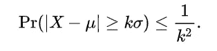
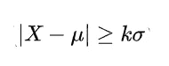
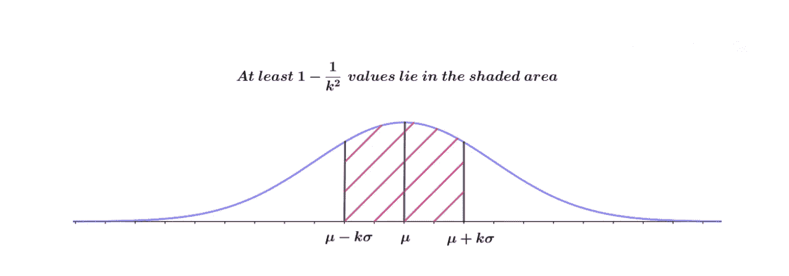

# 切比雪夫不等式

> 原文：<https://medium.com/analytics-vidhya/chebyshevs-inequality-66cce7067a70?source=collection_archive---------14----------------------->

在数据科学或数据分析领域，以下类型的问题非常重要且常见:

*   给定学校中有百分之多少的学生身高在给定区间内？(比如说，[135cm，200cm])或者
*   *百分之多少的人的工资在给定的范围内？或者*
*   *在给定的时间间隔内，体重超标的儿童比例是多少？诸如此类……不胜枚举。*

现在，如果我们知道考虑中的**随机变量**具有给定均值和标准差的**正态分布，这些问题就变得非常容易回答。然后，我们可以很容易地应用**68–95–99.7**规则来得到上述问题的答案。**

*该规则简单地说明了 68%的数据点***位于平均值* ***周围的±1 stnd-dev 内(【mean-1*stnd-dev，mean+1 * stnd-dev)****，* ***95%的数据点*** *位于平均值*周围的±2 stnd-dev 内*

*当我们不知道正在处理的随机变量的基本分布时，问题就出现了，这时**切比雪夫不等式**来拯救我们了！*

**需要满足两个条件:**

*   **相关随机变量的均值应该是有限的，并且**
*   **它的标准差一定是有限且非零的。**

*尽管切比雪夫不等式没有给出特定范围内数据的确切百分比，但给出了近似值或最小值。*

> *在概率论中，**切比雪夫不等式**(也称为**比纳梅–切比雪夫不等式**)保证，对于一大类概率分布，不超过某个分数的值与平均值的距离不超过某个距离-维基百科*

# *概率陈述*

*设 *X* (可积)是一个期望值 *μ* 有限，方差 *σ* 有限的随机变量。那么对于任意实数*k*0，*

**

***切比雪夫不等式***

***让我们更深入地研究一下这个公式！***

*为此，我们将考虑一个例子*

*设 X 是一个随机变量，代表一个国家的个人工资，平均值为 40，000 美元，标准差为 10，000 美元。我们有以下两个问题要回答-*

*Q1) *收入在 2 万美元到 6 万美元之间的人占多大比例？*或者换句话说*百分之多少的人的工资在平均值的 2 标准差以内？**

*Q2) *有百分之多少的人收入在 1 万美元到 7 万美元之间？*或者换句话说*百分之多少的人的工资在平均值的 3 标准差以内？**

****如果 X 是高斯分布，那么我们可以直接给出上述问题的答案，而无需任何进一步的计算:****

****答案:Q1)95%和 Q2) 99.7%****

*但现在让我们尝试用**切比雪夫不等式的公式来解决上述问题。***

*看着这个公式，一开始很难从中找到一个解决方案或一个意义。让我们一次拿一部分。*

**

****这部分公式也可以写成:****

****X≥μ+kσ且 X≤μ-kσ****

*现在我们可以把整个公式读作如下:*

****Pr(X≥μ+kσ且 X≤μ-kσ)≤ 1/k****

**找到大于等于****μ+kσ****或小于等于****μ-kσ****的值的概率为* ***≤ 1/k .****

*上面的公式可以重写为:*

# ****Pr(μ-kσ<X<μ+kσ)>1-(1/k)****

*可以读作**-******X 随机变量位于 k 个标准差之间的概率是* > ***1- (1/k)。*******

********

****因此回到这两个问题，我们现在可以通过使用上面的公式很容易地回答它们****

****答案:****

******Q1)** 这里 k=2，因为工资在平均值的 2 个标准差以内，所以将 k=2 代入上述公式，我们得到 3/4 (75%)。所以我们可以写作，****

****至少 75%的人的薪水在 2 万到 6 万美元之间。****

****这里 k=3，因为工资在平均值的 3 个标准差以内，所以将 k=3 代入上述公式，我们得到 8/9(大约 90%)。所以我们可以写作，****

****至少 90%的人的薪水在 1 万到 7 万美元之间。****

# ****结论****

****因此，切比雪夫不等式极大地帮助我们回答了重要的数据分析问题，并给我们一个最小百分比的点，将位于 k 标准偏差远离均值。****