# 使用深度学习生成胸部 X 射线医学报告

> 原文：<https://medium.com/analytics-vidhya/chest-x-ray-medical-report-generation-using-deep-learning-bf39cc487b88?source=collection_archive---------9----------------------->

# 目录:

1.  *业务问题*
2.  *机器学习问题*
3.  *探索性数据分析*
4.  *机器学习模型*
5.  *未来工作*
6.  参考

# 1.商业问题

# 1.1 描述

如果你因胸痛、胸部受伤或呼吸急促去看医生，你通常会接受胸部 x 光检查。胸部 x 光是最常要求的放射学检查。该图像有助于医生确定你是否有心脏问题、肺萎陷、肺炎、肋骨骨折、肺气肿、癌症或任何其他疾病。胸部 x 光检查也有助于诊断肺部的新冠肺炎感染，因为新冠肺炎主要攻击我们的肺部。一旦你做了 x 光检查，你的医生会用他的知识解释并进一步指导你。因此，我们的目标是通过生成描述放射科医师在 x 射线中看到和观察到的内容的报告，使这些 x 射线易于阅读。

**问题陈述**

构建深度学习模型，从给定的 x 光图像生成医疗报告。

**数据来源:**

PNG 图片:[http://academic torrents . com/details/5a 3a 439 df 24931 f 410 fac 269 b 87b 050203d 9467d](http://academictorrents.com/details/5a3a439df24931f410fac269b87b050203d9467d)

XML 报告:[http://academic torrents . com/details/66450 ba 52 ba 3 f 83 fbf 82 ef 9 c 91 F2 bde 0 e 845 ab](http://academictorrents.com/details/66450ba52ba3f83fbf82ef9c91f2bde0e845ab)

# 1.2 现实世界/业务目标和约束

1.  错误分类的代价可能非常高。
2.  没有严格的延迟问题。
3.  可解释性是部分重要的。

# 2.机器学习问题

# 2.1 数据

# 数据概述

*   **数据将在 2 个 TAR 文件中扩展:**

1.  一个文件夹将包含 PNG 图像，这将是 x 射线。
2.  另一个有 XML 报告(一个报告可以关联多个图像)

*   Posts.xml 的大小—14.6 GB XML 报告文件夹中的文件数= 3955
*   XML 报告文件夹中的文件数= 3955
*   我们使用的数据框架有 5 栏:“图像”、“比较”、“指示”、“发现”、“印象”

**数据字段解释**

*   数据集包含 3955 行。表中的列有:

1.  图像—包含与报告相关的所有图像的路径(输入变量)
2.  比较—包含关于报告的不同图像的注释
3.  指示—包含建议使用 x 射线的原因描述。
4.  发现——x 射线图像的初步发现。
5.  印象—关于 x 射线的详细信息(目标变量)

*   **数据点数= 3955**

# 2.2 将现实世界的问题映射到机器学习问题

# 2.2.1 机器学习问题的类型

1.  这个案例研究基本上是基于给定一个输入图像生成一个文本。具体来说，我们希望生成一份给定胸部 x 射线图像的医疗报告。
2.  这属于视觉语言任务，是计算机视觉领域和自然语言处理领域的混合。

# 性能指标

我们将在此评估中使用的指标是 BLEU 分数。

Bleu 是机器翻译最常用的度量标准。它使用一种叫做修正精度的东西来计算分数，这个分数介于 0-1 之间，1 表示完全相同或完美，0 表示没有共同点。

顾名思义，修改后的精度用于克服正常的
精度，计算如下

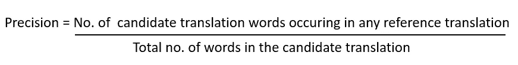

精确

候选翻译是我们模型的输出/预测，参考
翻译是我们拥有的输入句子。
让我们举个例子，计算一下候选
翻译的精度

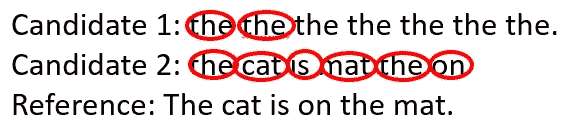

候选项 1 的精度是 2/7 (28.5%)
候选项 2 的精度是 1(100%)。
但我们知道这些结果并不充分。
所以我们修改如下:

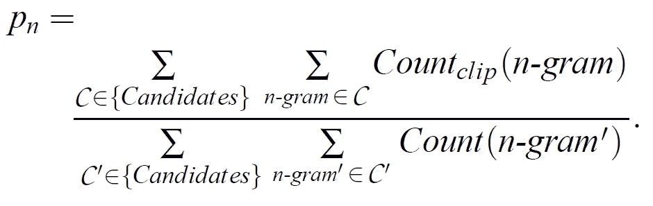

修正精度

这里，n-gram 是在 n 通常被取为 4 时要考虑的单词长度。1 克将为每个窗口考虑 1 个字，2 克将取
2 个字，以此类推。
计数夹是:

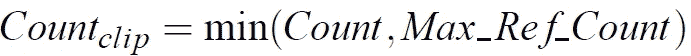

计数剪辑

我们首先使用以下步骤计算任何 n 元文法的计数剪辑:-

*   步骤 1:统计候选 n 元语法
    在任何单个引用翻译中出现的最大次数；这被称为计数。
*   第二步:对于每个参考句子，统计一个
    候选 n 元语法出现的次数。由于我们有三个参考翻译，我们
    计算 Ref 1 计数、Ref2 计数和 Ref 3 计数。
*   步骤 3:在任何
    引用计数中取 n 元文法出现的最大数量。也称为最大引用计数。
*   步骤 4:取最小的计数和最大的引用计数。也称为计数剪辑，因为它通过最大引用计数剪辑每个候选字的总计数
*   第五步:将所有这些剪辑计数相加。

现在只需输入值，您将获得修改后的精度，但是如果
翻译太长或太短怎么办？？
过长的翻译在默认情况下通过使用计数剪辑由修改的精度分数
处理。对于太短的翻译，我们引入简洁惩罚。
当候选翻译长度与任何参考翻译长度的
相同时，简洁罚分(BP)将为 1.0。最接近的参考句子
长度是“最佳匹配长度”

BP 是指数衰减，计算如下

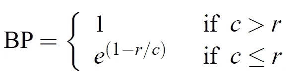

简短惩罚

参考译文中的 r-字数
候选译文中的 c-字数

**注意:**无论是简洁惩罚还是修正的 n-gram 精度长度
都没有直接考虑源长度；相反，他们只考虑目标语言的
参考翻译长度的范围。

最后，我们计算 BLEU

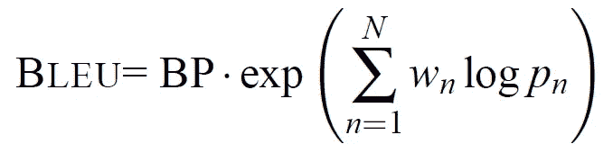

最终 BLEU 分数

BP-bristy penalty
N:N-gram 的数量，我们通常使用单 gram、双 gram、3-gram、4-gram
Wn:每个修正精度的权重，默认情况下 N 是 4，Wn 是 1/4=0.25
Pn:修正精度

**参考博客:**[https://towards data science . com/bleu-双语-评测-替角-2b4eab9bcfd1](https://towardsdatascience.com/bleu-bilingual-evaluation-understudy-2b4eab9bcfd1)

BLEU 评分是由 Kishore Papineni 等人在其 2002 年的论文《BLEU:一种自动评估机器翻译的方法》中提出的。

**研究论文链接:**[https://www . Research gate . net/publication/2588204 _ BLEU _ a _ Method _ for _ Automatic _ Evaluation _ of _ Machine _ Translation](https://www.researchgate.net/publication/2588204_BLEU_a_Method_for_Automatic_Evaluation_of_Machine_Translation)

**我们将使用 nltk 库来计算 BLEU 分数。**

# 3.探索性数据分析

# 3.1 数据加载

# 3.1.1 下载数据并提取 TAR 文件

数据以 Torrent 的形式提供，因此我们将使用 Google Colab 将 Torrent 下载到 Google Drive。

我们可以用命令行使用 [**传输**](https://transmissionbt.com/) 客户端下载 torrent 文件。它支持**命令行界面**，我们所要做的就是安装它，它会下载我们的种子文件。

传输-cli

这样就会下载安装 [**传输**](https://transmissionbt.com/) BitTorrent 客户端。

然后我们将复制 torrent 文件链接使用 transmission-cli 下载 torrent。

传输 cli

以上代码将从给定的种子文件链接下载种子文件到我的 Google Drive。

现在我们有了文件，我们必须提取它，所以我们将使用 [**patoo** l](https://pypi.org/project/patool/) 库来提取。

数据摘录

# 3.1.2 解析 xml 文件

我们的报告是 xml 文件，我们必须从中提取信息。XML 是一种固有的分层数据格式，用树来表示它是最自然的方式。为此，它有两个类——Element tree 将整个 XML 文档表示为一棵树，Element 表示这棵树中的一个节点。与整个文档的交互(读写文件)通常在 ElementTree 级别完成。与单个 XML 元素及其子元素的交互是在元素级别完成的。

提取列

在上面这段代码中，我们遍历了目录中的每个文件，并提取了 ID、比较、指示、发现、图像名称字段。

现在我们将从这些提取的列中制作数据帧，我们的初始数据帧有 **3955 个数据点。**

# 每列 3.2 EDA

## 3.2.1 列图像:

图像列包含与每个报告关联的图像名称，多个图像可以与单个报告关联。

每份报告图像数量的平均值为:1.8887484197218711
每份报告图像数量的中位数为:2.0
每份报告图像数量的最大值为:5
每份报告图像数量的最小值为:0

从上面的评估中，我们发现我们最多有 5 个图像与单个报告相关联，并且我们的数据中没有任何图像与某些报告相关联。平均值更接近于 2，中位数也是 2。

因此，让我们看看与每个报告相关的图像数量。

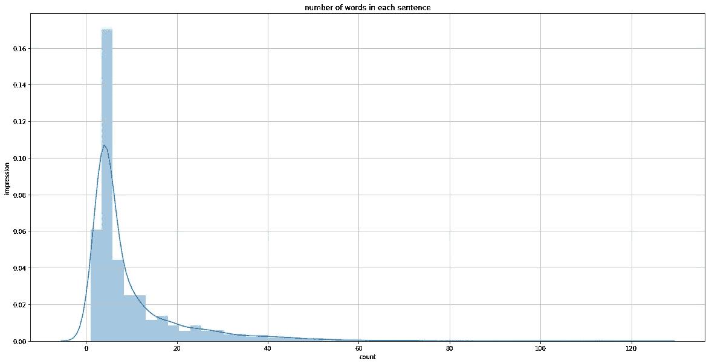

字数

*   宽度和高度的 EDA

平均高度:531.6648922357829
平均高度:512.0
平均宽度:512
平均宽度:512.0

## 3.2.2 列比较:

在我们的印象栏中有 2389 个无值或垃圾值。所以它没有给我们提供足够的信息。所以我们会放弃这个。

## 3.2.3 列指示:

```
Chest pain                               129
XXXX                                     114
Chest pain.                               88
NaN                                       86
chest pain                                62
XXXX.                                     58
XXXX-year-old female with chest pain.     39
XXXX-year-old male with chest pain.       38
Dyspnea                                   37
Shortness of breath                       31
dyspnea                                   29
Shortness of breath.                      23
XXXX-year-old female with chest pain      19
XXXX-year-old woman with chest pain.      19
XXXX-year-old female with XXXX.           19
Name: INDICATION, dtype: int64
```

这些是指示栏中出现的前 10 个值，我认为这些也不会证明有任何价值，所以我放弃了它。

## 3.2.4 列结果:

发现列有 514 个 Nan 列，所以如果我删除这些列，将会有更少的数据点来构建我的模型。所以也放弃这个专栏。

## 3.2.5 列印象(目标):

策划 20 大印象。

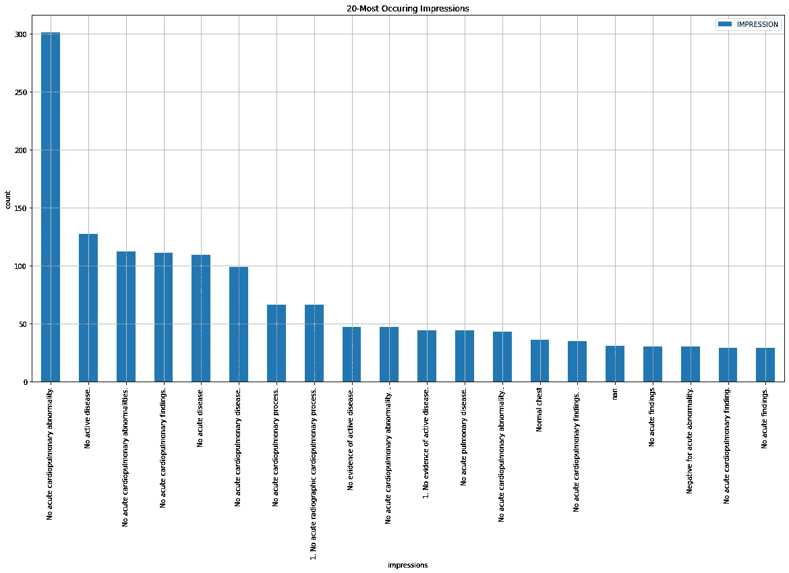

前 20 个印象

从上面的图中我们可以看到，印象栏中的 Nan 非常少，因此我们不会删除它们，而是用“无印象”字符串来替换它们。

单印象中的平均字数为: **10.493378343287457**
单印象中的平均字数为: **5.0**
单印象中的最大字数为: **130**
单印象中的最小字数为: **1**

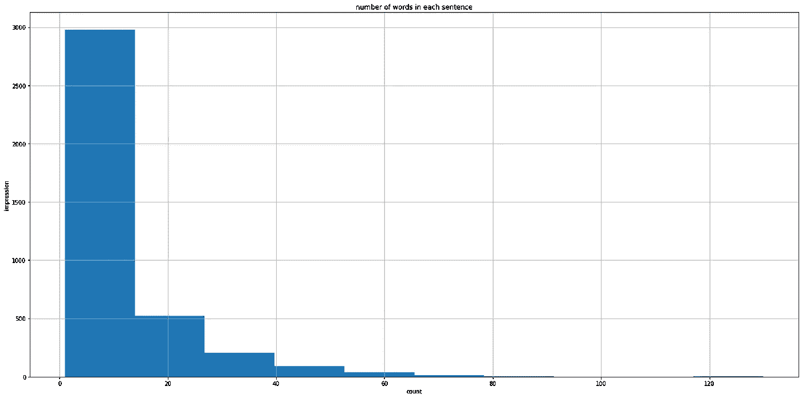

每句话的字数

因此，从上面我们可以观察到，每个印象中的单词数在 2-30 之间，因此我们可以从我们的模型中期待短句。

# EDA 的发现:

1.  我想我将只保留印象和图像列，其他人有许多空值。
2.  大多数报告是正常的，只有一些是不正常的，所以数据偏差是存在的。
3.  主要是每个报告有 2 个图像，所以我只会通过 2 个图像，如果少于这一点，然后我会重复第一个图像本身两次。有 3 个和 4 个图像的每张图片出现较少，我会保留前两个和丢弃其余的。只有一个包含 5 幅图像的报告，因此将执行与 2–4 幅图像相同的操作。,

# 3.3 数据清理

删除列，因为它有许多空值。

删除列

# 3.3.3 最常用的单词

我们将绘制一个单词云，它将显示出现最多的单词，字体大小与该单词的出现次数成正比。

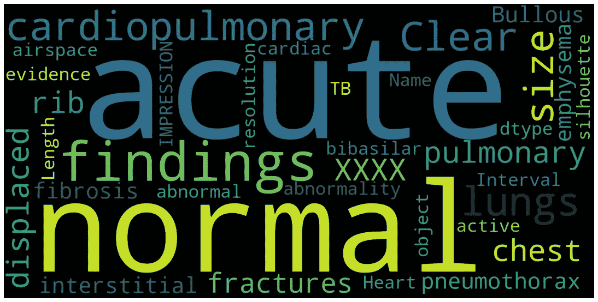

词云

# 3.4 数据预处理

在此，我们将以下列方式预处理输入文本:

1.  我们将替换“XXXX”字符串，它出现在许多印象中，没有任何意义。
2.  我们将删除所有其他小型和大写字母。
3.  解收缩文本:基本上是从收缩状态展开单词，例如:不会→不会，不能→不能等。

4.将制表符和多余的空格转换成一个简单的空格。

# 3.4.2 预处理图像列

1.  每个数据点仅保留前两幅图像。

每个数据点 2 幅图像

在上面这段代码中，我们对图像列的每个数据点进行切片，这是一个图像名称的列表，长度为 2，然后将此操作应用于整个列

2.对于每个数据点只有一个图像的行，我们复制该图像两次。

# 3.4.3 在 IMPRESSION 列中添加特殊字符串

在 impression 列中插入起始'<start>'和'<end>'字符串，让模型知道什么是标记的开始和结束，这将有助于生成字幕/印象。</end></start>

我们将制作 3 个新列表，如下所示:

**原始 _ 序列:** <开始>无急性肺部发现<结束>
输入 _ 序列: <开始>无急性肺部发现
**输出 _ 序列:**无急性肺部发现<结束>

我将在构建模型时展示它的用途。

# 3.4.4 标记化。

当处理文本时，我们必须做的第一件事是在将文本输入模型之前，想出一个策略将字符串转换成数字(或“矢量化”文本)，这就是 Tokenizer 发挥作用的时候了。

标记化是将单词转换成整数的过程，其中每个单词对应于语料库中的唯一单词。Tensorflow 内置了 tokenizer，我们只需初始化该函数，它将为我们标记输入。

在我们对输入句子进行标记后，我们必须使所有输入的大小相同，为此我们将填充序列，填充可以通过两种方式完成:预填充(在序列开始处填充零)或后填充(在原始序列结束后填充零)

最初，我将填充的最大序列长度限制为单词长度的 99%，即语料库中所有单词的 53%，最后我使用了 100%，即 123，因此每个序列的长度为 123，填充类型为后填充。

标记化

标记化后的示例。

```
sample input sequence [ 1 12 18 88  0  0  0  0  0  0  0  0  0  0  0  0  0  0  0  0  0  0  0  0  0  0  0  0  0  0  0  0  0  0  0  0  0  0  0  0  0  0  0  0  0  0  0  0  0  0  0  0  0  0  0  0  0  0  0  0  0  0  0  0  0  0  0  0  0  0  0  0  0  0  0  0  0  0  0  0  0  0  0  0  0  0  0  0  0  0  0  0  0  0  0  0  0  0  0  0  0  0  0  0  0  0  0  0  0  0  0  0  0  0  0  0  0  0  0  0  0  0  0]sample output sequence [12 18 88  2  0  0  0  0  0  0  0  0  0  0  0  0  0  0  0  0  0  0  0  0 0  0  0  0  0  0  0  0  0  0  0  0  0  0  0  0  0  0  0  0  0  0  0  0  0  0  0  0  0  0  0  0  0  0  0  0  0  0  0  0  0  0  0  0  0  0  0  0  0  0  0  0  0  0  0  0  0  0  0  0  0  0  0  0  0  0  0  0  0  0  0  0 0  0  0  0  0  0  0  0  0  0  0  0  0  0  0  0  0  0  0  0  0  0  0  0
0  0  0]
```

# 4.机器学习模型

# 4.1 将数据分为训练、验证和测试。

我们要做的第一件事是将数据分为训练集、验证集和测试集。我们将使用'**sk learn**' train _ test _ split 来拆分我们的数据。

我们将把我们的数据集分成总数据的训练(90%)、验证(9%)、测试(1%)和洗牌。

Sklearn 的 train_test_split 将数据分成两部分(训练和测试)，但我们也希望验证，所以我们首先将数据分成 90%(训练):10%(初始测试)，并将初始测试子集的 10%分成 99.98%(验证)和 0.019%(最终测试)数据集。

我将测试规模保持得很小，因为我们只需要显示几个例子作为输出，但是更多的验证数据将有助于训练模型(当然是间接的)。

# 4.3 数据扩充

数据扩充是生成略有不同的训练数据副本的过程，以使模型的性能在验证和测试集上保持稳定。

我们增加输入图像也是因为我们没有太多的数据来训练。

因此，下一个问题是，我们如何在训练时将增强应用于图像？？答案很简单，在将图像传递给模型之前，我们将应用下面提到的任意一个随机增强。通过这样做，模型将在每次获取数据点时看到增强的/不同的图像，因此这将帮助他减少过拟合，并且可以很好地推广。

我们正在使用的增强功能有:

1.  翻转:从左向右或水平翻转图像。
2.  上下或垂直翻转图像
3.  浮雕图像，并用原始图像覆盖结果。
4.  检测具有特定方向的边缘，并在黑白图像中标记它们，然后用原始图像覆盖结果。
5.  锐化图像

为了对图像执行上述增强，我们将使用 [**imgaug**](https://imgaug.readthedocs.io/en/latest/) 库，如下所示:

增加

# 4.4 加载和预处理图像

为了加载和预处理图像，我们将使用名为 [**opencv**](https://pypi.org/project/opencv-python/) **的计算机视觉库。**

我们将定义一个函数，该函数将在调用时加载预处理和增强图像，并返回最终的图像数组。

预处理图像

在上面的代码中，我们遵循以下步骤。

1.  我们正在使用`cv2.imread`方法加载图像
2.  我们正在使用`cv2.resize`根据模型的需要调整图像的大小。
3.  然后，我们在 0-1 之间选择一个随机数，并相应地应用任何一个增量。
4.  最后我们对图像进行归一化处理，使用`cv2.normalize`对图像的像素值进行压缩/归一化，范围从 0–255 到 0–1，使计算更简单，计算更快。

# 4.5 数据加载器功能:

顾名思义，我们正在创建一个将继承`[tf.keras.utils.Sequence](https://www.tensorflow.org/api_docs/python/tf/keras/utils/Sequence)`功能的函数，这是一种更安全的多处理方式。这种结构保证了网络在每个时期的每个样本上只训练一次，这与发电机的情况不同。

每个`Sequence`都必须实现`__getitem__`和`__len__`方法。如果你想在不同时期之间修改你的数据集，你可以实现`on_epoch_end`。方法`__getitem__`应该返回一个完整的批处理。

让我们深入研究一下**数据加载器**类的每个函数。

该函数将定义数据加载器的长度。

**注意:**当您调用`len(dataloader)`时，它将返回 dataloader 的长度，而不是您在其中传递的训练样本的长度。例如:假设你有 256 个数据点，你的批量大小是 8，那么这个函数将返回 256//8，也就是 32 注 256。

2.

在这个函数中，我们定义了我们想要在一个时期结束时做什么，这个函数将在一个时期结束后被调用。我们只是在每个时期后改变数据点的索引，以便模型在每个时期后看到不同的组合数据点。

3.

这个函数将加载增强的、标准化的图像，我们调用 load_image1 函数，它与我之前解释的`preprocess_img`函数相同。

4.

获取批量项目

这是批量加载图像、输入和输出张量并返回(input，target)元组的函数。

它将开始索引作为输入，并从该索引返回批量输出，例如:如果函数中的“I”为 4，批量大小为 16，则开始索引将为 4*16，直到(4+1)*16，因此它将从 64–80 获取数据点，这是一个 16 的批量。把它们堆起来，然后归还。

# 4.6 制作模型架构。

我们要遵循的模型架构称为**带注意机制的编码器-解码器**模型。

编码器-解码器模型最初是为机器翻译开发的，其中编码器和解码器都包含递归神经网络(LSTM，GRU)。编码器部分对输入序列进行编码，然后使用其内部状态将处理后的信息传递给模型的解码器部分，解码器然后处理输入并生成转换后的输出。

这些模型的问题在于，编码器输出除了最后一个 lstm 隐藏和输出状态之外什么也不是，不能捕捉要翻译的整个输入句子的关键。为了解决这个问题，研究人员引入了一种有效地将信息从编码器传递到解码器的方法。那种机制叫做'**注意**机制。这个想法是在 2015 年通过联合学习对齐和翻译论文的[神经机器翻译中引入的。在下一节中，我们将详细介绍该模型的所有部分。](https://arxiv.org/abs/1409.0473)

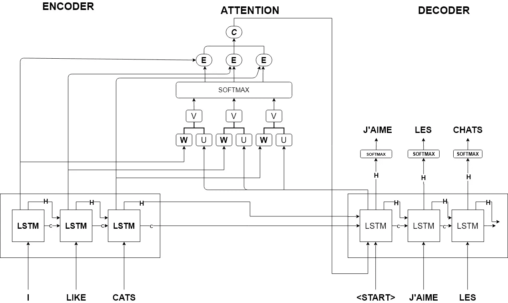

注意的编码器-解码器模型

上图描述了编码器-解码器模型的工作原理，注意机制位于其上。

我们正在修改编码器部分，并将其替换为预训练的 DenseNet121 模型，该模型是一个卷积神经网络，而不是递归神经网络，它将图像作为输入，提取感兴趣的特征或区域，并将其进一步传递给注意机制。

现在让我们深入模型的各个部分。

# 4.6.1 加载预训练 Chex-Net 模型。

这个模型是在 [CheXNet:利用深度学习对胸部 X 射线进行放射科医生级别的肺炎检测](https://arxiv.org/abs/1711.05225)中介绍的

在这个实验中，他们采用了 densenet121，这是一个 121 层的卷积神经网络，并用 imagenet 权重对其进行初始化，并在 [ChestX-ray14 数据集](https://arxiv.org/abs/1705.02315)上对其进行训练。他们试图根据输入图像将图像分为 14 类或 14 种疾病，因此这是一个多标签分类问题。他们使用的度量标准是 f1-score，并将模型在测试数据上的性能与 4 名放射科医生进行了比较，这 4 名放射科医生手动标记疾病，模型的表现优于他们。

chexnet

我们使用 densenet121 并添加 Chex-Net 模型的预训练权重。我们必须定义类=14，因为该模型是在 14 类多标签分类任务上训练的。我们获取的图像高度和宽度是 **(224，224，3)** ，这与 densenet 默认的输入形状相同。

**权重 _ 链接**:[https://github.com/brucechou1983/CheXNet-Keras](https://github.com/brucechou1983/CheXNet-Keras)

加载权重后，我们将从预训练模型中移除最后完全连接的层和全局平均池层。这使得最后卷积块的输出在级联或残差块之后，并应用批量归一化和 relu 激活作为我们的最终输出。该模型的输出将作为我们图像的特征向量。

# CNN _ 编码器

这是我们模型中的编码器模块，在这一层中，我们将调用我们的图像特征提取模型(chexnet ),并对其输出进行整形，使其看起来像序列编码器/LSTM (batch_size，hidden_state_size，units)的输出。

例如:我们的图像提取模型的输出是来自较低卷积层的形状(batch_size，7，7，1024)。我们将这个输入压缩为(batch_size，49，1024)作为编码器的输出。

编码器

# 注意事项:

这部分将告诉 lstm 哪个单词从图像的哪个区域产生，这就是为什么它被命名为注意机制。

有两种类型的注意机制。

*   **Bahdanau 注意**

这种注意力机制是在论文《通过联合学习对齐和翻译的[神经机器翻译》中介绍的。它是为序列到序列的机器翻译而引入的。让我们假设我们有一个将英语句子翻译成法语的任务。因此，现在我们对输入和输出文本进行了标记化和填充，以备将来使用。](https://arxiv.org/abs/1409.0473)

1.  我们的英语句子将一个字一个字地进入编码器部分，如图所示'*注意编码器-解码器模型'*。以上这些步骤被称为时间步骤。之后，我们将传递来自嵌入层的输入，我们将通过反向传播来学习。此后，每个输入进入 lstm 单元，并且该 lstm 的隐藏和输出状态将改变/更新。这个过程将对每个单词持续进行。因此，当我们的输入语句结束时，我们将最终的 LSTM 隐藏和输出状态作为编码器的输出。
2.  接下来是注意部分，现在我们有 lstm 输出状态、隐藏状态和单元状态作为编码器输出。
3.  我们将使用隐藏的编码器和单元状态初始化解码器模型的 lstm。
4.  首先，注意力将把编码器输出状态和解码器隐藏状态作为输入。然后它将计算它们之间的相似性。通过应用下面所示的操作，这些隐藏和输出状态将生成一个相似性得分。

相似性

5.然后，我们从 softmax 函数传递这个分数，该函数将把这个分数从 0-1 之间的范围转换。这种相似性的形状将等于编码器的隐藏大小，我们将称之为注意力权重，因为它将告诉我们在生成该输出时，它对每个编码器隐藏状态给予了多少注意力。比方说，隐藏大小为 49，第 31 个索引处的值为 **0.88** ，因此我们知道这在生成结果时贡献更多，因为由于 softmax 函数，通过将所有输出相加，最终概率将为 1。

注意力权重

6.然后，我们将该注意力权重与编码器输出状态相乘，并将它们相加以生成上下文向量，以将其传递给解码器 lstm。

上下文向量

*   **Luong 注意**

Luong 的注意力和 Bahdanau 的注意力没有太大的不同。过程是一样的。主要区别是:

1.  Luong 介绍了 3 种计算相似性得分的技术，而 bahdanau 只有一种方法。这些方法如下图所示。

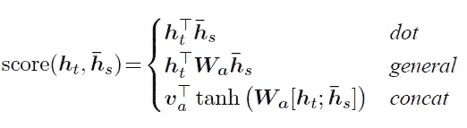

注意类型

这里得分指的是相似度，h_t 是目标隐藏状态，h_s 是源输出状态，Wa 和 Va 是权重矩阵。

2.我们在案例研究中使用了 Luongs 串联注意力方法，该方法与 Bahndanus 注意力相似度计算方法相同。

3.在计算相似性分数之后，计算注意力权重和上下文向量与 bahndanau 注意力相同。

4.在计算注意力时，Bahndanus 使用 lstm 的输出，该输出是在先前的时间步中生成的，其中 Luong 的注意力将使用当前的时间步隐藏状态。

# 解码器

解码器是模型中发生转换的部分，在我们的例子中，解码器包含嵌入、LSTM 和末尾的密集层(没有任何激活)。

解码器会在每一步中提取当前单词并生成下一个单词。让我们一步一步地看看解码器是如何工作的。

请记住，在我们的标记化中，我们对 input_sequence 和 output_sequence 做了不同的处理，它们将在这里使用，让我们通过一个例子来理解这一点。

**原 _ 序** : <开始>无急性肺部发现<结束>

**输入 _ 序列** : <开始>无急性肺部发现

**输出 _ 序列**:无急性肺部发现<结束>

因为我们知道解码器会一个字一个字地接受输入，所以我们使用教师强制来决定解码器的下一个输入。

教师强制是将目标单词作为下一个输入传递给解码器的技术。

因此，特殊标记'<start>'将从 INPUT_SEQUENCE 进入解码器，我们期望' No '作为解码器的输出，这也是第一时间步 OUTPUT_SEQUENCE 中的第一个字。此后，输入序列的第二个字“否”将作为解码器的输入，我们期望输出序列的第二个字“急性”作为输出。</start>

对于每个输入序列，我们将解码器的隐藏和单元状态初始化为来自正态分布的随机数，因为输入在图像之间是不相关的。

解码器的一步

这是名为“one_step decoder”的解码器类中的一个函数，它将为每个时间步长运行 123 次，这是我们在填充输入时决定的 max_sequence 长度，并按如下步骤执行操作。

1.  它将从 INPUT_SEQUENCE 中取出第一个字，并将其传递给嵌入层。在我们的例子中是 256。
2.  然后，来自先前时间步长的解码器隐藏状态连同编码器输出状态将被传递到我们在上面解释过的注意类，并且它将返回给我们 context_vector 和注意权重(**注意:**我们将不使用注意权重，而训练仅使用上下文向量)。
3.  现在，我们将上下文向量与嵌入的输出连接起来，并将其传递给 lstm，我们将用先前隐藏的时间步长和单元状态来初始化 lstm。并生成当前时间步长输出、隐藏和单元格状态。
4.  我们将传递来自全连接密集层的 lstm 输出，其单位与 vocab_size 相同。稍后我们将从这个密集层的输出中提取预测的单词。
5.  我们将从该函数返回当前步骤 lstm 输出、其隐藏状态、其单元格状态和注意力权重。
6.  对于下一步，所接收的输出将被用作 lstm 的输入，作为先前状态隐藏和单元状态。这样，序列信息保留在解码器的 lstm 单元中。

对于每个时间步长，我们将堆栈从 one_step_decoder 函数接收的输出，并将其作为最终的编码器输出返回。

# 4.7 损失函数和优化器

我们使用[稀疏分类交叉熵](https://www.tensorflow.org/api_docs/python/tf/keras/losses/SparseCategoricalCrossentropy)，因为我们已经编码出真正的标签。

在正常的分类交叉熵中，这些标签将是一个热编码，这不是我们已经标记化标签的使用情况。

例如:

y_true: [[1，0，0，0]，[0，1，0，0]，[0，0，0，1]] —因为我们真正的标签是单标签，并且我们有多类分类问题，我们也可以这样写。

y_true: [0，1，3] —它只是真实标签的索引。通过编码成这种类型，我们在计算损失时节省了大量的存储器，当数量类很大时，因为最终唯一的一个值将对损失项 rest 有贡献，将变成零。

如果你看到我们使用记号化器，我们也把我们的句子编码成记号，就像这样。

这些整数中的每一个都可以被认为是 index，其中特定的值是 one in one hot setting，并且该特定数组的大小将等于词汇表的大小。

正如你所看到的，我们通过添加零来填充序列。这些零不应该干扰损失值，因此我们必须找到一种方法来克服这个问题。为此，我们将使用 SparseCategoricalCrossentropy 的 sample_weight 参数，该参数让我们定义每个令牌的样本权重，因此首先我们将发现令牌/标签是否为零，如果它不为零，那么我们将把它的权重指定为 1，否则样本权重将为零，因此这些值不会干扰我们的损失计算。

我们正在使用的优化器是 [**亚当**](https://www.tensorflow.org/api_docs/python/tf/keras/optimizers/Adam) ，学习率为 **0.00001。**

优化器和损失函数

# 4.9 定制培训

我们已经编写了自己的自定义循环，如下所示。

*   我们将运行 n 个时期的循环。
*   在循环中，我们将使用枚举再次迭代我们训练数据加载器，我们将接收 batch_number、inputs、target。
*   我们将输入和目标传递到 train_step 函数中，该函数将运行我们的模型 1 批次/步骤，计算损失并应用梯度更新。

train_step 函数执行以下操作:

1.  首先，它将重置解码器的隐藏单元状态。
2.  它将从我们的编码器部分传递图像 1 和图像 2 数组，这将为我们提供特征向量。
3.  然后，我们连接这些特征向量，并添加丢失以减少过拟合。
4.  我们将 input_sequence、连接的特征和解码器隐藏的、我们初始化的单元状态传递到解码器中。
5.  解码器将在内部为每个时间步长运行，并使用 image_features 和 input_sequence 预测下一个单词，然后将该批次的最终预测结果返回给我们。
6.  我们将把解码器输出和真实输出传递到损失函数中。
7.  我们必须计算每个标记的损失，因为当我们计算梯度时，我们需要每个标记的损失。我们单独添加每个令牌的损失
8.  我们将计算的损失除以时间步长，得到该批次的最终损失。
9.  然后，我们将计算梯度，并将这些梯度和可训练变量一起应用于优化器。
10.  最后，我们将总损失作为输出返回。

训练步骤

*   我们得到该批次的损失，然后将该损失加到模型的总损失中。
*   当我们计算通过验证数据进入 validation_Step。validation_step 与 train_step 函数相同，只是在此步骤中我们不更新模型权重，我们只是预测输出并报告验证损失以用于模型评估。
*   在时段完成后，我们通过将增加的损失除以总时间步长来保存损失，并且我们将使用该类内的 on_epoch_end 函数来混洗列车数据加载器的索引。

*   然后，我们将使用自定义学习率降低器，如果验证损失在最后 3 个时期没有变化，则降低学习率

降低 lr

*   我们将实施定制的提前停止回调，它将检查 6 个时期的验证损失是否没有变化，这将停止训练。

提前停止

# 4.10 绘制损失图

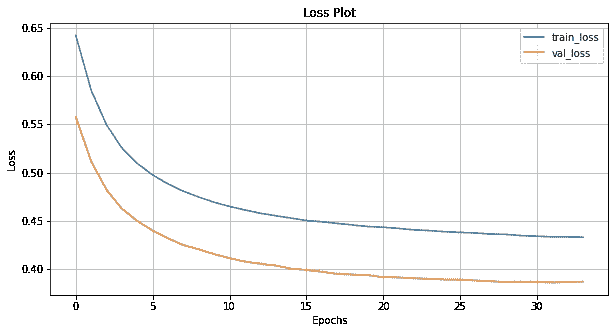

损耗图

# 我们的模型运行了 **34** 个周期，其训练损失: **0.433114** 和 val_Loss : **0.387015**

# 4.11 模型评估

Evaluate step 与我们的 train_step 没有太大的不同，只是我们在这里没有使用教师强制。

1.  我们首先将输入图像传入编码器，并连接输出特征。
2.  然后，我们初始化解码器 lstm 的隐藏状态和单元状态。
3.  然后，我们将令牌<start>传递给解码器，这是我们的特殊令牌，类似于预测的开始。</start>
4.  我们将为 max_sequence_length 运行 for 循环。
5.  在 for 循环中，我们调用 decoder 类的 one_step_decoder 函数。通过传递开始令牌作为解码器输入、隐藏和单元状态以及编码器输出。
6.  从该函数返回，我们将接收预测、新更新的隐藏的解码器 lstm 的单元状态。
7.  我们将作为解码器输入隐藏的所有三个预测字和作为先前时间步长输出的单元状态再次传递给 one_step_decoder 函数，以生成下一个字，这将持续到 max_seq_length 的范围。
8.  我们将保存注意力权重用于绘制注意力，并使用预测的 **argmax** 来找到预测的单词。
9.  如果从我们的模型中预测到特殊记号<end>，我们将在中间停止训练。</end>
10.  此函数将返回图像的最终印象和注意力图的注意力权重。

# 4.12 模型预测

在我们看到模型预测之前，让我们先来看看两个函数

1.  Bleu_score:这个函数将给出 1，2，3，4 克的 Bleu 分数。我们使用 nltk 的 bleu 分数作为我们的用例。

*   计算 BLEU 分数的方法不正确:

在上述代码中，引用指的是正确的翻译或基本事实，而翻译指的是模型、预测输出。当你按原样传递引用和翻译时，这个函数不会抛出错误，而是会给你好的结果，这就是发生在我身上的事情，我得到了整个数据的总 bleu 分数，0.80 是非常好的，但我认为这个分数有些可疑，所以我在他们的函数实现中查找它。

当你按原样传递这个函数时，它会将你的句子分解成字母而不是单词，我们的词汇量有限，只有 26 个字母，这个单词很有可能出现在翻译的句子中。这就是为什么它给了我这么好的分数。后来我改正了。

*   计算 BLEU 分数的正确方法。

蓝色分数正确

看看错误的和正确的之间的区别，这一个采取参考/基本事实的列表，因为可以有一个以上的参考句子，并且每个参考/基本事实也被分成单词列表，并且对于翻译，它采取翻译句子的单词列表。

2.剧情 _ 注意:

Phis 函数将图像、预测句子和注意力权重作为输入，并绘制注意力。

剧情关注

这里 len_result 是预测字符串的长度。我们正在迭代它。

1.  首先，我们打开图像，然后使用函数 get_concat_h 将它们并排粘贴。
2.  然后我们迭代结果的长度。
3.  我们首先将注意力图数组调整为 7，7 数组，因为这是 CHeXnet 模型 7，7，1024 的最后一层的输出，然后我们将数组调整为 49，1024，然后我们将产生 49，2048 的特征连接起来。所以现在我们再次分离它。
4.  当我们添加支线剧情时，要注意每个单词。
5.  我们将预测的单词设置为子情节的标题。
6.  然后我们显示图像，然后在图像上画出我们的注意力，它将显示为灰色。

## **部分结果:**

1.  **结果 1**

```
Real Caption: no acute cardiopulmonary findings chronic changes of emphysema and left basilar scarring
Prediction Caption: no hypoinflation minimal acute recommended lungs a left are identified no cannot <end>
BLEU score: 0.7071067811865476
Cumulative 1-gram: 0.250000
Cumulative 2-gram: 0.500000
Cumulative 3-gram: 0.632878
Cumulative 4-gram: 0.707107
```

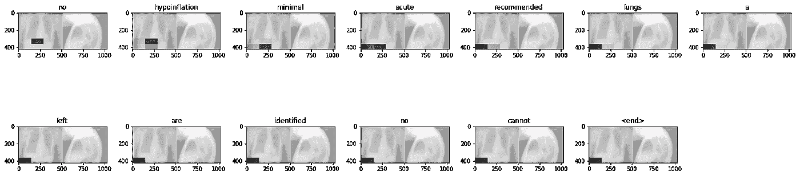

注意力图 1

**2。结果 2**

```
Real Caption: no acute findings
Prediction Caption: no evidence have right nodules of chest <end>
BLEU score: 0.6147881529512643
Cumulative 1-gram: 0.142857
Cumulative 2-gram: 0.377964
Cumulative 3-gram: 0.526160
Cumulative 4-gram: 0.614788
```

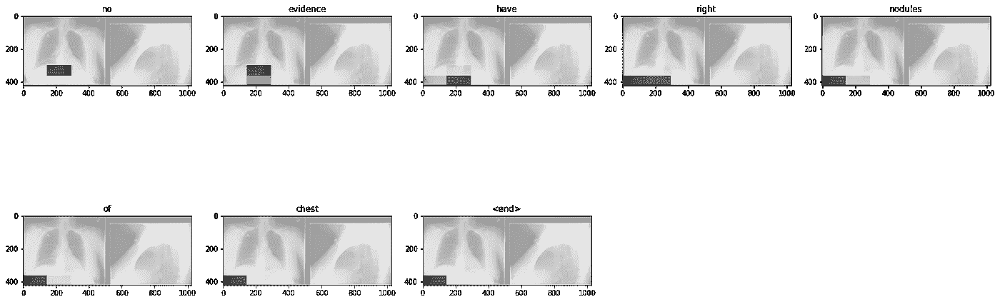

注意情节 2

**3。结果 3**

```
Real Caption: bilateral opacities most prominent in the lower lobes representing airspace disease or edema
Prediction Caption: retained volumes curvature normal lung prominent normal volumes fractures disease disease <end>
BLEU score: 0.5444358245099123
Cumulative 1-gram: 0.151591
Cumulative 2-gram: 0.355513
Cumulative 3-gram: 0.475026
Cumulative 4-gram: 0.544436
```

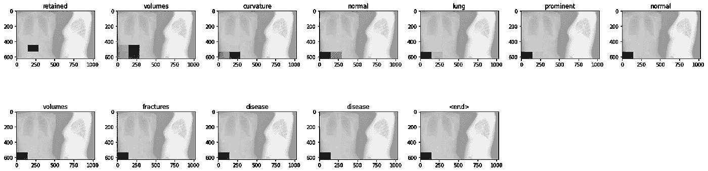

# 4.13 整个语料库的最终 BLEU 分数。

我们已经计算了我们拥有的整个语料库的 bleu 分数，下面是结果。

> ***Final _ bleau 1 _ score 0.11377335230141303***
> 
> ***Final _ bleau 2 _ score 0.20860306243858598***
> 
> **Final _ bleau 3 _ score 0.27927417083079303**
> 
> ***Final _ bleau 4 _ score 0.3235168641768014***

最终结果是好的:)

# 5.未来工作:

1.  我想试试 [VisualBERT:一个简单的视觉和语言基准](https://arxiv.org/abs/1908.03557)和 [ImageBERT:使用大规模弱监督图像文本数据的跨模态预训练](https://arxiv.org/abs/2001.07966)
2.  我想在模型的预测上尝试波束搜索，看看结果是否有所改善。
3.  我想尝试不同型号的编码器部分，如 yolov3，更快的 R-CNN 等。

# 6。参考文献:-

1.  [www.appliedaicourse.com](https://www.appliedaicourse.com/)
2.  [https://www.tensorflow.org/tutorials/text/image_captioning](https://www.tensorflow.org/tutorials/text/image_captioning)

# —这个博客的源代码。

[](https://github.com/sezazqureshi/chest-xray-medical-report-generation) [## sezazqureshi/胸部 x 光-医疗-报告-生成

### 此时您不能执行该操作。您已使用另一个标签页或窗口登录。您已在另一个选项卡中注销，或者…

github.com](https://github.com/sezazqureshi/chest-xray-medical-report-generation) 

## 也看看我的另一个案例研究。我做了一个基于 StackOverflow 问题的搜索引擎，并把它部署在 AWS 上。它会根据你的问题向你提出类似的问题。

[](https://sezazqureshi.medium.com/search-engine-based-on-stackoverflow-questions-2151307c283f) [## 基于 StackOverflow 问题的搜索引擎

### 目录:

sezazqureshi.medium.com](https://sezazqureshi.medium.com/search-engine-based-on-stackoverflow-questions-2151307c283f) 

# 喜欢并评论你的观点。

# 感谢您的阅读…