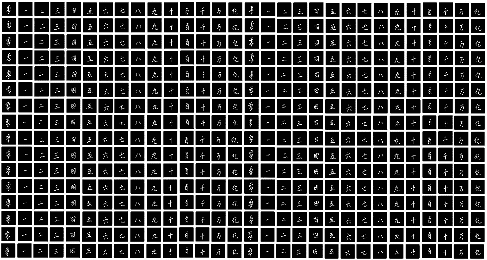
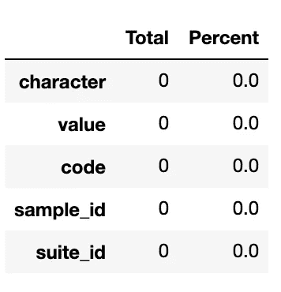
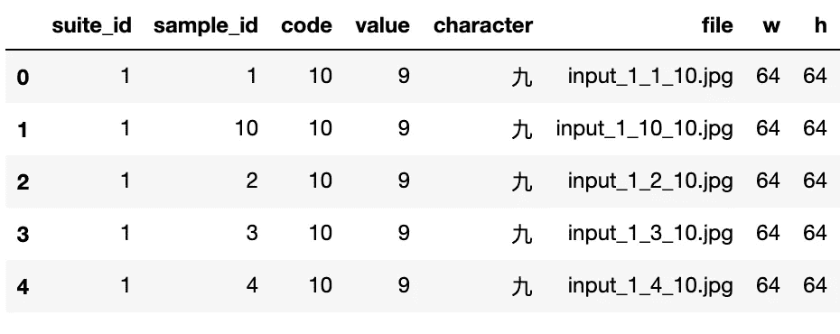

# 中文数字 MNIST

> 原文：<https://medium.com/analytics-vidhya/chinese-digit-mnist-1b46f51e8f75?source=collection_archive---------3----------------------->

**MNIST 手写数字**分类问题是计算机视觉和深度学习中使用的标准数据集。但是，如果数字是汉字呢？介绍中国数字 MNIST。ka ggle 页面链接:[https://www.kaggle.com/gpreda/chinese-mnist](https://www.kaggle.com/gpreda/chinese-mnist)



# 中国数字概论

上表显示了其对应的汉字值。现在，有了所有的基础，让我们跳上车吧！

# 数据集

了解我们正在处理的数据总是好的。数据集有 15000 张图片，但是每张图片有多少张呢？因为我们有 15 个不同的字符，所以每个字符应该是 1000，但是让我们检查一下。*注意笔记本是在 Kaggle 上运行的。*

1.  数据分布

获取数据分布的代码

代码将返回以下内容，即每个字符 1000 个图像！

```
value      character
0          零            1000
1          一            1000
2          二            1000
3          三            1000
4          四            1000
5          五            1000
6          六            1000
7          七            1000
8          八            1000
9          九            1000
10         十            1000
100        百            1000
1000       千            1000
10000      万            1000
100000000  亿            1000
dtype: int64
```

2.缺失数据？

让我们检查是否有任何丢失的数据。

用于评估缺失数据的代码

代码返回 0，表示数据集完全正常！安全总比后悔好！



缺失数据的结果

3.缺失图像？

让我们检查一下目录中是否有 15000 张图片。

```
Number of image files: 15000
```

没错。我们可以走了！

> *注意图片在* `data/data` *的子目录里面。*

4.将图像属性附加到数据帧

由于输入图像的命名约定为“`input_[siote_id]_[sample_id]_[code].jpg`”，因此我们应该在 dataframe 中再添加一列，以便将来处理。此外，我们还应该指定图像的宽度和高度！

上面的代码向 dataframe 添加了三个新列，分别是“`file`”、“`w`”和“`h`”。我们的数据帧应该是这样的。



*请注意，该数据有 100 个套件，每个套件有 10 个样本。*

# 让游戏开始吧！

我们需要首先将数据分成**测试、验证**和**训练**。 **train** 数据集，你猜对了，是用来训练模型的，而 **test** 数据集是用来评估模型性能的，是新鲜的，在 **train** 数据集中找不到。另一方面，**验证**数据集是为了测量模型在训练时的拟合程度，以及模型的泛化程度。这有助于理解模型的偏差和方差。

我们用 80:20 吧，其中 80%的**考**，20%的**练**。然后在**测试**数据集上进行另一个 80:20 的划分，其中 80%的**测试**和 20%的**验证。**

现在，我们有以下数据集。

```
Train set: 9600
Test set: 3000
Validation set: 2400
```

接下来，我们需要重塑和规范化的图像。我们需要一个函数，可以读取图像和缩放到 64×64×1 的图像。然后，我们还需要创建一个函数，该函数创建一个对应于分类目标变量的变量。

现在，我们开始训练吧！

我要一个类似 VGG 的模型。

现在，让我们训练 10 个纪元，这应该很快。

让我们看看结果。

```
[0.14375902712345123, 0.971666693687439]
```

相当可观！个人报告怎么样？

```
precision    recall  f1-score   support

           一       0.98      0.98      0.98       200
           七       0.98      0.97      0.98       200
           万       0.95      0.98      0.97       200
           三       0.95      0.96      0.96       200
           九       0.99      0.94      0.96       200
           二       0.94      0.94      0.94       200
           五       0.99      0.99      0.99       200
           亿       0.92      0.99      0.96       200
           八       1.00      0.99      1.00       200
           六       0.99      1.00      1.00       200
           十       0.99      0.94      0.96       200
           千       0.95      0.98      0.96       200
           四       0.99      0.97      0.98       200
           百       0.97      0.92      0.94       200
           零       1.00      1.00      1.00       200

    accuracy                           0.97      3000
   macro avg       0.97      0.97      0.97      3000
weighted avg       0.97      0.97      0.97      3000
```

# 恭喜你！

> 你已经建立了一个 CNN 来分类中文数字！你可以通过 Kaggle 笔记本[在这里](https://www.kaggle.com/koayhongvin/vgg-like-model-no-dense-model-a-review)搞定。