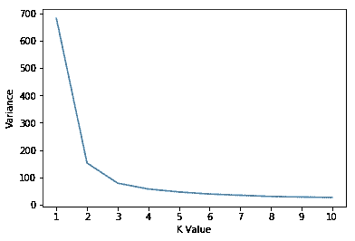

# 为 K-均值聚类选择最佳 K 值

> 原文：<https://medium.com/analytics-vidhya/choosing-the-best-k-value-for-k-means-clustering-d8b4616f8b86?source=collection_archive---------1----------------------->

有许多用于不同应用的机器学习算法。有些叫“有监督的”，有些叫“无监督的”。今天，我们将讨论一种无监督算法，它被称为 K-means 聚类。

可能，有很多关于 K-means 聚类如何工作或者如何用 Python 实现它的帖子。出于这个原因，我们将仅仅集中于选择最佳 K 值，以便获得更好的结果。我们所说的“更好的结果”显然是指尽可能有效地对数据点进行分组。

每次扫描一个范围内的 K 个值并将数据点聚类到 K 个不同的组中可能是一个聪明的想法。在每个聚类完成后，我们可以检查一些度量，以便决定我们是否应该选择当前的 K 或继续评估。

其中一个度量是总距离(在 sklearn 库中称为“惯性”)。惯性向我们展示了到每个星团中心的距离总和。如果总距离很大，这意味着这些点彼此之间距离很远，彼此之间可能不太相似。在这种情况下，我们可以选择继续评估更高的 K 值，以查看是否可以减少总距离。然而，我应该在这里强调一个非常重要的观点。缩短距离并不总是最明智的想法。假设我们有 100 个数据点。如果我们选择 K 为 100，我们将得到一个等于 0 的距离值。但是，显然，这不是我们所希望的。我们希望有几个“好的”聚类，它们包含关于数据点的足够信息，并且没有任何噪声或异常值。

嗯，我们能感觉到自己还行的点叫做“肘点”。当您绘制总距离(惯性)与 K 值的关系图时，您会发现，在某一点之后，总距离开始发生变化，与之前的变化相比，变化不明显。此时，我们可以得出结论，数据点被充分地聚类，并且进一步的聚类不会为我们的系统贡献更多的信息。因此，我们可以选择停止在这里，并继续与肘点对应的 K 值。

现在，让我们动手写一个 Python 代码，以便更好地理解如何找到最佳 k。

我们将使用一个非常著名的数据集 Iris。虹膜数据集包含三种不同类型的花，每种花有 4 个特征。我们希望我们的 K-means 算法能够找到最佳的分组结构。

```
#IMPORT LIBRARIES
import numpy as np
from sklearn.cluster import KMeans
from sklearn import datasets
import matplotlib.pyplot as plt#LOAD IRIS DATASET
iris=datasets.load_iris()
x=iris.data
target=iris.target#Create a function that calculates Inertia for n times
#We will sweep through 1 to n to find the optimal cluster numberdef cluster_variance(n):
    variances=[]
    kmeans=[]
    outputs=[]
    K=[i for i in range(1,n+1)] for i in range(1,n+1):
        variance=0
        model=KMeans(n_clusters=i,random_state=82,verbose=2).fit(x)
        kmeans.append(model)
        variances.append(model.inertia_)

    return variances,K,nvariances,K,n=cluster_variance(10)plt.plot(K,variances)
plt.ylabel("Inertia ( Total Distance )")
plt.xlabel("K Value")
plt.xticks([i for i in range(1,n+1)])
plt.show()
```



从上图中可以看出，K=3 后，总距离的减少变化更加缓慢，线的斜率显著降低。从这个图中，我们可以推断出，超过这个 K 值(3)不会对我们的聚类算法有太大的贡献，只会使我们的聚类更加复杂。最后，我想告诉你，这个结果与我们的预期相当一致。由于 Iris 数据集包含三种不同类型的花，因此得出 3 个聚类是这种情况下最有效的方法也就不足为奇了。