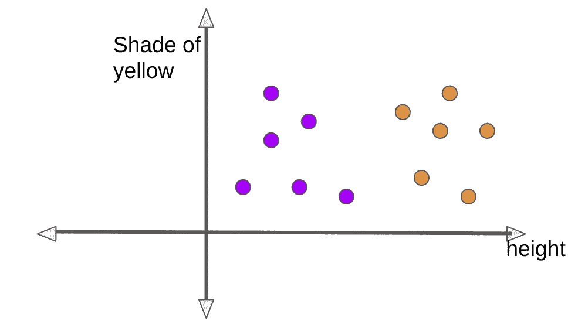
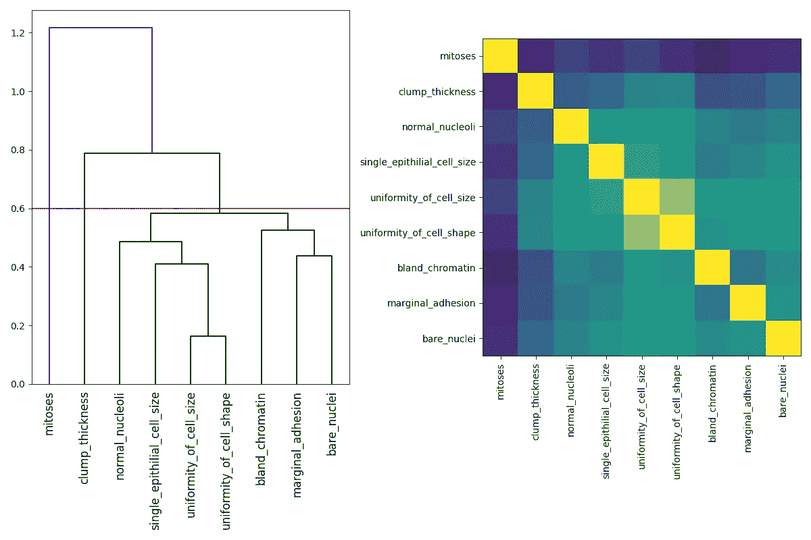
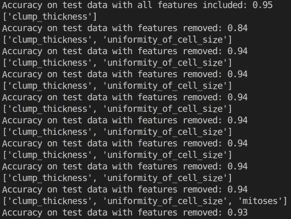

# 选择最好的:特征选择

> 原文：<https://medium.com/analytics-vidhya/choosing-the-best-ones-feature-selection-cbe3ac7fa698?source=collection_archive---------19----------------------->

“特征重要性”、“特征选择”是不同的短语，意思是一样的——找到对学习任务贡献最多信息的特征。在本帖中，我们将学习如何利用 Scikit learn 来检索最佳特性。

# 我们为什么需要它？

有多种提取特征的方法可以在不同的向量空间中创建新的特征，例如主成分分析(PCA)，但有时我们希望在生成任何次要特征之前知道现有特征的重要性。这增加了可解释性，并允许我们减少特征集以形成更简单的模型，并避免过度拟合。

例如，一家公司想根据花的高度和颜色对花进行分类。有两种花:“向日葵”和“万寿菊”，根据下面给出的特征-黄色的高度和深浅来分类。因为这两种花在颜色上有几乎相似的变化，所以高度是一个重要的区别。金盏花平均比向日葵矮。高度是一个重要的特征，因为当投影在“高度”轴上时，它具有最高的扩散，并且在两种花之间具有更多的差异。因此，公司不需要投入资源来收集关于花的颜色的数据，而是可以基于特征“高度”形成良好的分类器。

万寿菊(紫色圆圈)和向日葵(黄色圆圈)

如下所示，有三种方式进行特征选择:

1.  过滤方法:使用统计属性过滤掉信息差/冗余的特征。这种方法在使用任何分类器/回归器之前应用。所选择的特征子集应该彼此具有较小的相关性(避免冗余)和与类别标签的较大相关性(增加相关性)。
2.  包装器方法:涉及特征子集生成及其在分类器/回归器上的评估。子集生成有多种算法，如穷举搜索(生成所有可能的子集)、双向搜索、遗传算法等。
3.  嵌入式方法:在分类器/回归器的训练期间进行特征选择，例如使用正则化项，该正则化项相应地对特征进行加权。

目标:去除不相关的(对学习任务没有贡献)或多余的(没有添加额外的信息)特征。

包装器通常比过滤器获得更好的准确性，因为它们被调整到分类器。Scikit learn 的包装器方法中的大多数特征选择解决方案依赖于递归特征选择/消除。当要素具有多重共线性(两个或多个要素高度线性相关)时，这种方法的缺点就会出现。因此，如果两个特征 x1 和 x2 高度相关，删除 x1 不会降低模型的准确性，因为 x2 能够提供必要的信息，反之亦然。最终，即使通过选择其中至少一个而获得的信息可能是重要的，它们两个都将被给予较低的权重。

在本文中，我们尝试基于相关性对特征进行聚类，然后从每个聚类中选择一个特征来形成一个精简的特征集。这里使用来自 UCI 的威斯康辛乳腺癌数据库，代码和数据集可以在这里找到[，有 10 个属性和 2 个类别-良性和恶性。良性病例 458 例，恶性病例 241 例。它具有以下属性:'样本 _ 代码 _ 编号'，'丛 _ 厚度'，'细胞 _ 大小均匀性'，'细胞 _ 形状均匀性'，'边缘 _ 粘附'，'单个 _ 上皮细胞 _ 大小'，'裸核'，'空白 _ 染色质'，'正常 _ 核仁'，'有丝分裂'。](https://github.com/ApurvaMisra/breast_cancer)

用于形成聚类和选择特征的代码

左边是基于关联的聚类，右边是关联热图

我们使用 Spearman 的相关系数来找出特征之间的相关性，然后制作层次链接图，其中由高度较短的链接连接的两个特征具有高相关性，例如，“细胞大小的均匀性”和“细胞形状的均匀性”具有高相关性，因为它们连接在一起具有大约 0.18 的高度。

因此，我们可以选择任何阈值来定义我们的聚类，在上图中，我们使用了阈值 0.6(红色水平线)。这三组将是:

1.  集群 1:有丝分裂
2.  集群 2:丛厚
3.  群 3:细胞大小均匀，细胞形状均匀，边缘粘附，单个上皮细胞大小，裸核，染色质，正常核仁。

随机森林被用作包装器方法的分类器，并且从每个聚类中选择一个特征以避免任何冗余，如代码中所示。添加每个功能后，精确度会有所提高，如下所示:

约简特征集及其相应的精度

正如我们所看到的，来自第一个聚类的特征“有丝分裂”的添加导致了准确性的下降。这里，我们刚刚添加了每个聚类中的第一个要素，但是迭代每个聚类中的所有要素以选择最佳要素会更有用。

特征选择是解释和简化模型所需的最必要的过程之一，并且有许多方法，例如置换特征重要性，其减少了必须重新训练模型的次数。上面的方法是我研究的方法之一，将功能作为我研究的一部分。

其他提示:使用点-双列相关系数来查找要素和二进制标注之间的相关性。