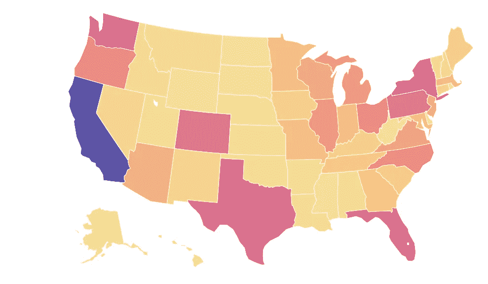
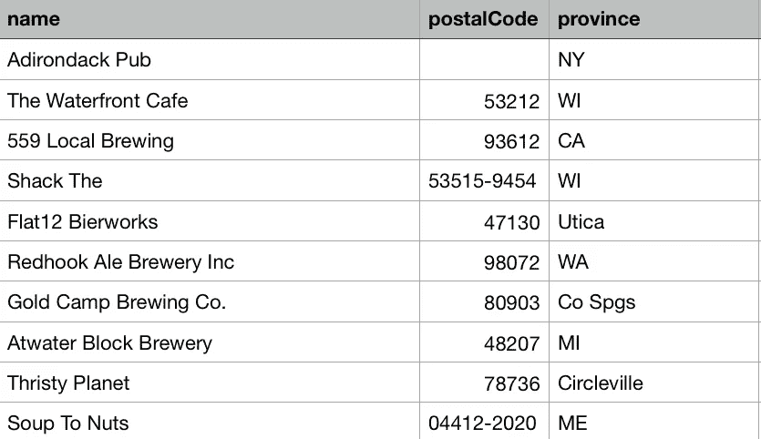
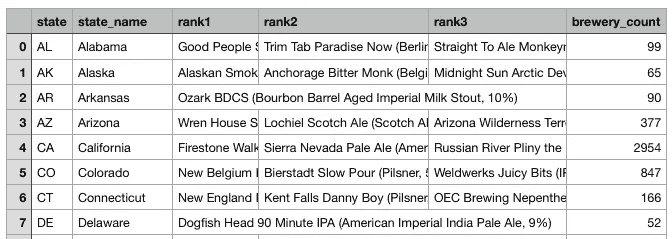
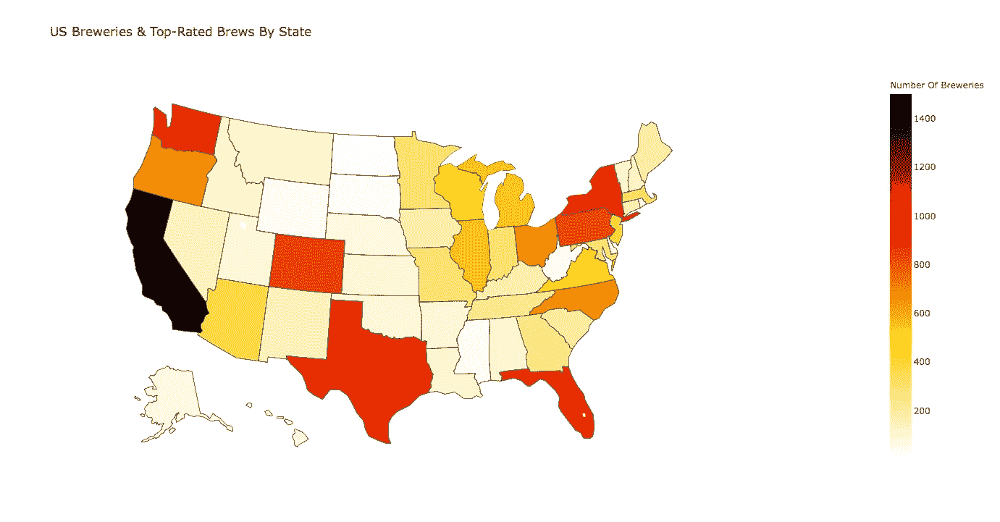
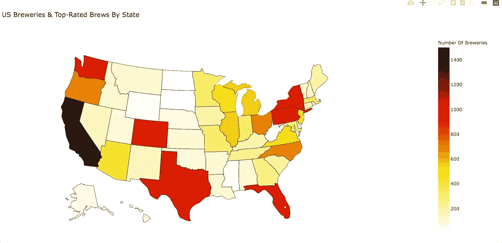

# 使用 Plotly 在 Python 中绘制 Choropleth 地图

> 原文：<https://medium.com/analytics-vidhya/choropleth-map-in-python-using-plotly-5fb067a32b50?source=collection_archive---------19----------------------->

在过去的几周里，几家媒体一直在报道 2020 年美国大选，每一家都用不同的方式呈现选举结果。从中汲取灵感，我使用 Plotly 图形库创建了自己的 choropleth 地图。在本文中，我将讨论如何生成一个交互式 choropleth 地图来可视化美国酿酒厂和酿酒酒吧的排名。除此之外，地图还显示了每个州排名靠前的精酿啤酒。

# 数据集

我们将使用三个数据集:

*   第一个数据集是美国的[酿酒厂&酿酒酒馆的样本数据集。该数据集包含美国 7000 多家啤酒厂&酒吧的地理信息。](https://data.world/datafiniti/breweries-brew-pubs-in-the-usa)
*   需要[美国邮政编码](https://www.kaggle.com/danofer/zipcodes-county-fips-crosswalk)数据集来清理第一个数据集。
*   最后，在[这篇](https://www.thrillist.com/drink/nation/every-state-in-the-usa-ranked-by-its-beer)文章的帮助下，创建了一个各州排名靠前的啤酒的数据集。

# 数据清理

为了创建 choropleth 地图，我们需要各州的名称以及每个州的啤酒厂数量。啤酒厂和酒馆数据集包含啤酒厂的名称、邮政编码和省份信息。然而，*省*列为一些条目提供了州名，为其他条目提供了城市名，并且一些条目具有缩写的州名。

图 1:美国数据集中的啤酒厂和啤酒酒吧

为了使*省*列中的值保持相同的格式，我们保留了州名和缩写，对于其他值(城市名、县名等)，我们使用*邮政编码*列和美国邮政编码数据集将条目映射到州名。为了简单起见，所有州名都用两个字母的缩写。对于缺少 *postalCode* 值的条目，通过检查啤酒厂的地址来手动更新条目。

一旦我们有了州的列表，我们就创建一个新的列表来存储每个州的啤酒厂的数量。使用上面的两个列表作为列来创建新的数据帧，然后将其与包含每个州的排名靠前的啤酒的数据帧合并。这是将为我们的 Choropleth 地图提供数据的最终数据集。

图 2:最终合并的数据集

# 创建 Choropleth 地图

现在有趣的部分来了。图形库 *Plotly* 提供了美国各州的内置几何图形，所以我们的工作相当简单。我们使用内置的几何图形和我们的数据来创建 Choropleth。

上面的代码生成了这个映射:

图 3: Plotly Chropleth 图

为了显示关于顶级啤酒的信息，我们将*悬停文本*添加到我们的**图**对象。

这给了我们这个:

图 4:带有悬停文本的 Choropleth

如果你想查看交互式 Plotly 图形，可在这里找到[。生成 Choropleth 的所有代码文件都可以在我的](https://github.com/eshza/US_BreweriesMap/tree/master/output) [GitHub](https://github.com/eshza/US_BreweriesMap) 上找到。