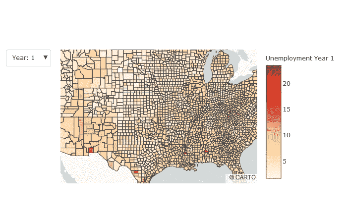

# Choropleth 地图:Plotly & follo

> 原文：<https://medium.com/analytics-vidhya/choropleth-maps-plotly-folium-ba18350fb89e?source=collection_archive---------17----------------------->

在最近的一个基于纽约餐馆的项目中，我想制作一些地图。在我看来，当谈论一个城市时，手头上有这样一件有用的东西，它们非常能说明问题。该项目最终整合了纽约社区委员会辖区周围的三幅 choropleth 地图:

*   餐馆密度
*   最受欢迎的餐馆类型，
*   卫生部门检查平均得分、

所有这些地图都是使用叶图书馆制作的，我认为它们非常棒。但是我做了另外一张地图，但是我最终没有使用——卫生部检查分数平均值的逐年变化。出于几个原因，包括项目在这一点上的整体蔓延，我最终没有将时间分析作为卫生部检查评分和分级的影响因素。这很好，因为尽管我很喜欢地图背后的想法，但我不喜欢它的结果有一些吹毛求疵的地方。

您可以在这里查看和互动:【https://ktzioumis.github.io/plotly-folium/m_ave_yronyr.html

该地图显示了 2016 年(从 7 月)、2017 年、2018 年和 2019 年(到 7 月)每个社区委员会区域的年度平均健康检查分数。可以选择或取消选择每年作为 OpenStreetMap 的覆盖图。上面链接的地图是功能性的，并且很好地说明了数据，但是我的异议如下:

*   在 choropleth 贴图之间进行选择不会取消选择其他 choropleth-这使得很难看到从一个贴图到下一个贴图的变化，因为它们要么在一个被选择而另一个被取消选择时被覆盖，要么在两次选择之间贴图变为空白
*   无论 choropleth 是否打开，每个 choropleth 的颜色条都会永久显示

leav 不支持解决这些问题的方法。

我不再需要*制作这张地图，但我仍然*希望*能够制作这张地图。were 的缺点令人失望，所以我想尝试另一个绘图/映射库——plottly。*

[Plotly Choropleth 教程](https://plot.ly/python/mapbox-county-choropleth/)

choropleth 教程基于美国各县的失业数据，我以此为起点制作了我想要的分层 choropleth 地图。

为 choropleth 选择创建一个下拉菜单的过程是我从本教程改编而来的

[github jupyter 笔记本](https://github.com/ktzioumis/plotly-folium/blob/master/Plotly_unemp_choro.ipynb)

结果的动画 gif:

我爱这个结果！它直接解决了我的两个问题。

*   下拉菜单允许选择被调整为设置另一个 choro ploth 的可见性的 choropleth(如果需要，下拉菜单中的第三个选项可以被设置为使两个 choro pleth 都可见)。
*   颜色栏仅显示所选 choropleth 的刻度。

此外，由于颜色条从地图向右偏移，图例上的 xticks 和标注文本不会显示在地图前面，因此更加清晰易读。follow 不允许改变 choropleth 上的图例位置。

普罗特利肯定赢了