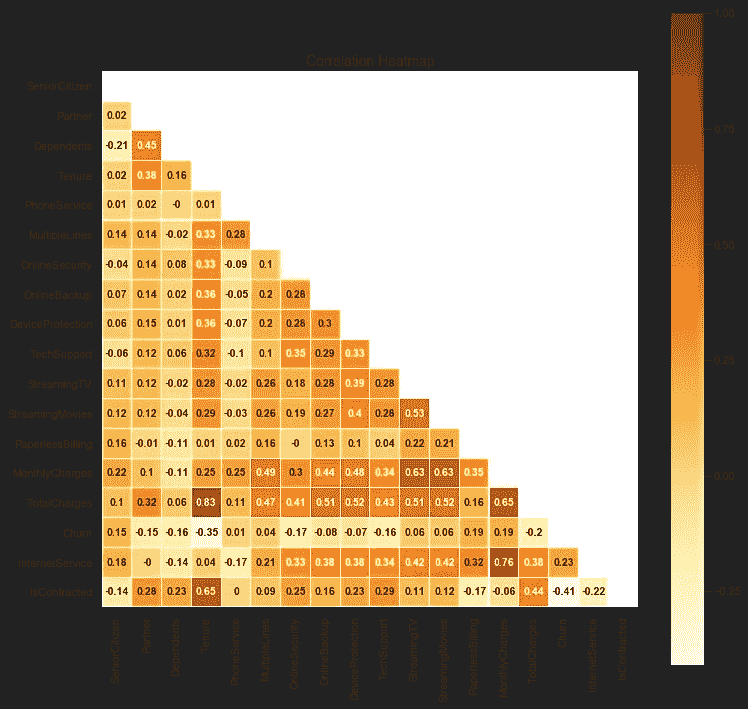

# 流失建模和预测

> 原文：<https://medium.com/analytics-vidhya/churn-modelling-and-prediction-4d899c112aff?source=collection_archive---------11----------------------->


# 什么是流失预测？

根据 [Appier](https://medium.com/u/618b87d86346?source=post_page-----4d899c112aff--------------------------------) 的[博客](https://www.appier.com/blog/churn-prediction/)的说法，流失预测可以帮助人们预见到这个人是否会离开，这样你就可以有足够的时间来准备吸引他们的策略。这几周我一直在忙着研究这个话题。在人力资源领域，总有一批员工会提交辞呈，尽管他们表现不错，公司也想留住他们。然而，要留住他们总是为时已晚，因为他们已经被另一家公司接受了一份更好的工作。因此，为什么我们不在员工开始寻找其他工作机会之前就让他们参与进来呢？这就是员工流失预测发挥作用的地方。

关于[电信流失预测](/analytics-vidhya/telecom-churn-prediction-model-aa5c71ef944c)的帖子由 [Shivali](https://medium.com/u/7dc0648c97f5?source=post_page-----4d899c112aff--------------------------------) 撰写，是一个很好的流失预测入门指南。使用了各种技术，如 EDA(探索性数据分析)、聚类分析和流失预测模型。主要目的是分析客户的行为，并制定保留计划，以降低流失率。

# 如何开始？

以下是如何启动客户流失预测项目的一般工作流程。主要的挑战将是数据收集过程。如果可能的话，我们应该在不同的时间戳收集尽可能多的数据点。

1.  数据收集
2.  数据预处理
3.  探索性数据分析
4.  流失聚类分析
5.  流失预测模型
6.  保留计划

## 1.数据收集

数据收集听起来可能很容易，但是如果您的数据来自多个来源呢？关于员工的数据可能很难收集，尤其是关于员工的等级、与主管/同事的关系以及他们的生活事件(如婚姻、父母身份等)。我们需要明确我们的项目目标，以便数据收集可以更简单。理解我们的数据也很重要，尤其是在下一步——数据预处理。

## 2.数据预处理

例如，您预测过去 3 年中每个季度将在 6 个月内离职的员工。因此，处理后的数据集应该如下所示。

*   `extract_mth`是提取的月份
*   `resign_dt`是从 *extract_mth* 起 6 个月内的离职月份
*   `pct_chg_mcrate` 是当前季度 MC 率相对于上一季度的百分比变化

## 3.探索性数据分析

在开始使用 EDA 之前，您必须首先将您的数据分组/转换为 3 个类别— `Numeric`、`Nominal`和`Binary` ，并将您的目标列设置为`Churn`。

```
**cat_cols** = ["Gender","Partner","Dependents","SeniorCitizen","PhoneService","MultipleLines","InternetServiceType","OnlineSecurity","OnlineBackup","DeviceProtection","TechSupport","StreamingTV","StreamingMovies","IsContracted","ContractType","PaperlessBilling","PaymentMethod"]

**num_cols** = ["Tenure","MonthlyCharges","TotalCharges"]

**target_col** = 'Churn'

*# spliting categorical columns into Nominal and Binary columns*

**nominal_cols** =[Gender','InternetServiceType','PaymentMethod','ContractType']

**binary_cols** = ['SeniorCitizen','Partner','Dependents','PhoneService','MultipleLines','OnlineSecurity','OnlineBackup','DeviceProtection','TechSupport','StreamingTV','StreamingMovies','PaperlessBilling','InternetService',IsContracted']
```

关联热图对于检查输入要素之间是否存在任何关系也很有用。



## 4.流失聚类分析

我们还可以检查输入特征之间是否有任何聚类关系(例如`Tenure`和`MonthlyCharges`)


```
 sns.lmplot(
x='Tenure',
y='MonthlyCharges',
data=df_cal,
hue='Churn',
fit_reg=**False**,
markers=["o", "x"],
palette=plotColor)plt.show() *# checking number of clusters*

Create_elbow_curve(df_cal[df_cal.Churn==1][['Tenure_norm','MonthlyCharges_norm']])
```


从肘部曲线来看，3 似乎最有效。


## 5.流失预测模型

应该使用各种模型来比较哪种模型更适合数据集。热门车型有`Logistic Regression`、`Random forest`、`Gradient boosting`。超参数调整过程也用于获得每个模型的最佳参数。


## 6.保留计划

最后一步是使用当前数据上生成的模型来找出客户流失的概率。有了确定的流失群体，我们可以进一步将他们分为不同的风险因素—低、中、高风险。保留计划可以提供给`high risk`组。