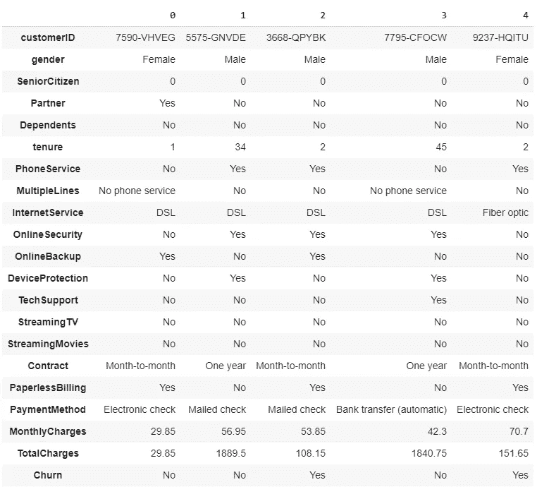
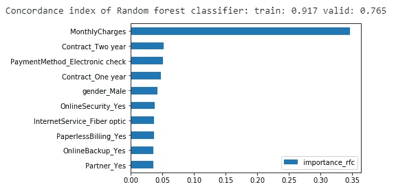
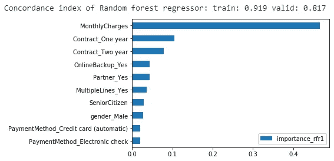
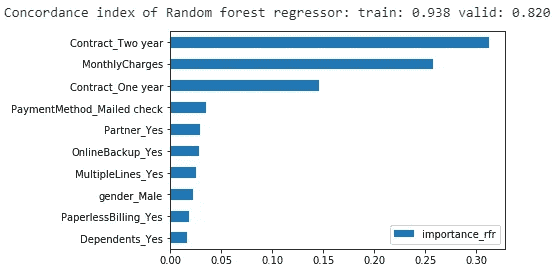
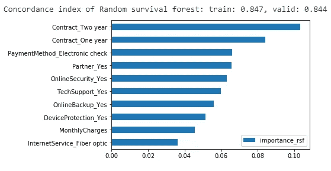
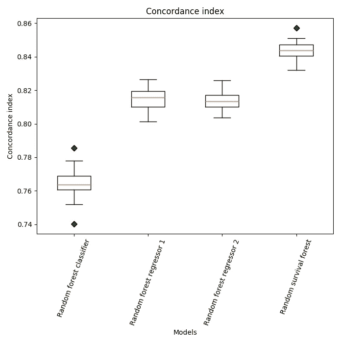
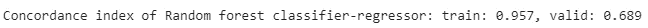
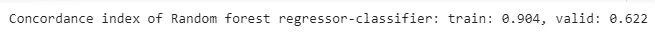

# 电信行业的客户流失预测

> 原文：<https://medium.com/analytics-vidhya/churn-prediction-in-a-telco-70ba5aa12f70?source=collection_archive---------5----------------------->

*所有与本帖相关的代码都可以在* [*这里*](https://github.com/alonsosilvaallende/Churn-Prediction-in-a-Telco) *找到。*

亚历山大·安德鲁斯在 [Unsplash](https://unsplash.com?utm_source=medium&utm_medium=referral) 上拍摄的照片

客户流失是客户或顾客的损失。为了避免失去客户，一个公司需要检查为什么它的客户在过去离开了，哪些特征对决定谁将在未来流失更重要。因此，我们的任务是预测客户是否会流失，以及哪些是正确预测的最重要特征。和大多数预测问题一样，我们会使用机器学习。

我们如何利用机器学习来做到这一点？首先，我们需要建立一个评估指标。给定一个数据集，我们如何评估我们的流失预测是对还是错？每个人最终都会流失(一些人会换到不同的公司，一些人会完全停止使用提议的服务，最终所有人都会流失，如果不是的话，因为最终公司会像人一样死去)。

所以问题依然存在，你如何评估你的流失预测是对还是错？

在其他地方(例如参见[这篇文章](https://ragulpr.github.io/2016/12/22/WTTE-RNN-Hackless-churn-modeling/)或[这篇文章](/@zachary.james.angell/applying-survival-analysis-to-customer-churn-40b5a809b05a))有人认为，评估流失预测模型的正确方法是通过[一致性指数](/analytics-vidhya/concordance-index-72298c11eac7)。和谐指数基本上集中在被搅动的客户的**订单**。它被定义为预测的一致对的比例除以预测的可能评估对的总数。由于上述原因，这是一种比将问题作为二元分类问题来处理更好的方法。

我认为思考这个问题的正确方式是，假设我们的模型已经预测到客户会以一定的顺序流失，那么这个顺序就是正确的。那些被预测会先流失的顾客确实已经先流失了。因此，我们将通过索引来评估我们的机器学习模型。

数据咨询服务公司 treselle Systems[使用逻辑回归分析了客户流失数据](http://www.treselle.com/blog/customer-churn-logistic-regression-with-r/)。我们将使用该数据集进行分析。

关于数据集的伟大数据分析，请看[的帖子](/@zachary.james.angell/applying-survival-analysis-to-customer-churn-40b5a809b05a)，作者[扎克·安吉尔](/@zachary.james.angell)。然而，在这篇文章中，我们的重点是不同的，因为我们对使用机器学习进行预测感兴趣。

我们首先安装库 lifelines 和 pysurvival 以及通常的导入

我们下载数据集并展示前 5 个客户

数据集包括以下信息:

+流失的客户—该列称为流失

+每位客户已注册的服务—电话、多条线路、互联网、在线安全、在线备份、设备保护、技术支持以及流媒体电视和电影

+客户帐户信息—他们成为客户的时间、合同类型(按月、一年、两年)、支付方式、无纸化账单、月费和总费用

+客户的人口统计信息——性别、年龄范围，以及他们是否有伴侣和家属

在数据集中，有 7043 个客户，其中 1869 个客户(27%)已经搅动，5174 个客户(73%)还没有搅动。

我们删除了 ID 列和 TotalCharges 列(否则，通过了解每月费用，我们的模型可以很容易地推断出某人已经订阅了多少个月)。我们最后对分类变量使用[一键编码](https://en.wikipedia.org/wiki/One-hot)。有关数据预处理的详细信息，请查看[相关代码](https://github.com/alonsosilvaallende/Churn-Prediction-in-a-Telco)。

# **数据分析**

为了评估我们的模型，我们将数据集分为训练数据集(70%)和测试数据集(30%)。

在本帖中，我们想比较三种不同的随机森林模型与默认值的性能，以进行流失预测:

+随机森林分类器

+随机森林回归量

+随机生存林

我们希望仅从一组特征/协变量中确定谁将首先流失。

随机森林分类器通常给出 0 或 1，但是我们可以使用方法 [predict_proba](https://scikit-learn.org/stable/modules/generated/sklearn.ensemble.RandomForestClassifier.html#sklearn.ensemble.RandomForestClassifier.predict_proba) 来获得属于搅动类的概率，并因此使用该概率进行搅动的预测排序。

随机森林分类器获得 0.765 的一致指数。最重要的特点是每月收费，其次是合同类型和支付方式。

让我们先来看看随机森林回归器在只考虑客户的情况下是如何表现的。

随机森林回归得到的和谐指数为 0.817。最重要的特点是每月收费和合同类型。

让我们通过考虑所有的顾客来看看我们是否做得更好。

随机森林回归得到的和谐指数为 0.82，这与仅考虑顾客的和谐指数几乎相同。最重要的特征是合同类型和每月费用。所有其他功能都远远落在后面。

现在让我们看看随机生存森林的表现。

随机存活林的和谐指数为 0.844。最重要的特征是合同类型、支付方式以及客户是否有与账户相关的在线服务。与随机森林分类器和随机森林回归器给出的重要性相比，每月费用的重要性要小得多。

这可能是因为我们分割数据集的方式给了随机生存森林模型一个优势。让我们试试随机选择的 20 颗种子。

在所有考虑的情况下，随机存活森林模型优于随机森林分类器模型和两种考虑的随机森林回归模型。

# **结论**

我们使用三种不同的随机森林模型考虑了电信公司中的流失预测问题:随机森林分类器、随机森林回归器和随机生存森林，并以和谐指数作为评估指标。在所有考虑的情况下，随机存活森林优于随机森林分类器和随机森林回归器。

# **附录**

在我们的分析中，我们对随机森林回归器和随机森林分类器不公平，因为没有简单的方法来包括感兴趣的事件(流失)和人们订阅这些模型的时间(或最近已知的时间)。

随机森林分类器仅使用可用的流失信息。随机森林回归器仅使用可用的时间信息。然而，随机生存森林同时使用流失信息和时间信息。

让我们考虑两种额外的情况:

首先，随机森林分类器将使用流失信息，我们将使用流失信息运行随机森林回归器(我们称这种方法为随机森林分类器-回归器)。

第二，随机森林回归器将使用时间信息，我们将使用该时间信息运行随机森林分类器(我们称这种方法为随机森林回归器-分类器)。

这两种情况都比随机存活森林表现差(随机森林分类器-回归器给出 0.689 的一致指数，随机森林回归器-分类器给出 0.622 的一致指数)。实际上，他们的表现比仅仅考虑一个可用的信息更差。