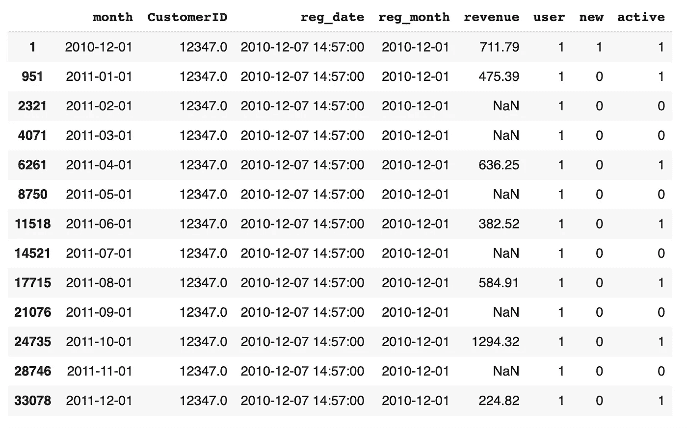
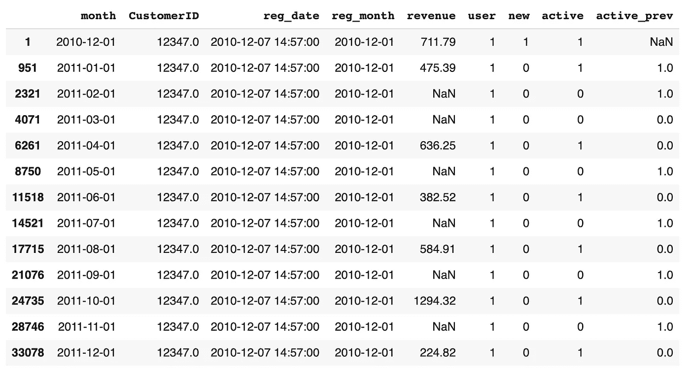
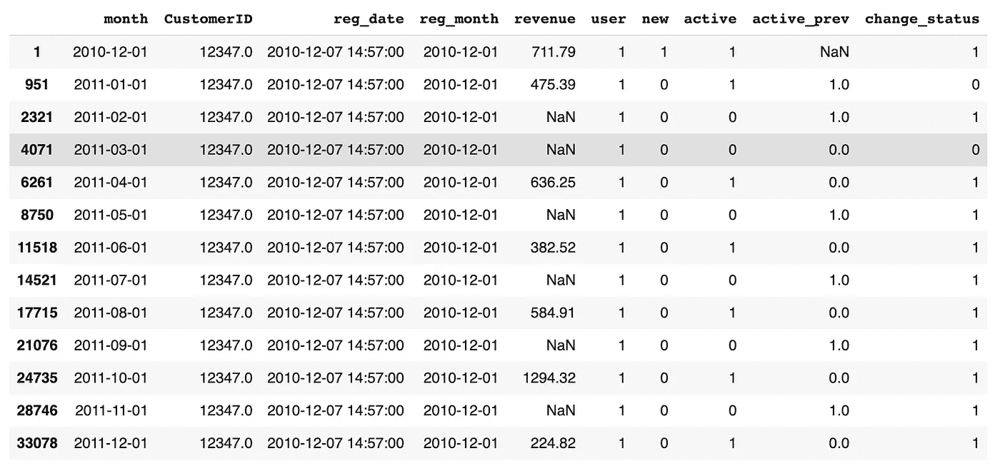
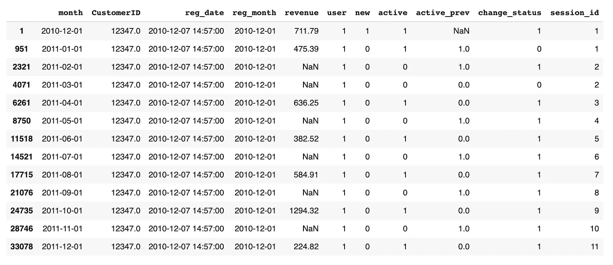
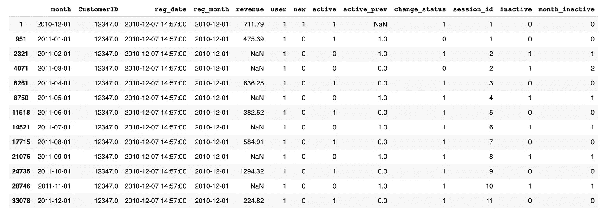
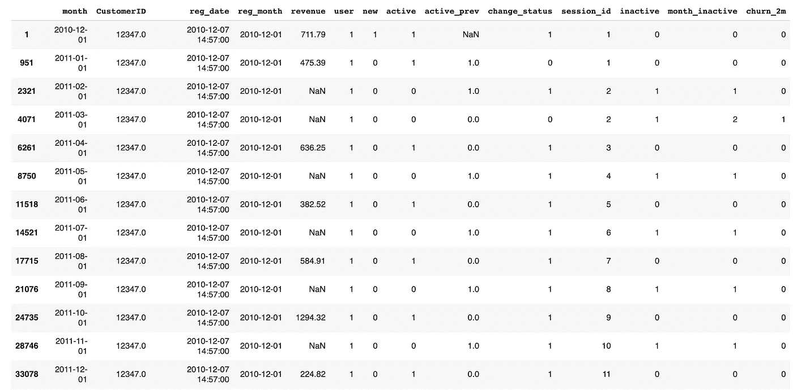
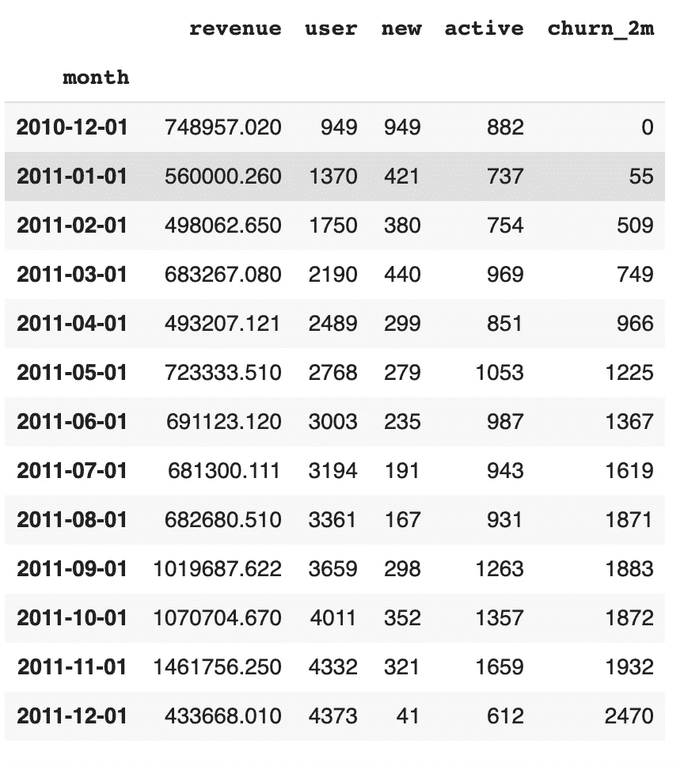
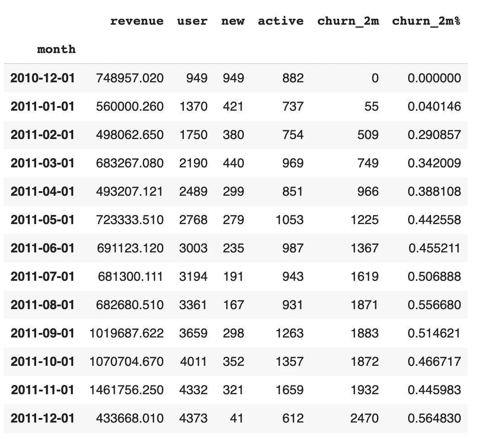

# 熊猫的流失报告

> 原文：<https://medium.com/analytics-vidhya/churn-report-in-pandas-94a461e50014?source=collection_archive---------6----------------------->

这是我在熊猫帖子中的[销售报告的延续，它从其中的最终表格开始。这是给一个随机顾客的。](/analytics-vidhya/sales-report-in-pandas-c4ef777cc490)

```
report[report['CustomerID'] == 12347.0]
```



它表示该特定客户在整个可用日期范围内的活动，按月汇总。可以看出这个活动并不规律。

首先，我想添加一个标志，表明客户在上个月是否活跃。

```
report['active_prev'] = (report.sort_values(by=['month'], ascending=True)
.groupby(['CustomerID'])['active'].shift(1))
```

这个硬东西有点像 sql 中的窗口函数。因为我有很多顾客，所以我必须以某种方式对熊猫说，它们应该被分开对待，这就是 groupby 的目的。我也希望月份是有序的，这就是 sort_values 的作用。最后，shift 给出前一行的值(在本例中为月份)。检查一下。

```
report[report['CustomerID'] == 12347.0]
```



正确。将活动列与 active_prev 进行比较。现在，我想了解客户何时从活跃变为不活跃，反之亦然。

```
report['change_status'] = (report['active'] != report['active_prev']) * 1report[report['CustomerID'] == 12347.0]
```



看起来不错。接下来，我想为每个状态更改分配某种 id。这里有一个非常巧妙的累积求和技巧。查看 change_status 列。如果我对这一列执行累积求和，那么每当用户改变状态时，我都会得到一个增量。这就是我想要的。我再次使用这个可怕的结构，因为我想让熊猫分别对待每个用户。



太完美了。查找 id 为 2 的会话。您能看出这是客户两个月没有活动的会话吗？现在，我可以合计每个用户和每个会话的非活动月数。

```
report['inactive'] = (report['active'] == 0) * 1report['month_inactive'] = (report.sort_values(by=['month'], ascending=True)
.groupby(['CustomerID','session_id'])['inactive'].cumsum())report[report['CustomerID'] == 12347.0]
```



看第四排。在 month_inactive 列中，我们得到客户不活动的正确月数。用你的眼睛检查一下。而且对整个表都是正确的)。

现在让我们来计算度量。Say 两个月或更长时间处于流失状态的用户数量。

```
report['churn_2m'] = (report['month_inactive'] >= 2) * 1report[report['CustomerID'] == 12347.0]
```



看起来不错。现在 groupby 每月获取所有客户的信息。

```
t = report.groupby('month')[['revenue','user','new','active','churn_2m']].agg('sum')t
```



你也可能想得到 10%的分数.分母的选择取决于你制造客户的方法。在这里，我将只使用每个月的当前用户数。但它可能是上个月甚至第二个月的用户数，因为我们测量的是两个月的客户流失。

```
t['churn_2m%'] = t['churn_2m'] / t['user']t
```



多酷啊。)

下面是 Colab 笔记本整个项目(销售+流失)[https://Colab . research . Google . com/drive/1 twivvdubavto 2 aiwbbdlfeupvf 74 pwu-# scroll to = 2s C3 zrxjrj 8 c](https://colab.research.google.com/drive/1TwivVdUbavTO2aIWBBDlFEUPvF74PwU-#scrollTo=2sC3zrxjRj8c)

感谢您的阅读。也可以在 https://www.glebmikhaylov.com/的[和我的 YouTube 频道](https://www.glebmikhaylov.com/)[https://www.youtube.com/channel/UCLdAnxmoGVySnh691CwDz9Q](https://www.youtube.com/channel/UCLdAnxmoGVySnh691CwDz9Q)找到我。