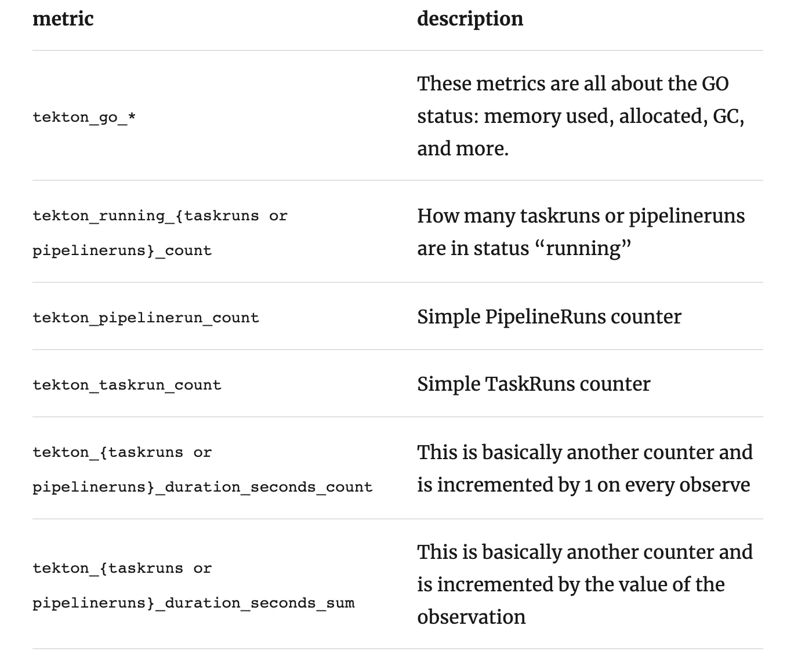

# CI/CD 可观察性:泰克顿+普罗米修斯

> 原文：<https://medium.com/analytics-vidhya/ci-cd-observability-tekton-prometheus-471606dcb564?source=collection_archive---------13----------------------->

2020 年 8 月 11 日
( *原载于*[*https://ish-ar . io*](https://ish-ar.io/tekton-and-prometheus/)*。)*


亲爱的读者们，你们好，

今天的文章是关于我用 Tekton CI/CD + Prometheus 做的一些实验。

持续集成和部署正变得越来越热门——每个人都想要 100%自动化的、完美的、快速的代码集成和部署。

但是一个团队或一家公司如何才能做到这一点呢？

**通常**是一个循序渐进的过程，而不是一个现成的安装解决方案(如果有，请告诉我！！；) ).

因此，指标将帮助您跟踪 CI/CD 的改进，并了解需要调整的内容。

幸运的是，如果您使用的是 **Tekton** ，默认情况下会有一些非常有用的指标。

老实说，我找不到足够的关于 Tekton 公开的指标的文档。然而，经过几次实验，我列出了(在我看来)最有价值的指标。

我准备的演示使用 Prometheus 作为后端来收集和显示指标，但是注意其他后端(比如 StackDriver/Cloud Monitoring)也是受支持的。

# Tekton CI/CD:有用的指标



# Tekton 的一些有用的 PromQL 表达式:

## 管道运行持续时间

```
tekton_pipelinerun_duration_seconds_sum{pipelinerun="app-ci-run-bzl48"} / tekton_pipelinerun_duration_seconds_count{pipelinerun="app-ci-run-bzl48"}
```

## 管道运行持续时间趋势

*如果管道开始显示持续时间增加的趋势，该值也将增加。*

```
rate(tekton_pipelinerun_duration_seconds_sum{pipelinerun="xxx"}[5m]) / rate(tekton_pipelinerun_duration_seconds_count{pipelinerun="xxx"}[5m])
```

## 检查管道运行故障

*如果超过 15%的管道运行出现故障，本规则将适用*

```
tekton_pipelinerun_count{status="failed"} * 100 / ignoring(status) tekton_pipelinerun_count{status="success"} > 15
```

## 检查任务运行失败

*如果超过 15%的任务运行失败，该规则将适用*

```
tekton_taskrun_count{status="failed"} * 100 / ignoring(status) tekton_taskrun_count{status="success"} > 15
```

## 监控 Tekton 控制器

以下两个指标更有可能暴露与 K8s 而非 Tekton 相关的问题:

```
tekton_workqueue_adds_total -> *It's the number of required actions per unit time. A high value could indicate problems in the cluster of some of the nodes.* tekton_workqueue_depth -> *It's the number of actions waiting in the queue to be performed. It should remain in low values.*
```

这些都是非常基本的例子，你还可以用这些指标做其他很酷的事情。例如，您可以监控一个项目中分配了多少 pods/资源，用户在重试上浪费了多少时间，在延迟、pods 延迟、工作队列等方面浪费了多少秒！

在我看来，测量管道是每个想要转向数据驱动思维的公司都应该做的事情。

# 如何设置 Tekton 使用 Prometheus

如前所述，Tekton 自带 Prometheus 作为默认后端。用户只需确保 Tekton 配置上启用了指标。

在安装 Tekton 管道控制器的名称空间中，有一个名为“observability”或“tekton…-observability”的配置映射。在 configmap 中，有一个配置，Knative/Tekton 控制器将使用它来公开指标。

这里解释一下可观测性配置:[https://github . com/tektoncd/pipeline/blob/EDC 453934 a 183d 44 FDE 739 DC 24 D6 ca 6b 25 CDE 6b/config/config-observability . YAML](https://github.com/tektoncd/pipeline/blob/edc453934a183d44fde739dc24d6ca6b25cdeb6b/config/config-observability.yaml)

一旦配置了 Tekton，唯一缺少的是相关的服务监视器，它允许 Prometheus 操作者收集暴露的指标！

服务监视器配置应该如下所示:

```
apiVersion: monitoring.coreos.com/v1
kind: ServiceMonitor
metadata:
  annotations:
    meta.helm.sh/release-name: prometheus-operator-1595779515-custom-sm
    meta.helm.sh/release-namespace: tekton-demo
  generation: 1
  labels:
    app: prometheus-operator-tekton-pipeline-controller
    app.kubernetes.io/managed-by: Helm
    chart: prometheus-operator-8.15.6
    heritage: Helm
    release: prometheus-operator-1595779515
  name: prometheus-operator-159577-tekton-pipeline-controller
  namespace: tekton-demo
spec:
  selector:
    matchLabels:
      app.kubernetes.io/instance: tekton-pipeline-1593528871
      app.kubernetes.io/component: controller
  endpoints:
  - port: metrics
    path: /metrics
    interval: 15s
```

以上就是我的全部内容，希望你喜欢今天的文章:)

干杯！