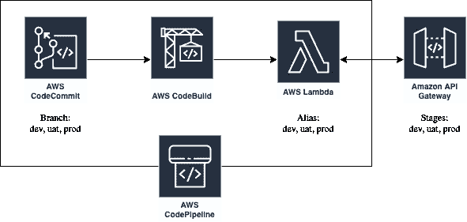

# 使用 AWS 代码管道将 CI/CD 转换为 Lambda 函数

> 原文：<https://medium.com/analytics-vidhya/ci-cd-to-lambda-function-using-aws-code-pipeline-87b8098c1a8c?source=collection_archive---------12----------------------->

在这篇博文中，我将为您提供一个快速指南，告诉您如何建立一个自动化的部署管道，将 Lambda 映射的不同别名的更改推送到不同的开发阶段。

**先决条件**:我们将用于部署的 lambda 函数和 API 网关，将不同的阶段映射到 Lambda 函数的不同别名。

我们将使用的组件:



1.  **代码提交** —触发源(branch — dev，uat，prod)，包含代码构建所需的构建文件。
2.  **代码构建** —运行 **buildspec.yml** 文件中的指令，创建 lambda 部署包并更新 Lambda 代码，发布新版本，然后更新指向该版本的 Alias。我们在不同的开发阶段使用不同的别名(开发、用户验收测试、生产)
3.  **AWS Lambda** —用于部署的 Lambda 功能。
4.  **代码管道** —将 1、2、3 打包在一起。
5.  **API 网关** —我们 lambda 函数的接口。API gateway 中的不同阶段(dev、uat、prod)指向我们的 Lambda 函数的不同别名。

我们为每个阶段(开发、用户验收测试、生产)创建不同的管道。管道的来源是代码提交存储库，分支指向包含该阶段代码的存储库。

然后，我们使用 standard:2.0 Linux 环境添加代码构建模块。我们还在这里添加了 STAGE 环境变量，并提供了构建 YAML 文件的参考路径。这里最重要的组件是构建文件" **buildspec.yml"** ，该文件包含代码构建环境运行的所有指令。在我们的示例中，它包含以下指令…

1.  安装应用程序所需的依赖项。

```
python3 -m pip install --target ./package -r requirements.txt
```

2.打包源代码和依赖项，并创建 Lambda 部署包。

```
zip -r9 function.zip package api
```

3.更新 lambda 函数代码。该命令为每次更新返回一个唯一的哈希代码，该哈希代码在创建新版本时使用。这里 **my_lambda_function** 是部署的 lambda 函数的名称。

```
CODE_SHA_256=$(aws lambda update-function-code --function-name my_lambda_function --zip-file fileb://function.zip --query CodeSha256 --output text)
```

点击阅读更多关于 AWS lambda 命令行选项的信息:

4.发布新版本。传递更新的哈希代码，以验证自我们更新以来代码没有发生更改。如果最新的发布代码与我们推送的不同，这将引发一个错误，构建将会失败。

```
FUNCTION_VERSION=$(aws lambda publish-version --function-name my_lambda_function --code-sha256 $CODE_SHA_256 --query Version --output text)
```

5.用版本更新阶段别名。将**阶段变量设置为代码构建环境变量**，并引用我们要更新的别名。

```
RESPONSE=$(aws lambda update-alias --function-name my_lambda_function --name $STAGE --function-version $FUNCTION_VERSION --output text)
```

以下是完整的代码:

buildspec.yml

AWS lambda 命令行返回多个参数。我们通过使用**查询**参数过滤结果，它只返回我们感兴趣的参数。此外，AWS 命令行工具通常以字典的形式返回结果，我们通过在命令行中设置**输出**标志来更改它，对于我们的例子，我们希望它是文本格式的，这在后续指令中易于处理和使用。

最后，通过将提交推送到分支来触发管道。

这里我们没有在管道中使用单独的部署模块，因为这只是在构建阶段使用 AWS 命令行完成的。