# CICD 管道:从 Jupyter 笔记本到 AWS Sagemaker 端点

> 原文：<https://medium.com/analytics-vidhya/cicd-pipeline-from-jupiter-notebook-to-aws-sagemaker-endpoint-e56f40ec2a2f?source=collection_archive---------3----------------------->

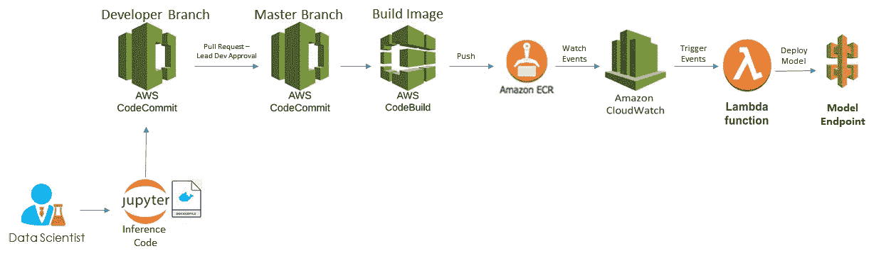

在这篇文章中，我将介绍如何在 AWS 中构建一个 CICD 管道来部署机器学习模型。为了构建 CICD 管道，我使用了 AWS 代码提交(代码库)和 CodeBuild、CloudWatch、ECR、Lambda。

我将把这个过程分成 3 个步骤。

步骤 1:创建一个 CodeCommit 存储库，并与 Sagemaker Jupyter 笔记本集成。

步骤 2:集成 CodeCommit 以触发 CodeBuild 项目，该项目构建 Docker 映像并将其推送到 ECR 存储库。

第三步:Lambda 函数创建一个 Sagemaker 端点。

**第一步:创建一个 CodeCommit 存储库，并与 Sagemaker Jupyter 笔记本集成。**

在 CodeCommit 中创建一个存储库，从本地将推理代码、nginx.conf、serve、wsgi.py 以及 dockerfile 推送到 CodeCommit。

代码:[https://github . com/NareshReddyy/Sagemaker _ deploy _ own _ model . git](https://github.com/NareshReddyy/Sagemaker_deploy_own_model.git)

你可以参考这篇关于[如何在 Sagemaker](/@lee.naresh962/deploy-your-own-model-with-aws-sagemaker-55b4234be4a) 上部署自己的模型的文章。

现在使用 Sagemaker Notebook Git repositories 设置将 Sagemaker Notebook 与 CodeCommit 集成，您可以选择使用 GitHub 来代替 CodeCommit。

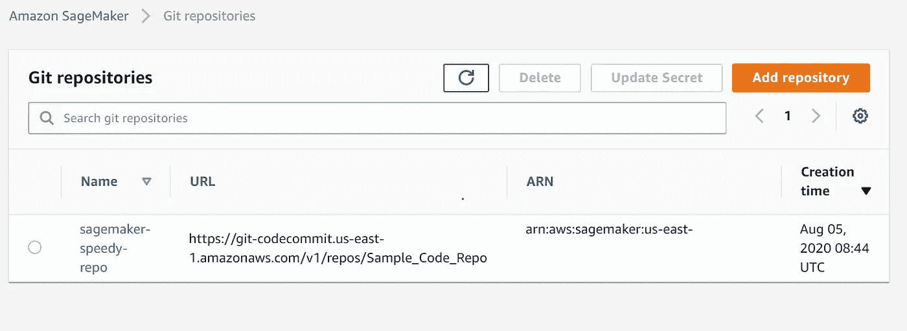

**步骤 2:集成 CodeCommit 以触发 CodeBuild 项目，该项目构建 Docker 映像并将其推送到 ECR 存储库。**

将代码推送到 CodeCommit 存储库之后，创建一个 CodeBuild 项目。

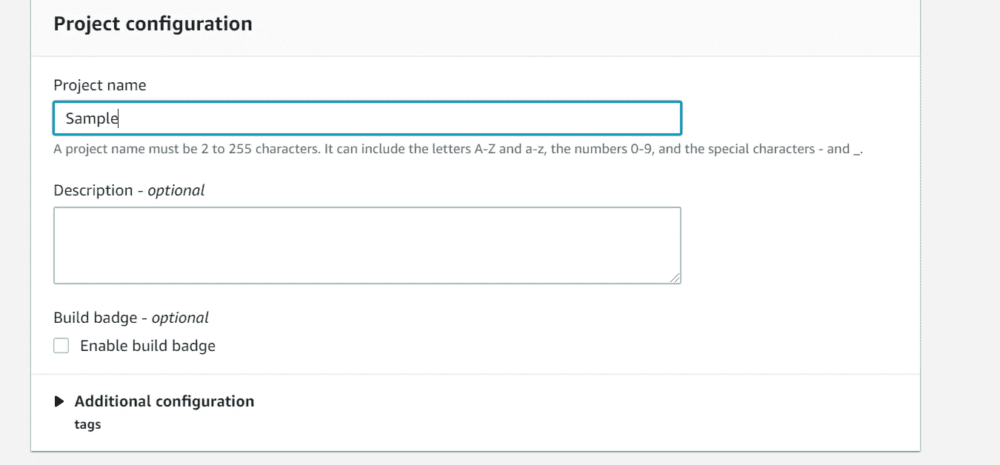

选择包含源代码的 CodeCommit 存储库。

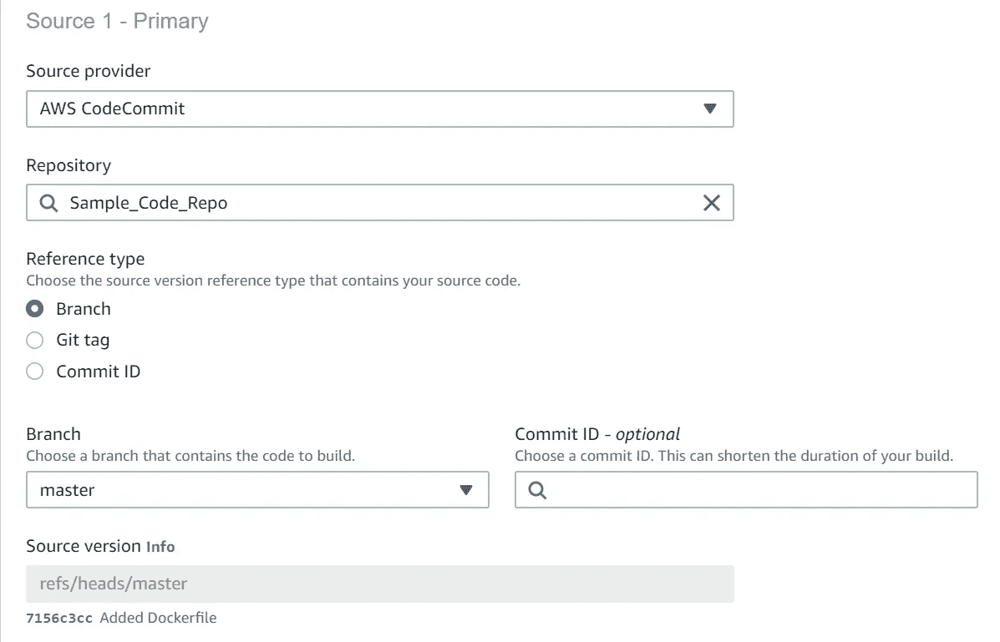

当您调用 AWS CodeBuild 来运行构建时，您必须提供有关构建环境的信息，构建环境表示操作系统、编程语言运行时和 CodeBuild 用来运行构建的工具的组合。

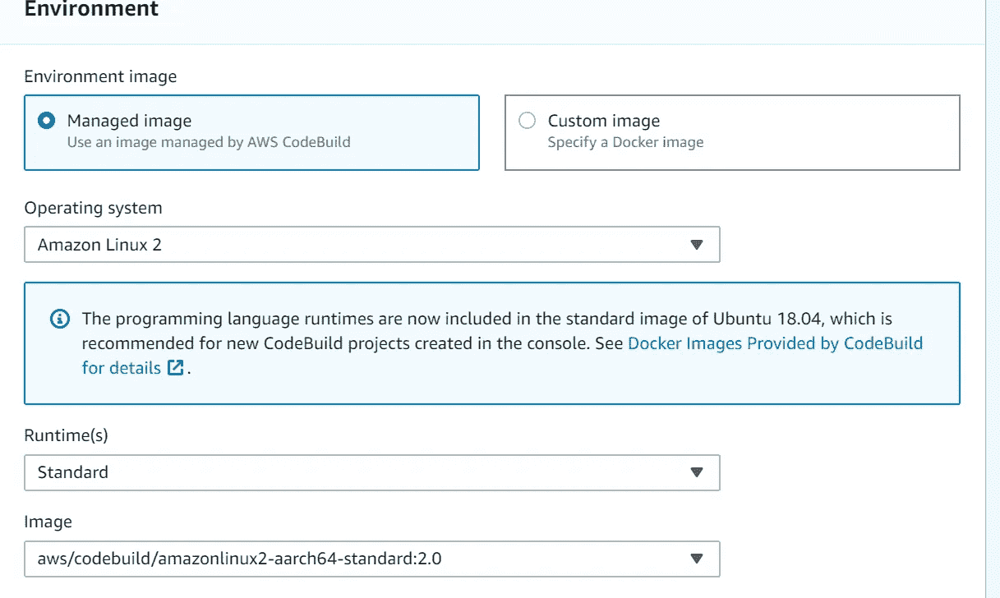

创建一个 buildspec 文件，CodeBuild 使用该文件运行生成，其中包含生成命令和相关设置。创建 buildspec.yml，并将其保存在 CodeCommit 存储库中的根(顶层)目录中。

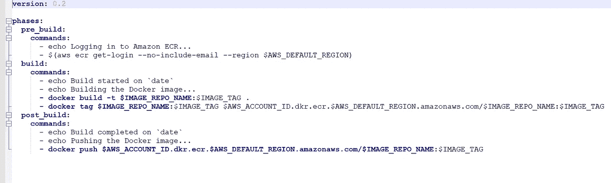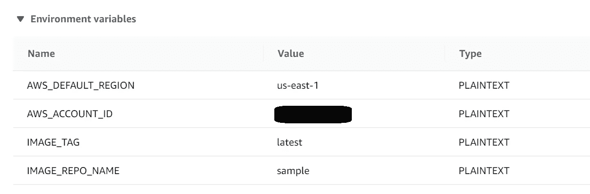

buildspec 文件的环境变量

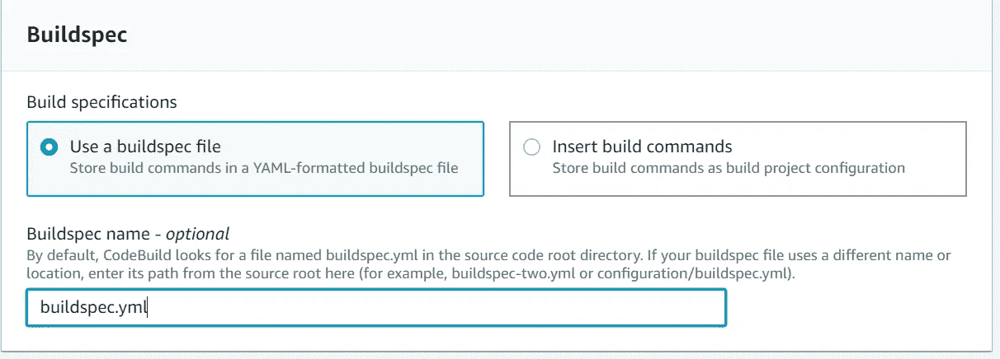

每当有人提交到 CodeCommit 存储库时，创建一个 Lambda function add 事件来启动 CodeBuild 中的构建。

在触发器配置中，选择要配置触发器的代码库、事件、分支，并在自定义数据中传递 CodeBuild 项目名称。

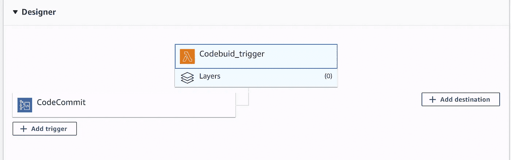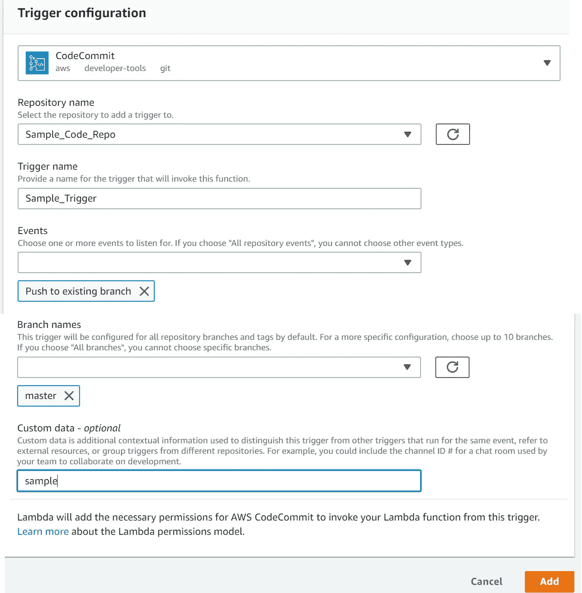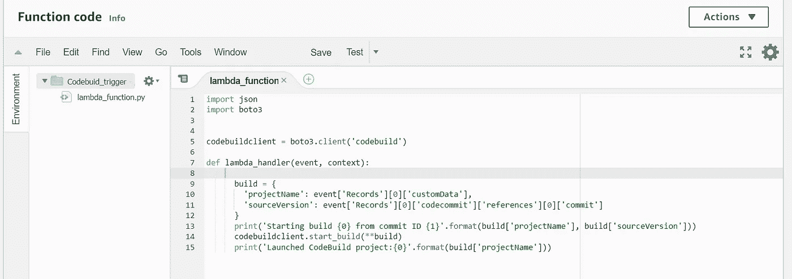

**步骤 3:创建 Sagemaker 端点的 Lambda 函数。**

创建一个 lambda 函数，使用来自 CloudWatch 规则的触发器创建 Sagemaker 端点，其中任何对 ECR 存储库的提交都会触发 lambda。

为了创建 Sagemaker 端点，您需要创建 Sagemaker 端点配置、模型。

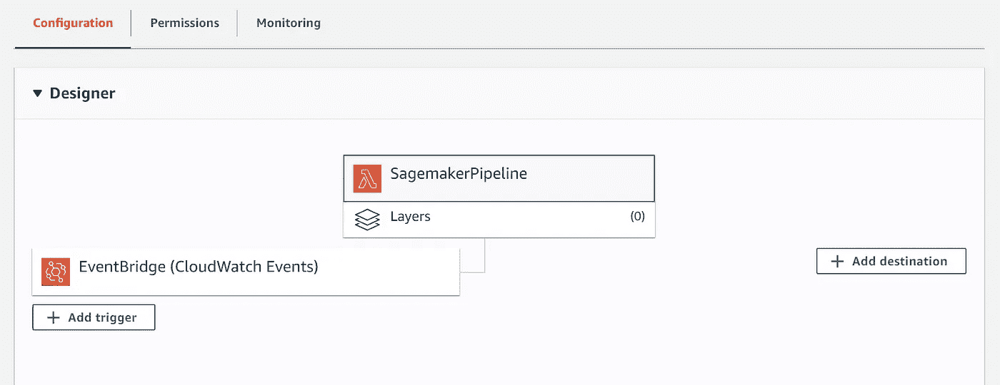

还可以使用 CloudFormation，也就是 IaC(Infrastructure as Code)来部署代码，创建 Sagemaker 端点。

请评论可能的改进和建议。