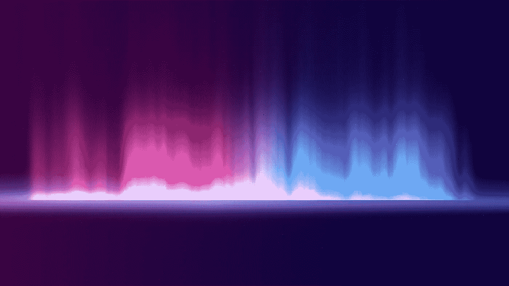

# 圆形旋转渐变环-Swift & XCode

> 原文：<https://medium.com/analytics-vidhya/circular-rotating-gradient-ring-swift-xcode-f3e48c38b5ba?source=collection_archive---------13----------------------->

## 在任何圆形视图周围添加旋转渐变环—快速



## 先决条件

对 Swift 和 iOS 开发的基本了解。

## 跳进来

一个独特的简单风格可以让你的应用程序脱颖而出，并增加一个不错的感觉。正确使用渐变可能正是增加用户界面趣味所需要的！让我们开始吧。

## 添加一些视图

我们需要一个 UIView 和一个 UIImageView。把这两块加起来。给他们起任何你喜欢的名字。我选择了 profilePhotoRingView 和 profilePhoto。不过，请确保使用您自己的图像名称。随着应用程序的扩展和越来越多的开发人员加入团队，明确命名约定将会有很大的帮助！

```
lazy var profilePhotoRingView : UIView = {let oli = UIView()oli.translatesAutoresizingMaskIntoConstraints = falseoli.backgroundColor = .clearoli.isUserInteractionEnabled = trueoli.clipsToBounds = trueoli.layer.masksToBounds = truereturn oli}()lazy var profilePhoto : UIImageView = {let oli = UIImageView()let image = UIImage(named : "demo_wall")?.withRenderingMode(.alwaysOriginal)oli.image = imageoli.translatesAutoresizingMaskIntoConstraints = falseoli.backgroundColor = UIColor .whiteoli.contentMode = .scaleAspectFilloli.layer.masksToBounds = trueoli.layer.borderColor =  UIColor .white.cgColoroli.layer.borderWidth = 1.5oli.isUserInteractionEnabled = truereturn oli}()
```

## 添加和约束

首先添加 profilePhotoRingView，使其出现在 profilePhoto 下。在 viewDidLoad 中调用 addViews 函数。

```
func addViews() {self.view.addSubview(profilePhotoRingView)self.view.addSubview(profilePhoto) self.profilePhotoRingView.centerYAnchor.constraint(equalTo: self.view.centerYAnchor, constant: 0).isActive = trueself.profilePhotoRingView.centerXAnchor.constraint(equalTo: self.view.centerXAnchor, constant: 0).isActive = trueself.profilePhotoRingView.heightAnchor.constraint(equalToConstant: 50).isActive = trueself.profilePhotoRingView.widthAnchor.constraint(equalToConstant: 50).isActive = trueself.profilePhotoRingView.layer.cornerRadius = 25self.profilePhoto.centerYAnchor.constraint(equalTo: self.profilePhotoRingView.centerYAnchor, constant: 0).isActive = trueself.profilePhoto.centerXAnchor.constraint(equalTo: self.profilePhotoRingView.centerXAnchor, constant: 0).isActive = trueself.profilePhoto.heightAnchor.constraint(equalToConstant: 48).isActive = trueself.profilePhoto.widthAnchor.constraint(equalToConstant: 48).isActive = trueself.profilePhoto.layer.cornerRadius = 24}
```

## 渐变设置

添加 gradientLayer 变量和一个布尔值来控制 viewDidLayoutSubviews()。

```
var gradientLayer: CAGradientLayer!var hasViewBeenLaidOut : Bool = false
```

添加 handleGradientLayer 函数。

```
func handleGradientLayer() {self.gradientLayer = CAGradientLayer()self.gradientLayer.frame = profilePhotoRingView.boundsself.gradientLayer.startPoint = CGPoint(x: 0.5, y: 0.0)self.gradientLayer.endPoint = CGPoint(x: 0.5, y: 1.0)self.gradientLayer.colors = [UIColor .blue.withAlphaComponent(1.0).cgColor,UIColor .blue.withAlphaComponent(0.9).cgColor,UIColor .blue.withAlphaComponent(0.8).cgColor,UIColor .blue.withAlphaComponent(0.7).cgColor,UIColor .orange.withAlphaComponent(0.6).cgColor,UIColor .orange.withAlphaComponent(0.5).cgColor,UIColor .orange.withAlphaComponent(0.4).cgColor,UIColor .orange.withAlphaComponent(0.3).cgColor,UIColor .orange.withAlphaComponent(0.2).cgColor,UIColor .orange.withAlphaComponent(0.1).cgColor]self.profilePhotoRingView.layer.addSublayer(self.gradientLayer)self.addGradientRingRotation()}
```

为什么这么多颜色？！这允许在渐变的顶部有下降的淡入淡出效果，非常酷！这里有一个错误，让我们添加 addGradientRingRotation 函数。首先，添加 CAAnimationDelegate 协议。

```
func addGradientRingRotation() {let fullRotation = CABasicAnimation(keyPath: "transform.rotation")fullRotation.delegate = selffullRotation.fromValue = NSNumber(floatLiteral: 0)fullRotation.toValue = NSNumber(floatLiteral: Double(CGFloat.pi * 2))fullRotation.duration = 3.0fullRotation.repeatCount = Float.infinityfullRotation.isRemovedOnCompletion = falseprofilePhotoRingView.layer.add(fullRotation, forKey: "360")}
```

轻松右转！现在，如果您退出应用程序并返回，isRemovedOnCompletion 将确保您的渐变保持旋转——这只是一种可能的实现。

最后，让我们将 handleGradientLayer 函数添加到 viewDidLayoutSubviews()中。

```
override func viewDidLayoutSubviews() {super.viewDidLayoutSubviews()if self.hasViewBeenLaidOut == false {self.handleGradientLayer()self.hasViewBeenLaidOut = true}}
```

就是这样！现在看你的梯度旋转在她所有的荣耀！请随意调整渐变的持续时间和 alpha 值，以获得您想要的精确效果！如果你想看到更多的渐变实现，请在下面的评论中告诉我！