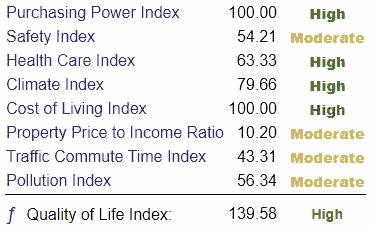

# 基于 Python 的城市推荐系统[第 2/3 部分]:EDA——寻找我的 Schitt’s Creek

> 原文：<https://medium.com/analytics-vidhya/city-recommender-system-with-python-part-2-finding-my-schitts-creek-da2f2cce2b5f?source=collection_archive---------18----------------------->

还记得我们的问题吗？我们正试图为美国的城市创建一个推荐系统！为什么？为了更好地通知人们他们应该考虑在哪个城市工作，或者出于任何原因搬到哪个城市！

在这一部分中，我们简要探讨一下在[第 1 部分](/@melulfrescoelias/city-recommender-system-with-python-part-1-finding-my-schitts-creek-f362646280b3)中搜集的数据。

# 探索性数据分析

**关于天气数据**

天气数据的表现和我们预期的一样。为了可视化这样的逻辑，在应用了 Elbow 方法来估计聚类数之后，我对数据进行了规范化，并使用 KMeans 对其进行了聚类。我还对数据使用了凝聚聚类和 DBSCAN 然而，知识分子似乎拥有最明显的*正确性*。

我们首先定义一个函数来绘制 elbow 方法并返回规范化的数组。*注意，该函数假设分类变量(或索引)名为 City。请随意更改和修改此功能！*

```
def elbow_kmeans_city(data, maxRange = 10):
    try:
        X_w = data.drop('City',1)
        X_w = MinMaxScaler().fit_transform(X_w)
    except:
        X_w = MinMaxScaler().fit_transform(data) Error =[]
    for i in range(1, maxRange+1):
        kmeans = KMeans(n_clusters = i).fit(X_w)
        kmeans.fit(X_w)
        Error.append(kmeans.inertia_) plt.plot(range(1, maxRange+1), Error)
    plt.title('Elbow method')
    plt.xlabel('No of clusters')
    plt.ylabel('Error')
    plt.show()

    return(X_w)
```


图 1:天气数据中的肘方法(左)，场馆数据中的肘方法

理想情况下，这种方法将显示出明显的'*'肘'*-即误差减少的突然、剧烈变化，使得添加集群的边际效益急剧降低。图 1 的右图显示了 4 处的清晰肘部。但是天气数据没有明确的*弯头*(图 1 左侧)。我决定应用 5 个集群。现在，让我们聚集和绘制数据！

为此，我创建了这个函数。它需要规范化数组(nor MDF——*elbow _ k means _ city*函数的输出)、聚类数(k)、原始数据帧(regDF——在 *elbow_kmeans_city* 函数中使用)以及包含纬度(lat)、经度(lng)和城市名称(CityName，STATE——即。纽约州纽约市)，你可以在这里下载。

```
def Map_KMeans(normDF, k, regDF, citiesLatLong):
    w_mod = KMeans(n_clusters=k).fit(normDF)
    temp_df = regDF
    try:
        temp_df = temp_df.drop('Clusters',1)
    except:
        pass

    temp_df.insert(0,'Clusters',w_mod.labels_)

    temp_df = temp_df.merge(citiesLatLong, how='inner',on='City')

    map_clusters = folium.Map(location=[37.0902,-95.7129], zoom_start=4)# set color scheme for the clusters
    x = np.arange(k)
    ys = [i + x + (i*x)**2 for i in range(k)]
    colors_array = cm.rainbow(np.linspace(0, 1, len(ys)))
    rainbow = [colors.rgb2hex(i) for i in colors_array]# add markers to the map
    markers_colors = []
    for lat, lon, poi, cluster in zip(temp_df.lat, temp_df.lng, temp_df.City, temp_df['Clusters']):
        label = folium.Popup(str(poi) + ' Cluster ' + str(cluster), parse_html=True)
        folium.CircleMarker(
            [lat, lon],
            radius=4,
            popup=label,
            color=rainbow[cluster-1],
            fill=True,
            fill_color=rainbow[cluster-1],
            fill_opacity=0.7).add_to(map_clusters)return map_clusters, temp_df
```


图 2:美国的天气集群

哇！看起来很合适。

*   橙色—寒冷的冬天，潮湿的大陆城市(包括阿拉斯加，未显示)
*   红色——温暖潮湿的亚热带城市
*   绿色——内陆、大摇摆、半干旱城市
*   蓝色——温暖干旱的城市
*   紫色——温和的夏季和冬季，年降水量丰富(海洋性西海岸气候)

定义好这些函数后，让我们将社会经济数据聚类的结果可视化吧！

**关于社会经济数据**

由于收集数字中的指数有困难，我们失去了大部分为场地和天气数据列出的小城镇。尽管如此，它包括美国的 600 多个地方，包括大多数(如果不是全部的话)人口超过 10 万的大都市地区和城市。


图 3:美国的一般社会经济数据集群

从上面的地图中可以看出两件事。紫色圆点代表 MSA，橙色代表贫困率高的高生活质量城市。


图 4:放大到纽约的罗切斯特和锡拉丘兹

我们将看看一些例子，包括锡拉丘兹、罗切斯特和哈里斯堡(橙色)，以及纽约和匹兹堡(紫色)。


图 5:纽约州锡拉丘兹、纽约州罗切斯特、宾夕法尼亚州哈里斯堡(橙色)

低安全指数是橙色集群的常见分子。然而，让我们记住还有 20 多个变量包含在这个模型中，所以这可能*没有显示出全貌*！



图 6:纽约州纽约市和宾夕法尼亚州匹兹堡市(紫色)

这种情况主要包括管理事务协议。那些不属于管理服务协议和中等/高生活费用的国家，由于对收集的数据进行插补，可能是异常值。这一群，紫色，显然有很高的购买力，但中等偏高的生活费用指数。然而，如前所述，还包括 20 多个变量！

**关于场馆数据**


这张帕累托图显示了我们数据集中排名前 30 位的场所类型(600+中),显示了美国对快餐店、披萨店、美式餐厅和三明治店的高度重视。根据城市的贫困程度和规模，你预计这些类型的餐厅在每个城市的前 100 名中会出现得更多还是更少？


图 8:排名前 100 的顶级场馆

绿点主要代表 MSA，我们认为它描绘了与美国大多数大陆城镇不同的文化特征。我们还看到，与国家东部的红色和紫色圆点密度相比，国家西部的蓝色圆点密度更大。

这里有什么好玩的？这张图*证实了*每个城市排名前 100 的受评场馆在不同的城市和不同类型的城市中是不同的。这可能表明，基于城市的文化背景和经济(或迁移)状况，饮食和活动习惯有显著差异。

# 关于数据的注释

值得一提的是，数据是根据每个变量的分布进行转换的。我这样做是为了防止建模过程中的多重共线性。但是为什么我们在创建推荐系统之前要对数据建模呢？

# 建模

如果我们在没有事先建模的情况下使用推荐系统中的所有变量(这是由余弦相似性驱动的——在第 3 部分中有更多这方面的内容),我们将为数据的每个特征赋予相等的归一化权重。换句话说，两个向量(输入、可能的推荐)的点积将对每个变量进行同等加权。然而，你可能已经意识到，我们(人们)更关心我们的收入，而不是城市里披萨店的频率！因此，我们必须回归我们的数据，以确定每个特征的权重(系数)……但是基于什么呢？我们的因变量应该是什么！？

我首先考虑做一个接近购买力的指标——中值房产价值除以中值家庭收入。但是这个*‘值’*指标，效果并不好。我迭代了不同的模型并测试了它们...你猜怎么着？看起来表现最好的模型回归了*家庭收入中位数*！

因此，我使用了岭回归——由于变量的多重共线性仍然存在——家庭收入中位数的标准化变量，并将返回的系数乘以数据框！

厉害！现在，我们已经有了经过缩放的[数据](https://s3.us-east-2.amazonaws.com/www.findingmyschittscreek.com/Data/normalized_df_sub.csv)，可以构建推荐系统了！

# Github 和数据链接

1.  [EDA 笔记本](https://github.com/eliasmelul/finding_schitts/blob/master/EDA_FMSC.ipynb) — [直接数据下载](https://s3.us-east-2.amazonaws.com/www.findingmyschittscreek.com/Data/allDataCombined.csv)
2.  [建模笔记本](https://github.com/eliasmelul/finding_schitts/blob/master/modeling_LM_FMSC.ipynb) — [直接数据下载](https://s3.us-east-2.amazonaws.com/www.findingmyschittscreek.com/Data/normalized_df_sub.csv)