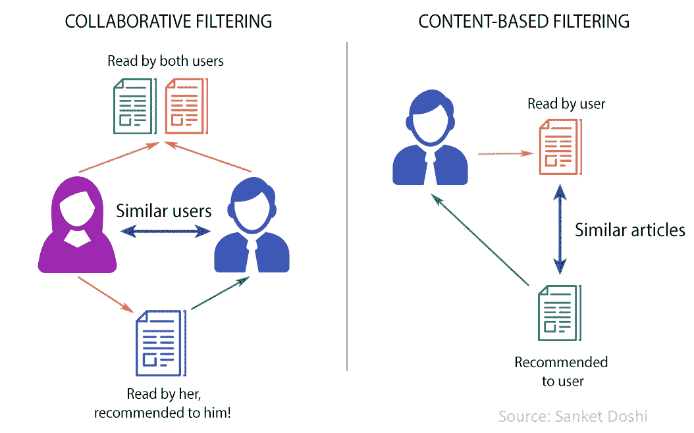
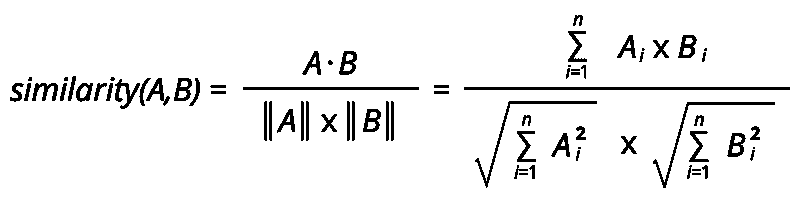
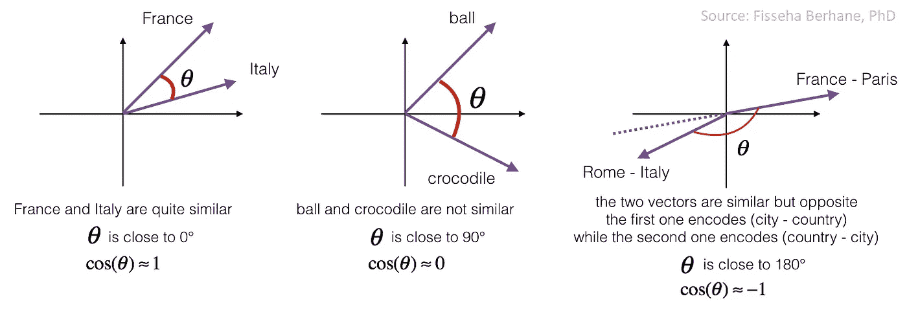
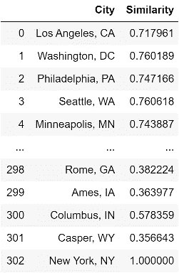
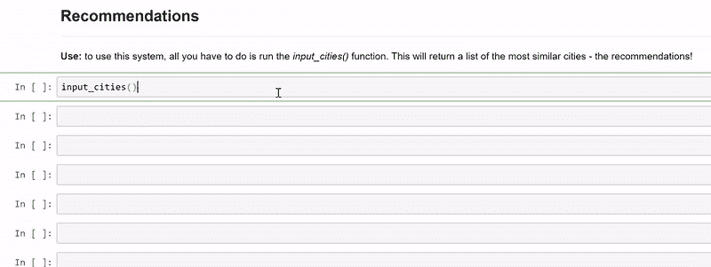
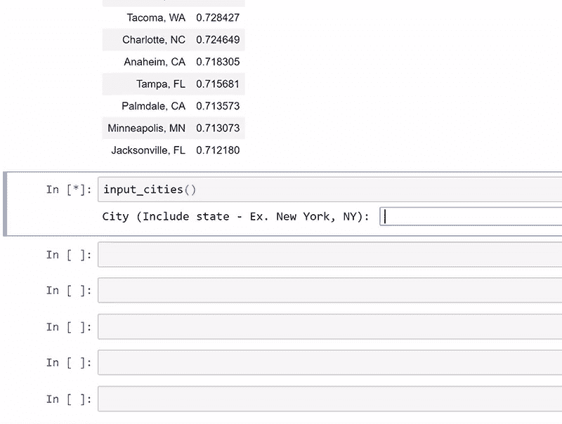
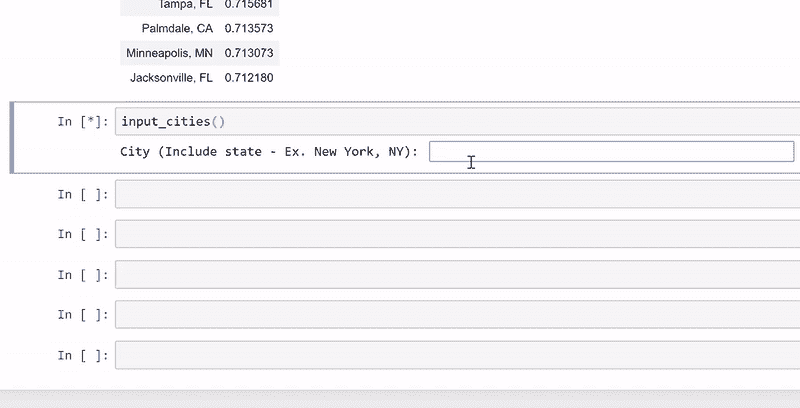
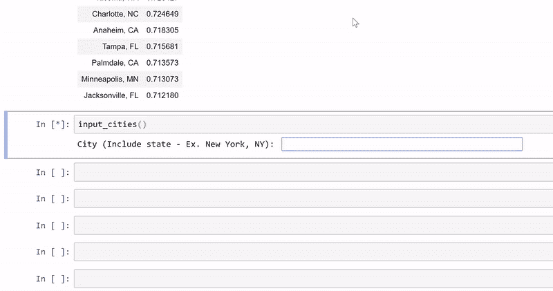
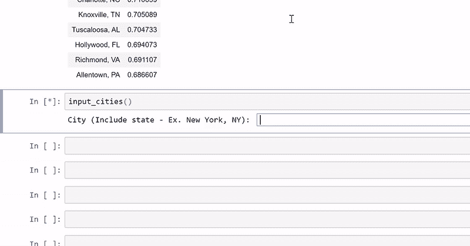
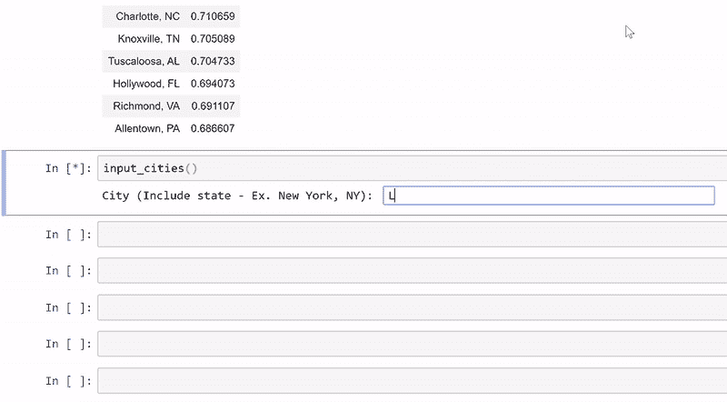

# 基于 Python 的城市推荐系统[第 3/3 部分]:部署——寻找我的 Schitt's Creek

> 原文：<https://medium.com/analytics-vidhya/city-recommender-system-with-python-part-3-3-deployment-finding-my-schitts-creek-2019971e2c4d?source=collection_archive---------13----------------------->

记得我们的目标吗？我们正试图为美国的城市创建一个推荐系统！为什么？为了更好地通知人们他们应该考虑在哪个城市工作，或者出于任何原因搬到哪个城市！

在这一部分中，我解释了推荐系统如何基于在第一部分第一部分第一天收集的数据工作，这些数据后来被预处理、探索和建模——如在第二部分第三天 T2 中解释的那样——以创建最终数据文件第五天 T4。然后我会展示一些结果，并解释你如何自己使用它！

# 推荐系统——综述

有两种主要的方法来构建推荐系统——向用户推荐相关项目的系统:

1.  ***协同过滤*** :使用用户和项目之间记录的交互来产生推荐。这意味着用户的行为指示了相似用户的行为。例子:Siri 喜欢橘子和苹果(双关语)；我们知道 Alexa 喜欢橙子；因此，我们会向 Alexa 推荐苹果。
2.  ***基于内容的*** :使用关于用户和/或项目的信息，根据这些项目之间的相似性产生推荐。例子:大牛喜欢 AviciiAvicii 的音乐和马丁·盖瑞斯的相似；因此，我会向丹尼尔推荐马丁·盖瑞斯。



主要推荐方法

您可能会问自己，能否混合使用这两种系统，以便利用用户和内容输入？绝对的！混合推荐系统是公司中最常用的，可以应用多种方法，包括深度学习、剩余学习、自动编码器和受限玻尔兹曼机器！如果你想了解更多关于推荐系统的知识，请查看我的课程。

有很多协同过滤推荐系统在城市中使用，我最喜欢的关于它的文章是[这个](https://www.datarevenue.com/en-blog/building-a-city-recommender-for-nomads)(超级简单！).因此，出于城市推荐的目的，我构建了一个基于内容的推荐系统。

# 寻找我的史考特:城市推荐系统

**要求:**

*   sci kit-学习
*   熊猫

它是如何工作的？

我们的推荐系统通过计算用户输入的城市和数据帧中其余城市之间的余弦相似度来工作。用更数学的术语来说，余弦相似性是在用户向量(输入:A)和项目向量(B)之间测量的，项目向量(B)包含将为其构建向量并执行余弦相似性计算的所有项目的特征。



余弦相似性公式(矢量、代数)



余弦相似可视化

余弦相似性值被计算并以降序排序，较大的值在统计上与用户输入的城市更相似。瞧啊。你有推荐系统！

**推荐系统**

1.  我们首先输入所需的库和数据:

```
import pandas as pd
from sklearn.metrics.pairwise import cosine_similaritynorm_df = pd.read_csv('[https://s3.us-east-2.amazonaws.com/www.findingmyschittscreek.com/Data/normalized_df_sub.csv'](https://s3.us-east-2.amazonaws.com/www.findingmyschittscreek.com/Data/normalized_df_sub.csv'), index_col=0)
```

2.然后，我们定义一个函数来计算数据帧中特定城市和其余城市之间的余弦相似性。

```
def from_city_cosSim(data, name): try:
        Xs = data[data.City == name].drop('City',1)
        Col_A = data[data.City != name].City
        Ys = data[data.City != name].drop('City',1) cosSim = cosine_similarity(X=Xs,Y=Ys)
        sim = list(cosSim[0])
        cty = list(Col_A)
        comb = {"City":cty,"Similarity":sim}
        dfdf = pd.DataFrame(comb).reset_index() # Adding a row with the Y City
        currCity = {"City":name,"Similarity":1}
        curr = pd.DataFrame(currCity, index=[0]) # Concatenate to finalize DF
        dfdf = pd.concat([dfdf,curr], sort=False).reset_index(drop=True).drop('index',1)
        return(dfdf)
    except:
        print("Wrong input: this entry will be ignored")#New York, NY as an example:from_city_cosSim(norm_df,"New York, NY")
```



纽约州纽约市示例

3.然后，我们定义一个调用用户输入的函数，对每个输入的城市和数据帧中其余城市之间的余弦相似性值进行未加权平均，并返回一个数据帧，其中按降序排列了最佳推荐(默认设置为 10 个推荐)。

```
def input_cities(numShow=10):
    # create class that defines cities
    class rated_city:
        def __init__(self, city):
            self.city = city

    #Loop to input cities based on the user
    add_city = True
    userInput = []
    w = 0
    while add_city == True:
        city_name = input("City (Include state - Ex. New York, NY): ")
        userInput.append(city_name)
        simSim = from_city_cosSim(data=norm_df, name=city_name)
        try:
            cosSim = cosSim.merge(simSim, how='inner', on='City')
        except:
            cosSim = simSim

        city = rated_city(city_name)
        cont = input("Do you want to include another city?")
        add_city = cont.lower() in ['yes','true','of course','y','si','1']
        w+=1

    simCols = cosSim.drop("City",1)
    cits = cosSim.City

    for i, row in simCols.iterrows():
        simCols.at[i,'SumVal'] = row.sum()/w
    simi = simCols.SumVal

    out = {"City":cits,"Score":simi}
    out = pd.DataFrame(out).set_index("City").drop(userInput)
    out = out.sort_values('Score', ascending=False)

    return out.head(numShow)
```

厉害！我们来试试吧！

**结果:**

一次输入多少个城市没有限制。我们包括超过 300 个城市(抱歉，如果你想要的没有包括在内！).所以你可以想象有大量的结果组合可以分析。在这里，我们只讨论一些常见的建议和一些我熟悉的建议。我会在最后留一个笔记本的链接，这样你就可以试用了！



**纽约州纽约市**



**纽约州纽约市、伊利诺伊州芝加哥市和北卡罗来纳州达勒姆市**

似乎工作得很好！让我们测试一下其他城市，看看天气参数是否被恰当地捕捉到。如果我们把佛罗里达州的迈阿密放在这里，你会期待什么？佛罗里达州的迈阿密和佐治亚州的亚特兰大怎么样？



**佛罗里达州迈阿密**



**佛罗里达州迈阿密和佐治亚州亚特兰大**

当你考虑包含的数据时，这些建议是有意义的，但在佛罗里达州迈阿密的情况下，我们预计会有更多的沿海城市。因此，一种改进可以包括一个关于城市是否是沿海的二元变量，或者一个湿度测量值，因为靠近海洋和湖泊的城市往往具有较高的湿度。

非普通城市呢？推荐系统表现如何？我不是很熟悉美国的城市(因此，这个项目！！)，但我熟悉两个较小的大都市区:宾夕法尼亚州的兰卡斯特和北卡罗来纳州的达勒姆。



**北卡罗来纳州达勒姆**



**宾夕法尼亚州兰卡斯特和北卡罗来纳州达勒姆**

太好了！推荐系统似乎捕捉到了我们想要的大多数关系，最明显的是天气和社会文化。但是，还有很大的提升空间！不是一直都有吗？

# 后续步骤

这个推荐系统表明，一个基于内容的推荐系统可以通过包含正确的措施而变得更加主观，但也受到您所包含的措施的限制！

基于内容的推荐系统的一个缺陷是，它们只推荐统计上相似的城市。这意味着用户可能喜欢的城市(项目)将不会被推荐，除非它们与用户输入的城市(项目)相似。马克可能喜欢看足球和篮球。假设 Maria 从不看足球，但喜欢篮球。虽然在协同过滤推荐系统中，可以向 Maria 推荐不同的运动，例如足球和曲棍球，但是在基于内容的推荐系统中情况并非如此，因为这些运动在统计上是不相似的(或者我们是这样假设的！).

那么……有什么可以改进的呢？

*   将推荐系统转换成混合推荐系统
*   将输入转换为已评级的城市，而不仅仅是城市，以便余弦相似性平均值可以根据您喜欢和不喜欢的城市进行加权。
*   包括更多变量，以更好地表示每个项目(例如，湿度或评论)

# **使用**

通过 [Github](https://github.com/eliasmelul/finding_schitts/blob/master/Recommender_System_FMSC.ipynb) 访问笔记本

# 结束语

希望你们都喜欢这个解释“寻找我的 Schitt's Creek”项目的迷你系列！更多信息，请关注我的 [LinkedIn](https://www.linkedin.com/in/melulelias/) (:干杯！

