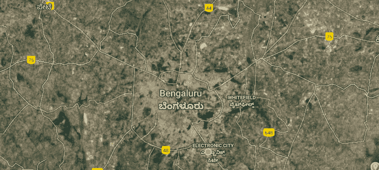

# 基于监督最大似然分类器的城市绿地提取

> 原文：<https://medium.com/analytics-vidhya/citys-green-space-extraction-using-supervised-maximum-likelihood-classifier-a3e2d1e183ff?source=collection_archive---------13----------------------->

> **简介**

*整个绿色空间，包括植被、树木、森林和农作物，通过减少热岛效应，促进人与自然的和谐关系，维持全球碳循环，在平衡生态过程中起着至关重要的作用。绿地规划是城市规划和景观设计的重要组成部分。为了全面了解绿地格局和分析绿地的环境影响，有必要定期监测绿地的分布并模拟其城市系统相互作用和环境影响。
卫星遥感(RS)是快速发展的现代空间信息技术的核心，可以随时间从航空航天中获取不同光谱区间的土地覆盖信息。这是监测绿地状态、格局和变化的有效方法。地理信息系统(GIS)是获取、存储、管理和分析多源地理数据的重要平台。GRASS GIS 是一款用于地理空间数据管理、数据处理、空间建模、地图制作和可视化的免费软件。我们提出的系统，一个具有定制城市边界的孟加拉鲁鲁市的遥感 Landsat 数据集被考虑作为一个广泛的案例研究。并且，GRASS GIS 被用于执行时间序列分析和检查多年来的绿地分布模式。*

> **数据集和感兴趣区域(ROI)**

图一。绿地分析的投资回报率

从 Landsat 卫星上收集的孟加拉鲁鲁市的遥感数据集用于处理和分析绿地。美国地质调查局(USGS)地球探测器(T8)提供了这些数据。用于数据提取和分析的感兴趣区域(ROI)如图 1 所示。感兴趣的矩形区域的坐标(纬度和经度)如表 1 所示。

考虑了五年的数据，即 1998 年、2003 年、2008 年、2011 年和 2018 年，以考虑跨越 20 年的绿色空间的变化。Landsat 4–5 用于收集 1998 年、2008 年和 2011 年的数据，而 2003 年和 2018 年则使用 Landsat 7，如表 2 所示。

栅格数据集包含一个或多个称为波段的图层。例如，1。彩色图像由三个波段(RGB 或 HSI)组成，2。数字高程模型(DEM)只有一个波段(保存高程值)和 3 个波段。多光谱图像可能有几个波段。表 3 显示了系统中使用的各种卫星图像波段。此外，表 4 解释了卫星投影数据。

> **系统设计**

我们提出的系统分为 4 个任务:1 .数据采集，2。假彩色合成(FCC)和特征提取，3 .使用最大似然分类(MLC)的监督分类，以及 4 .分析和报告，如图 2 所示。首先，收集卫星数据，并对给定数据执行 FCC 以提取特征。假彩色合成有效地识别结构，如关节和地形。由波段 1、2 和 3 分别投影到蓝色、绿色和红色上生成的标准 FCC 提供了与植被、水体、土地利用、土地覆盖和岩石类型相关的重要信息。因此，标准 FCC 用于选择监督分类的训练地点。之后，最大似然分类有助于对监督数据进行分类。最后，进行分析并生成报告和统计数据。

图 2:系统设计

> **监督分类**

1。**最大似然分类(MLC)将图像像素分类为绿色或非绿色。MLC 涉及以下步骤:
·绿地和非绿地等级的定义。
·收集合适的训练区域(每个班级的参考区域):使用 FCC 和光栅数字化仪收集签名。
·使用 MLC 执行真实分类:使用贝叶斯分类器。
结果的验证和评估。**

**2。 **训练和测试区域**借助光栅数字化仪提取。此外，它还用作 GRASS GIS 的内置 MLC 功能。不同波段的数字编号(DN)值被用作训练数据的特征。波段 1 对应于具有最大值的绿色，因此被标记为绿色空间。然而，波段 3 对应于红色，其值对于非绿色空间更大，如表 5 所示。**

****

**表 5:用于培训的示例特性**

**3。 **标签:**土地利用(LU) /土地覆被(LC)类中的任何一个。**【陆】**土地利用是指人类为了利用土地资源获得产品和/或利益而在土地上进行的一系列活动。
**土地覆被(LC) 定义为发生在地球表面的植被(天然的或种植的)或人造建筑。水、冰、裸露的岩石、沙子和类似的表面也算作土地覆盖。
对于每个类别，在训练数据上构建高斯曲线，如图 3 所示。在这里，森林、农业用地、水和封闭区是不同的类别。每当分类中出现新的像素时，都会为每个类别计算其后验概率(先验概率和似然性的乘积)，并根据最高概率类别对像素进行分类。****

********

****图 3:特征空间****

> ******结果和分析******

****图 4 显示了使用最大似然分类器对 Bengaluru 市 Landsat 卫星遥感数据集的 5 年数据进行监督分类的结果。绿色突出绿色空间，而黑色突出非绿色空间。如图 4 所示，从 1998 年到 2018 年，可以观察到绿色空间和强度的巨大下降。****

********

****图 4:图像分类比较结果****

****随着时间的推移，绿色植物变得稀疏，密集的绿色斑块可以看到正在消失。实际的森林、植被和树木区域小于显示的绿色区域，因为它包括杂草和草。因此，它引起了人们对森林砍伐及其对环境的不利影响的更多关注。****

******数据集中的异常**
上面显示的分类结果还包括湖泊和地面中的杂草和藻类。杂草和其他突出绿地的 DN 分布相似，而绿地和非绿地的 DN 分布不同。因此，使用基于光谱值的分类很难将杂草区域与绿地(MLC 的结果)分开。****

******精度**
**生产者的精度(Precision)** 表示给定类型的训练像素分类的好坏。
**用户的准确度(召回)**表示被分类到给定类别的像素实际上代表该类别的概率。
如表 6 所示，计算 5 年内将像素正确分类为绿色或非绿色的准确度。最后，通过计算系统的整体平均准确率来分析分类器的性能。****

********

****表 6:用户准确度、生产者准确度和总体准确度****

******报告与分析**
表 7 描述了绿地面积从 1998 年到 2011 年逐渐减少，2018 年略有增加。从 1998 年到 2003 年，绿地面积从 27.03%下降到 19.93%。****

********

****表 7:20 年来绿色覆盖面积的百分比****

****从 1998 年到 2011 年，绿色覆盖逐渐减少，2018 年略有增加，同样，非绿色覆盖迅速增加，2018 年略有减少，如图 5 所示。****

********

****图 5:绿地和非绿地覆盖率。****

******补片分析**
**补片号**使用 4-邻居算法计算，在追踪补片时忽略对角单元。它定义了分类图像中存在的斑块数量，而不考虑其斑块大小，并且是计算斑块密度所必需的。1998 年至 2018 年的补丁数量如图 6 所示。****

********

****图 6:补丁数量比较****

******补丁密度**通过滑动一个矩形窗口来计算一个区域相对于给定窗口中相邻区域的密度。定义为每平方公里的斑块数，即(PD = Npatch / A)，其中 Npatch 为斑块数，A 为采样面积。该指数是使用 4-邻居算法计算的，在追踪面片时忽略对角线单元。只有空值的样本区域被认为具有零个面片，即它们的结果总是 0。斑块密度描述了图像的特定区域相对于其邻居或周围环境的密度和稀疏度。因此，如图 7 所示，它提取了随着时间推移而失去绿色的某些区域。****

********

****图 7:斑块密度的时间序列比较****

****在图 7 中，黑色、红色和绿色区域代表密集的斑块。随着时间的推移，图像的某些部分逐渐失去红色和黑色。该区域(靠近左下方)变得更加稀疏，这意味着它们的绿化是正常的，即该区域的所有部分都具有相似的密度。****

> ******结论******

****在该系统中，Bengaluru 市的绿色空间被提取出来，具有定制的边界，因此附属于该城市的子城市区域也可以被考虑。在 GRASS GIS 的帮助下，使用最大似然分类器对 Landsat 卫星数据集进行绿地和非绿地分类。因此，从 1998 年到 2011 年，绿色空间逐渐减少，从 1998 年到 2003 年大幅下降。进行斑块密度分析是为了观察受影响最严重的区域。****

> ******参考文献******

****[1]数据集:[美国地质调查局(USGS)地球探索者](https://earthexplorer.usgs.gov/)
【2】[Grass GIS 工具及教程](https://grass.osgeo.org/documentation/tutorials/)
【3】Z 华鹏，D 佩军，[基于 RS 和 GIS 的城市绿地格局分析与环境影响评价](https://ieeexplore.ieee.org/document/4234403/)
【4】C 沈，M 李，[基于决策树的快鸟影像城市绿地提取研究](http://ieeexplore.ieee.org/document/5567526/)
【5】W X 爽，C，****