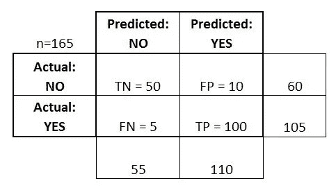
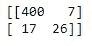
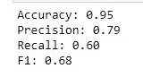

# 混乱矩阵中的清晰度

> 原文：<https://medium.com/analytics-vidhya/clarity-in-confusion-matrix-17fb1da6dabf?source=collection_archive---------31----------------------->

大多数真实世界场景总是存在类不平衡，这意味着一种类型的数据的观察数量比另一种类型的数据多。例如，在信用卡交易中，欺诈交易的数量远远少于真实交易。同样，在医学上，患病的人数少于健康的人数(感谢上帝！) .

想象一下，在信用卡场景中，欺诈交易/观察的数量远远少于真实交易。这意味着，在我们的数据集中，只有极少数数据是欺诈性标签，大多数数据是真正的标签。

例如，在 Kaggle 的[信用卡欺诈](https://www.kaggle.com/mlg-ulb/creditcardfraud)数据集中，284，807 笔交易中只有 492 笔欺诈。这意味着只有 0.172%的观察是欺诈。如果我们创建一个虚拟模型(*猜猜看，有一个真实的 sklearn 虚拟分类器*)，它预测所有数据都是真实交易，没有欺诈交易，我们的模型将具有 0.998%的准确性。

喔，是的，没错。我们没有做任何事情就达到了 998%的准确率。但是这种准确性能让我们对欺诈数据有所了解吗？不，一点也不。即使有 0.998%的准确度，我们的模型也是没有价值的。在这里“混乱矩阵”是我们的救星。这里，我们的目标不是识别真实交易，而是针对欺诈交易。我们不仅要从整个数据集中识别欺诈交易，还要从实际欺诈中识别欺诈交易。

# 混淆矩阵

混淆矩阵是一个表格，通常用于描述一个分类模型(或“分类器”)对一组真实值已知的测试数据的性能。

下面是一个例子:

样本混淆矩阵

# 基本术语

以下 4 个基本术语将帮助我们确定我们需要的指标。

*   **真阳性(TP)** :当实际值为正，预测值也为正时。真正被指责为阳性
*   **真负值(TN)** :实际值为负值，预测也为负值时。真正被指责为消极
*   **误报(FP)** :实际为负，但预测为正。被错误地指责为阳性
*   **假阴性(FN)** :实际为正，但预测为负。错误地习惯于消极

# 韵律学

> **准确性:模型预测多长时间是正确的？**

*   正确预测总数/预测总数
*   (TP+TN)/合计= (100+50)/165 = 0.91

> **误分类率:分类器预测出错的频率？**

*   错误预测总数/预测总数
*   (FP+FN)/总数= (10+5)/165 = 0.09
*   **精度的补充，即 1 —精度**
*   也称为“错误率”

> **真阳性率:实际阳性被预测为阳性的频率有多高？**

*   也被称为“敏感症”或“回忆 T4”
*   TP/(FP+TP) = 100/105 = 0.95

> **假阳性率:实际阴性被预测为阳性的频率？**

*   FP/(TN+FP)= 10/60 = 0.17

> **真阴性率:实际阴性被预测为阴性的频率？**

*   TN/(TN+FP) = 50/60 = 0.83
*   假阳性率的补充，即 1 —假阳性率
*   也被称为“特异性”

> **精度:当预测为正时，其正确的频率有多高**

*   TP/(FP+TP) = 100/110 = 0.91

请记住，精确度和召回率是最常见的评估指标

# 让我们现在做一些代码

> 从 sklearn.tree 导入决策树分类器
> 
> dt = DecisionTreeClassifier()。拟合(X_train，y_train)
> 
> tree _ predicted = dt . predict(X _ test)
> 
> 混淆=混淆 _ 矩阵(y _ 测试，树 _ 预测)

> 从 sklearn.metrics 导入准确度分数、精确度分数、召回分数、f1 分数
> 
> #准确度= TP + TN / (TP + TN + FP + FN)
> 
> #精度= TP / (TP + FP)
> 
> # Recall = TP / (TP + FN)也称为敏感度或真阳性率
> 
> # F1 = 2 *精度*召回/(精度+召回)
> 
> 打印('精度:{:.2f} '。格式(accuracy_score(y_test，tree_predicted))
> 
> 打印('精度:{:.2f} '。格式(precision_score(y_test，tree_predicted)))
> 
> 打印(' Recall: {:.2f} '。格式(recall_score(y_test，tree_predicted)))
> 
> 打印(' F1: {:.2f})。格式(f1_score(y_test，tree_predicted)))

