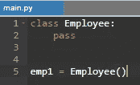

# python 中的类和实例属性

> 原文：<https://medium.com/analytics-vidhya/class-and-instance-attributes-in-python-85aa895eb81d?source=collection_archive---------11----------------------->

你可能是一个初学编程的人，试图进入面向对象编程的神奇世界，或者你可能已经是一个有点健忘症的专家了。在任何情况下，回顾概念总是好的，并且清楚地知道你正在编码的是什么，以及你如何使用它的全部潜力，在这种情况下是属性。

# 类和对象

让我们记住，类是一种创建代码的蓝图或模板，更确切地说是对象。后者是包含的组件，具有使特定数据集有用的方法和属性。

这方面的一个例子如下:

在这种情况下，创建了一个名为 *Employee* 的空类。之后，我们生成该类的一个新实例，一个名为 *emp1* 的对象。

# **什么是职业属性**

当我们创建类时，我们也在设置一个封闭的空间，我们的对象将存在于其中。在这个空间中，我们可以让所有实例以一种全局方式访问变量。这些变量不属于任何对象，而是属于类本身。

在下一个例子中，我们创建了一个名为 *company_name* 的类属性。在前面，我们创建了雇员*的两个实例。*

如果我们尝试打印每个实例的 *company_name* ，您会注意到两者是一样的。

# **什么是实例属性**

如果类属性是属于类的变量，并且可用于所有实例，那么实例属性是属于特定实例的变量，并且仅可用于该实例。

在下一个例子中，我们有两个雇员的实例。

对于第一个实例， *emp1* ，我们为一个名为 *name* 的新属性赋值*“约翰”*。

如果我们打印 *emp1.name* ，我们会得到相应的输出。但是如果我们试图打印相同的属性，现在用我们的第二个实例 *emp2* ，我们将得到一个错误。

这是因为 *name* 是一个实例属性，只属于对象 emp1。

# 创造它们的所有方法是什么，Pythonic 式的方法是什么

可以用不同的方式为类和实例创建属性。

> 在类声明之外创建类属性:

> 逐个创建实例属性:

然而，这些创建属性的方法是不被认可的，因为它们要求程序员重复代码并且缺乏组织性。

> 对于类变量来说，最好是在类的开头，在任何方法之前进行声明。

> 对于实例属性，建议使用类的 __init__ 方法，这样每次创建实例时，都会自动分配其属性。

# **类和实例属性有什么区别**

在这两种属性之间，应该考虑以下几点。

*   如果希望在类的所有实例之间共享属性的单个实例(单个值)，请使用类属性。
*   如果希望类的每个实例都具有不同的属性值，请使用实例属性。

# **他们各自的优缺点是什么**

类别属性的优点:

*   它们像“全局”变量一样作用于你的类的所有实例
*   它们允许对属于该类的所有对象进行操作和数据管理。

类属性的缺点:

*   当创建同名的实例属性时，类属性可能会变得混乱，这意味着它的行为可能会变得出乎意料。

实例属性的优点:

*   它们特定于一个对象
*   它们可以与同名的类变量共存

实例属性的缺点:

*   如果需要，另一个实例不能直接访问它们。
*   一旦实例被删除，它的属性就消失了。

# **Python 如何使用** `**__dict__**`处理对象和类属性

Python 中的每个对象都有一个用 *__dict__ 表示的属性。*

该属性包含一个形式为 *key: value* 的字典，其中存储了所有其他属性。

例如，如果我们创建属性为 *company_name* 的*类 Employee* ，并打印它的 *__dict__* ，我们将看到几个属于该类的变量，包括我们刚刚声明的属性。

如果我们现在创建该类的一个新实例，并试图打印它的字典，我们将看到一个空的数据结构。但是，如果我们尝试打印它的属性 *company_name* ，我们不会得到任何错误。

这是因为 python 首先在 *emp1* 字典中搜索属性。如果在那里没有找到该属性，python 就会在类空间中寻找它，然后在那里打印出来。

可以给与类属性同名的 *emp1* 实例分配一个新属性。

如果再次检查 *emp1* 的字典，可以找到并打印刚刚创建的属性。

这并不意味着 class 属性被替换，因为它仍然存在，并且可以被访问。

作者:乔安·斯蒂文·萨莫拉·凯塞多