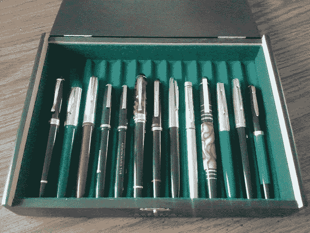

# Python 中的类组合与继承

> 原文：<https://medium.com/analytics-vidhya/class-composition-vs-inheritance-in-python-2fb4a788b330?source=collection_archive---------15----------------------->



# 介绍

类组合是 python 中的一个特性，可以用来代替继承。它比继承有用得多，因为它使我们的代码更简单，可读性更好。看看这段代码:

```
class Box:

    def __init__(self, quantity):
        self.quantity = quantity

    def __str__(self):
        return f"The box contains {self.quantity} pens."

box = Box(5)

class Pen(Box):

    def __init__(self, name, quantity):
        super().__init__(quantity)
        self.name = name

    def __str__(self):
        return f"This is a {self.name}"

pen = Box("Ball pen", 5)
print(pen)
```

# 让我们分析一下方法

这没有多大意义，因为在这段代码中，类“Pen”继承了类“Box”。这个想法是，一个盒子里装着钢笔。这里我们需要在 pen 类中使用 __str__ 方法，这样就可以避免打印“盒子里有 5 支钢笔”，而在打印 Pen 类的对象时打印“这是一支圆珠笔”。这或许可行，但不是一个好方法，原因有二

**概念上的问题** —概念上的问题是，当我们做继承的时候，我们认为这是一种进化的继承。这意味着钢笔是一个盒子，而不仅仅是一个东西。盒子仍然可以单独使用。当我们谈论盒子和钢笔时，这是行不通的，因为与盒子相比，钢笔是一个完全不同的物体。一个盒子里可能有许多支钢笔，但其中一支不是另一支。

**技术问题** —技术问题，为什么这不工作是因为我们有这个继承自 box 的 pen 类，但是我们并没有真正在里面使用 box 类中的任何东西。在这里，我们完全覆盖了 __str__ 方法，因为我们不想在这里使用 box。我们实际上根本不需要这些，因为如果我们不打算在方法中使用它，设置数量是没有意义的。

所以概念上的原因是笔不是盒子，技术上的原因是如果我们不用它来继承任何东西，就没有理由使用继承。这就是作文的用武之地。

我们可以使用构造函数来接收一些笔，而不是在框中输入数量。

```
class Box: def __init__(self, *pens): self.pens = pens def __str__(self): return f"This box contains {len(self.pens)} pens." class Pen(Box): def __init__(self, name): self.name = name def __str__(self): return f"This is a {self.name}" pen1 =  Pen("Ball Pen")pen2 =  Pen("Gel pen")print(pen1)box = Box(pen1, pen2)print(box)
```

**输出**

```
This is a Ball Pen
This box contains 2 pens.
```

这里，super 方法和 quantity 参数已经被删除。更新了 Box 类中的 __str__ 方法，以查找 pens 元组(*self.pens)的长度，该元组可以包含任意数量的笔。我们可以使用任意数量的参数。创建了一个名为“box”的 Box 类对象。我们传入了 pens，打印它将返回 Box 类中的 __str__ 方法。看看它看起来有多简单、干净，我们可以在盒子里放几支笔。

**总结**

这个例子中的继承意味着笔是一个盒子，而组合意味着一个盒子可以包含许多笔。明智地选择。

在 Linkedin 上看到这篇文章:[https://www . Linkedin . com/pulse/class-composition-python-shivam-thaman/？发布=t](https://www.linkedin.com/pulse/class-composition-python-shivam-thaman/?published=t)

在 LinkedIn 上联系我:[https://www.linkedin.com/in/shivam-thaman-1167a8147/](https://www.linkedin.com/in/shivam-thaman-1167a8147/)