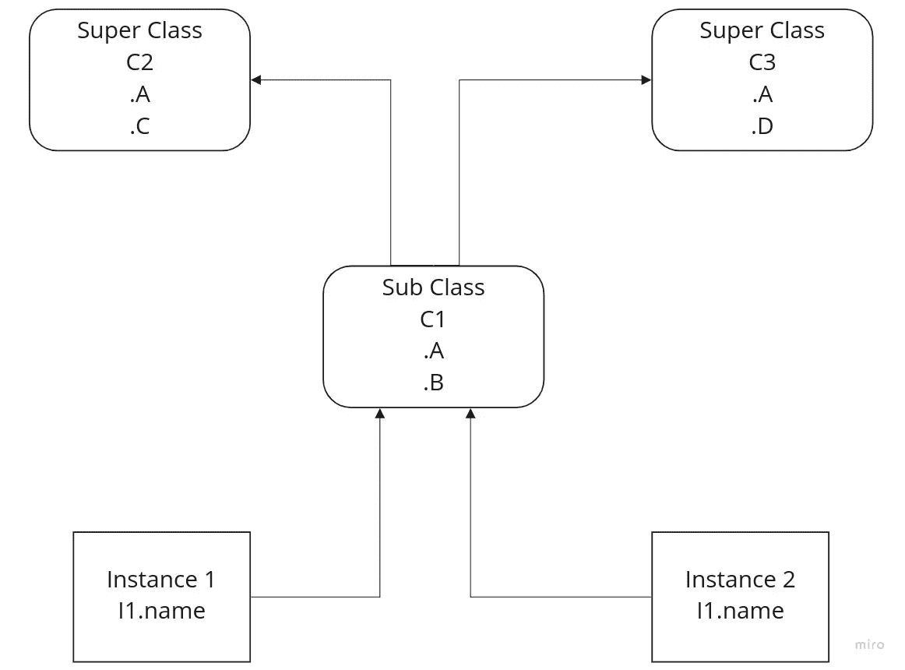
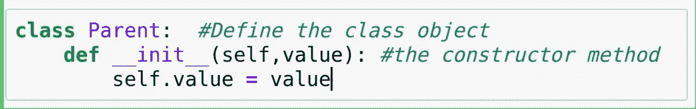
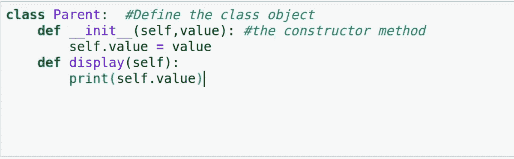
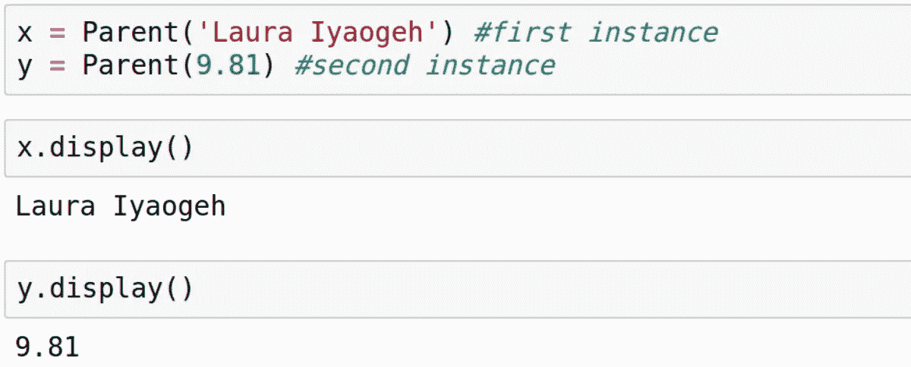
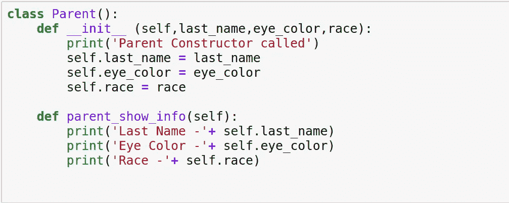
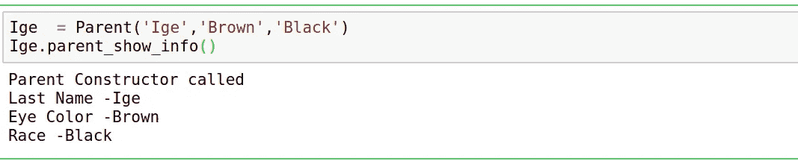
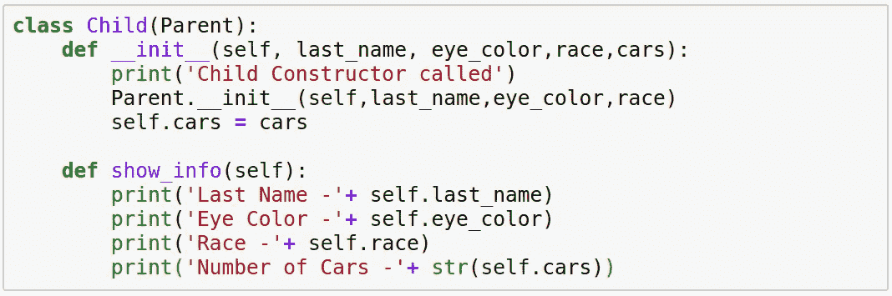
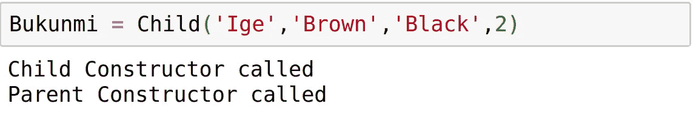
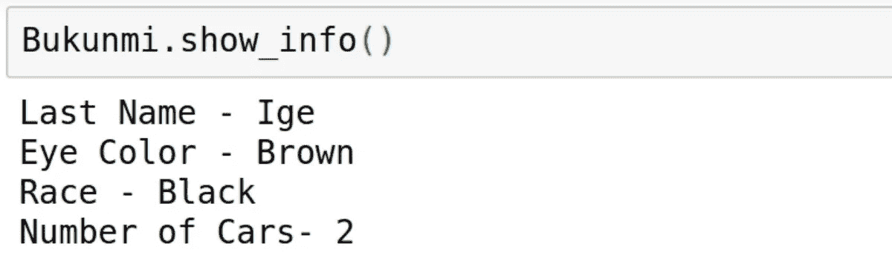
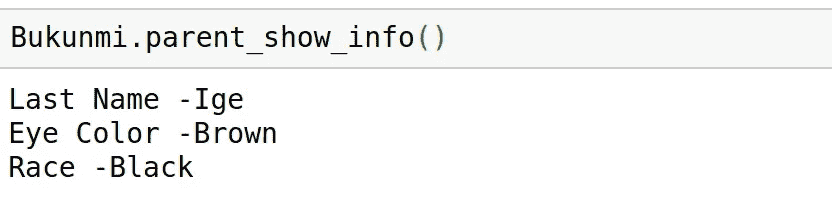

# Python 中的类和面向对象编程(OOP ):初学者指南

> 原文：<https://medium.com/analytics-vidhya/classes-and-object-oriented-programming-oop-in-python-a-beginners-guide-8105cca6e28b?source=collection_archive---------9----------------------->

照片由[达科塔·鲁斯](https://unsplash.com/@dakotaroosphotography?utm_source=unsplash&utm_medium=referral&utm_content=creditCopyText)在 [Unsplash](https://unsplash.com/s/photos/building-construction?utm_source=unsplash&utm_medium=referral&utm_content=creditCopyText) 拍摄

类和 OOP 是一个让我很难理解的话题，因此，我必须做大量的挖掘和广泛的阅读，才能获得对这个概念的某种高层次的理解；这促使我记录了迄今为止我所学到的东西，并发表了这篇博文。我的想法是，当我需要修改 OOP 的概念时，我想把它作为一个参考，同时也作为初学者的指南，这些初学者希望获得对 Python 中的类和 OOP 的高级理解。

对于初学者来说，什么是面向对象编程或 OOP？根据维基百科，OOP 是一种基于“对象”概念的编程范式，因此它围绕字段形式的对象(通常称为属性)来组织软件设计；和程序形式的代码，通常称为方法。

Python 中的 OOP 使用类，因为它是编码结构中实现支持继承的新类型对象的主要工具(将很快涉及这一点)。一个对象可以被定义为内存中的一个数据字段，它具有独特的行为，OOP 关注于你如何操作这些对象。

**对 OOP 的高层次解释**
到目前为止，我们已经介绍了 OOP 的基础，但是这个解释可能不完全相关，所以让我们看看是否可以通过使用更相关的概念来解释 OOP 的一些重要原则，从而做得更好。

想象一下一辆车的设置，从引擎到变速箱，就说是车轮。这些是作为一个单元一起工作以组成车辆的项目的集合。为了使车辆成功工作，发动机必须提供动力，车轮能够运动等等。在面向对象语言中，这被称为组合，每个不同的组件可以被编码为一个方法，它将组成车辆的类。

**继承**
对于继承，假设我们的交通工具是一辆卡车，我们使用交通工具是因为它可以作为我们试图解释的事物的通称。子类将从一辆车开始，而超类将是一辆卡车，它通过添加更多功能来构建车辆的功能。所以它启动了一辆车(这是通用的),除了作为卡车的超类和卡车的新属性之外，它还继承了车辆的属性。我们总是可以使用车辆的子类来组装其他的汽车，如卡车、SUV 等。这个属性被称为继承，它是 OOP 的主要提升特性之一。
在高级类中，Python 编程单元是封装逻辑和数据的隔间，该结构层支持更好的编程实践，如重用和定制代码。

**OOP 术语**
在我们深入研究代码之前，让我们探索一些 OOP 术语。

**对象**:存储数据的实体
**类**:通过定义对象中存储什么数据，对象可以执行什么动作来描述对象类型。它也作为生成实例的工厂
实例:描述一个类的具体例子。实例从其类继承属性。每次调用一个类时，都会生成该类的一个新实例。就像我们不同的实例会有不同颜色的类卡车。
**属性**:属于类的实例的变量
**方法**:属于类的实例的函数，决定类中的对象可以执行什么动作。属性和方法的主要区别在于属性存储数据，而方法执行操作。同样，方法有括号()，属性没有。

在我们探索代码中的这些特性之前，让我们先来分析一下我们在上一节中涉及的所有概念。我们将使用一个类树来阐明这些概念。

具有 2 个实例和 3 个类的类树

在上图中，有五个带有标签变量的对象。自下而上，我们有两个实例，名为实例 1 和实例 2，以及三个类类 1、类 2 和类 3。正如我们在上一节中所说的，类是生成实例的工厂，因为这样的实例从它的生成类继承属性，而类从树中它上面的类继承属性。如图所示，Class 1 C1is 是子类，Class(C2&C3)是超类。这些定义基于树中每个类的相对位置。类别树遵循自下而上的流程，因此超类别行为由树中它下面的所有子类共享。

从我们的类树中，假设我们用属性 D 构建并实例化实例 I2，即:
I2。D
发生的事情是继承被影响，这触发了在类树中的搜索。Python 会沿着 I2 的树路径搜索属性 D。它遵循这样的路径:
I2，C1，C2，C3
并且搜索在找到属性 D 的 C3 结束。这显示了 I2。去 C3 的地图。这说明实例 I2 从 C3 继承了属性 D。

同样，假设我们想要访问 I1 实例中的属性 A，即
I1。这里发生的是搜索在 C1 停止。答:因为 C1 在 C2 和 C3 之下，它超越了这两个国家。因此，属性 A 从 C1 继承到实例 I1 中。

编码类树现在让我们用一些代码把我们到目前为止所学过的东西拼凑起来。在此之前，让我们先了解一些基本事实来帮助我们理解。

*   使用**类**字实例化一个类
*   每个 class 语句生成一个新的类对象，并给它分配一个名称。
*   每次调用一个类时，它都会生成一个新的实例对象
*   实例会自动链接到创建它们的类
*   类自动链接到它们的超类，根据它们在类顺序的括号中列出的方式，即从左到右，就像我们的类树图描述的那样。

为了开始编写代码，让我们定义一个名为 **Parent** 的类。
类的定义就像一个函数，在类名(():)后有或没有括号和冒号。同样，类的主体也像函数一样缩进。

**__init__** 方法是用于初始化对象状态的构造函数方法。每当创建该类的实例时，都会自动调用它。第一个参数， **__init__** 方法中的 **self** 是 Python 中表示对象实例的特殊约定。这是因为类是生成多个实例的工厂，因此每当我们需要获取或设置正在处理的特定实例的属性时，它们的方法都会自动传递 self 参数。因此，无论被调用的实例是什么，总是隐含着使用**自我**论点。

上面的代码片段显示了我们在上面创建的类的延续，我们添加了一个新方法来打印实例接收到的任何参数。

我们创建了两个实例 x 和 y，它们接受不同的参数一个字符串和一个整数。正如上面所解释的，这里发生的事情是, **self** 参数表示隐含的任何实例，无论是 x 还是 y，并将参数存储在实例名称空间中。因此，当对每个实例调用 display 方法时，它们都返回各自的参数，这表明尽管实例是由同一个类创建的，但它们都是独立的实体。

现在让我们探索一下父子关系，使用类使我们的例子更具关联性。
接下来，我们将向构造函数添加更多参数，该构造函数将存储关于父母的信息，如姓氏、眼睛颜色和种族。然后，我们定义一个新方法，显示我们在初始化父类时收到的参数。

让我们创建一个父类的实例。我的名字是 Bukunmi Ige，所以父类是我父母的，因此我将用我的姓创建一个实例。然后我们在实例上调用 **parent_show_info()** 方法

接下来让我们创建一个子类，它将代表我这个孩子。这个子类将是一个超类，它将从作为子类的父类继承参数。
现在，我们基于某些假设创建这个子类，例如父母和孩子将共享一些特征，如姓氏、种族和眼睛颜色。子类将从父类继承参数，同时添加自己的新参数。在这种情况下，我们将添加汽车作为新的参数。

然后我们创建子类的一个实例。

从我们的实例中，我们可以看到，仅仅初始化子类就调用了子类和父类。
让我们在实例上调用 **show_info()** 方法。

通过继承，我们可以访问 **parent_show_info()** 方法，通过我们的子实例获得关于我父母的信息。

**结论**
到目前为止，我们已经涵盖了 Python 类和 OOP 的重要概念。我们以此为基础，通过探索一个简单但真实的父子关系的例子来进一步阐明这些概念。最后，我们希望这篇文章对 OOP 的概念和 Python 中的类做了一个高层次的介绍，也希望它能让你对这个主题做更多的挖掘。