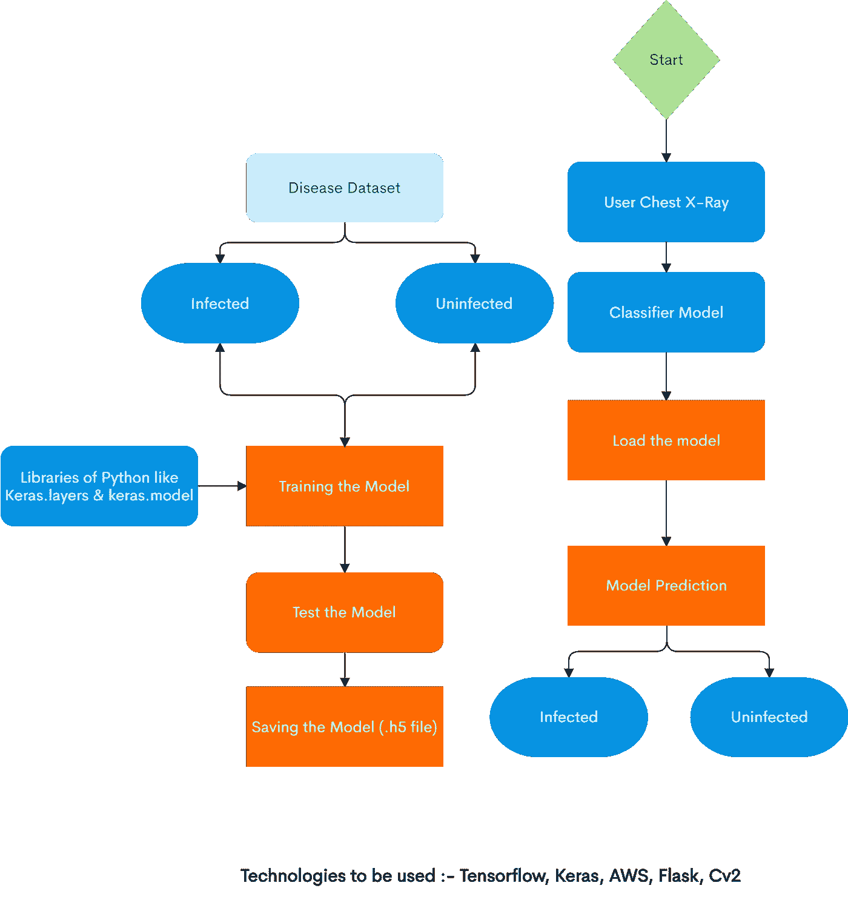
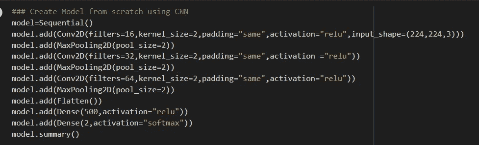
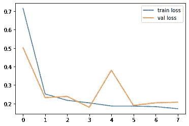
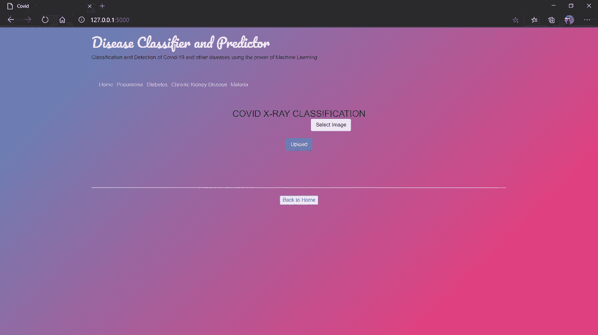
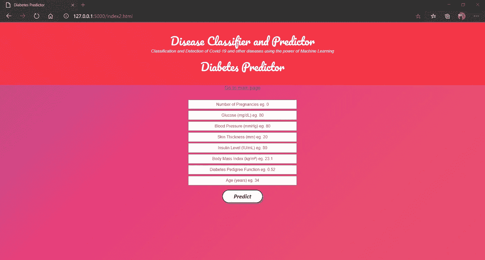

# 使用机器学习的能力对新冠肺炎病和其他疾病进行分类和检测

> 原文：<https://medium.com/analytics-vidhya/classification-and-detection-of-covid-19-and-other-diseases-using-the-power-of-machine-learning-a4005235ff65?source=collection_archive---------10----------------------->

神经网络库 Keras 与 Tenserflow 一起用作后端

## 介绍

近年来，深度学习在人工智能领域取得了巨大成功。深度学习使得人工智能任务更容易预测，并与计算机智能一起工作。特别是对于图像分类，现在每个人都更喜欢 CNN(卷积神经网络)而不是其他层，因为它的高精度，而且它具有从图像中提取特征的高潜力，这有助于对图像进行分类(即本项目中的疾病)，最重要的是，CNN(卷积神经网络)自早期发展以来主要用于图像分析。

随着大数据分析技术的发展，人们越来越重视从大数据分析的角度进行疾病预测，各种研究通过从大量数据中自动选择特征来提高风险分类的准确性，而不是以前选择的特征。然而，这些现有的工作大多考虑结构化数据。例如，对于非结构化数据，利用卷积神经网络(CNN)自动提取文本特征已经引起了广泛的关注，也取得了很好的效果。

## 目标:

*   **预测**患者是否应该被诊断为疾病。这是一个**双星**的结局。
    **(+)= 1，患者诊断为疾病
    **阴性** (-) = 0，患者未诊断为疾病**
*   **用各种**分类模型** &做实验，看看哪一个产生最大的**准确度**。**
*   **检查我们数据中的**趋势** & **相关性****
*   **确定哪些**特征**对阳性/阴性疾病诊断**最重要****

# **体系结构**

**对于该项目，创建了不同的疾病分类模型，作为后端并提供结果。疾病预测模型，如 Covid'19、疟疾、慢性肾病、糖尿病等。使用预先训练的模型通过一系列算法和分类来预测。**

****

**整个系统设计由以下模块组成:**

**Covid'19 分类模型**

**疟疾分类模型**

**糖尿病分类模型**

**慢性肾脏病分类模型**

**肺炎分类模型**

**糖尿病视网膜病变分类模型**

# **迁移学习和 CNN**

**CNN 的训练是使用名为 Keras 的 Python 库和 Tensorflow backend 进行的，这是一个深度学习框架。Imagenet 数据集已被广泛用于构建各种架构，因为它足够大(1.2M 图像)以创建通用模型。虽然，问题陈述来自于训练一个模型。我们使用迁移学习来推广到 ImageNet 数据集之外的图像。这仅发生在预训练模型的情况下。此外，我们使用微调模型对预训练模型进行修改。**

**卷积神经网络(CNN)是**深度学习神经网络**的一类。CNN 代表了图像识别的巨大突破。它们最常用于分析视觉图像，并且经常在图像分类的幕后工作**

## **履行**

**Keras 库通过 Tensorflow 后端导入。导入了 Model、VGG19、ImageDataGenerator 等库。对于问题陈述，使用 VGG19，因为它比 resnet50、exception、mobilenet 等迁移学习技术提供更好的准确性。顺序模型也被导入。Google Colab 用于模型的执行。**

**为了训练和测试的目的，为模型定义图像数据集路径。数据集的大小在决定 VGG16、VGG19 等模型的效率方面起着重要作用。根据原始尺寸调整图像大小，以便更好地确定最佳结果。VGG19 库被调用来定义像 RBG 通道，权重，include_top 这样的参数。Imagenet 被分配给权重参数，该参数包含用于创建最先进算法的数百万幅图像。include_top 参数被指定为 false 以剪切第一层和最后一层，因为它们用于定义图像大小和类别数。**

**随着迁移学习技术的实施，每一层都不再需要人工训练，因为重量是在 VGG 预先训练的。基于输出，在最后一层需要一些节点，但是不需要训练所有层。除了要添加的最后一层之外，卷积层都被冻结了。VGG19 滚动输出，然后通过 flatten()函数将其展平，这是添加密集图层所必需的。输出层将包含两个节点，文件夹和激活功能的长度为“softmax”。如果考虑单个节点，将使用 sigmoid 激活函数。该层用作模型预测过程中的密集层。model.summary 用于查找关于所创建的层的详细信息。Keras 调谐器是一个工具，建议验证您的参数，并保持检查。从头开始创建模型时，所有层都被冻结，只有最后一层被重复训练以获得高精度。**

**现在模型的编译是使用分类交叉熵完成的。损失函数分类交叉熵用于量化深度学习模型错误，通常在单标签、多类分类问题中。如果使用单个节点，编译将通过二进制交叉熵来完成。**

**ImageDataGenerator 用于从数据集中导入和读取图像。基于个人需求，应用图像增强以在数据集上获得最佳结果。测试数据集只是进行了重新缩放，像素范围大幅缩小。增强技术被分别用于生成模型的训练集和测试集。**

**时期在模型中运行，具有指定训练集、验证集、批量大小等的各种参数。时期是机器学习中使用的术语，表示机器学习算法已经完成的整个训练数据集的通过次数。数据集通常被分组成批(尤其是当数据量非常大的时候)。训练模型的持续时间直接取决于历元的数量。因此，确定最佳历元数非常重要。如果你有足够的数据，你可以尝试早期停止法:将数据分成三个数据集，训练，验证和评估。沿着足够数量的历元训练每个网络，以查看固定在最小值的训练均方误差。训练过程使用训练数据集，并且必须逐个时期地执行，以便为验证集计算每个时期中网络的均方误差。具有最小验证 MSE 的时期的网络被选择用于评估过程。这种方法也可以应用于正则化方法和 k-fold 交叉验证。**

## **最大池层**

**它进行下采样，这意味着它从较大的图像输出较小的图像。例如，如果我们在卷积层中有(224，224)大小的图像，那么当使用(2，2)的最大池时，它确实将图像的大小减小到(112，112)。它会减小图像的大小，直到图像到达最终的卷积层。**

****

> **疟疾分类模型**

**我们的模型是在深度学习中使用 CNN(卷积神经网络)创建的，使用 TensorFlow 库和 Keras API，在 16k 训练图像下每个时期训练大约需要 2 小时。在训练集上的结果是 94%,在验证集上的结果是 92%,这是相当好的，并且使用数据扩充技术也解决了过拟合问题。在完成我的模型后，我还分析了 CNN 是深度学习框架中使用 TensorFlow 后端进行图像分类的最佳技术之一。**

****

**精确度图表**

****

**损失图**

> **糖尿病视网膜检影分类模型**

**我们的模型是在深度学习中使用 CNN(卷积神经网络)创建的，使用 TensorFlow 库和 Keras API，在 4k 训练图像下每个时期训练大约需要 20 分钟。在训练集上的结果是 96%,这是相当好的，并且使用数据扩充技术也解决了过拟合问题。在完成我的模型后，我还分析了 CNN 是深度学习框架中使用 TensorFlow 后端进行图像分类的最佳技术之一。**

> **慢性肾脏分类模型**

**我们的模型是在深度学习中使用 CNN(卷积神经网络)创建的，使用了具有 400 行数据的 sklearn、pandas 和 pickle 库。年龄、血压、红细胞和其他 21 个健康相关属性等列被用作数据集。通过在训练集中使用交叉验证对参数进行适当调整，随机森林分类器实现了 92%的准确性和 99.2%的 ROC AUC。经验教训:一些修剪有助于提高 RF 的性能。**

**随机森林是一种元估计器，它在数据集的各个子样本上拟合多个决策树分类器，并使用平均来提高预测精度和控制过拟合。如果`bootstrap=True`(默认)，子样本大小由`max_samples`参数控制，否则使用整个数据集构建每棵树。**

> **最终结果**

********