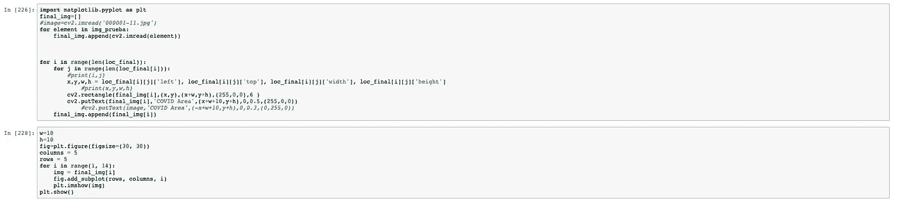

# 使用深度学习和 IBM 视觉识别对胸片中的新冠肺炎进行分类和检测

> 原文：<https://medium.com/analytics-vidhya/classification-and-detection-of-covid-19-in-chest-radiographs-using-deep-learning-and-ibm-visual-28782777bb4?source=collection_archive---------37----------------------->

2020 年中期，我们一直在经历一场疫情，起因是新冠肺炎，这种病毒 2019 年底起源于中国，2020 年初到达欧美。到目前为止，截至 11 月中旬，全球已有 5490 多万人感染了这种病毒，约 130 万人死亡。面对这种疫情，不同的医疗和技术解决方案正在开发中。今天，通过技术我们可以创造不同的工具来帮助我们对抗这种病毒，比如机器人。同样，由于人工智能有助于执行人类日常做的不同任务，如视觉，可以开发算法通过 X 射线诊断新冠肺炎，就像医生一样。这就是我详述以下工作的原因。

# **方法论**

该方法包括 5 个步骤:收集、预处理、建模、检测和评估

# **数据收集**

这些图像来自 Kaggle，包含以下分布:

这些图像是关于新冠肺炎、正常人和肺炎的，因为冠状病毒引起的大多数损伤与肺炎病例中发现的损伤非常相似。总共有 2583 个图像:冠状病毒的 577 个图像，正常的 1004 个图像和肺炎的 1002 个图像。

# 图像预处理

胸部射线照片或通常称为 x 射线图像用于获得人体内部结构的图像，并且具有各种类型:CT 扫描(计算机断层摄影)、乳房 x 线照相术、血管造影术、荧光透视法等。
这些类型的图像是医疗领域中最广泛使用的诊断工具，使我们能够看到从骨折到肺部病变的各种情况。另一方面，这些类型的图像有两个缺点:图像的 ***低对比度*** 和可能破坏图像的 ***加性噪声*** 。
有几种过滤器可以去除图像中的噪声，其中一种是高斯过滤器，它允许您稳定图像中的变化。为了提高对比度，可以使用对比度自适应直方图均衡化(CLAHE)技术，该技术允许在噪声消除过程之后增加射线照片中的对比度，以便提高性能。这就是为什么这些图像必须经过预处理阶段。需要注意的是 ***为了处理这种类型的图像*** ，必须首先去除 ***噪声*** (应用高斯滤波器) ***然后提高对比度*** (CLAHE)，如果提高了对比度而之前没有去除噪声，会导致信息(图像的特征)的丢失，从而降低图像的质量，进而降低分类的性能。

首先，导入库:

1.  操作系统:允许文件管理
2.  BytesIO:允许将数据保存在内存的缓冲区中
3.  Zipfile:允许提取 zipp 中的压缩图像
4.  Ibm_boto3:允许将 zip 文件从 IBM Cloud Object Storage 导入到路径: **/ home / wuser**

其次，包含 3 个文件夹(正常、Covid19、肺炎)的 zip 文件必须上传到**对象存储器**

然后使用 ***StreamingBody 对象*** 将其插入到代码中

使用 zipfile 库提取图像，并将类保存在名为 classes_required 的数组中。

现在，图像将保存在以下路径: **/ home / wsuser / work/**

使用两个 for 循环，图像将被迭代并存储在一个名为 images 的数组中。

然后，创建一个 CLAHE 类型的对象，它将帮助我们提高图像的对比度(对比度增强)，并通过另一个 for 循环迭代图像，其过程如下:

1.  转换为灰度(cv.cvtColor (img，cv。颜色-RGB 2 灰色)
2.  应用高斯滤波器(cv。GaussianBlur (gray，(5，5)，0))，它有一个 5×5 的内核
3.  最后，应用 CLAHE 函数来提高图像的对比度。

# **建模**

深度学习架构用于图像的特征提取和分类。在这种情况下，使用了视觉几何组 19 (VGG19)，它由 19 层组成(16 个卷积层、3 个全连接层、5 个 MaxPool 层和 1 个 SoftMax 层)。

首先，保存图像

首先导入以下库:

1.  ImageDataGenerator(做数据扩充)。
2.  VGG19(深度学习架构)。
3.  AveragePooling2D，Input，Dense，Flatten，Dropout，Model 对模型进行调优，使其适应三类分类。
4.  SGD 作为优化器。
5.  to _ categorical(使标签适应三类 numpy 格式)。
6.  train_test_split 对数据进行分区。

因为我们将数据存储在一个数组(nv_image)中，并且按顺序，我们通过一个 for 循环来保存标签。

然后，将图像的大小调整为 224 x 224，并将图像的大小除以 255。此外，通过 for 循环和 to _ categorical()函数对标签进行一次性编码。数据分区是 75/25。

使用 ImageDataGenerator 函数，通过旋转 15 度来执行数据扩充。然后加载 VGG19 架构，用“imagenet”权重进行迁移学习。需要注意的是，架构进行了修改，增加了一个 GlobalAveragePooling 层，这是一个 514 个神经元的全连接层，压降为 0.5。因为有 3 个类，所以使用 softmax 函数。

学习率= 0.001，100 次，批次大小为 64

**冠状病毒检测**

对象检测是计算机视觉的一项任务，涉及检测图像或视频中的对象。在这种情况下，使用 IBM 云服务视觉识别检测到指示冠状病毒存在的病变。

值得注意的是，标记过程是由一名具有 15 年以上经验的放射科医师完成的，他曾在秘鲁的多家医院和私人诊所工作过。正如我们在视觉识别中看到的，我们加载图像并选择 Add object 按钮，在病变所在的位置绘制一个正方形。

标记图像后，按下列车模型按钮。

模型训练完成后，提取 apikey 和 url。

提取 apikey 和 url 后，我们继续在 IBM Watson 笔记本中实现视觉识别模型。为此，需要导入 libm_boto3、Config 和 ClientError 库(以便能够访问 IBM Cloud 对象存储)

为了测试模型，您必须上传一个包含新图像的 zip 文件(testing2.zip ),并导入您的凭证和 ICOS SDK (IBM Cloud Object Storage)。

使用 ls 命令，可以看到 zip 文件已经在路径中。出于这个原因，zipfile 被导入，zip 中的图像被提取出来。有了这个库，你就可以获得 zip 文件中图片的名称。

然后，用 url 和 apikey 实例化虚拟识别模型

为了执行检测，使用了一个 for 循环，该循环遍历图像并取出用视觉识别模型预测的边界框的坐标。

最后，使用另一个 for 循环，在图像和它所属的类中绘制边界框。

# **评估**

VGG19 在四项指标(准确度、召回率、精确度和 f1 得分)中取得了好成绩。

在混淆矩阵中，我们可以看到该模型对少数图像进行了错误分类。

最后，我们在图表中看到，准确性和损失表明该模型相对较好地概括了数据分布。然而，这可以通过拥有更多图像来改善，从而显著减少损失。

