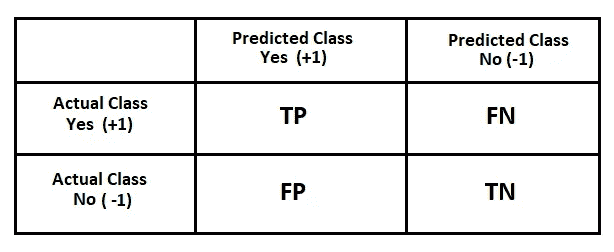

# 机器学习中的分类及其性能度量

> 原文：<https://medium.com/analytics-vidhya/classification-and-its-performance-metrics-in-machine-learning-f0ad57866ec9?source=collection_archive---------7----------------------->

> 编程是一种最好通过实践和例子获得的技能，而不是从书本上获得。艾伦·图灵

在分类中，目标是预测类别标签，类别标签是从预定义的可能性列表中选择的。

如果你是机器学习的新手，请查看:[机器学习简介](https://www.yadsmic.com/post/introduction-to-machine-learning)

分类是一个有监督的机器学习问题，其中通过使用分类算法来收集、分析和使用数据以构建分类器。当目标输出变量的值离散为{ Yes| No }时，使用这些算法

**二元或二项式分类**是根据一个分类规则实例将给定集合的元素分类成两组的任务。(是/否)，(对/错)，(动物/人)

**多类或多名分类**是将实例分类到三个或更多类中的问题

# 性能指标

# 混淆矩阵:

不要继续这个名字，它只是一个表格，告诉你哪些值被正确预测，哪些没有。



图片来自[https://www.yadmsic.com/](https://www.yadsmic.com)

用技术术语来说:混淆矩阵是一种机器学习分类的性能测量技术。它是一种表格，帮助您了解分类模型对一组测试数据的性能，因为真实值是已知的。

[sklearn -混淆矩阵](https://scikit-learn.org/stable/modules/generated/sklearn.metrics.confusion_matrix.html)

```
**>>> from sklearn.metrics import confusion_matrix
>>> confusion_matrix(y_actual, y_pred)**
```

*真阳性(TP):结果数据为阳性，预计为阳性。*

*假阴性(FN):结果数据为阳性，但预测为阴性。*

*假阳性(FP):结果数据为阴性，但预测为阳性。*

*真阴性(TN):结果数据为阴性，预计为阴性。*

# 真实阳性率(TPR):

也称为**灵敏度**或**召回**或**命中率**

**TPR = TP / ( TP + FN )**

回忆给了我们一个想法，当它实际上是肯定的，它多久预测一次是。

[sklearn - recall](https://scikit-learn.org/stable/modules/generated/sklearn.metrics.recall_score.html#sklearn.metrics.recall_score)

```
**>>> from sklearn.metrics import recall_score
>>> recall_score(y_actual, y_pred)**
```

敏感度计算正确检测到的阳性类别的比率。该度量给出了模型识别一个肯定类的好坏程度。

理想情况下**回忆**必须接近 1，这意味着有接近 100%正确预测的阳性病例。

# 真实负利率(TNR):

它也被称为**特异性。**

**TNR = TN / ( FP + TN )**

特异性计算正确检测到的阴性类别的比率。该指标给出了模型识别负类的能力。

特异性测量用于确定正确预测的实际阴性病例的比例。

理想情况下**特异性**必须接近 1，这意味着有接近 100%正确预测的阴性病例。

# 假阳性率(FPR):

它也被称为**脱落物**。

**FPR = FP / ( FP + TN )**

它是所有预测错误的负类的比率，即预测为正的类除以所有实际为负的类

**FPR = 1- TNR**

理想情况下 **FPR** 必须接近 0。

# 假阴性率(FNR):

它也被称为**未命中率**

**FNR = FN / ( FN+TP )**

它是所有被错误预测为阴性的阳性类别除以所有实际为阳性的类别的比率

**FNR = 1-TPR**

理想情况下 **FNR** 必须接近 0。

# 精确度:

准确性告诉我们分类器正确的频率是多少？

**准确度= ( TP + TN ) / ( TP + TN + FP + FN )**

[sklearn - Accuracy](https://scikit-learn.org/stable/modules/generated/sklearn.metrics.accuracy_score.html#sklearn.metrics.accuracy_score)

```
**>>> from sklearn.metrics import accuracy_score
>>> accuracy_score(y_actual, y_pred)**
```

理想情况下**精度**必须接近 1。

# 错误率:

错误率(ERR)的计算方法是所有错误预测的数量除以数据集的总数。

**错误率= ( FP + FN ) / ( TP +TN + FP + FN )**

**错误率= 1 -准确度**

理想情况下**错误率**必须接近 0。

# 精确度(阳性预测值):

精度是真阳性的数量除以真阳性和假阳性的数量。换句话说，它是正面预测的数量除以预测的正面类值的总数。它也被称为阳性预测值(PPV)。

**精度= TP / ( TP + FP )**

[sklearn - Precision](https://scikit-learn.org/stable/modules/generated/sklearn.metrics.precision_score.html)

```
**>>> from sklearn.metrics import precision_score
>>> precision_score(y_actual, y_pred)**
```

理想情况下**精度**必须接近 1。

# F1 分数:

F1 的分数是 2*(精度*召回率)/(精度+召回率)。F1 分数是精确度和召回率的调和平均值。它也被称为 F 分数或 F 测度。

简单来说，F1 分数传达了精确度和召回率之间的平衡。

**F1 得分= 2TP / ( 2TP + FP + FN )**

[sklearn - f1 比分](https://scikit-learn.org/stable/modules/generated/sklearn.metrics.f1_score.html#sklearn.metrics.f1_score)

```
**>>> from sklearn.metrics import f1_score
>>> f1_score(y_actual, y_pred)**
```

**F1** 得分在 1 时达到最佳值，这意味着完美的精确度和召回率

# 分类报告

sklearn 中的这个函数提供了每个类的精确度、召回率和 F1 分数的文本摘要。

[sklearn -分类报告](https://scikit-learn.org/stable/modules/generated/sklearn.metrics.classification_report.html)

```
**>>> from sklearn.metrics import classification_report
>>> classification_report(y_true, y_pred, labels=[1, 2, 3])**
```

**我们将评估一些分类算法的性能参数。**

“文明所提供的一切都是人类智慧的产物。我们无法预测当这种智能被人工智能可能提供的工具放大时，我们可能会实现什么，但消除战争、疾病和贫困将是任何人的优先事项。成功创造人工智能将是人类历史上最大的事件。不幸的是，这也可能是最后一次。”**——斯蒂芬·霍金。**

*原载于*[*https://www.yadsmic.com*](https://www.yadsmic.com)*。*