# 胎儿健康分类

> 原文：<https://medium.com/analytics-vidhya/classification-fetal-health-bd578beae25?source=collection_archive---------11----------------------->

# 介绍

在这本笔记本中，我将对胎儿健康进行分类，以防止儿童和产妇死亡。

**所以，我们将结果分成 3 类**

1.  常态
2.  怀疑
3.  病理学的

首先，我将解释重要特性的含义:

*   基线值——基线胎儿心率(FHR)
*   加速度——每秒钟的加速度次数
*   胎动——每秒钟胎动的次数
*   子宫收缩——每秒钟子宫收缩的次数
*   light_decelerations —每秒的激光二极管数量
*   severe_decel —每秒的 SDs 数量
*   prolonged _ decel—每秒的 PDs 数
*   异常 _ 短期-异常短期变化的时间百分比
*   sh 的平均值——短期可变性的平均值
*   ti 百分比——出现异常长期变化的时间百分比

**让我们开始导入库。**

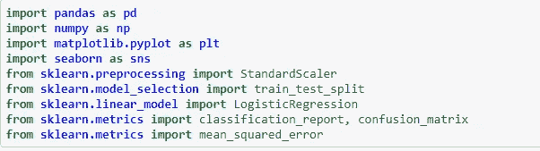

**读取数据**

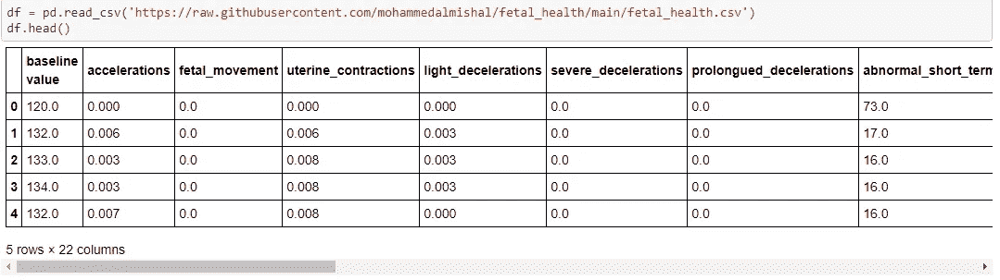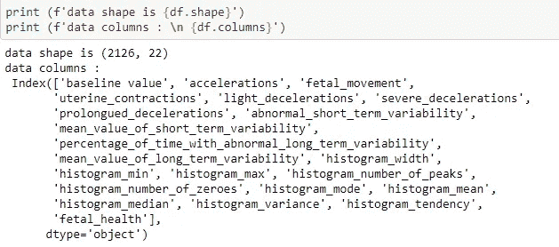

**描述数据**

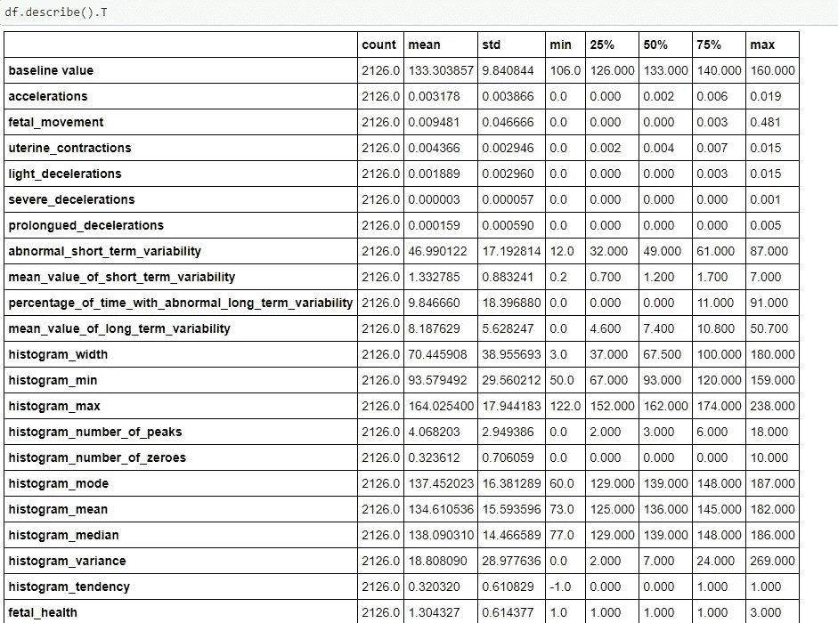

**缺失数据如果有一些缺失数据，我们必须修复它**

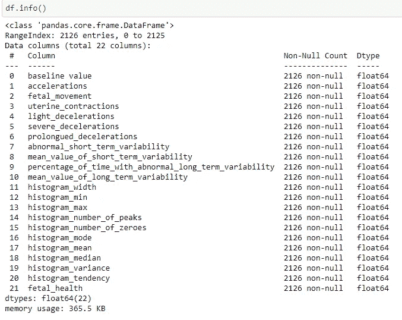

**似乎没有丢失数据**

**我的目标是有结果的胎儿健康。因此，我们将对其进行分析，并找出它与其他特征之间的关系。**

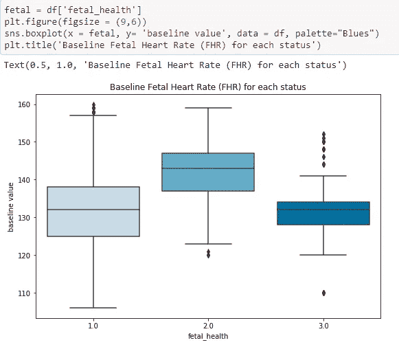

请记住，1.0 表示正常，2.0 表示可疑，3.0 表示病态。


我们将在该数据中找到每个状态的计数，以便于我们将其可视化。

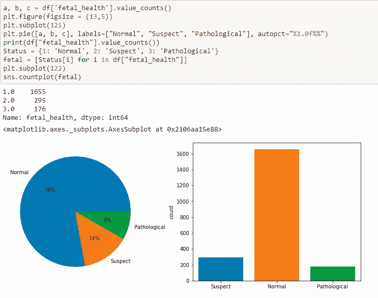

为了更好地理解数据，我们将发现胎儿健康和其他特征之间的相关性。

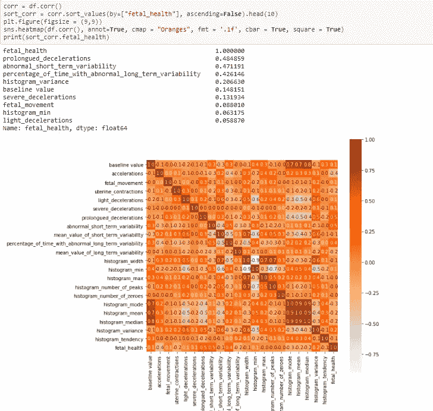

让我们看看数据的分布和直方图

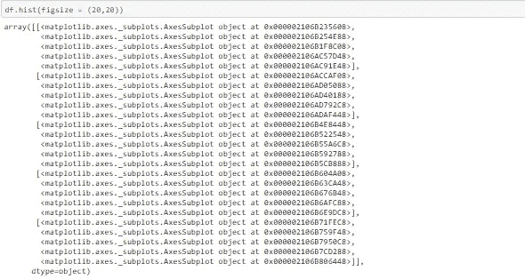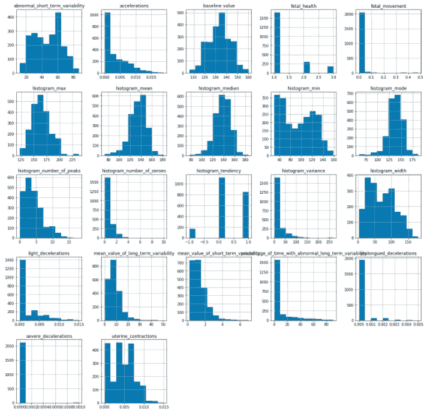

这些数据在数量上各不相同，这给我们带来了一些问题。我们将对数据进行标准化，以避免这些问题。

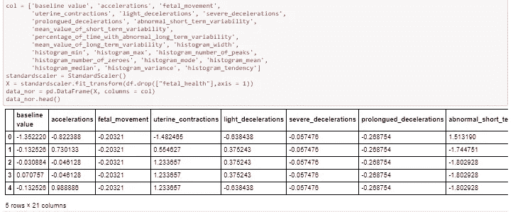

让我们把数据分成训练数据和测试数据。让我们在训练数据上训练模型，然后在测试数据上进行测试。

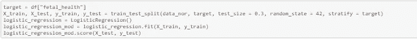

```
0.8934169278996865
```

这个比例在逻辑回归中，我们试试另一个模型。

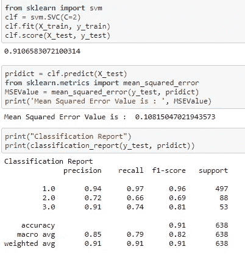