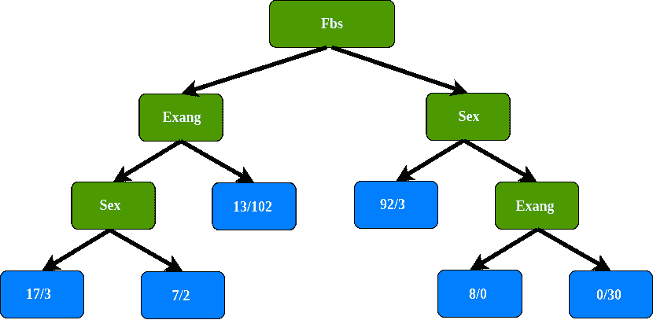

# 决策树中的分类—一步一步的推车(分类和回归树)

> 原文：<https://medium.com/analytics-vidhya/classification-in-decision-tree-a-step-by-step-cart-classification-and-regression-tree-8e5f5228b11e?source=collection_archive---------1----------------------->

决策树算法—第二部分

# 1.介绍

CART(分类和回归树)是决策树算法的变体，在上一篇文章— [决策树的基础知识](/@arifromadhan19/the-basics-of-decision-trees-e5837cc2aba7)中。决策树是非参数监督学习方法。CART 可以应用于回归和分类问题[ [1](/@arifromadhan19/the-basics-of-decision-trees-e5837cc2aba7) ]。

正如我们所知，数据科学家经常使用决策树来解决回归和分类问题，他们大多数人在决策树实施中使用 scikit-learn。基于[文档](https://scikit-learn.org/stable/modules/tree.html#tree-algorithms-id3-c4-5-c5-0-and-cart)，scikit-learn 使用了优化版本的 CART 算法

# 2.CART 如何在分类中工作

[在上一篇文章](/@arifromadhan19/the-basics-of-decision-trees-e5837cc2aba7)中，我们解释了 CART 在将数据集分割成决策树的过程中使用了 Gini 杂质。

数学上，我们可以把基尼系数写成如下

## CART 如何处理数据集的分割

这个模拟使用一个有 303 行的心脏病数据集，有 13 个属性。目标包括 138 个值 0 和 165 个值 1

在此模拟中，仅使用性别、Fbs(空腹血糖)、Exang(运动诱发的心绞痛)和目标属性。

## 分类

**测量基尼系数在性别上的杂质**

**测量 Fbs(空腹血糖)中的基尼系数杂质**

**测量 Exang(运动诱发的心绞痛)中的 Gini 杂质**

**Fbs(空腹血糖)的基尼杂质最低，所以我们要在根节点使用它**

正如我们所知，我们将 Fbs 作为根节点，当我们使用 Fbs(空腹血糖)划分所有患者时，我们最终会得到“不纯”的叶节点。每片叶子都包含有无心脏病。

我们需要弄清楚性别和 Exang 在 Fbs 左侧淋巴结中如何区分这些患者

**Exang(运动诱发心绞痛)基尼杂质最低，我们在这个节点用它来区分患者。**

在 Exang(运动诱发的心绞痛)的左侧结中，它如何很好地分离这 49 个患者(24 个患有心脏病，25 个没有心脏病。因为只剩下属性 sex，所以我们将 sex 属性放在 Exang 的左侧节点中

正如我们所看到的，我们在这个分支上有最终的叶节点，但是为什么叶节点被圈起来，包括最终的节点？

注:带圈的叶节点，89%没有心脏病

这些新的叶子比我们以前的更好的分离病人吗？

为了回答这些问题，我们必须在使用属性性别区分病人之前，比较使用属性性别的基尼系数和基尼系数。

用性别来分离患者之前的基尼杂质是最低的，所以我们不用性别来分离这个节点。树的这个分支的最后一个叶节点

在右边的树枝上做同样的事情，所以这种情况下树的最终结果是

**处理数据集拆分时的要点**

> 1.计算所有的基尼系数
> 
> 2.比较基尼杂质分数，在使用新属性分离数据之前的 n 之后。如果节点本身得分最低，那么就没有必要分离数据
> 
> 3.如果分离数据导致改善，则选择杂质分数最低的分离

# 奖金

## **如何计算连续数据中的基尼杂质？**

比如体重，体重是决定心脏病的属性之一，比如我们有体重属性

**第一步:数据升序排序**

**第二步:计算平均重量**

**步骤 3:计算每个平均体重的基尼系数杂质值**

最低的基尼系数杂质是**权重< 205，**这是我们与另一个属性比较时使用的临界值和杂质值

## **如何计算分类数据中的基尼杂质？**

我们有一个最喜欢的颜色属性来确定一个人的性别

为了了解基尼系数杂质这一属性，计算每一个以及每一个可能的组合的杂质分数

# 继续学习 CART 在回归中是如何工作的

[决策树中的回归——一步一步的 CART(分类和回归树)——第三部分)](/@arifromadhan19/regrssion-in-decision-tree-a-step-by-step-cart-classification-and-regression-tree-196c6ac9711e)

## 关于我

我是一名数据科学家，专注于机器学习和深度学习。你可以通过[媒体](/@arifromadhan19)和 [Linkedin](https://www.linkedin.com/in/arif-romadhan-292116138/) 联系我

**我的网站:【https://komuternak.com/】**

## **参考**

1.  **[https://medium . com/@ arifromadhan 19/the-basics-of-decision-trees-e 5837 cc 2 ABA 7](/@arifromadhan19/the-basics-of-decision-trees-e5837cc2aba7)**
2.  **[统计学习简介](http://faculty.marshall.usc.edu/gareth-james/ISL/)**
3.  **拉什卡，塞巴斯蒂安。Python 机器学习**
4.  **[https://en.wikipedia.org/wiki/Decision_tree_learning](https://en.wikipedia.org/wiki/Decision_tree_learning)**
5.  **博纳科索朱塞佩。机器学习算法**
6.  ***改编自 YouTube 频道的《*[*stat quest with Josh Stamer*](https://www.youtube.com/watch?v=7VeUPuFGJHk&t=911s)**