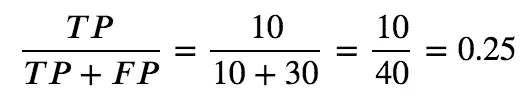

# 分类指标 101

> 原文：<https://medium.com/analytics-vidhya/classification-metrics-101-c7b5da9cb21d?source=collection_archive---------19----------------------->

让我们通过首先介绍我们的混淆矩阵来谈论分类度量。

这是我创建的一个典型的混淆矩阵样本。请注意，这些数字没有任何意义，它们只是作为例子。

混淆矩阵通常遵循这种布局，你有一个 2 x 2 矩阵，列是你预测的正面和负面，行是你实际的正面和负面。请记住，这些是关于我们的 *Y* 变量。

有许多度量标准，但我们将探索更多关于表面水平的内容，以使它对像我这样没有数学学位、学习过线性代数和抽象数学的人友好。我们要做的就是处理我们的混淆矩阵，并引入一些别名和公式。

在我们的混淆矩阵中，我们有四个数字:10、20、30 和 40。请记住，这些数字没有任何意义，但是当你自己构建一个混淆矩阵时，它们可能代表你的实际 *Y* 值与你从你创建的模型中预测的 *Y* 值。如果我们回到第一次学习乘法表的时候，你把一个手指放在上面，一个手指放在左边。两者走一条直线，直到你的手指相遇(至少我是这么被教的)。

在我们的示例中:

*   10 =预测阳性和实际阳性
*   30 =预测正值和实际负值
*   20 =预测负值和实际正值
*   40 =预测负值和实际负值

现在，将这些数字分别称为它们的行和列标签似乎太多了，所以让我们引入一些新的名称吧！

*   10 =预测阳性和实际阳性= **真阳性**
*   30 =预测阳性和实际阴性= **假阳性(1 型错误)**
*   20 =预测阴性和实际阳性= **假阴性(2 型错误)**
*   40 =预测负值和实际负值= **真实负值**

如你所见，我们有两种类型的错误:类型 1 和类型 2。没有什么特别的，因为它只是一些被分配的东西和一些需要记忆的东西。一个小技巧是，当你写下“p”表示假阳性时。(这个可能不适合你，如果你不像我一样写“p”的话。)当我写“p”的时候，我会先画一条垂直线，然后在线的上半部分画一个向后的“c”来结束。同样，我把我的“1”写成一条垂直线。我记得好像我要写“假阳性”，当我到“p”的时候，我想为类型 1 写 1，然后通过排除过程，假阴性就是类型 2。

又多了一个别名！让我们把我们得到的新名字缩短:

*   10 =预测阳性和实际阳性=真阳性= **TP**
*   30 =预测阳性和实际阴性=假阳性= **FP**
*   20 =预测阴性和实际阳性=假阴性= **FN**
*   40 =预测负值和实际负值=真实负值= **TN**

这里，我们采用了我们的混淆矩阵样本，并添加了我们的新标签。

现在，有趣的部分:度量！我们将讨论五个基本指标:准确性、误分类、敏感性、特异性和精确性。总的来说，这将是记忆公式，但希望我的提示能帮助你记住它们。

## **准确性=** 正确预测/所有预测

如果我们回头参考我们的混淆矩阵，并插入我们所知道的，我们会得到以下结果:

本质上，准确性让我们知道我们的模型做得有多好，因为它让我们知道我们的**正确**预测值占我们所有预测值的比例。在这种情况下，我们有 50%的准确率。

## 错误分类= 1-精确度

误分类相对简单。它与准确性相反，因此错误分类让我们知道我们的模型做得如何，因为它让我们知道我们的**不正确的**预测值占我们所有预测的比例。在这种情况下，我们错误分类了 50%的预测。

## 灵敏度=真阳性/所有阳性

灵敏度，也称为*真阳性率*或*召回*，告诉我们我们的模型预测真阳性的能力与总实际阳性的比例。即使有了我们的新缩写，在记住要计算什么时也会感到困惑，所以这里有一个有用的提示！

如果你拼出“敏感”，这个单词中没有“p”，但是这个公式包含了我们所有的“p”，或者“积极”我们需要真正的肯定和错误的否定。现在你可能认为“假阴性”没有 p，你是对的。然而，如果你回想一下基础数学，我们可以把假和负联系起来，我们知道负和负产生正！

## 特异性=真阴性/所有阴性

特异性，也称为*真阴性率*，告诉我们我们的模型预测真阴性的能力与总实际阴性的比例。类似于敏感性，这里有一个有用的工具来说明特异性！

如果你拼出“特异性”，这个单词中有一个“p”，但这个公式不涉及我们的“p”或“阳性”。我们需要我们的真阴性和假阳性。现在你可能在想“假阳性”确实有一个“p”，你是对的。不过，还是和上面一样的招数。我们可以把假和消极联系起来，把积极和积极联系起来，我们知道消极和积极会产生消极！

## 精确度=真阳性/预测阳性

在精确度之后，精确度是正确预测的正值占我们所有预测的正值的比例，也就是我们正确预测的百分比。Precision 也称为*阳性预测值*，我们可以记住这一点，因为 precision 以“p”开头，所以我需要所有阳性:真**阳性**和假**阳性**。

咻，这就是所有的公式！现在我们该如何处理这些信息呢？好吧，如果你发现自己在使用一个分类模型，并想看看它做得有多好，你可以创建一个混淆矩阵来查看它。

这是我笔记本上的一个例子。

在上图中，我想看看我的模型在用现有数据进行训练和拟合后表现如何。在这种情况下，我使用逻辑回归模型`log_reg`，并使用`.predict()`方法根据我的 *X* 变量生成 *Y* 值。之后，我将我的实际 *Y* 值与我预测的 *Y* 值进行比较，得到一个混淆矩阵，这个矩阵产生了一个数组。多亏了 Python 库，我没有额外的工作！最后一个代码块将我的混淆矩阵数组转换成 DataFrame，使它更容易阅读，也更吸引人。利用我的混淆矩阵中的四个数字，我可以很容易地计算我的分类指标，但是从矩阵本身来看，我可以看到我的模型做得很好，只有两个类型 2 错误，而我所有其他的预测都是准确的。